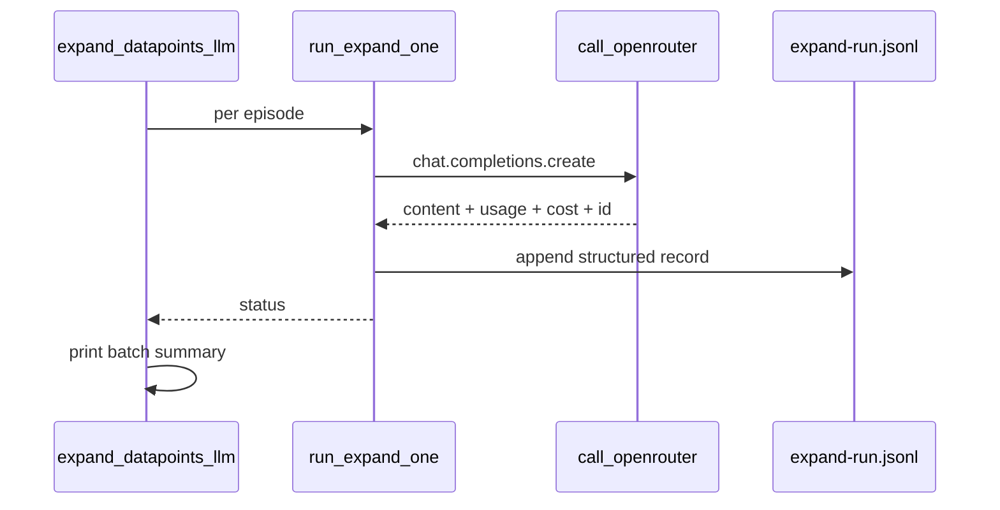

# Expand apply-run logging improvements

## Problem

Actual `--apply` runs today log little beyond `[wrote]` / `[error]` and sparse [`catalog/expand-run.jsonl`](catalog/expand-run.jsonl) rows (no tokens, cost, duration, or tune context). [`expand_tune.py`](ingestion/notes/expand_tune.py) subprocess loops do not aggregate results after a batch.

Dry-run pricing is already good; this plan targets **live API runs** only.

## Approach



### 1. Capture OpenRouter usage in [`ingestion/lib/expand_llm.py`](ingestion/lib/expand_llm.py)

Replace bare `str` return from `call_openrouter` with a small dataclass, e.g. `OpenRouterCompletion`:

| Field | Source |
|-------|--------|
| `content` | `choices[0].message.content` |
| `response_id` | `response.id` |
| `prompt_tokens`, `completion_tokens`, `total_tokens` | `response.usage` (best-effort; 0 if missing) |
| `cost_usd` | `usage.cost` if present (OpenRouter credits) |
| `duration_ms` | `time.perf_counter()` around the API call |

Keep `call_openrouter` signature stable for callers by returning the dataclass; update the one other caller path only if needed—**expand-only scope** means [`attribute_posts_llm.py`](ingestion/x/attribute_posts_llm.py) keeps using `.content` via a thin wrapper or unchanged string return:

- **Preferred:** `call_openrouter` returns `OpenRouterCompletion`; `attribute_posts_llm` uses `call_openrouter(...).content` (one-line change, minimal).

Add helpers:

- `usage_from_response(response) -> dict` — normalize usage/cost fields safely
- `expand_log_context_from_env() -> dict` — read optional `EXPAND_RUN_ID`, `EXPAND_VARIANT` for tune correlation
- `log_expand_event(record: dict)` — wraps `append_expand_run_log` with consistent schema
- `print_expand_batch_summary(records: list[dict])` — human rollup at end of batch

### 2. Enrich per-episode logging in [`ingestion/notes/expand_datapoints_llm.py`](ingestion/notes/expand_datapoints_llm.py)

In `run_expand_one` (apply path):

| Event | stdout | JSONL `status` |
|-------|--------|----------------|
| Skip existing draft | `[skip] ep-XXXX (draft exists)` | `skipped` |
| Start | `[expand] ep-XXXX  N bullets  model=…` | (optional `started` omitted to avoid noise) |
| Success | `[ok] ep-XXXX  18.2k in / 1.2k out  $0.03  42.1s  → path` | `ok` |
| Failure | `[error] ep-XXXX: …` | `error` |

JSONL fields to add on every apply event:

- `prompt_tokens`, `completion_tokens`, `total_tokens`, `cost_usd`, `duration_ms`, `response_id`
- `prompt_path` (relative), `draft_path`, `n_bullets`, `n_sections`, `validation_errors`
- `run_id`, `variant` (from env when set by tune)
- `input_chars` (optional, cheap: len(system)+len(user) for compare vs billed tokens)

After the episode loop in `main()`, call `print_expand_batch_summary` with in-memory records collected during the run (not re-parsing jsonl).

### 3. Tune orchestrator: [`ingestion/notes/expand_tune.py`](ingestion/notes/expand_tune.py)

On `--apply` expand pass:

- Set child env: `EXPAND_RUN_ID={run_id}`, `EXPAND_VARIANT={variant}` (subprocess inherits via `subprocess.run(..., env=...)`).
- After all subprocesses, read [`catalog/expand-run.jsonl`](catalog/expand-run.jsonl) (or in-memory is unavailable across processes—**read jsonl**) filtered by `run_id` + `variant` + recent `at` window, then print the same batch summary footer.
- On subprocess non-zero exit, note that jsonl may still have the per-episode error row from the child.

Optional `--verbose`: print full subprocess command (today only `[expand] ep-XXXX`).

### 4. Optional log inspection CLI

Add to `expand_datapoints_llm.py`:

```bash
python notes/expand_datapoints_llm.py --summarize-log [--run-id tune-001] [--last 50]
```

Reads `expand-run.jsonl`, filters, prints token/cost/error rollup—useful after `expand_tune` without re-running `report`.

### 5. Docs and schema note

Update [`docs/datapoint-workflow.md`](docs/datapoint-workflow.md) with a short **expand-run.jsonl schema** table and example `jq` one-liner for monitoring.

## Tests

| File | Coverage |
|------|----------|
| [`tests/test_expand_llm.py`](tests/test_expand_llm.py) | `usage_from_response` with mock completion object; `OpenRouterCompletion` |
| [`tests/test_expand_datapoints_llm.py`](tests/test_expand_datapoints_llm.py) (new or extend existing) | `run_expand_one` logs tokens/cost on mocked API; batch summary counts |
| [`tests/test_expand_tune.py`](tests/test_expand_tune.py) | Child env includes `EXPAND_RUN_ID` in `build_child_cmd` / subprocess env |

Mock `call_openrouter` to return `OpenRouterCompletion(...)` instead of raw string in existing tests.

## Out of scope

- `attribute_posts_llm.py` structured run log (user chose expand-only; only minimal `.content` accessor change on shared `call_openrouter` if return type changes).
- Streaming responses, retries, or dashboard UI.
- Changing dry-run table output (already sufficient).

## Example console output (after apply batch)

```
[expand] ep-0066  8 bullets  deepseek/deepseek-v4-flash
[ok] ep-0066  21.5k in / 1.8k out  $0.004  38.2s  → ingestion/fixtures/expand-runs/tune-001/A/.../draft.md
...
--- expand batch summary (10 episodes, variant A) ---
  ok: 9  skipped: 1  error: 0
  tokens: 185,350 in / 12,400 out
  cost: $0.42 (OpenRouter usage.cost)
  log: catalog/expand-run.jsonl
```
