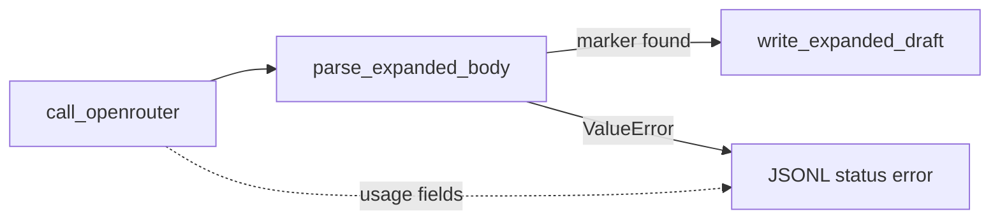

# Expand format compliance (prompt-only)

## Context (validated)

Your handoff summary matches the repo:


| Layer                                                                                                               | Status                                                                                                                       |
| ------------------------------------------------------------------------------------------------------------------- | ---------------------------------------------------------------------------------------------------------------------------- |
| Dry-run cost table + dynamic pricing (`[ingestion/lib/openrouter_pricing.py](ingestion/lib/openrouter_pricing.py)`) | Shipped (e911dd0, 9092f92)                                                                                                   |
| Apply logging (`OpenRouterCompletion`, `[expand]`/`[ok]`/`[error]`, JSONL, `--summarize-log`)                       | Implemented locally; **uncommitted** per git status                                                                          |
| Live blocker                                                                                                        | `[parse_expanded_body()](ingestion/lib/expand_llm.py)` requires `## Expanded datapoints`; DeepSeek returns `###` blocks only |


```229:239:ingestion/lib/expand_llm.py
def parse_expanded_body(raw: str) -> str:
    ...
    if idx == -1:
        raise ValueError(f"Model output missing {marker!r}")
    return text[idx:].strip()
```

On parse failure, `[run_expand_one](ingestion/notes/expand_datapoints_llm.py)` logs only `status: error` + message — usage from `completion` is dropped because the broad `except` runs after `call_openrouter` succeeds.

Default model in `[.env.example](.env.example)` is `deepseek/deepseek-v4-flash` (same as your live test).

## Strategy (your choice: prompt-only)

Do **not** relax `parse_expanded_body()` or auto-prepend the header. Fix model compliance via prompt text; keep parser as the contract.




## 1. Commit apply-logging work (if not already on a branch)

Stage and commit the in-progress apply-logging diff together with `[.cursor/plans/expand_apply_run_logging_9ced1e30.plan.md](.cursor/plans/expand_apply_run_logging_9ced1e30.plan.md)` per [AGENTS.md](AGENTS.md). No behavior change in this step — just lands infrastructure before prompt fixes.

Files touched (from git status): `[ingestion/lib/expand_llm.py](ingestion/lib/expand_llm.py)`, `[ingestion/notes/expand_datapoints_llm.py](ingestion/notes/expand_datapoints_llm.py)`, `[ingestion/notes/expand_tune.py](ingestion/notes/expand_tune.py)`, tests, `[docs/datapoint-workflow.md](docs/datapoint-workflow.md)`.

## 2. Tighten expand prompt (primary fix)

Edit `[ingestion/prompts/expand_datapoints.md](ingestion/prompts/expand_datapoints.md)` (and mirror in `[ingestion/prompts/expand_datapoints.candidate.md](ingestion/prompts/expand_datapoints.candidate.md)` for tune parity):

**Move format contract into `<<<SYSTEM>>>`** (higher weight than user template):

- State that the **first line of the assistant reply** must be exactly `## Expanded datapoints` (no preamble, no title, no “Here is…”, no transcript echo).
- Clarify: output is **only** the expanded section — not NOTES/TRANSCRIPT, not a recap of instructions.
- Repeat: one `### {timestamp} — {bullet}` per raw bullet, in order; fields Context / Quote / Key takeaway with blank lines between.

**Slim `<<<USER>>>`** to task + placeholders:

- Keep the example block under `## Expanded datapoints` as the visual template.
- Add one line immediately before the example: “Begin your reply with `## Expanded datapoints` on line 1.”

Rationale: today the header lives only in the USER half ([lines 11–15](ingestion/prompts/expand_datapoints.md)); models often skip “documentation” headers and jump to `###` content. Putting the rule in SYSTEM aligns with how `[load_prompt_template](ingestion/lib/expand_llm.py)` splits messages.

**Optional doc note** in `[docs/datapoint-workflow.md](docs/datapoint-workflow.md)`: first line must be `## Expanded datapoints` (parser requirement).

## 3. Log usage on “API ok, parse failed” (small, independent)

In `[run_expand_one](ingestion/notes/expand_datapoints_llm.py)` `except` block (~272–284):

- If a `completion` variable exists in scope (set `completion = None` before `try`, assign after `call_openrouter`), merge into error JSONL:
  - `response_id`, `prompt_tokens`, `completion_tokens`, `total_tokens`, `cost_usd`, `duration_ms`
- Optionally print a one-line hint: `tokens: … cost: …` on stderr-style line after `[error]` when usage is present.

Add/extend test in `[tests/test_expand_datapoints_llm_logging.py](tests/test_expand_datapoints_llm_logging.py)`: mock `call_openrouter` returning valid `OpenRouterCompletion` + `parse_expanded_body` raising → assert error row includes token fields.

## 4. Verify

```bash
cd ingestion
python -m pytest tests/test_expand_llm.py tests/test_expand_datapoints_llm_logging.py tests/test_expand_tune.py tests/test_openrouter_pricing.py -q
python notes/expand_datapoints_llm.py --id ep-0145 --dry-run   # unchanged estimates
python notes/expand_datapoints_llm.py --id ep-0145 --apply     # expect [ok] + .expanded.draft.md
python notes/expand_datapoints_llm.py --summarize-log --last 5
```

Success criteria:

- `[ok]` with draft path for ep-0145 (and ep-0189 if retried).
- `catalog/expand-run.jsonl` row: `status: ok` with token/cost fields.
- On forced failure (temporarily break prompt in a local test only): error row still has token/cost.

If DeepSeek still omits the header after SYSTEM emphasis, next escalation (out of scope for prompt-only): try `--model` override or A/B via `expand_tune.py` — do not add parser recovery unless you change strategy.

## Out of scope

- Parser leniency / auto-prepend header
- Changing default `OPENROUTER_MODEL` in `.env.example`
- Prompt tuning sandbox runs beyond re-running 1–2 episodes to confirm fix

