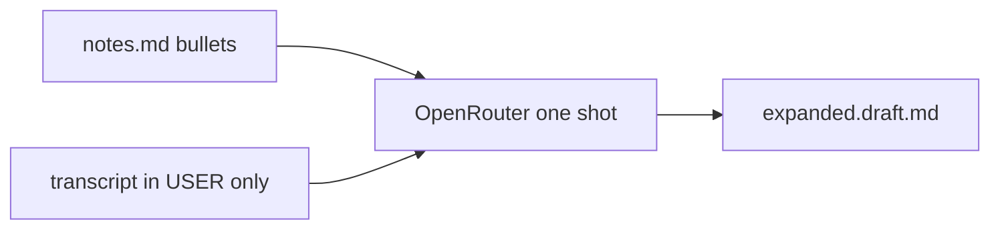

# Expand prompt A/B rewrite (format-first)

## Goal

Replace the identical [`expand_datapoints.md`](ingestion/prompts/expand_datapoints.md) / [`.candidate.md`](ingestion/prompts/expand_datapoints.candidate.md) pair with two **distinct output-style** prompts derived from your chat example, trimmed for this repo’s stateless API pipeline (`{notes}` + `{transcript}` placeholders, no chat preamble).

**A/B axis:** instruction depth and quote-format complexity — not different fields.

| Variant | File | Style |
|---------|------|--------|
| **A (faithful)** | `expand_datapoints.md` | Close to your example: Context + Quote (bold core, unbolded flank sentences) + Key takeaway, explicit line breaks, worked example |
| **B (optimized)** | `expand_datapoints.candidate.md` | Same three fields, **shorter** rules; markdown tuned for vault retrieval (consistent labels, scannable blocks, minimal prose); simpler quote rule (still uses `**bold**` for the key phrase, not the full flank-sentence choreography) |

Both must still emit parseable output for [`expand_llm.parse_expanded_body`](ingestion/expand_llm.py) (`## Expanded datapoints` marker) and section counting for [`validate_expanded_draft`](ingestion/expand_llm.py).

## Pipeline constraints (unchanged)



- **TRANSCRIPT stays in the USER template** — required for grounding — but both prompts will state clearly: *use for lookup only; never reproduce or summarize the full transcript in the output*.
- Keep **one `###` block per raw bullet** (heading = timestamp + original bullet text) so existing tune `report` / promote section counts keep working.
- Bullets without a timestamp (`- — …` in notes) → `### — {original text}` and best-effort grounding (same as today).

## Target output shape (both prompts)

Per bullet, in order, with a **blank line between each labeled field** (your line-break requirement):

```markdown
## Expanded datapoints

### 49:20 — solar thesis (from "49 minutes 20 seconds" in raw)

Context: 1–2 sentences — where we are in the story at this moment.

Quote: "**core verbatim phrase**" plus minimal surrounding transcript sentences for context. (49:20)

Key takeaway: 2–3 sentences — bigger-picture lesson.
```

**Differences A vs B (format/style only):**

| Element | Prompt A | Prompt B |
|---------|----------|----------|
| Instructions | Longer; includes your formatting example | Compact checklist + single template |
| Quote | Bold **core** + unbolded extra sentence(s) on each side when needed | Bold **key phrase** inside a shorter verbatim quote; avoid multi-sentence formatting rules |
| Labels | `Context:` / `Quote:` / `Key takeaway:` (plain, as in your example) | Same labels (retrieval consistency) |
| Show context | Repeat Founders / Senra framing once | One line: personal vault; episode already identified in NOTES |

## Prompt file edits

### [`ingestion/prompts/expand_datapoints.md`](ingestion/prompts/expand_datapoints.md) (A)

**`<<<SYSTEM>>>`** (trimmed):

- Role: expand Founders timestamped study notes for a personal knowledge vault.
- For each bullet under `## Raw datapoints`, locate the moment in TRANSCRIPT via timestamp.
- Output only expanded blocks — **never** include the full transcript or a transcript summary.
- Verbatim quotes; no invented facts/timestamps.
- If timestamp missing/ambiguous: still output the `###` block; note uncertainty in Context or Key takeaway.

**`<<<USER>>>`**:

- Short task line + **example block** adapted from your message (with line-break note).
- Explicit template with `###`, Context / Quote / Key takeaway.
- `---` / `## NOTES` / `{notes}` / `---` / `## TRANSCRIPT (reference only — do not output)` / `{transcript}`.

Remove: old `**Quote:**` / `**Takeaway:**` two-field template and “typically 1–3 sentences” without Context.

### [`ingestion/prompts/expand_datapoints.candidate.md`](ingestion/prompts/expand_datapoints.candidate.md) (B)

**`<<<SYSTEM>>>`**: Same rules in ~40% fewer words; emphasize retrieval-friendly structure (stable labels, one block per bullet, blank lines between fields).

**`<<<USER>>>`**:

- No long example paragraph — **one** minimal filled template + bullet checklist.
- Quote rule: one short verbatim excerpt; wrap the most important phrase in `**bold**`; append `(MM:SS)` at end of the Quote line.
- Same NOTES / TRANSCRIPT sections and “do not output transcript” line.

## Validation + tests (required for A/B to be meaningful)

Update [`validate_expanded_draft`](ingestion/expand_llm.py):

- Section count: still `^###\s+` (unchanged).
- Per-block checks (warnings, not hard errors where reasonable):
  - Accept `Context:` or `**Context:**`
  - Accept `Quote:` or `**Quote:**`
  - Accept `Key takeaway:` or `Takeaway:` or `**Key takeaway:**` (so A/B and legacy drafts don’t false-fail)
- Drop or soften old hard dependency on `**Takeaway:**` only.

Update [`tests/test_expand_llm.py`](tests/test_expand_llm.py) fixtures to use Context / Quote / Key takeaway sample bodies.

Optional one-line note in [`docs/episode-id-rules.md`](docs/episode-id-rules.md) expanded section: three fields per bullet (Context, Quote, Key takeaway).

## Docs touch

- [`docs/datapoint-workflow.md`](docs/datapoint-workflow.md) — describe new expanded shape under tuning section (no change to commands).
- [`ingestion/fixtures/expand-runs/README.md`](ingestion/fixtures/expand-runs/README.md) — note A = faithful format, B = retrieval-tight format.

## What we will not change

- `expand_tune.py` orchestration, subprocess isolation, or batch file.
- `parse_expanded_body` marker (`## Expanded datapoints`).
- `build_chunks.py` indexing rules.

## After implementation (your workflow)

```bash
cd ingestion
python expand_tune.py expand --run-id tune-001 --variant A --apply
python expand_tune.py expand --run-id tune-001 --variant B --apply
python expand_tune.py report --run-id tune-001
```

Compare readability, quote fidelity, and retrieval usefulness in staged drafts before promoting a winner.
