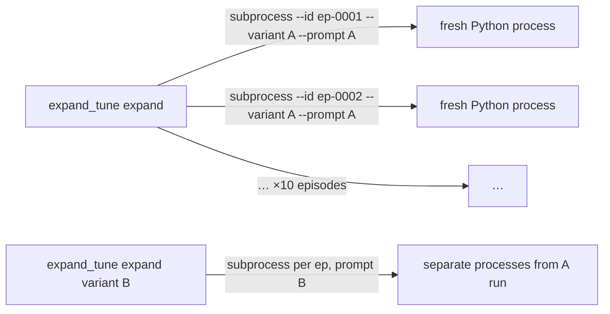
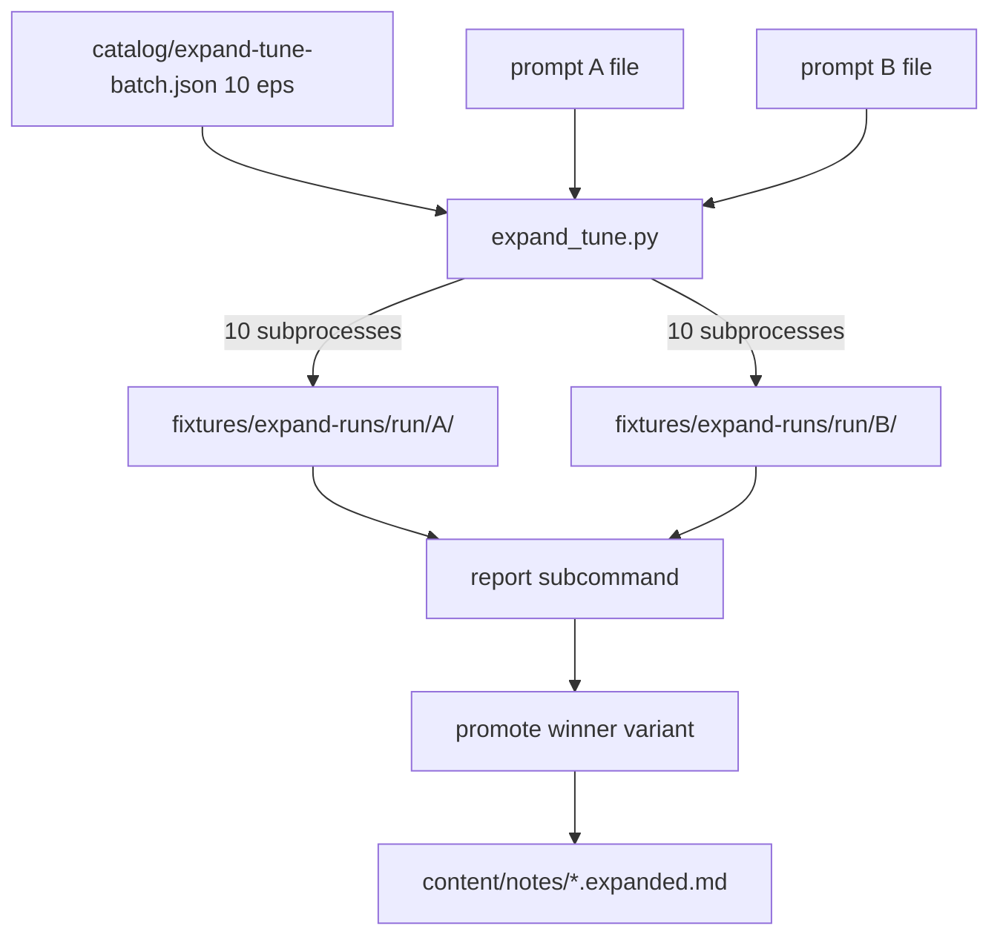

# Expand prompt tuning sandbox (A/B, 10-episode batch)

## Goal

Tune [`ingestion/prompts/expand_datapoints.md`](ingestion/prompts/expand_datapoints.md) by comparing **prompt A** vs **prompt B** on a **fixed 10-episode batch**, with:

- **Sandbox output** only under `ingestion/fixtures/expand-runs/{run_id}/A/` and `.../B/` (no `content/notes/` writes until promote).
- **One clean instance per episode per variant** — no shared in-process state across episodes or between A and B runs (subprocess isolation, not optional).
- **Stateless API** — each child call is a single `chat.completions` with `[system, user]` only (already true in `call_openrouter`; subprocess ensures no client/history reuse in Python).

Production backfill stays on [`expand_datapoints_llm.py`](ingestion/expand_datapoints_llm.py).

## Isolation model (non-negotiable)



| Layer | Guarantee |
|-------|-----------|
| **Orchestrator** | `expand_tune.py expand` loops episodes; **never** calls `run_expand_one` in-process for tune runs |
| **Child process** | Each invocation: `expand_datapoints_llm.py --id ep-NNNN --apply --staging-dir … --variant A --prompt <pathA>` (exactly one episode) |
| **API** | New `OpenAI()` client per `call_openrouter` inside child; no conversation history; temperature 0 |
| **Prompt A vs B** | Separate expand passes: first all 10 eps with `--prompt` A → `staging/.../A/`, then all 10 with prompt B → `staging/.../B/` (20 subprocesses total per full A/B cycle) |

`--subprocess` on the production CLI remains optional; **`expand_tune` always subprocesses** (no `--no-subprocess` escape hatch for tune mode).

## Current gaps

| Exists today | Missing for tuning |
|--------------|-------------------|
| `--prompt`, `--model`, `--force` on [`expand_datapoints_llm.py`](ingestion/expand_datapoints_llm.py) | `--staging-dir` + `--variant` for child writes; tune orchestrator |
| Optional `--subprocess` batch mode | **Mandatory** per-episode subprocess for tune A/B |
| 5-episode plan | **10-episode** curated batch |
| [`catalog/expand-run.jsonl`](catalog/expand-run.jsonl) | Log `variant`, `prompt_hash`, `staging_dir`, validation summary per subprocess |

## Architecture



**Staging layout** (gitignored):

```
ingestion/fixtures/expand-runs/{run_id}/
  manifest.json
  A/{folder}/{folder}.expanded.draft.md   # prompt A results
  B/{folder}/{folder}.expanded.draft.md   # prompt B results
```

**Prompt files** (reproducible A/B):

- **A (baseline):** [`ingestion/prompts/expand_datapoints.md`](ingestion/prompts/expand_datapoints.md)
- **B (candidate):** [`ingestion/prompts/expand_datapoints.candidate.md`](ingestion/prompts/expand_datapoints.candidate.md) — copy of A at init; you edit B while A stays frozen for the run

`manifest.json` records both paths + `prompt_hash` per variant after each expand pass.

## 1. Curated 10-episode tune batch

[`catalog/expand-tune-batch.json`](catalog/expand-tune-batch.json) — exactly **10** ids, datapoints present, no `.expanded.md`, evenly spaced by `episode_number` across the 176-episode backlog:

| id | ep # | bullets | tx ~size |
|----|------|---------|----------|
| `ep-0001` | 1 | 3 | 54 KB |
| `ep-0022` | 22 | 3 | 61 KB |
| `ep-0042` | 42 | 4 | 80 KB |
| `ep-0066` | 66 | 8 | 84 KB |
| `ep-0085` | 85 | 4 | 71 KB |
| `ep-0105` | 105 | 8 | 86 KB |
| `ep-0125` | 125 | 5 | 73 KB |
| `ep-0145` | 145 | 3 | 72 KB |
| `ep-0166` | 166 | 2 | 81 KB |
| `ep-0189` | 189 | 5 | 61 KB |

Schema: `{ "episode_ids": ["ep-0001", ...], "notes": { "ep-0001": "…" } }`. Full A/B apply = **20 API calls** per run (10 × prompt A + 10 × prompt B). Document expected cost in fixtures README.

Optional stress episode `ep-0088` (24 bullets) documented but **not** in default batch.

## 2. CLI: `expand_tune.py`

| Subcommand | Purpose |
|------------|---------|
| `init --run-id ID` | Create run dir + `manifest.json`; seed `expand_datapoints.candidate.md` from baseline if missing |
| `expand --run-id ID --variant A\|B --prompt PATH (--dry-run \| --apply)` | Run **all 10** batch episodes via **one subprocess per episode**; write to `…/{run_id}/{variant}/` |
| `report --run-id ID` | Compare A vs B per episode: validation errors, `###` vs bullets, model, prompt_hash |
| `promote --run-id ID --variant A\|B (--dry-run \| --apply) [--id ep-NNNN]` | Copy staging draft(s) → notes dir → `promote_draft` → `.expanded.md` |

**Default prompts** (overridable with `--prompt`):

- variant `A` → `ingestion/prompts/expand_datapoints.md`
- variant `B` → `ingestion/prompts/expand_datapoints.candidate.md`

Child command shape (one episode, clean instance):

```bash
python expand_datapoints_llm.py \
  --id ep-NNNN --apply --force \
  --staging-dir ingestion/fixtures/expand-runs/{run_id} \
  --variant A \
  --prompt ingestion/prompts/expand_datapoints.md
```

**Core code changes:**

- [`ingestion/paths.py`](ingestion/paths.py): `staging_draft_file_path(staging_root, variant, episode_id, slug, episode_number)`
- [`ingestion/expand_llm.py`](ingestion/expand_llm.py): `write_expanded_draft(..., out_path=None)`; richer `append_expand_run_log`
- [`ingestion/expand_datapoints_llm.py`](ingestion/expand_datapoints_llm.py): `--staging-dir`, `--variant`; when set, draft path = staging (not `content/notes/`)
- **New** [`ingestion/expand_tune.py`](ingestion/expand_tune.py): orchestrator; **always** subprocess loop (no in-process batch expand)

## 3. Gitignore + README

- [`.gitignore`](.gitignore): `ingestion/fixtures/expand-runs/*/`
- [`ingestion/fixtures/expand-runs/README.md`](ingestion/fixtures/expand-runs/README.md): 10-ep batch, 20-call A/B cost, isolation rules, prompt A/B files

## 4. Documented tuning loop

[`docs/datapoint-workflow.md`](docs/datapoint-workflow.md) section **Prompt tuning (10-episode A/B)**:

```bash
cd ingestion
python expand_tune.py init --run-id tune-001
# Edit prompts/expand_datapoints.candidate.md (prompt B); leave A frozen

python expand_tune.py expand --run-id tune-001 --variant A --dry-run   # 10× char estimates
python expand_tune.py expand --run-id tune-001 --variant A --apply     # 10 subprocesses, prompt A
python expand_tune.py expand --run-id tune-001 --variant B --apply     # 10 subprocesses, prompt B

python expand_tune.py report --run-id tune-001
python expand_tune.py promote --run-id tune-001 --variant B --apply    # pick winner
python build_chunks.py
```

Also [`AGENTS.md`](AGENTS.md), [`ingestion/README.md`](ingestion/README.md).

## 5. Tests (no network)

- Subprocess command builder includes exactly one `--id`, `--staging-dir`, `--variant`, `--prompt`
- Staging path resolution under `A/` and `B/`
- `report` diffs A vs B on fixture drafts
- `monkeypatch` `expand_run_log_path()` in existing expand tests (fix pytest pollution in `catalog/expand-run.jsonl`)

## 6. Model / env

- Commit [`.env.example`](.env.example) (`OPENROUTER_MODEL=deepseek/deepseek-v4-flash`, attribution model update)
- Same model for both A and B unless `--model` passed per `expand` pass (model A/B is optional; primary comparison is **prompt A vs prompt B**)

## Out of scope

- In-process batch expand for tune mode
- Auto-pick winning variant
- Indexing staging drafts in `build_chunks.py`

## Implementation order

1. Staging paths + `write_expanded_draft(out_path)` + run log fields
2. `expand-tune-batch.json` (10 eps) + fixtures README + gitignore
3. `expand_datapoints_llm.py` staging flags (single-episode child target)
4. `expand_tune.py` with mandatory subprocess orchestration
5. Docs + `.env.example` + tests
