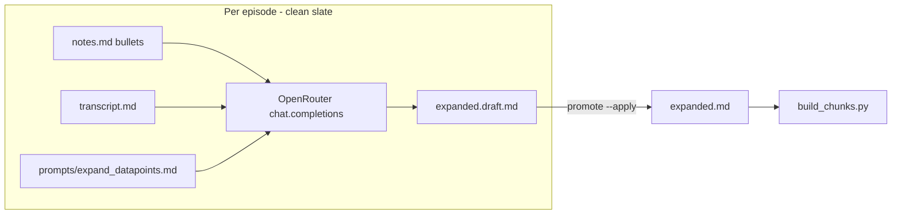

# Expanded notes LLM workflow (OpenRouter)

## Current state

| Piece | Status |
|-------|--------|
| [`ingestion/expand_datapoints.py`](ingestion/expand_datapoints.py) | Builds a single prompt from `notes` + `transcript`; `--copy` / `--write` only; **no API call** |
| Prompt | Inline `PROMPT_TEMPLATE` (duplicated in [`docs/datapoint-workflow.md`](docs/datapoint-workflow.md)) |
| Output | [`{folder}.expanded.md`](docs/episode-id-rules.md) — **0 files** in repo today |
| Backlog | **176** episodes with `MM:SS —` bullets ([`catalog/gaps.md`](catalog/gaps.md)); **241** scaffolds without bullets (out of scope for expansion) |
| LLM precedent | [`ingestion/attribute_posts_llm.py`](ingestion/attribute_posts_llm.py) — OpenAI client, `--dry-run` / `--apply`, env from [`.env.example`](.env.example) |
| Transcript size | ~27–194 KB per file (~7–49k tokens rough); full transcript per call is feasible on modern models but costly |

You confirmed: **keep `expanded.md`**, and **staging before promote** (not direct write to `.expanded.md`).

## Architecture

**Fresh instance (your requirement):** For each episode in a batch loop:

1. Load only that episode’s `notes` body + `transcript` body (no catalog, no prior episodes).
2. One **stateless** `chat.completions` request (`messages=[system, user]` only — no conversation history, no shared client state across episodes).
3. Optional: run each episode in a **subprocess** (`--id ep-NNNN` only) so a crash/OOM cannot contaminate the next episode’s in-memory state; parent script only orchestrates and logs.

This matches “clean slate for the transcript, episode by episode” without cross-episode context leakage.

## 1. External preprompt (tunable)

Add [`ingestion/prompts/expand_datapoints.md`](ingestion/prompts/expand_datapoints.md):

- **System section** (stable instructions): role, output markdown schema (`## Expanded datapoints`, `### timestamp — bullet`, `**Quote:**`, `**Takeaway:**`), ambiguity handling, “quote verbatim from transcript”.
- **User template section** (or separate `expand_datapoints_user.md`): placeholders `{notes}` and `{transcript}` filled at runtime.

Refactor [`expand_datapoints.py`](ingestion/expand_datapoints.py) to `load_prompt_template()` from that file so manual Cursor/Gemini workflow and the API script stay in sync. Update [`docs/datapoint-workflow.md`](docs/datapoint-workflow.md) to point at the file instead of duplicating the full template.

Optional: `--prompt ingestion/prompts/expand_datapoints.md` override for A/B tuning without code edits.

## 2. New script: `expand_datapoints_llm.py`

Mirror patterns from [`attribute_posts_llm.py`](ingestion/attribute_posts_llm.py) and batch flags from [`scaffold_notes.py`](ingestion/scaffold_notes.py).

### Environment ([`.env.example`](.env.example))

| Variable | Purpose |
|----------|---------|
| `OPENROUTER_API_KEY` | Required for API runs |
| `OPENROUTER_MODEL` | Default model slug (e.g. `anthropic/claude-sonnet-4` — you pick at first run) |
| `OPENROUTER_BASE_URL` | Default `https://openrouter.ai/api/v1` |

Use OpenAI Python SDK with `base_url` + `api_key` (OpenRouter is OpenAI-compatible). Add `httpx` only if needed; existing `openai>=1.40.0` is enough.

### Episode selection

Eligible row iff:

- `transcript_status == complete`
- `has_timestamp_datapoints(notes.md)` ([`markdown_io.py`](ingestion/markdown_io.py))
- Not skipped by flags below

CLI (proposed):

| Flag | Behavior |
|------|----------|
| `--id ep-NNNN` | Single episode |
| `--from N --to M` | Episode number range |
| `--missing-expanded` | Has datapoints, no `.expanded.md` (and optionally no draft) |
| `--dry-run` | Print would-run list + token/char estimates; no API |
| `--apply` | Call API and write **draft** |
| `--force` | Re-run even if draft exists |
| `--subprocess` | One child process per episode (extra isolation) |
| `--limit K` | Cap episodes per run (cost guard) |
| `--model` | Override env model |

**Out of scope by design:** episodes without timestamp bullets (per [`AGENTS.md`](AGENTS.md) — not bulk-fix scaffolds).

### Staging + promote (your choice)

**Draft path (same notes folder):** `{folder}.expanded.draft.md`

- Requires a small [`layout.py`](ingestion/layout.py) change so verify accepts `*.expanded.draft.md` (extend `PER_EPISODE_FILE_RE` or allow optional `.draft` suffix); **exclude drafts** from [`build_chunks.py`](ingestion/build_chunks.py) indexing.
- Draft frontmatter: `id`, `title`, `source: expand_llm`, `model`, `generated_at`, optional `prompt_hash` / `prompt_path`.

**Promote** (new subcommand or `expand_datapoints_llm.py --promote`):

- `--id` / `--all-ready` / `--from`/`--to`
- Validate draft structure (section header, at least one `###`, quote/takeaway pairs; bullet count vs `notes.md` within tolerance)
- Write canonical [`{folder}.expanded.md`](docs/episode-id-rules.md) via `write_frontmatter_md`
- Delete draft on success

Keep existing manual path: Cursor + `expand_datapoints.py --copy` still valid for one-off quality.

### Response handling

- Parse model output: strip fences if present; require `## Expanded datapoints`.
- Compare bullet count in draft vs `TIMESTAMP_BULLET_RE` matches in notes; warn or fail promote if large mismatch.
- On API/parse failure: log to [`catalog/expand-run.jsonl`](catalog/expand-run.jsonl) (`episode_id`, `status`, `error`, `model`, timestamp) for resume; do not leave a partial promoted file.

### Cost / safety defaults

- Default batch invocation: **`--dry-run`** unless `--apply` passed (same ergonomics as `attribute_posts_llm`).
- Recommend `--limit 5` for first live backfill; full 176 ≈ 176 × (median ~70k char transcript) — budget accordingly.
- `temperature=0` for reproducibility.

## 3. Shared module (thin)

Add [`ingestion/expand_llm.py`](ingestion/expand_llm.py) (or `datapoint_expand.py`):

- `load_prompt_template(path) -> (system, user_template)`
- `build_user_content(notes, transcript) -> str`
- `call_openrouter(...) -> str`
- `parse_expanded_body(raw) -> str`
- `validate_expanded_draft(notes_path, draft_body) -> list[str]` warnings/errors
- `write_expanded_draft(row, body, meta)`
- `promote_draft(row) -> Path`

Keeps CLI scripts small and testable.

## 4. Coverage reporting (refine gaps, not blocking)

Extend [`ingestion/gaps_report.py`](ingestion/gaps_report.py) + [`catalog/gaps.md`](catalog/gaps.md) generation:

- **Expanded files:** count episodes with `.expanded.md`
- **Drafts pending review:** count `.expanded.draft.md`
- Optional list: “has datapoints but no expanded” (subset of the 176 backlog)

Does not fail `verify.py` — expanded remains optional per [`docs/episode-id-rules.md`](docs/episode-id-rules.md).

## 5. Docs and agent guide

| Doc | Update |
|-----|--------|
| [`docs/datapoint-workflow.md`](docs/datapoint-workflow.md) | OpenRouter flow, staging/promote, prompt file location, quality checklist |
| [`ingestion/README.md`](ingestion/README.md) | Script row + env vars |
| [`.env.example`](.env.example) | OpenRouter vars |
| [`AGENTS.md`](AGENTS.md) | Daily: expand after bullets; backfill uses LLM script + promote; still no bulk scaffold bullets |

Post-promote: `python build_chunks.py` so search includes `expanded` chunks.

## 6. Tests

Under [`tests/`](tests/):

- Prompt file load + placeholder substitution
- `parse_expanded_body` / validation (golden fixtures, no network)
- Promote: draft → expanded with frontmatter; layout allows `.expanded.draft.md`
- Mock OpenRouter client for one `--apply` path

## 7. What else to refine (follow-ups, not blocking v1)

| Topic | Recommendation |
|-------|----------------|
| **Transcript trimming** | v2: pre-slice transcript windows around each timestamp (smaller/cheaper calls); v1 sends full transcript for accuracy |
| **Chunking long episodes** | Only if you hit context limits on chosen model; monitor max transcript (~194k chars) |
| **Parallelism** | Serial by default (rate limits + clean slate); optional `--workers 2` later |
| **X / posts workflows** | Unchanged; separate from expansion |
| **Embeddings** | Still deferred per [`docs/retrieval.md`](docs/retrieval.md) |

## Suggested implementation order

1. Prompt file + refactor `expand_datapoints.py` loader  
2. `expand_llm.py` core + tests (no network)  
3. `expand_datapoints_llm.py` with `--dry-run` / `--apply` → draft  
4. Layout + `build_chunks` draft exclusion  
5. `--promote` + gaps stats + docs + `.env.example`  
6. Smoke: one episode (`ep-0073` has 3 bullets, ~94k transcript) dry-run → apply → promote → `build_chunks.py`

## Open choice (you can set on first run)

**Default OpenRouter model** — not specified yet; use `OPENROUTER_MODEL` in `.env` and `--model` CLI override. Pick based on cost vs quality after one smoke episode.
