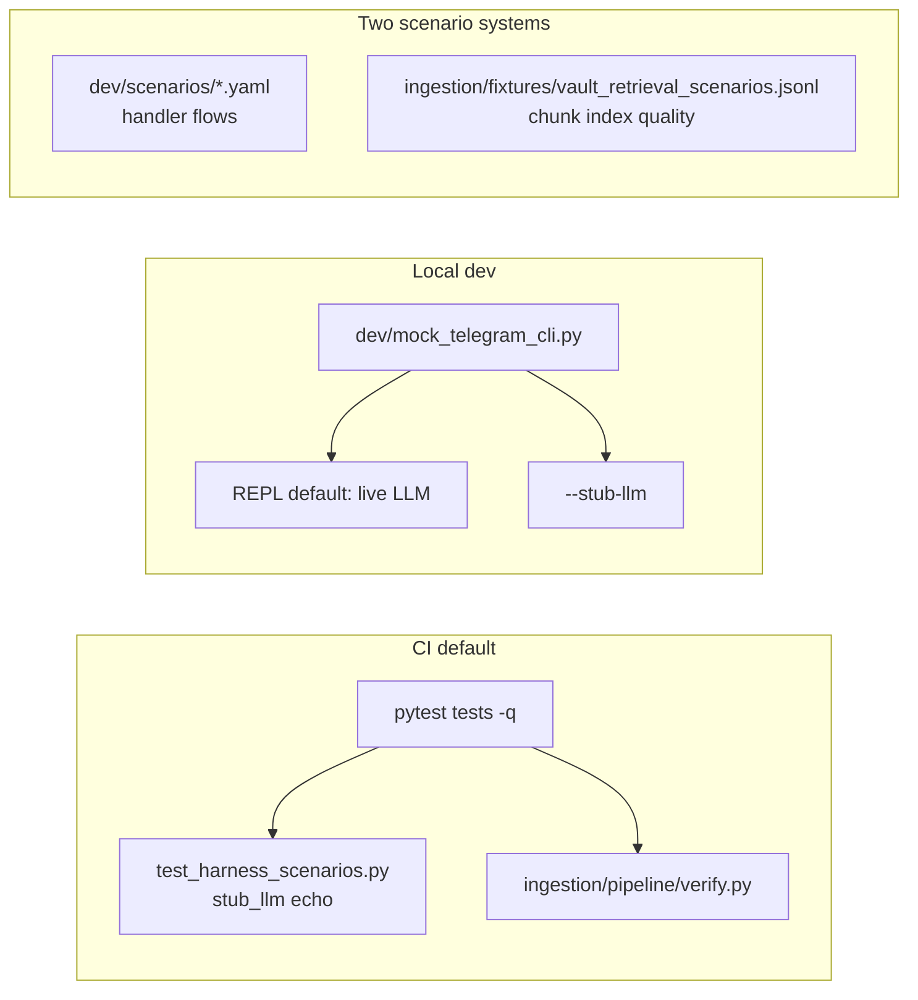

# Harness validation + documentation consistency

## Success criteria (done when)

1. Local tree matches `origin/main` (includes PR #10 harness).
2. `pytest tests -q` and `ingestion/pipeline/verify.py` pass locally (same as `[.github/workflows/verify.yml](.github/workflows/verify.yml)`).
3. Harness pytest + `python dev/mock_telegram_cli.py --stub-llm --run-scenarios` pass; `SKIP_HARNESS_SCENARIOS=1` skips harness tests.
4. `[docs/telegram-mock-harness.md](docs/telegram-mock-harness.md)` exists and is linked from Telegram entry points.
5. `[docs/testing.md](docs/testing.md)` has correct CI wording (harness **in** default CI), complete test-module table, and clear YAML vs JSONL scenario distinction.
6. `[telegram_mock_harness_2296d9fc.plan.md](.cursor/plans/archive/telegram_mock_harness_2296d9fc.plan.md)` lives under `.cursor/plans/archive/` with links updated.
7. No code changes unless validation exposes a real bug (separate commit/message if so).

---

## Context

**Merged PR:** [#10 — Add mock Telegram harness for Librarian and Janitor](https://github.com/ethan-frost-xyz/founders-notes/pull/10) (`720df0b` on `origin/main`).

**Local gap (at plan time):** Checkout was at `0c08fb6`, **behind 3** commits. Harness code and a partial `[docs/testing.md](docs/testing.md)` harness section exist on `origin/main` only. **First step is always `git pull origin main`.**

**CI (merge commit):** Verify workflow `26549287705` — all tests passed (~171 total; exact count may drift).




---

## Phase 0 — Pre-flight (before validation)

```bash
git pull origin main
```

**Untracked `dev/`:** If `git status` shows `?? dev/` from pre-merge local runs, that is usually `dev/logs/` (gitignored on main). Safe to keep; do not delete tracked harness files after pull. If pull reports conflicts under `dev/harness/`, resolve by keeping upstream (merged) versions.

**Install (match CI):**

```bash
pip install -r ingestion/requirements.txt -r ingestion/requirements-dev.txt
```

CI does **not** install `[services/telegram/requirements.txt](services/telegram/requirements.txt)`; harness tests rely on `python-telegram-bot` from `requirements-dev.txt`. For interactive REPL debugging, optionally also install `services/telegram/requirements.txt` in the same venv.

---

## Phase 1 — Validate (gate for doc work)

Run from repo root:

```bash
pytest tests -q
cd ingestion && python pipeline/verify.py && cd ..
pytest tests/test_harness_scenarios.py -q
python dev/mock_telegram_cli.py --stub-llm --run-scenarios
SKIP_HARNESS_SCENARIOS=1 pytest tests -q
git diff --quiet -- content/notes/ || echo "FAIL: content/notes modified"
```


| Check                             | Expected                                     |
| --------------------------------- | -------------------------------------------- |
| Full `pytest tests -q`            | All pass                                     |
| `verify.py`                       | Exit 0                                       |
| Harness pytest                    | 5 passed (one per `dev/scenarios/**/*.yaml`) |
| CLI `--stub-llm --run-scenarios`  | Exit 0; JSON report under `dev/logs/runs/`   |
| `git diff --quiet content/notes/` | No changes (Janitor sandbox only)            |


**If validation fails:** Fix code/harness in a **separate** commit before or instead of doc-only work. Known doc errors on main (wrong “not in default CI” line) may still be fixed in parallel.

**Deferred — live OpenRouter smoke** (optional, not blocking):

```bash
export OPENROUTER_API_KEY=... TELEGRAM_CHAT_MODEL=...
python dev/mock_telegram_cli.py --suite librarian   # no --stub-llm
```

Librarian YAML files use `llm: live` and `expect_live` tool assertions; echo CI can pass while live fails. Record failures in `[potential-ideas.md](potential-ideas.md)` only if flaky—not required for this task.

---

## Phase 2 — Documentation (after Phase 1 passes)

### Primary guide (new)

Create `**[docs/telegram-mock-harness.md](docs/telegram-mock-harness.md)**` — **canonical reference** for Telegram feature development.


| Section           | Content                                                                                                                                      |
| ----------------- | -------------------------------------------------------------------------------------------------------------------------------------------- |
| What it is        | Real `build_application()` + handlers; mocked Bot API transport only                                                                         |
| When to use       | Handler/Janitor changes, new YAML regressions, prompt tweaks before deploy                                                                   |
| Quick start       | `--run-scenarios`, `--suite`, `--scenario`, `--debug`, `--stub-llm`, `--keep-sandbox`                                                        |
| Echo vs live      | See table below                                                                                                                              |
| REPL              | **Default is live LLM** — use `python dev/mock_telegram_cli.py --stub-llm` (no `--run-scenarios`) for keyless local debugging                |
| Janitor sandbox   | `dev/logs/sandbox/`; never `content/notes/`; echo stubs expand/reindex subprocesses                                                          |
| Writing scenarios | `send`, `button`, `expect`, `janitor_episode`, `expect_live`; examples in `dev/scenarios/`                                                   |
| Logs              | `dev/logs/sessions/`, `dev/logs/runs/` (gitignored)                                                                                          |
| CI                | `test_harness_scenarios.py` in every `pytest tests -q`; opt out `SKIP_HARNESS_SCENARIOS=1`                                                   |
| Not this          | **Retrieval JSONL** → `[tests/test_vault_retrieval_scenarios.py](tests/test_vault_retrieval_scenarios.py)` + `RUN_REBUILT_INDEX_SCENARIOS=1` |
| History           | Link `[.cursor/plans/archive/telegram_mock_harness_2296d9fc.plan.md](.cursor/plans/archive/telegram_mock_harness_2296d9fc.plan.md)`          |


**Echo vs live**


| Mode | How                                               | API key                                     | Assertions                                                                 |
| ---- | ------------------------------------------------- | ------------------------------------------- | -------------------------------------------------------------------------- |
| Echo | `--stub-llm` or scenario `llm: echo`              | Not required                                | `contains`, `response_min_length`, Janitor `phase`, `sandbox_file_written` |
| Live | CLI without `--stub-llm` and scenario `llm: live` | `OPENROUTER_API_KEY`, `TELEGRAM_CHAT_MODEL` | Above + `expect_live` (`tool_called`, `response_contains`)                 |


`TELEGRAM_BOT_TOKEN` is never required for harness.

### Refine `[docs/testing.md](docs/testing.md)`

**On `main` after PR #10 this file already has a “Mock Telegram harness” section** — do not duplicate it; **replace/refine**:

- Add to **Test modules** table:
  - `test_harness_scenarios.py` — YAML scenarios, echo, CI
  - `test_build_chunks.py` — chunk index / listened filter / expanded splits
  - `test_telegram_deploy.py` — deploy scripts smoke
- **Fix incorrect CI line:** change “optional; not in default CI until stable” → harness runs in default `pytest tests -q`; skip via `SKIP_HARNESS_SCENARIOS=1`.
- Add **Two kinds of scenarios** (harness YAML vs retrieval JSONL).
- Shorten inline harness section to ~5 lines + link to `[docs/telegram-mock-harness.md](docs/telegram-mock-harness.md)`.
- **Focused runs** — add:
  ```bash
  pytest tests/test_harness_scenarios.py -q
  python dev/mock_telegram_cli.py --stub-llm --run-scenarios
  pytest tests/test_janitor_notes.py tests/test_janitor_workflow.py -q
  ```
- Remove standalone `pip install pyyaml` (use `requirements-dev.txt`).

### Pointers


| File                                                                   | Change                                                                                                                                                                                                                                                                       |
| ---------------------------------------------------------------------- | ---------------------------------------------------------------------------------------------------------------------------------------------------------------------------------------------------------------------------------------------------------------------------- |
| `[services/telegram/README.md](services/telegram/README.md)`           | **Local harness (no Bot API)** after “Run locally (dev)” — copy-paste echo commands + link to primary guide                                                                                                                                                                  |
| `[docs/telegram-vault-agent.md](docs/telegram-vault-agent.md)`         | **Related:** `telegram-mock-harness.md`                                                                                                                                                                                                                                      |
| `[docs/janitor.md](docs/janitor.md)`                                   | **Testing Janitor locally** — sandbox, `dev/scenarios/janitor/`                                                                                                                                                                                                              |
| `[docs/vault-agent-v0-checklist.md](docs/vault-agent-v0-checklist.md)` | **Local harness** for command smoke; JSONL scenarios = index quality only                                                                                                                                                                                                    |
| `[AGENTS.md](AGENTS.md)`                                               | Tests row: link `docs/telegram-mock-harness.md` for Telegram dev                                                                                                                                                                                                             |
| `[services/telegram/REVIEW.md](services/telegram/REVIEW.md)`           | Top banner: historical SP1–SP4 PR review; point to `docs/testing.md` + harness guide for current tests; update test file list; **/web:** tool exists but provider unimplemented until `WEB_SEARCH_API_KEY` + provider wired (`[web.py](services/telegram/bot/tools/web.py)`) |
| `[potential-ideas.md](potential-ideas.md)`                             | Only if live smoke fails: note “live harness librarian suite” follow-up                                                                                                                                                                                                      |


### Plan lifecycle (during Phase 2)

1. After pull, move `[.cursor/plans/telegram_mock_harness_2296d9fc.plan.md](.cursor/plans/telegram_mock_harness_2296d9fc.plan.md)` → `[.cursor/plans/archive/telegram_mock_harness_2296d9fc.plan.md](.cursor/plans/archive/telegram_mock_harness_2296d9fc.plan.md)`.
2. Add one-line **Status: Shipped** at top of archived harness plan (match [janitor_llm-first_clean.plan.md](.cursor/plans/archive/janitor_llm-first_clean.plan.md) pattern).
3. Grep repo for `telegram_mock_harness_2296d9fc` and fix links to `archive/`.
4. When **this** task ships: archive `[.cursor/plans/harness_docs_validation_00c7577f.plan.md](.cursor/plans/harness_docs_validation_00c7577f.plan.md)` in the same or follow-up commit (per [AGENTS.md](AGENTS.md)).

---

## Phase 3 — Legacy / stale sweep


| Item                                          | Action                                                                                          |
| --------------------------------------------- | ----------------------------------------------------------------------------------------------- |
| “Legacy” in test names (`docs/testing.md`)    | Keep; add that harness **echo** skips `expect_live` by design (not deprecated product behavior) |
| `REVIEW.md` focused pytest one-liner          | Replace with link to `docs/testing.md` **Focused runs**                                         |
| `telegram_rag_bot_v0.plan.md` pre-commit line | Skip (low value)                                                                                |
| `ingestion/README.md`                         | Skip (Telegram-specific)                                                                        |


---

## Phase 4 — Commit (only when user asks)

**One commit** (docs + plan moves; no drive-by edits):

```
docs: add telegram mock harness guide and align testing references
```

Include:

- New/updated docs listed above
- `.cursor/plans/archive/telegram_mock_harness_2296d9fc.plan.md` (moved + status header)
- `.cursor/plans/harness_docs_validation_00c7577f.plan.md` (tracked; archive after merge if desired)

**Separate commit** if Phase 1 required code fixes: `fix: …` first, then docs.

---

## Out of scope

- Harness behavior or new YAML scenarios (unless validation failure)
- Live-mode harness in CI
- Bulk edits to `content/notes/` or `catalog/gaps.md`
- Rewriting `telegram_rag_bot_v0.plan.md`

---

## Review notes (plan review)


| Severity   | Finding                                    | Resolution                                   |
| ---------- | ------------------------------------------ | -------------------------------------------- |
| Should fix | Local behind `origin/main`                 | Phase 0 `git pull`                           |
| Should fix | `docs/testing.md` partially exists on main | Refine, don’t duplicate                      |
| Should fix | REPL defaults to live LLM                  | Document in primary guide                    |
| Should fix | Plan file was only in `~/.cursor/plans/`   | Track under repo `.cursor/plans/` per AGENTS |
| Should fix | Archive harness plan only after pull       | Phase 2 plan lifecycle                       |
| Info       | CI already green on merge                  | Phase 1 confirms local parity                |


