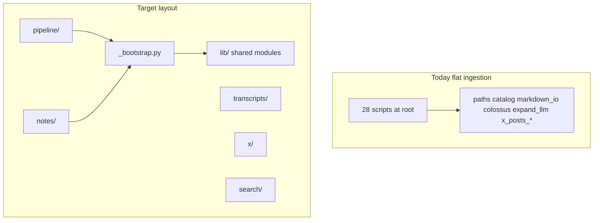

# Ingestion folder organization refactor

## Current state

[`ingestion/`](ingestion/) has ~28 Python files at the root after the completed [vault_lib split](ingestion_refactor_plan_41ab7943.plan.md). Subdirs already exist for [`migrations/`](ingestion/migrations/), [`prompts/`](ingestion/prompts/), and [`fixtures/`](ingestion/fixtures/). Scripts assume:

- `cd ingestion` then `python verify.py`
- Flat imports: `from catalog import load_catalog` (via [`tests/conftest.py`](tests/conftest.py) adding `ingestion/` to `sys.path`)
- Repo root from [`paths.ROOT`](ingestion/paths.py): `Path(__file__).parent.parent`



## Target layout

| Folder | Files | Section README |
|--------|-------|----------------|
| [`ingestion/lib/`](ingestion/lib/) | `paths`, `catalog`, `markdown_io`, `episode_ids`, `layout`, `gaps_report`, `cli_args`, `colossus`, `sitemap`, `expand_llm`, `x_posts_csv`, `x_posts_match`, `x_posts_threads` | [`lib/README.md`](ingestion/lib/README.md) — shared APIs, no CLI |
| [`ingestion/pipeline/`](ingestion/pipeline/) | `build_catalog`, `sync_new`, `map_colossus`, `verify` | Catalog build, Colossus map, gaps |
| [`ingestion/transcripts/`](ingestion/transcripts/) | `fetch_transcripts` | Colossus fetch |
| [`ingestion/notes/`](ingestion/notes/) | `scaffold_notes`, `expand_datapoints`, `expand_datapoints_llm`, `expand_tune` | Scaffolds + expansion |
| [`ingestion/x/`](ingestion/x/) | `sync_x_cache`, `organize_posts_from_csv`, `attribute_posts_llm`, `assign_post_manual`, `dedupe_x_csv` | X cache → posts |
| [`ingestion/search/`](ingestion/search/) | `build_chunks`, `search` | Chunk index + query |
| *(unchanged)* | `migrations/`, `prompts/`, `fixtures/` | Keep existing READMEs |

**Naming:** use `pipeline/` not `catalog/` to avoid confusion with repo [`catalog/`](catalog/).

**No root shims** (your “either” → pick the cleaner long-term shape): update command paths once in docs/AGENTS/CI. Daily usage stays `cd ingestion`; commands become e.g. `python pipeline/verify.py`.

## Import / path strategy

### 1. Shared bootstrap — [`ingestion/_bootstrap.py`](ingestion/_bootstrap.py)

```python
def setup_paths() -> None:
    ingestion = Path(__file__).resolve().parent
    for entry in (ingestion, ingestion / "lib"):
        s = str(entry)
        if s not in sys.path:
            sys.path.insert(0, s)
```

Every CLI script starts with:

```python
import _bootstrap
_bootstrap.setup_paths()
```

This preserves existing import style inside `lib/` (`from catalog import …`, `from paths import ROOT`).

### 2. Fix [`paths.py`](ingestion/paths.py) when moved to `lib/`

- `ROOT` → repo root: `Path(__file__).resolve().parent.parent.parent` (was `.parent.parent` at `ingestion/paths.py`)
- Add `INGESTION_DIR = Path(__file__).resolve().parent.parent` for prompts/fixtures
- Replace hardcoded `Path("ingestion/prompts/...")` in [`expand_llm.py`](ingestion/expand_llm.py) with `INGESTION_DIR / "prompts" / "expand_datapoints.md"`
- Update [`expand_tune.py`](ingestion/expand_tune.py) `PROMPT_A` / `PROMPT_B` / `LLM_SCRIPT` to use `INGESTION_DIR` and `INGESTION_DIR / "notes" / "expand_datapoints_llm.py"`

### 3. Subprocess callers

| Caller | Change |
|--------|--------|
| [`expand_tune.py`](ingestion/expand_tune.py) | `LLM_SCRIPT` → `INGESTION_DIR / "notes" / "expand_datapoints_llm.py"` |
| [`expand_datapoints_llm.py`](ingestion/expand_datapoints_llm.py) `--subprocess` | `Path(__file__).resolve()` still works inside `notes/` |
| [`gaps_report.py`](ingestion/gaps_report.py) help strings | `python pipeline/sync_new.py`, `python notes/expand_datapoints_llm.py` |

### 4. Tests — [`tests/conftest.py`](tests/conftest.py)

Mirror bootstrap:

```python
INGESTION = ...
sys.path.insert(0, str(INGESTION))
sys.path.insert(0, str(INGESTION / "lib"))
```

[`tests/test_attribute_posts_llm.py`](tests/test_attribute_posts_llm.py) and [`tests/test_expand_tune.py`](tests/test_expand_tune.py) import script modules by name — update to import from new locations if needed (e.g. `import importlib; mod = importlib.import_module("attribute_posts_llm")` still works if `x/` is on path, or add `ingestion/x` to path for script imports only).

**Simpler test approach:** keep importing lib modules unchanged; for script tests, add each script parent dir to `sys.path` in conftest (`pipeline`, `notes`, `x`) OR import via file path after move.

### 5. Migrations

Leave under [`ingestion/migrations/`](ingestion/migrations/). Add `_bootstrap.setup_paths()` at top of each migration that imports lib modules; update [`migrations/README.md`](ingestion/migrations/README.md) run example to `python migrations/migrate_episode_layout.py` (unchanged cwd).

## Documentation refresh

### Master index — rewrite [`ingestion/README.md`](ingestion/README.md)

- Quick start (venv, `cd ingestion`)
- **Table of contents** linking to section READMEs
- One pipeline-order table with **new script paths**
- Env vars + CLI conventions (keep current content, update paths)
- “Run tests”: `pytest ../tests -q` + `python pipeline/verify.py`

### Section READMEs (new, ~30–50 lines each)

Each documents: purpose, scripts, typical commands, env vars, upstream/downstream in the vault pipeline.

| README | Covers |
|--------|--------|
| [`pipeline/README.md`](ingestion/pipeline/README.md) | `build_catalog` → `map_colossus` → `verify`; `sync_new` ongoing |
| [`transcripts/README.md`](ingestion/transcripts/README.md) | `fetch_transcripts`, Colossus `.env` |
| [`notes/README.md`](ingestion/notes/README.md) | `scaffold_notes`, expand trio, link to [`docs/datapoint-workflow.md`](docs/datapoint-workflow.md) |
| [`x/README.md`](ingestion/x/README.md) | sync → organize → attribute → manual assign |
| [`search/README.md`](ingestion/search/README.md) | `build_chunks`, `search` |
| [`lib/README.md`](ingestion/lib/README.md) | Module map (today’s “Module layout” table) |

### Repo docs to update (path strings only)

- [`AGENTS.md`](AGENTS.md) — ingestion command table
- [`docs/notes-pipeline.md`](docs/notes-pipeline.md), [`docs/datapoint-workflow.md`](docs/datapoint-workflow.md), [`docs/retrieval.md`](docs/retrieval.md)
- [`import/README.md`](import/README.md)
- [`ingestion/fixtures/expand-runs/README.md`](ingestion/fixtures/expand-runs/README.md)
- [`.github/workflows/verify.yml`](.github/workflows/verify.yml): `python pipeline/verify.py`

Optional small add: [`docs/ingestion-pipeline.md`](docs/ingestion-pipeline.md) as a one-page human overview that links into section READMEs (deferred in [next_refactor_priorities](next_refactor_priorities_837d760f.plan.md) — include if time permits in same PR).

## Implementation order

1. Add `_bootstrap.py`; create `lib/` and `git mv` all shared modules; fix `paths.ROOT` / `INGESTION_DIR`; fix `expand_llm` prompt paths.
2. Create domain folders; `git mv` CLI scripts; add `import _bootstrap; _bootstrap.setup_paths()` to each.
3. Fix subprocess paths and `gaps_report` user-facing hints.
4. Update `conftest.py` + any broken test imports.
5. Write section READMEs + rewrite master `ingestion/README.md`.
6. Ripgrep repo for stale `python verify.py` / `ingestion/foo.py` references; update docs + CI.
7. Verify: `pytest tests -q`; `cd ingestion && python pipeline/verify.py` (exit 0); spot-check `python notes/scaffold_notes.py --id ep-0200 --dry-run`.

## Out of scope (keep guidelines-aligned)

- Converting to installable package (`pyproject.toml` / `python -m ingestion...`) — unnecessary for a personal vault
- Further splitting `x_posts_*` or `expand_llm` — only move files
- Bulk content / notes / posts changes
- New features or embeddings

## Risk notes

- **Muscle memory:** commands gain a folder prefix (`pipeline/verify.py`). Document prominently in README TOC.
- **Working directory:** still `ingestion/`; do not run scripts from repo root without `cd ingestion` (same as today).
- **Agent transcripts / old plans:** historical `.cursor/plans/` paths will be stale; only update actively linked docs above.

## Commit guidance

Single focused commit (or docs + code split if you prefer reviewability). Per [`AGENTS.md`](AGENTS.md), include this plan file under [`.cursor/plans/`](.cursor/plans/) in the same commit as the refactor.
