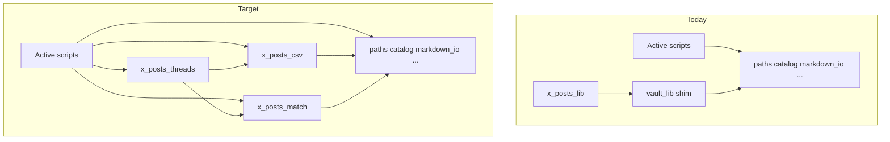

# Ingestion polish: vault_lib removal + x_posts split

## Current state (verified)

| Area | Status |
|------|--------|
| Refactor on `main` | Done (`a02d035` vault split + pytest; `1022853` docs/CI/cli_args) |
| CI | [`.github/workflows/verify.yml`](.github/workflows/verify.yml) runs `pytest tests -q` + `ingestion/verify.py` |
| Production imports | **All active scripts** already use `catalog`, `paths`, `markdown_io`, `colossus`, etc. |
| `vault_lib` consumers | Only [`ingestion/x_posts_lib.py`](ingestion/x_posts_lib.py) (`ROOT`, `utc_now_iso`) + [`ingestion/migrations/`](ingestion/migrations/) (archived one-shots) |
| `x_posts_lib.py` | ~287 lines, single module; used by `sync_x_cache`, `organize_posts_from_csv`, `dedupe_x_csv`, `assign_post_manual` |



**Out of scope for this pass:** X corpus backfill, article-body fetch, `expand_datapoints` batch mode, content catch-up (goals 1–3). No changes to `catalog/gaps.md` counts.

---

## Phase 1 — Remove `vault_lib` shim (~30 min)

### 1a. Fix last production dependency

In [`ingestion/x_posts_lib.py`](ingestion/x_posts_lib.py) (or its split successors), replace:

```python
from vault_lib import ROOT, utc_now_iso
```

with:

```python
from markdown_io import utc_now_iso
from paths import ROOT
```

### 1b. Update archived migrations (so shim can be deleted)

Point [`migrate_episode_layout.py`](ingestion/migrations/migrate_episode_layout.py) and [`migrate_transcript_names.py`](ingestion/migrations/migrate_transcript_names.py) at the real modules (`paths`, `catalog`, `episode_ids`) — same symbols they import today, no behavior change. These scripts are not re-run; this only keeps them importable if someone opens them.

### 1c. Delete [`ingestion/vault_lib.py`](ingestion/vault_lib.py)

No re-export facade. Active code already bypasses it.

### 1d. Doc touch-up (3 files)

| File | Change |
|------|--------|
| [`AGENTS.md`](AGENTS.md) | `vault_lib.folder_name` → `paths.folder_name` (or “`ingestion/paths.py`”) |
| [`docs/episode-id-rules.md`](docs/episode-id-rules.md) | `EPISODE_NUMBER_WIDTH` and path helpers cite `episode_ids.py` / `paths.py` only; remove “re-exported from vault_lib” |
| [`ingestion/README.md`](ingestion/README.md) | Module table: drop `vault_lib.py` row; add `x_posts_csv` / `x_posts_match` / `x_posts_threads` after Phase 2 |

---

## Phase 2 — Split `x_posts_lib.py` (~1–2 hrs)

Split by responsibility (flat modules, consistent with `catalog.py` / `paths.py`):

### [`ingestion/x_posts_csv.py`](ingestion/x_posts_csv.py) — cache I/O + API row shape

- Path constants: `X_POSTS_CSV`, `X_POSTS_META`, `POST_MAPPING_REVIEW`, `POSTS_OTHER_DIR`, `POSTS_CORPUS_OTHER`
- `CSV_COLUMNS`, `tweet_url`, `load_existing_ids`, `load_meta`, `save_meta`, `append_csv_rows`, `load_csv_rows`
- Tweet parsing: `json_field`, `extract_text`, `classify_post_kind`, `thread_root_id`, `is_thread_root`, `tweet_to_row`

### [`ingestion/x_posts_match.py`](ingestion/x_posts_match.py) — episode attribution

- `EP_MENTION_RE`, `AUTO_ACCEPT_SCORE`, `REVIEW_SCORE`
- `days_between`, `title_tokens`, `match_episode`

**Optional small fix (same PR):** widen `EP_MENTION_RE` episode capture from `\d{1,3}` to `\d{1,4}` so explicit mentions like `ep 0200` / `#200` stay consistent with 4-digit catalog ids (today max episode 417, so behavior unchanged until ~1000).

### [`ingestion/x_posts_threads.py`](ingestion/x_posts_threads.py) — grouping + attribution filters

- `x_user_id`, `is_reply_to_other`, `is_attributable_row`, `filter_attributable_rows`, `assemble_threads`
- Imports row helpers from `x_posts_csv` only (no circular imports)

### Update consumers (direct imports, no second shim)

| Script | New imports |
|--------|-------------|
| [`sync_x_cache.py`](ingestion/sync_x_cache.py) | `x_posts_csv` (append, meta, tweet_to_row, …) |
| [`organize_posts_from_csv.py`](ingestion/organize_posts_from_csv.py) | `x_posts_csv` + `x_posts_match` + `x_posts_threads` |
| [`dedupe_x_csv.py`](ingestion/dedupe_x_csv.py) | `x_posts_csv` |
| [`assign_post_manual.py`](ingestion/assign_post_manual.py) | `x_posts_csv.tweet_url` |

Delete [`ingestion/x_posts_lib.py`](ingestion/x_posts_lib.py) after rewiring (avoid keeping a pass-through file).

---

## Phase 3 — Tests for extracted pure logic (~45 min)

Add [`tests/test_x_posts_match.py`](tests/test_x_posts_match.py) and [`tests/test_x_posts_threads.py`](tests/test_x_posts_threads.py) (mirror existing style in [`tests/test_markdown_io.py`](tests/test_markdown_io.py)):

**`match_episode` cases:**

- Explicit `#131` / `episode 131` → score ≥ 0.95, correct `episode_number`
- Title-token fuzzy match with/without `published_at` proximity
- No match → `(None, 0.0, "none")`

**Attribution cases:**

- `is_reply_to_other` when `post_kind=reply` and `in_reply_to_user_id` ≠ your `X_USER_ID`
- `filter_attributable_rows` drops other people's reply threads
- `assemble_threads` merges self-thread parts into one unit text (minimal fixture rows)

No live API or CSV file I/O in tests.

---

## Verification

From repo root (local; CI already encodes this):

```bash
cd ingestion
pip install -r requirements.txt -r requirements-dev.txt
pytest ../tests -q
python verify.py
```

Confirm:

- `pytest` count increases (new x_posts tests); all green
- `verify.py` exits 0; [`catalog/gaps.md`](catalog/gaps.md) counts unchanged (176 datapoints, 187 posts)
- `rg 'vault_lib|x_posts_lib' ingestion --glob '*.py'` → **no matches** outside `migrations/` (migrations should also be clean after 1b)

**Pre-push:** ensure `1022853` (docs/CI polish) is pushed if not already on `origin/main`.

---

## PR shape

Single focused PR is fine (~4–6 files moved/created, 4 scripts touched, 3 docs, 2 test files, delete 2 modules). If you prefer smaller review: **PR1** vault_lib removal + doc fixes; **PR2** x_posts split + tests.

## Risk notes

- **Low:** import-only refactor; no catalog or content writes
- **Migrations:** still runnable in theory after import path updates; do not re-execute on production vault
- **Deferred:** splitting further (e.g. `organize_posts_from_csv` writers) or X article fetch — save for goal #2 when you add real X features
