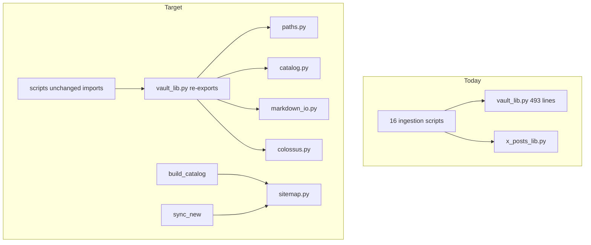

# Ingestion refactor after guidelines review

## Context

[`.cursor/guidelines.mdc`](.cursor/guidelines.mdc) favors **simplicity**, **surgical diffs**, and **verifiable steps**. Your choices: **code dedup first**, plus **module split**, **pytest**, and **archive migrations** (zero-pad migration is [completed](.cursor/plans/zero-pad_episode_ids_85a85c51.plan.md)).

The ingestion tree is ~3.3k lines across 19 scripts; [`ingestion/vault_lib.py`](ingestion/vault_lib.py) (493 lines) is the hub imported by 16 scripts. There are **no tests** today and **no CI**.



---

## Phase 0 — Baseline (no behavior change)

**Goal:** Lock a green baseline before refactors.

1. From `ingestion/`: `python verify.py` (must exit 0).
2. Spot-check one scripted path: `python scaffold_notes.py --id ep-0200 --dry-run`.
3. Record current `catalog/gaps.md` datapoint count (**176/417** per [`catalog/gaps.md`](catalog/gaps.md)) — README still says 189; fix README in a tiny follow-up only if you want docs in sync (out of scope for code-first pass).

**Verify:** `verify.py` exit 0; optional `git status` clean aside from intentional work.

---

## Phase 1 — Incremental dedup (still single `vault_lib.py`)

Extract the highest-duplication, lowest-risk helpers **before** splitting files so logic is centralized once.

| Extract | From | Used by |
|---------|------|---------|
| `read_markdown_body(path) -> str` | 5× `split("---", 2)` | `verify.py`, `scaffold_notes.py`, `expand_datapoints.py`, `build_chunks.py`, `organize_posts_from_csv.py` |
| `TIMESTAMP_BULLET_RE` + `has_timestamp_datapoints(path)` | 3 copies | `verify.py`, `scaffold_notes.py`, `import_notes.py` (align regex with verify unless Apple Notes needs `•` prefix) |
| `resolve_catalog_row(rows, episode_id) -> dict` | `expand_datapoints.find_row`, `fetch_transcripts`, `scaffold_notes` | All `--id` tools |
| `iter_sitemap_episodes(sess) -> dict[str, dict]` | Duplicate loops | [`build_catalog.py`](ingestion/build_catalog.py), [`sync_new.py`](ingestion/sync_new.py) |

**Also in this phase:**

- Unify [`write_transcript_md`](ingestion/vault_lib.py) with [`write_frontmatter_md`](ingestion/vault_lib.py) (build FM dict → one writer).
- Route post writes through **`write_post_md`** or extend it so [`organize_posts_from_csv.py`](ingestion/organize_posts_from_csv.py) and [`assign_post_manual.py`](ingestion/assign_post_manual.py) share one FM shape (today `write_post_md` has **zero callers**).
- Deduplicate `tweet_url()` into `x_posts_lib` or `vault_lib`.
- Remove **unused imports**: `slug_from_founders_url` in `build_catalog.py` / `sync_new.py` (only imported, never called).

**Verify:** `verify.py`; `python expand_datapoints.py --id ep-0200` (dry-run if it supports it, else read-only path); re-run `build_catalog.py` + `sync_new.py --dry-run` if such flag exists (else document manual smoke).

---

## Phase 2 — Split `vault_lib` into modules + re-export shim

Keep **all existing** `from vault_lib import ...` working via a thin [`vault_lib.py`](ingestion/vault_lib.py) that re-exports public symbols (zero script churn).

Proposed layout under [`ingestion/`](ingestion/):

| Module | Responsibility |
|--------|----------------|
| [`paths.py`](ingestion/paths.py) | `ROOT`, dir constants, `folder_name`, `content_filename`, `*_dir`, `*_file_path`, `transcript_path` |
| [`catalog.py`](ingestion/catalog.py) | `load_catalog`, `save_catalog`, `new_row`, `catalog_by_id` / `catalog_by_number`, `resolve_catalog_row`, `load_jsonl` |
| [`markdown_io.py`](ingestion/markdown_io.py) | `escape_yaml_value`, `write_frontmatter_md`, `read_markdown_body`, `has_timestamp_datapoints`, `write_notes_md`, `write_post_md`, `write_transcript_md` |
| [`colossus.py`](ingestion/colossus.py) | BeautifulSoup extractors, `colossus_login`, cookies, `session`, `rate_limit` |
| [`sitemap.py`](ingestion/sitemap.py) | `iter_sitemap_episodes`, shared `SITEMAP_URL` / slug→number parsing |
| [`episode_ids.py`](ingestion/episode_ids.py) (optional) | `format_episode_id`, `parse_numbered_episode_id`, `make_id`, `legacy_make_id` |

**Dead code policy (guidelines: mention, delete when asked — you asked for cleanup):**

- Delete if still unused after wiring post writer: `notes_path`, `expanded_path`, `post_path`, `append_unmapped_post` / `load_unmapped_posts` / `save_unmapped_posts`, or wire `append_unmapped_post` from organize if that queue is still intended.
- Keep `legacy_make_id` only if [`migrate_episode_layout.py`](ingestion/migrate_episode_layout.py) needs it until archived.

**Verify:** `verify.py`; `python -c "from vault_lib import load_catalog, folder_name; print(len(load_catalog()))"` from `ingestion/`.

---

## Phase 3 — Slim `verify.py` (optional but fits split)

[`verify.py`](ingestion/verify.py) (331 lines) mixes layout scanning, Phase 2 stats, and exit policy.

- Move `scan_layout_violations` + regex constants to `layout.py` (reused by tests).
- Move gap markdown generation to `gaps_report.py`.
- Leave `verify.py` as orchestrator: load catalog → layout + coverage → write `gaps.md` → `SystemExit(1)` on hard failures.

**Verify:** `verify.py` output matches prior `gaps.md` structure (diff `catalog/gaps.md` before/after; tolerate timestamp-only churn).

---

## Phase 4 — Pytest for pure helpers

Add dev dependency and minimal tests (no network).

**Files:**

- `ingestion/requirements-dev.txt` — `pytest>=8.0`
- `tests/test_episode_ids.py` — `format_episode_id`, `parse_numbered_episode_id` (`ep-1` and `ep-0001`), `make_id` specials
- `tests/test_paths.py` — `folder_name`, `content_filename`, path helpers
- `tests/test_markdown_io.py` — `read_markdown_body`, `write_frontmatter_md` round-trip, YAML escape
- `tests/test_layout.py` — `scan_layout_violations` on fixture dirs (tmpdir with one valid + one invalid episode folder)

Run from repo root:

```bash
cd ingestion && source .venv/bin/activate
pip install -r requirements-dev.txt
pytest ../tests -q
python verify.py
```

**Guidelines alignment:** tests give “refactor X → tests pass before and after” success criteria.

---

## Phase 5 — Archive migrations and deprecated entrypoints

Confirm zero-pad migration is done (plan todos completed; [`verify.py`](ingestion/verify.py) enforces padded ids and `{folder}.{type}.md`).

| Action | Item |
|--------|------|
| Move | `migrate_episode_layout.py`, `migrate_transcript_names.py` → `ingestion/migrations/` |
| Add | `ingestion/migrations/README.md` — one paragraph: historical, do not re-run unless restoring from manifest |
| Remove or stub | [`import_posts_x.py`](ingestion/import_posts_x.py) — replace with 2-line note in `AGENTS.md` / README pointing to `sync_x_cache` + `organize_posts_from_csv` |
| Keep manifest | [`catalog/migration-layout-2026-05-21.json`](catalog/migration-layout-2026-05-21.json) as rollback reference |

**Verify:** `verify.py`; grep shows no imports of archived scripts in active pipeline docs.

---

## Phase 6 — Small CLI consistency (low priority)

Not required for correctness; reduces agent/human confusion:

- Shared `add_episode_id_arg(parser)` → `--id ep-NNNN` for `fetch_transcripts`, `scaffold_notes`, `expand_datapoints`.
- Document in code/docstring that `assign_post_manual --episode` is **integer episode_number**, not `ep-NNNN`.

Defer unless you want this in the same PR series.

---

## What we are intentionally not doing (per guidelines + AGENTS.md)

- **No embeddings / v2 retrieval** unless grep + chunks fail.
- **No broad content/notes refactors** (hundreds of untracked `ep-0190+` scaffolds in git status).
- **No drive-by formatting** across unrelated scripts.
- **No full docs rewrite** in this pass (README 189 vs 176 datapoints, stale [`import/README.md`](import/README.md) — quick fix later if wanted).

---

## Suggested PR sequence (surgical diffs)

1. **PR1:** Phase 1 dedup + dead import removal + writer unification  
2. **PR2:** Phase 2 module split (re-export shim only)  
3. **PR3:** Phase 4 pytest + Phase 3 verify slim (can combine)  
4. **PR4:** Phase 5 archive migrations + drop `import_posts_x.py`

Each PR: `verify.py` + `pytest` green.

---

## Risk notes

- **Timestamp regex alignment** between `import_notes` and `verify` may change which files count as “has datapoints” — compare `gaps.md` before/after Phase 1.
- **Post FM unification** must preserve fields `organize_posts_from_csv` and `assign_post_manual` already emit (`source`, `post_kind`, `x_post_id`, etc.).
- **Module split** is safe only with re-export shim; avoid updating 16 import sites in one shot unless you prefer explicit imports.
