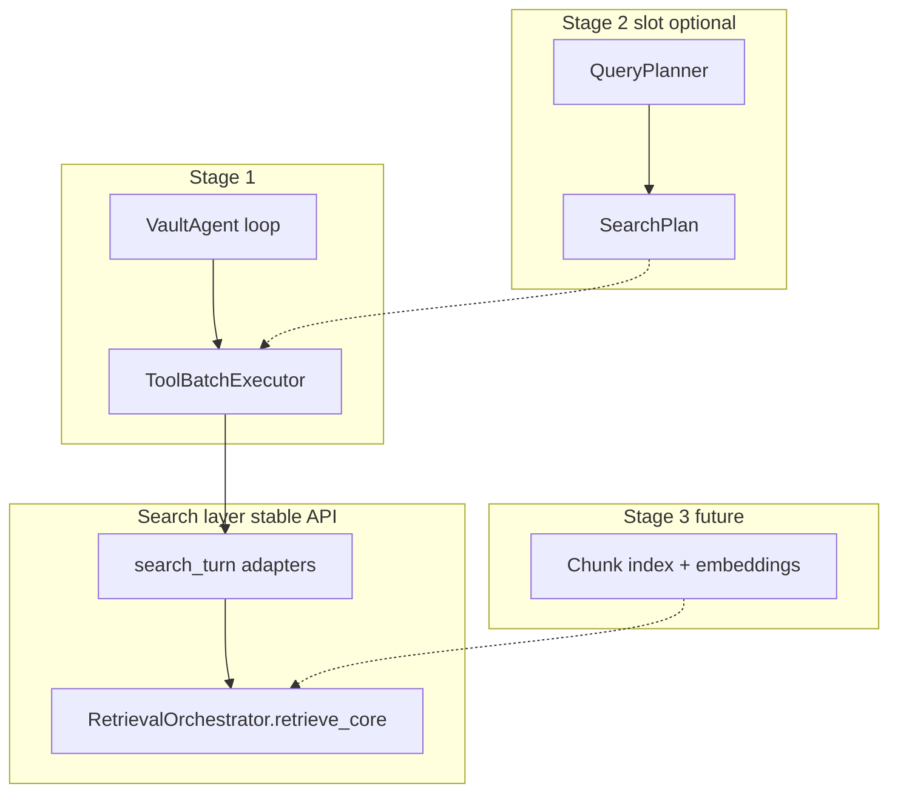

# Founders Librarian — Agentic Vision Brief

## What This System Is

The Founders Librarian is a personal AI study partner built on top of Ethan's private vault of Founders podcast notes, expanded datapoints, and episode transcripts. It is not a search tool or a document Q&A interface. It is designed to feel like a brilliant collaborator who has studied the same material and can reason across it — surfacing patterns, making connections across founders, and being honest when the evidence is thin.

The target experience is closest to Perplexity Pro Search: the user asks a question in natural language, and the system does whatever retrieval work is necessary before delivering a sharp, well-grounded answer with citations. Depth and voice matter; latency is now a first-class architectural goal alongside quality.

***

## What Has Been Built (v4 — shipped)

The **v4 agentic Librarian loop** is live. The model cold-starts with no pre-retrieved evidence and drives retrieval via a five-tool toolbox:

- **`search_vault(query)`** — full expand → hybrid search → rerank pipeline on a targeted query
- **`search_vault_many(queries[])`** — concurrent fan-out across model-supplied sub-queries; results labeled per sub-query
- **`search_transcript(query)`** — keyword search over raw transcripts (verbatim / triangulation)
- **`list_episode_ids(query)`** — resolve guest name or episode number to `ep-NNNN`
- **`load_episode(episode_id)`** — pull one full episode (post + notes + expanded)

The loop runs until the model answers or hits a **6 tool-call round** safety cap (rounds, not sub-queries). Model tiers are split: `librarian_model` drives the loop + synthesis; `retrieval_model` handles expand + rerank inside each search.

Source of truth: [`services/telegram/bot/agent_core.py`](services/telegram/bot/agent_core.py), [`services/telegram/bot/search_turn.py`](services/telegram/bot/search_turn.py), [`docs/retrieval.md`](docs/retrieval.md).

### Historical context (v3 — superseded)

Before v4, retrieval was **rigidly pre-scripted**: a rules-based intent classifier decided whether to retrieve, then a single linear pipeline (expand → hybrid search → rerank → transcript fallback) ran before the synthesis model ever saw the question. That architecture could not decompose multi-hop questions, triangulate corpora deliberately, or re-search when evidence was thin. v4 replaced it with model-driven retrieval.

***

## The Core Problem v4 Solved

The old pipeline produced two failure modes:

1. **Thin or tangential evidence, with no recourse.** The synthesis model was stuck with whatever a single pass surfaced.
2. **Multi-hop and cross-founder questions fell flat.** One search pass could not hold evidence about two founders in relationship.

v4 gives the model a feedback loop: decompose, triangulate, re-search, and stop when evidence is sufficient.

***

## Search-as-Code Roadmap (3 stages)

This design follows Perplexity's **Search as Code** principle: expose the search stack as atomized, composable primitives the model (or a planner) assembles per question — with parallel fan-out and a distinct tool per corpus. Not literal code execution; this vault is ~1.2k studied-episode vectors, not a web-scale sandbox.

All heavy lifting stays **API-driven** (OpenRouter for LLM steps; local hybrid search over bundled index today; cloud deployment will keep retrieval behind stable APIs).



| Stage | Goal | Scope | Status |
|-------|------|-------|--------|
| **1 — Parallel execution** | Collapse within-round tool wall time from sum → max | `ToolBatchExecutor` in agent loop; timing/harness; retrieval internals unchanged | **Shipped** |
| **2 — Query planner** | Upfront fast LLM decomposes question into a `SearchPlan` | Optional pre-loop planner; librarian loop may shrink to synthesis-only on hard questions | Future; `SearchPlan` → `execute_tool_batch` seam reserved |
| **3 — Ingestion chunking** | Eliminate runtime LLM rerank | Chunk boundaries + index build; `retrieve_core` becomes search-only | Future |

### Stage 1 detail: parallel tool execution

When the librarian model emits multiple tool calls in one round (e.g. `search_vault` + `search_transcript`), the agent loop must execute them **concurrently**, not serially. `search_vault_many` already parallelizes sub-queries internally; Stage 1 fixes the outer loop.

**OpenRouter burst profile:** parallel tools multiply concurrent expand + rerank calls. Stage 1 relies on existing 429 retry (`execute_openrouter_with_retry`) — no proactive semaphore. Monitor `expand_retry_ms` in harness timing after deploy.

### Agentic layer principles (unchanged from v4)

**Cold start, full agency** — no pre-retrieved evidence; the model decides every search.

**Dynamic loop** — no fixed minimum rounds; 6-round safety cap on tool-call rounds (not sub-queries).

**Composition guidance** — [`AGENTS.md`](AGENTS.md) teaches decomposition (`search_vault_many`), triangulation (`search_transcript`), and disconfirming evidence as soft heuristics, not mandatory steps.

**Model tiers stay split** — strong model for loop + synthesis; cheap model for expand + rerank inside each search.

**Voice stays consistent** — sharp, opinionated thought partner; honest about thin evidence.

**Legible loop** — `tool_trace` records every tool call, sub-query, batch parallelism, and stop reason for tuning. End-user UX polish for live status is deferred.

***

## Influence: Perplexity "Search as Code" and 2026 agentic-RAG patterns

Atomized primitives, parallel fan-out, distinct corpus per tool — not a monolithic pre-scripted endpoint. What is **explicitly out of scope**: model-generated Python in a secure sandbox over web-scale search. The brief takes *granularity, decomposition, and triangulation* — not literal code execution.

***

## Stage 2 / 3 interface contract (design now, build later)

```python
# Stage 2 (future) — services/telegram/lib/retrieval/search_plan.py
@dataclass
class SearchPlan:
    sub_queries: list[str]
    include_transcript: bool = False
    # maps to list[ToolInvocation] for execute_tool_batch

# Stage 3 (future) — orchestrator.retrieve_core gains rerank=False path
# when chunk quality makes LLM rerank redundant
```

`execute_tool_batch` + unchanged `search_turn` adapters = the stable seam. Planner and chunking both plug in without rewriting the agent loop.

***

## Success Criteria

**Quality (unchanged):**

- Multi-hop and cross-founder questions come back sharper because the model decomposed and triangulated
- Thin-evidence questions get an honest decline instead of confident filler
- Synthesis voice stays consistent regardless of search rounds
- Judged by reading real answers + live harness scenarios ([`docs/telegram-mock-harness.md`](docs/telegram-mock-harness.md))

**Latency (Stage 1+):**

- Within-round multi-tool turns show wall time ≈ max(tool latencies), not sum
- `timing_accountability.parallelism_excess_ms` drops when tools run in parallel
- Harness pass/fail does not regress at the same 6-round cap

Cost remains secondary. Cloud deployment (public website) will require API-driven retrieval throughout — Stage 1 interfaces are modular for that path.
