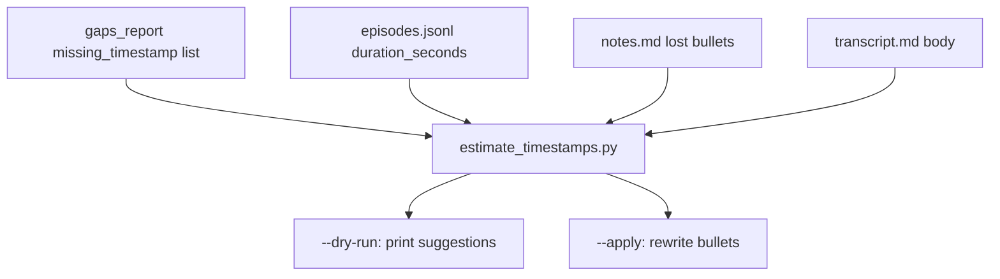

# Housekeeping + timestamp repair (A + B)

## Decisions (from grill)


| Decision                  | Choice                                                                          |
| ------------------------- | ------------------------------------------------------------------------------- |
| Scope                     | **A (housekeeping) + B (timestamps)** — no Librarian re-baseline, no X articles |
| Deprecated X wrappers     | **Delete** `sync_x_cache.py` and `organize_posts_from_csv.py`                   |
| Timestamp repair          | **RSS duration + estimate script** (not manual transcript lookup)               |
| X articles (ep-0082/0088) | **Skipped** this plan                                                           |
| After notes fix           | **Re-expand** affected episodes                                                 |
| Delivery                  | **Two PRs**                                                                     |


## Doc hygiene gate (required — [.cursor/guidelines.mdc](.cursor/guidelines.mdc))

Per guidelines, this repo has **two agent contexts** — do not conflate them when editing docs:

| Context | Doc | Touch when |
|---------|-----|------------|
| Librarian persona | [`AGENTS.md`](AGENTS.md) | Synthesis voice, retrieval heuristics only |
| Repo maintenance | [`docs/repo-agent-guide.md`](docs/repo-agent-guide.md) | Pipeline commands, gaps policy, new CLIs |

**PR1 and PR2 doc work stays in maintenance docs** (`repo-agent-guide`, subsystem READMEs, `episode-id-rules`, `datapoint-workflow`). Do **not** edit `AGENTS.md` for timestamp tooling or wrapper deletion.

### Surgical doc rule (guidelines §3)

Every doc change must trace to a concrete agent confusion risk. No drive-by rewrites of adjacent sections. Match existing doc style.

### Grep checklist (run before each PR merge)

Must return **zero hits** in `*.md` / `*.mdc` (except this plan while in flight):

```
sync_x_cache
organize_posts_from_csv
x/x_posts_sync.py --full
organize second
Organize skips
post organization
~200/417
~187
AGENTIC-VISION-BRIEF.md   # at repo root only — legacy path in retrieval.md is OK
```

**Known remaining hits today** (PR1 must clear):

- [`catalog/import-review.md`](catalog/import-review.md) — "Organize skips"
- [`ingestion/x/README.md`](ingestion/x/README.md) — deprecated table rows (remove with wrapper deletion)

### Doc touch map

| Change | Docs to update |
|--------|----------------|
| Delete X wrappers | [`ingestion/x/README.md`](ingestion/x/README.md), [`ingestion/README.md`](ingestion/README.md) pipeline table (already says attribute) |
| `duration_seconds` catalog column | [`docs/episode-id-rules.md`](docs/episode-id-rules.md), [`ingestion/pipeline/README.md`](ingestion/pipeline/README.md) if catalog build documented there |
| `estimate_timestamps.py` | [`docs/repo-agent-guide.md`](docs/repo-agent-guide.md) ingestion table, [`ingestion/notes/README.md`](ingestion/notes/README.md), [`docs/datapoint-workflow.md`](docs/datapoint-workflow.md) (lost-timestamp recovery subsection) |
| ep-0021 XYZ | [`catalog/import-review.md`](catalog/import-review.md) — move out of "Resolved" or mark open |

### Plan lifecycle ([`docs/repo-agent-guide.md`](docs/repo-agent-guide.md) § Cursor plans)

1. Copy this plan to [`.cursor/plans/housekeeping_and_timestamps.plan.md`](.cursor/plans/housekeeping_and_timestamps.plan.md) at start of PR1
2. **Commit the plan in the same PR** as its implementation (final commit of each PR)
3. When both PRs merge, move plan to [`.cursor/plans/archive/legacy/`](.cursor/plans/archive/legacy/)

---

## PR 1 — Housekeeping (doc hygiene + dead code)

**Primary deliverable:** agent-facing docs and entry points are consistent with shipped CLIs. Code deletion supports the doc pass; not the other way around.

### Step 0 — Doc hygiene audit (do this first)

1. Run grep checklist above across repo
2. Fix every hit in agent entry points: [`README.md`](README.md), [`docs/repo-agent-guide.md`](docs/repo-agent-guide.md), [`import/README.md`](import/README.md), [`ingestion/README.md`](ingestion/README.md), [`catalog/import-review.md`](catalog/import-review.md), [`services/telegram/README.md`](services/telegram/README.md), subsystem READMEs under `ingestion/*/README.md`
3. Reconcile contradictory docs (ep-0021 listed "Resolved" but notes still have `- XYZ`)
4. Verify [`docs/telegram-vault-agent.md`](docs/telegram-vault-agent.md) and [`docs/retrieval.md`](docs/retrieval.md) still agree on v4 architecture (no edit unless grep finds drift)

### Delete dead code

- Remove `[ingestion/x/sync_x_cache.py](ingestion/x/sync_x_cache.py)` and `[ingestion/x/organize_posts_from_csv.py](ingestion/x/organize_posts_from_csv.py)`
- Update `[ingestion/x/README.md](ingestion/x/README.md)` — drop deprecated rows from scripts table (keep only live CLIs)
- Grep repo for any remaining references (should be clean after doc refresh)

### Delete orphan fixture

- Remove `[ingestion/fixtures/sample-apple-notes.txt](ingestion/fixtures/sample-apple-notes.txt)` — zero references; leftover from removed Apple Notes importer

### Stale doc strings (minimum set — audit may find more)

| File | Fix |
|------|-----|
| [`catalog/import-review.md`](catalog/import-review.md) | "Organize skips" → "Attribute skips"; fix ep-0021 "Resolved" contradiction |
| [`services/telegram/README.md`](services/telegram/README.md) | `## Mac mini install (SP4)` → `## Mac mini install` |

### Verify PR 1

```bash
# Doc hygiene (must pass)
rg -l 'sync_x_cache|organize_posts_from_csv|--full|organize second|Organize skips|post organization' --glob '*.md' --glob '*.mdc'

# Code
ingestion/.venv/bin/pytest tests -q --durations=10
cd ingestion && ../ingestion/.venv/bin/python pipeline/verify.py
```

---

## PR 2 — Timestamp estimation pipeline + data repair

### Problem

32 episodes (`[catalog/gaps.md](catalog/gaps.md)` § "Datapoint bullets missing timestamp") have bullets like `- — 9 grade education level` — Apple Notes import lost `MM:SS`. Transcripts are **plain prose** (no timecodes), so exact recovery is impossible. Expanded files already mirror this as `### —` headers (e.g. ep-0002 in `[catalog/chunks.jsonl](catalog/chunks.jsonl)`).

### Step 1 — Catalog duration from RSS

Extend `[ingestion/pipeline/build_catalog.py](ingestion/pipeline/build_catalog.py)` `load_rss_meta()` to parse `itunes:duration` from Megaphone RSS (`https://feeds.megaphone.fm/DSLLC6297708582`):

- Add `duration_seconds: int | null` to each `episodes.jsonl` row
- Handle RSS formats: plain seconds (`3721`) and `H:MM:SS` / `MM:SS`
- Document new column in [`docs/episode-id-rules.md`](docs/episode-id-rules.md) (schema source of truth)
- Add unit test with a small RSS fixture snippet (mock XML, no network in CI)
- Run `build_catalog.py` once to populate all 417 numbered rows

**Doc hygiene (PR2):** after schema/script land, update maintenance docs only — see Doc touch map. Add `estimate_timestamps.py` to [`docs/repo-agent-guide.md`](docs/repo-agent-guide.md) ingestion table and [`ingestion/notes/README.md`](ingestion/notes/README.md). Note in [`docs/datapoint-workflow.md`](docs/datapoint-workflow.md) that lost Apple Notes timestamps are **estimated** (RSS duration × transcript position), not recovered from transcript timecodes.

### Step 2 — `notes/estimate_timestamps.py`

New CLI (follow `[ingestion/_bootstrap.py](ingestion/_bootstrap.py)` + existing notes script patterns):




**Per lost-timestamp bullet:**

1. Normalize bullet text (strip `- —`, lowercase, drop punctuation)
2. Fuzzy-match against transcript body (`[markdown_io.read_markdown_body](ingestion/lib/markdown_io.py)`) — use `difflib.SequenceMatcher` or substring window search on first ~40 chars of distinctive words
3. `ratio = match_start_offset / transcript_char_length`
4. `estimated_sec = ratio * duration_seconds` (skip episode if duration missing — report in summary)
5. Format as `MM:00 — {original_text}` (round to nearest minute per your preference)

**Flags:**

- `--id ep-NNNN` / `--all-missing` (drives from `gaps_report` / `LOST_TIMESTAMP_BULLET_RE`)
- `--dry-run` (default) — table: episode, bullet excerpt, suggested `MM:00`, match confidence
- `--apply` — rewrite `.notes.md` bullets in place
- `--min-confidence` threshold to skip weak matches (manual follow-up)

**Tests:** `[tests/test_estimate_timestamps.py](tests/test_estimate_timestamps.py)` — synthetic transcript + bullet, known offset → expected minute.

### Step 3 — Apply + re-expand (data PR)

After reviewing dry-run output:

```bash
cd ingestion
python notes/estimate_timestamps.py --all-missing --apply
python pipeline/verify.py   # expect missing-timestamp section → 0

# Re-expand episodes where expanded headers are still `### —`
python notes/expand_datapoints_llm.py --id ep-NNNN --apply --force
# Or batch: loop the 32 ids with --subprocess

python notes/expand_datapoints_llm.py --promote --all-ready --apply
python lib/reindex_vault.py
```

Re-expand scope: all 32 episodes from gaps list (user chose notes + re-expand). Use `--force` because expanded drafts already exist.

### Out of scope (document only)

- **ep-0021** `- XYZ` placeholder — not a lost-timestamp case; still in "notes without datapoints". Fix when you listen to Masters of Doom.
- **X articles** ep-0082/ep-0088 — deferred
- **`content/posts/_other/`** — deferred
- **Librarian lift 3 / live re-baseline** — separate session per `[librarian_output_quality.md](.cursor/plans/librarian_output_quality.md)`

---

## Risk notes


| Risk                              | Mitigation                                                                                                                         |
| --------------------------------- | ---------------------------------------------------------------------------------------------------------------------------------- |
| Bad fuzzy matches → wrong `MM:00` | Default dry-run; `--min-confidence`; review table before `--apply`                                                                 |
| RSS missing duration for some eps | Script reports skips; fallback: word-count duration estimate or manual duration in catalog                                         |
| Re-expand cost                    | ~32 episodes × OpenRouter; run with `--dry-run` cost estimate first via `maintain.py` menu 5 or `expand_datapoints_llm.py` dry-run |
| Expanded quote accuracy           | Re-expand re-anchors quotes to estimated minute — good enough for search, not broadcast-exact                                      |


## Success criteria (goal-driven — guidelines §4)

| PR | Verify |
|----|--------|
| PR1 | Grep checklist **zero hits**; no deprecated X wrappers; `pytest` + `verify.py` green; plan file committed in repo `.cursor/plans/` |
| PR2 | `duration_seconds` documented in `episode-id-rules`; `estimate_timestamps` documented in repo-agent-guide + notes README; `gaps.md` missing-timestamp section → **0**; 32 `.notes.md` repaired; expanded promoted; chunk index rebuilt; plan archived to `legacy/` |

