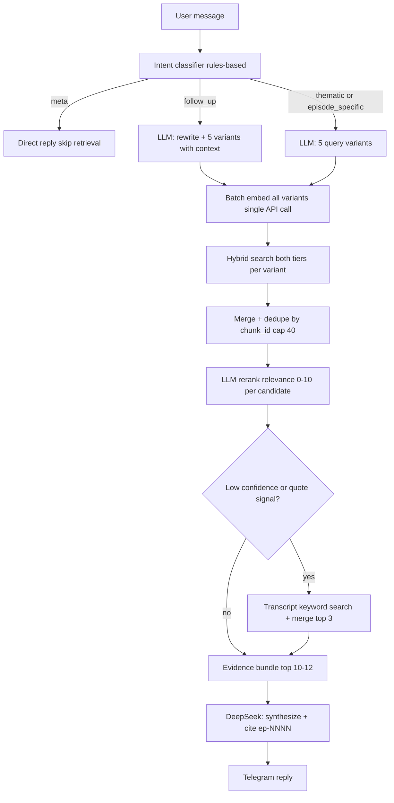

# Librarian Retrieval Overhaul

## Decisions locked (from interview)

| Decision | Choice |
|----------|--------|
| Orchestration | **Hybrid controller** — Python orchestrator runs adaptive retrieval; DeepSeek synthesizes only |
| Primary intent | **Thematic cross-episode** (forget episode numbers — that's the main job) |
| Corpus boundary | **Strict studied-only** — retrieval filtered to episodes with timestamp bullets in notes |
| Datapoint index | **Expanded-only** — drop `notes:*` and `post:*` from search; 100% of studied episodes have `.expanded.md` |
| Second tier | **Episode summaries** — LLM-generated at index time, content_hash incremental reuse; invisible routing layer only, never cited |
| Query expansion | **5 variants** in a single LLM call (batched embed for all variants in one API request) |
| Embeddings | **Structured embed text** per chunk type + large model via `runtime.json` `/setmodel embed` |
| Rerank | **LLM reranker** — top ~40 candidates → ranked 10–12 with relevance scores |
| Synthesis input | **Reranked excerpts** (v1) |
| Transcript | **Conditional fallback** — auto-runs when top rerank score < threshold or quote intent detected |
| Multi-turn | **Context-aware expansion** — follow-up rewrites are folded into the same single LLM expand call |
| Scope | **Telegram Librarian only**; orchestrator + reranker live in `ingestion/lib/` |

---

## Why the plan changed from v1 draft

**Critical corpus finding:** Every single one of the 179 studied episodes already has a canonical `.expanded.md`. There are zero studied episodes without one. This means:

- The draft's "per-bullet notes chunking" (1b) was solving a non-existent problem — **removed entirely**
- `notes:*` chunks (186 windowed blobs of half-sentence bullets like `- 49:20 — solar thesis`) compete against the richer expanded chunks they duplicate — **drop from search index**
- `post:*` chunks (193 blobs) are your published X distillations — useful context when loading a specific episode, but redundant as search candidates alongside expanded — **drop from search index; available via `load_episode` only**
- Summaries are a routing layer, not a citation source — they surface episodes silently; DeepSeek cites from expanded datapoints only
- The real index today: 1,045 expanded + 193 post + 186 notes = 1,424 parent chunks. After overhaul: **1,045 expanded datapoints + ~179 episode summaries = ~1,224 focused search chunks**

**LLM call count corrected:** The draft said "7 LLM calls." Correctly: 3 LLM calls per thematic turn (1 expand, 1 rerank, 1 synthesize) + 1 batched embed API call for all 5 query variants. Embed calls are cheap batch requests, not main-model calls.

---

## Target architecture



---

## Phase 1 — Index overhaul (foundation)

### 1a. Drop `notes:*` chunks; enforce studied-only at index time

In [`ingestion/search/build_chunks.py`](ingestion/search/build_chunks.py):

- **Skip unstudied episodes entirely** — if `episode_is_listened(notes_path)` is false, index nothing (transcript, notes, expanded, post all gated). Mirrors and generalizes the existing transcript gate.
- **Stop emitting `notes:*` chunks** — expanded covers all studied episodes; raw half-sentence bullets are noise.
- **Stop emitting `post:*` chunks** — posts remain readable via `load_episode` (user asks for a specific episode) but are removed from the thematic hybrid search pool. Expanded datapoints and episode summaries cover the same episodes with more retrieval signal.

**Net index change:** Drop 186 notes chunks + 193 post chunks; gain ~179 summary chunks. New search index: **expanded 1,045 + summaries ~179 = ~1,224 chunks** — smaller and more focused.

Add `episode_is_studied()` to [`ingestion/lib/search_retrieval.py`](ingestion/lib/search_retrieval.py) as a defense-in-depth filter at search time — never trust index alone.

### 1b. Episode summaries (new artifact and tier)

New script: [`ingestion/search/build_summaries.py`](ingestion/search/build_summaries.py)

- Reads `expanded.md` + `post.md` per studied episode.
- **Incremental:** hashes (expanded_text + post_text); skips LLM call when hash unchanged.
- LLM generates a 300–400 word retrieval-optimized summary: guest bio, core themes, mental models, key operators, notable quotes fragment. Not user-facing prose — dense retrieval surface.
- Prompt: new [`ingestion/prompts/episode_summary.md`](ingestion/prompts/episode_summary.md).
- Writes `catalog/episode-summaries.jsonl`: `{episode_id, title, summary_text, content_hash, model, generated_at}`.
- `build_chunks.py` reads this file and emits `summary:episode` chunks — one per studied episode.
- Reindex pipeline: `build_chunks` → `build_summaries` → `build_chunks` (second pass to pick up summaries) → `build_embeddings`. Or: summaries are emitted directly into `chunks.jsonl` by `build_summaries.py` in a merged write.

**Simpler option:** `build_summaries.py` directly appends `summary:episode` chunk rows to `chunks.jsonl` at the end of the same reindex step. Avoids double-pass.

Wire into [`ingestion/lib/reindex_vault.py`](ingestion/lib/reindex_vault.py).

### 1c. Structured embed text

Update [`ingestion/search/build_embeddings.py`](ingestion/search/build_embeddings.py):

Embed input per chunk type — all fit well within model limits (expanded avg 942 chars):

```
# expanded:expanded_datapoints chunk
Episode: {title} (ep-{num}, {published_at})
Timestamp: {ts_from_heading}
Context: {context field}
Quote: {quote field}
Takeaway: {takeaway field}

# summary:episode chunk
Episode: {title} (ep-{num})
{summary_text}
```

Posts are **not embedded** — they are loaded on demand via `load_episode` only.

- Embed model slug from existing `runtime.json` `/setmodel embed` — no new config surface.
- Recommended starting model: `openai/text-embedding-3-large` (3072-dim, good semantic coverage).
- `parent_chunks_for_embedding()` in `search_retrieval.py` updated: include `expanded:*` and `summary:*`; exclude `notes:*` and `post:*`.

### 1d. In-process embedding cache

In [`ingestion/lib/search_retrieval.py`](ingestion/lib/search_retrieval.py):

- **Matrix cache** — load `embeddings.npy` + manifest once per bot process; invalidate on file mtime change. Today it re-loads on every `search_vault_parent` call.
- **Query embed cache** — LRU (e.g. `functools.lru_cache` on query hash) — avoids re-embedding identical or near-identical variants.
- **`retrieval_meta`** field in all search results — `{embed_present, tiers_searched, candidate_count, studied_filter_applied}`. Eliminates silent hybrid degradation.

---

## Phase 2 — Retrieval orchestrator

New module: [`ingestion/lib/retrieval_orchestrator.py`](ingestion/lib/retrieval_orchestrator.py)

Telegram adapter: [`services/telegram/bot/retrieval.py`](services/telegram/bot/retrieval.py) (thin wrapper providing vault paths + runtime env to orchestrator).

### 2a. Intent classification (rules-first, no LLM needed)

| Intent | Detection | Action |
|--------|----------|--------|
| `meta` | Starts with `/`, greetings, "what model", "how many episodes" | Direct reply, skip retrieval |
| `follow_up` | Short message + prior assistant turn exists + no guest/ep-number signal | Fold context into expand call |
| `thematic` | Default (everything else) | Full pipeline |

Intent classifier does **not** need its own LLM call. `episode_specific` and `quote_hunt` are handled as sub-signals within the thematic pipeline — if the expanded query includes a guest name, hybrid search naturally surfaces those episodes first via keyword match. A separate routing branch for "Carnegie" is unnecessary overhead.

### 2b. Thematic pipeline (primary path)

**Step 1 — Query expansion (1 LLM call)**

Single structured prompt to DeepSeek:

```
Given: user query (+ last 2 turns if follow_up)
Produce JSON:
{
  "standalone_query": "...",   // rewritten for follow_up; else original
  "variants": [
    "...",  // synonym expansion
    "...",  // operator/mental-model framing
    "...",  // broader theme
    "...",  // specific entity/name if inferable
    "..."   // contrasting angle
  ]
}
```

**Step 2 — Batched hybrid search (1 embed API call)**

Pass all 5 `variants` as a **single batch** to OpenRouter embeddings endpoint — one HTTP call returns 5 vectors. For each vector + each variant (keyword), run `_hybrid_search_parent_chunks` against the full index (expanded + summary + post tiers). Pool per variant: `max(k*4, 32)`.

**Step 3 — Merge + dedupe**

Union all variant result sets; dedupe by `chunk_id`; aggregate RRF scores across variant appearances. Cap total candidate pool at ~40 chunks for reranker.

**Step 4 — LLM rerank (1 LLM call)**

`ingestion/lib/rerank_llm.py` — pass original user query + list of (chunk_id, title, section, excerpt ~600 chars). DeepSeek returns ordered list with score 0–10 and one-line rationale. Keep top 10–12.

**Step 5 — Conditional transcript fallback**

If `max(rerank_scores) < 6.0` OR query contains quote-intent signals ("what did he say", "exact words", "quote"):
- Run `search_transcript_keyword()` with original + top synonym variant.
- Pass transcript hits through same reranker call (merged with parent hits if not already at step 4, or separate rerank pass).
- Insert top 2–3 transcript excerpts into evidence bundle.

**Step 6 — Evidence bundle**

```python
@dataclass
class EvidenceBundle:
    chunks: list[EvidenceChunk]   # top 10-12, ordered by rerank score
    retrieval_meta: dict          # intent, variants, candidate_count, rerank_scores, fallback_triggered
    skip_retrieval: bool          # True for meta intent
```

Each `EvidenceChunk`: `chunk_id`, `episode_id`, `title`, `section`, `excerpt`, `rerank_score`, `source_path`.

### 2c. Episode-specific queries

When a guest name or `ep-NNNN` is in the query, the expanded variants will include it. Keyword hybrid naturally surfaces those episodes. No separate routing branch needed — thematic pipeline handles it. `load_episode` stays available as a DeepSeek **optional tool** for cases where the user explicitly asks for everything from one episode.

---

## Phase 3 — Agent integration

### 3a. Refactor [`agent.py`](services/telegram/bot/agent.py)

```python
# New turn structure (pseudocode)
bundle = orchestrator.retrieve(user_message, history=history[-4:], config=cfg)

if bundle.skip_retrieval:
    # meta intent: single completion with no evidence
    return single_completion([system_msg, *history, user_msg])

evidence_section = format_evidence_bundle(bundle)
messages = [synthesis_system_msg, *history, user_msg, evidence_section]
return single_completion(messages, tool_choice="none")
```

- Remove `search_vault_parent`, `search_transcript` from default OpenRouter tool list.
- Keep `load_episode` as an optional tool (user says "show me everything from the Rockefeller episode").
- Keep `web_search` for `/web` command.
- Remove `max_steps` loop for retrieval — orchestrator is deterministic Python, not LLM-stepped.
- Remove `_truncate_tool_json` — evidence bundle size is orchestrator-controlled.

### 3b. Rewrite [`vault_agent.md`](services/telegram/prompts/vault_agent.md)

Shifts from tool-calling policy to **synthesis policy**:

- Citable sources: `expanded:*` datapoints and `transcript:*` excerpts only.
- `summary:episode` chunks inform episode selection but are **never cited** — do not quote from summaries.
- Cite `[ep-NNNN]` from evidence chunks only — never reference episodes not present in the bundle.
- Unstudied episodes: orchestrator hard-excludes them; prompt reinforces "if it's not in the evidence, don't mention it."

### 3c. Observability

- **Retrieval trace** in session export: `{intent, variants, candidate_count, reranked_top5_scores, fallback_triggered, embed_present}`.
- Telegram status messages via existing [`tool_status.py`](services/telegram/bot/tool_status.py): "Expanding query…", "Searching vault…", "Ranking results…", "Composing answer…".

---

## Phase 4 — Tests and eval

| Test | What changes |
|------|-------------|
| Studied-only index | [`tests/test_search_retrieval.py`](tests/test_search_retrieval.py): unstudied episodes produce zero chunks |
| Notes + post chunks absent | [`tests/test_search_retrieval.py`](tests/test_search_retrieval.py): `notes:*` and `post:*` sections never in search index |
| Summary incremental | New `tests/test_build_summaries.py`: hash reuse skips LLM call; changed content triggers new call |
| Orchestrator thematic | [`tests/test_vault_retrieval_scenarios.py`](tests/test_vault_retrieval_scenarios.py): mock expand + rerank LLM; assert bundle.chunks non-empty for known thematic queries |
| Agent two-phase | [`tests/test_vault_agent.py`](tests/test_vault_agent.py): mock orchestrator → assert single synthesis completion call |
| Regression | [`tests/test_vault_v0_checklist.py`](tests/test_vault_v0_checklist.py): unstudied ep never in bundle |

Add [`dev/scenarios/librarian/thematic_cross_episode.yaml`](dev/scenarios/librarian/) with 10+ thematic queries and expected episode sets for MRR@8 once reranker is live.

---

## Docs updates

- [`docs/retrieval.md`](docs/retrieval.md) — v3 orchestrator; explain why notes tier was dropped; dual-tier (expanded + summary); Telegram-only scope.
- [`docs/telegram-vault-agent.md`](docs/telegram-vault-agent.md) — new turn flow diagram (3 LLM calls + 1 embed batch).
- [`AGENTS.md`](AGENTS.md) — reindex now includes `build_summaries` step.
- Move this plan to [`archive/`](.cursor/plans/archive/) on implementation.

---

## What is out of scope (v1)

- Repo-wide vector DB / ANN index — brute-force cosine on ~1,400 vectors is fine
- Full episode hydration before synthesis (every `load_episode` before answer)
- Web search provider (existing stub unchanged)
- Persisting evidence bundles across turns
- [`ingestion/search/search.py`](ingestion/search/search.py) CLI — stays keyword-only

---

## Risk notes

- **First reindex cost:** ~179 summary LLM calls + full re-embed of ~1,400 chunks — one-time cost; incremental thereafter.
- **True LLM call count:** 3 per thematic turn (expand, rerank, synthesize). Not 7. Embed batch = 1 cheap API call, not counted as LLM.
- **Summary tier in synthesis:** Summaries are stripped from the final evidence bundle before it is passed to DeepSeek, or clearly marked as `[routing context — do not cite]`. Synthesizer cites from expanded datapoints and transcript excerpts only.
- **Intent mis-classification** is low risk because thematic is the default and handles episode names naturally via keyword leg.
- **Embed model change** still auto-invalidates full rebuild via existing `build_embeddings.py` mechanism — no new logic needed.
