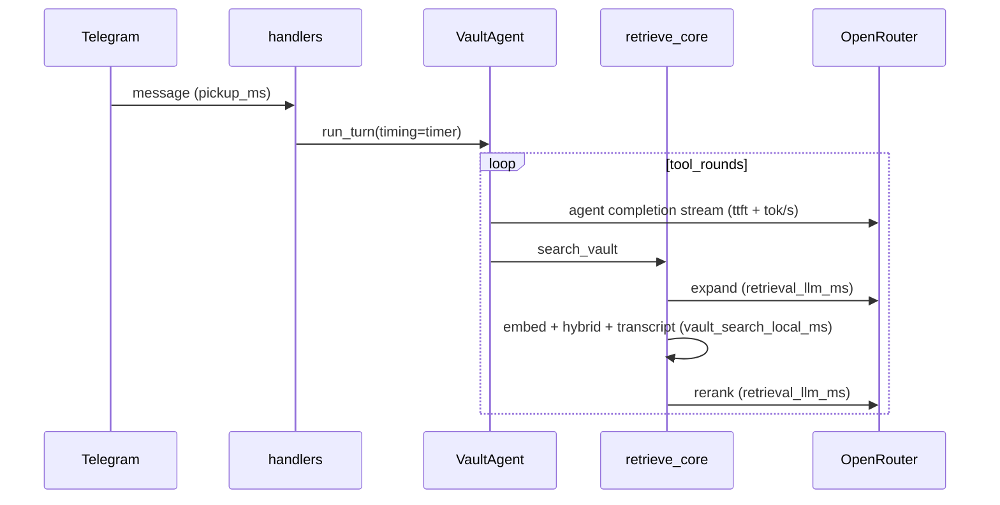

# Librarian pipeline timing telemetry

## Problem

The live harness suite (`--suite librarian --live-only`) can exceed an hour because v4 runs **many** OpenRouter calls per scenario turn (agent loop rounds × `search_vault` expand + rerank per search). Today you only get total `elapsed_s` per turn in [`dev/harness/scenario_runner.py`](dev/harness/scenario_runner.py)—not enough to pick a bottleneck.

## Success criteria

- After a live librarian scenario turn, `-v` prints a one-line phase summary (pickup / vault local / retrieval LLM / agent TTFT / tok/s).
- `dev/logs/runs/*-report.json` includes per-turn `timing` dict when verbose.
- After `--suite librarian --live-only`, CLI prints an aggregate mean/sum table across scenarios.
- `pytest tests/test_turn_timing.py tests/test_vault_agent.py tests/test_retrieval_orchestrator.py -q` passes; `ingestion/pipeline/verify.py` passes.
- Production Mac mini: with `LIBRARIAN_TIMING=1`, each turn appends one JSONL line under `~/Library/Logs/founders-telegram/librarian-timing.jsonl`.

## Metric model (5 buckets)

| Bucket | What | Where measured |
|--------|------|----------------|
| **1. `telegram_pickup_ms`** | Delay from Telegram `message.date` → handler starts `run_turn` | [`handlers.py`](services/telegram/bot/handlers.py) `_run_agent_turn` (production only; **null in harness**) |
| **2. `vault_search_local_ms`** | Embed API + hybrid search + transcript keyword only | [`retrieve_core`](ingestion/lib/retrieval_orchestrator.py): `embed_queries`, `ThreadPoolExecutor` hybrid block, `search_transcript_keyword`; plus [`search_transcript_for_turn`](services/telegram/bot/retrieval.py) |
| **2.5. `retrieval_llm_ms`** | Expand + rerank OpenRouter wall time (non-stream chat, incl. retries) | [`expand_query_llm`](ingestion/lib/retrieval_orchestrator.py), [`rerank_candidates`](ingestion/lib/rerank_llm.py) via [`call_openrouter`](ingestion/lib/openrouter_client.py) `duration_ms` |
| **3. `openrouter_ttft_ms`** | Time to first streamed token per **agent-loop** completion | [`agent.py`](services/telegram/bot/agent.py) `_accumulate_streamed_message` |
| **4. `generation_tok_per_sec`** | Inter-token speed for streamed agent completions | Same stream loop: `completion_tokens / (stream_end - first_token)` |

**Note:** Expand/rerank are non-streaming JSON calls—no meaningful inter-token rate; they contribute only to **2.5**. Agent-loop synthesis uses **3 + 4**.



## Enable / logging policy

Resolve the env vs harness ambiguity up front:

| Context | Default | Override |
|---------|---------|----------|
| **Harness** (`harness_bot` via [`mock_session.py`](dev/harness/mock_session.py)) | Timing **on** | `LIBRARIAN_TIMING=0` disables |
| **Production Telegram** | Timing **off** (no extra I/O) | `LIBRARIAN_TIMING=1` enables JSONL append |
| **Unit tests** | Off unless test sets timer explicitly | — |

Implement `is_timing_enabled(*, harness: bool) -> bool` in `turn_timing.py`.

**JSONL path (production only, when enabled):** `Path.home() / "Library/Logs/founders-telegram/librarian-timing.jsonl"` — create parent dirs; on non-macOS CI skip file append (in-memory / `tool_trace` only).

## Implementation

### 1. Shared timing module

New [`services/telegram/bot/turn_timing.py`](services/telegram/bot/turn_timing.py) (bot-adjacent; **ingestion must not import this**—use callbacks):

```python
@dataclass
class TurnTiming:
    telegram_pickup_ms: int | None = None
    vault_search_local_ms: int = 0
    retrieval_llm_ms: int = 0
    searches: list[dict]  # per search_vault / sub-query: query, vault_search_local_ms, retrieval_llm_ms
    openrouter_calls: list[dict]  # label, ttft_ms, total_ms, completion_tokens, tok_per_sec
```

- `TurnTimer`: `perf_counter()` helpers; **`threading.Lock`** around accumulators (required for [`search_vault_many_for_turn`](services/telegram/bot/retrieval.py) concurrent `retrieve_core`).
- Methods: `add_vault_local(ms)`, `add_retrieval_llm(ms)`, `record_search(...)`, `record_openrouter_stream(label, ttft_ms, total_ms, tokens)`.
- `to_dict()` → JSON-serializable blob; `summary_line()` → human one-liner for harness `-v`.

### 2. Phase 1 — Telegram pickup

In [`handlers.py`](services/telegram/bot/handlers.py) `_run_agent_turn`:

1. `t_handler = perf_counter()` at entry.
2. Create `timer = TurnTimer()` when `is_timing_enabled(harness=harness)`.
3. If `update.message.date` present and not harness: `pickup_ms = max(0, int((t_handler - msg_date_epoch) * 1000))`.
4. Pass `timing=timer` into `agent.run_turn(..., timing=timer)`.
5. On success, if enabled: append JSONL (production) and ensure timing lands on `TurnResult` (step 6).

Harness: `_is_harness_bot` already exists; pickup stays `null`.

### 3. Phase 2 + 2.5 — `retrieve_core` and tool wiring

**Orchestrator** ([`retrieval_orchestrator.py`](ingestion/lib/retrieval_orchestrator.py) `retrieve_core`):

- Add optional `on_timing: Callable[[str, int], None] | None` where `phase` is `"vault_local"` or `"retrieval_llm"`.
- **2.5:** wrap `expand(...)` and each `rerank(...)` with `perf_counter`; call `on_timing("retrieval_llm", ms)` per call (fallback-path re-rerank counts as **2.5**).
- **2:** time `embed_queries`, the `ThreadPoolExecutor` hybrid block, and `search_transcript_keyword` blocks; call `on_timing("vault_local", ms)`.
- Optionally attach per-call ms into `bundle.retrieval_meta["timing_ms"]` for debugging (not required for harness).

**OpenRouter hook** ([`openrouter_client.py`](ingestion/lib/openrouter_client.py)):

- Add optional `on_complete: Callable[[OpenRouterCompletion], None] | None` to `call_openrouter`.
- Invoke after successful `_once()` inside retry wrapper (once per successful attempt, not per retry failure).

**Bot adapters** ([`retrieval.py`](services/telegram/bot/retrieval.py)):

- `search_vault_for_turn` / `search_vault_many_for_turn` / `search_transcript_for_turn`: accept optional `timing: TurnTimer | None`; bridge to `on_timing` on `retrieve_core`.
- `search_vault_many`: each concurrent sub-query calls `timer.record_search(...)` under the lock.

**Agent tool path** ([`agent.py`](services/telegram/bot/agent.py)) — **easy to miss**:

- Add `timing: TurnTimer | None = None` to `run_turn` and `execute_tool`.
- In `_tool_handlers`, pass `timing` into retrieval adapters (today `execute_tool` does not thread `on_status` either—only add `timing`).

### 4. Phases 3 + 4 — Agent OpenRouter stream

In [`agent.py`](services/telegram/bot/agent.py):

- Thread `timing` through `run_turn` → inner `_completion` → `_accumulate_streamed_message(..., timing=..., label=...)`.
- **TTFT:** record on first chunk with `delta.content` **or** `delta.tool_calls` (tool-planning rounds often have no content).
- **Stream end:** `tok_per_sec` from final usage chunk when `stream_options={"include_usage": True}` (mirror [`call_openrouter_streaming`](ingestion/lib/openrouter_client.py)); else `len(content) / 4` char proxy.
- Labels: `agent_round_{n}` for loop completions; `agent_round_{n}_cap` for cap-forced final synthesis (not `agent_cap_synthesis`).
- Add `stream_options={"include_usage": True}` to agent `client.chat.completions.create` when `stream=True`.

Non-stream tool-planning rounds still use `stream=True` today—TTFT applies to every agent round.

### 5. Surface results

Two different `TurnResult` types—update both:

| Type | File | Change |
|------|------|--------|
| Agent | [`agent.py`](services/telegram/bot/agent.py) | Add `timing: dict[str, Any] \| None = None`; set from `timer.to_dict()` before return |
| Harness | [`scenario_runner.py`](dev/harness/scenario_runner.py) | Add `timing: dict \| None` and `timing_summary: str \| None` on harness `TurnResult` |

**Extraction in harness** ([`scenario_runner.py`](dev/harness/scenario_runner.py) `ScenarioRunner.run`):

1. After each turn, scan `session.tool_traces` for `{"record": "timing", ...}` **or** read from wrapped agent result if extended in [`mock_session._wrap_agent`](dev/harness/mock_session.py).
2. Prefer: agent appends `{"record": "timing", **timer.to_dict()}` to `tool_trace` on every `run_turn` return (works with existing trace capture).

| Consumer | Change |
|----------|--------|
| `tool_trace` | Final entry `{"record": "timing", ...}` |
| Harness `-v` | Print `timing_summary` per turn in `ScenarioResult.summary(verbose=True)` |
| Report JSON | Add `timing` and `timing_summary` per turn in `write_report` when `verbose` |
| Suite aggregate | New helper in [`scenario_runner.py`](dev/harness/scenario_runner.py) or [`mock_telegram_cli.py`](dev/mock_telegram_cli.py): after `run_paths`, print table of mean/sum per bucket across all turns |
| Production | Append one JSONL line per turn when `LIBRARIAN_TIMING=1` |

### 6. Tests

| File | What |
|------|------|
| [`tests/test_turn_timing.py`](tests/test_turn_timing.py) (new) | Timer aggregation, lock safety, `summary_line()`, `is_timing_enabled` |
| [`tests/test_vault_agent.py`](tests/test_vault_agent.py) | Mock stream with delayed chunks → assert `ttft_ms` / `tok_per_sec` on `TurnResult.timing` |
| [`tests/test_retrieval_orchestrator.py`](tests/test_retrieval_orchestrator.py) | Fake expand/rerank with `sleep` + `on_timing` collector → assert **2** vs **2.5** split |

No live OpenRouter in new tests.

### 7. Docs

Brief **Timing** subsection in [`docs/telegram-mock-harness.md`](docs/telegram-mock-harness.md): env flag, `-v` output, report JSON fields, aggregate table, production JSONL path.

## How you'll use it (Mac mini)

```bash
# Full suite with phase breakdown per turn + suite aggregate
ingestion/.venv/bin/python dev/mock_telegram_cli.py \
  --suite librarian --live-only -v

# Single hard scenario
ingestion/.venv/bin/python dev/mock_telegram_cli.py \
  --scenario dev/scenarios/librarian/multi_founder_comparison.yaml -v

# Production (launchd bot)
# LIBRARIAN_TIMING=1 in ~/.config/founders-telegram/env
tail -f ~/Library/Logs/founders-telegram/librarian-timing.jsonl
```

**Read the summary:** If `retrieval_llm_ms` dominates → tune `retrieval_model` / expand-rerank prompts. If `vault_search_local_ms` dominates → index/embed/hybrid optimizations. If agent `ttft_ms` is high and `tok_per_sec` low on `librarian_model` → model/provider issue. If `telegram_pickup_ms` dominates → polling/network (unlikely in harness).

## Out of scope (this PR)

- Changing models, infra, or parallelization
- Timing `search/search.py` CLI (not on Librarian path)
- Telegram outbound `edit_text` throttle (0.5s stream flush)—separate UX metric if needed later
- Janitor expand streaming telemetry (already has `ExpandProgressReporter` in ingestion)

## Files touched

- **New:** [`services/telegram/bot/turn_timing.py`](services/telegram/bot/turn_timing.py), [`tests/test_turn_timing.py`](tests/test_turn_timing.py)
- **Edit:** [`agent.py`](services/telegram/bot/agent.py), [`handlers.py`](services/telegram/bot/handlers.py), [`retrieval.py`](services/telegram/bot/retrieval.py), [`retrieval_orchestrator.py`](ingestion/lib/retrieval_orchestrator.py), [`openrouter_client.py`](ingestion/lib/openrouter_client.py)
- **Edit:** [`dev/harness/scenario_runner.py`](dev/harness/scenario_runner.py), [`dev/mock_telegram_cli.py`](dev/mock_telegram_cli.py), [`docs/telegram-mock-harness.md`](docs/telegram-mock-harness.md)

## Suggested implementation order

1. `turn_timing.py` + unit tests
2. `call_openrouter` `on_complete` hook
3. `retrieve_core` `on_timing` + orchestrator tests
4. `retrieval.py` + `execute_tool` / `run_turn` wiring
5. Agent stream instrumentation
6. Handlers pickup + JSONL
7. Harness report / aggregate + docs
8. `verify-ship`
