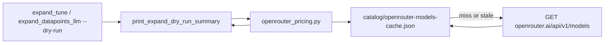

# Dynamic OpenRouter dry-run pricing

## Goal

Dry-run summaries ([`ingestion/lib/expand_llm.py`](ingestion/lib/expand_llm.py) `print_expand_dry_run_summary`) should show **automatic dollar estimates** from OpenRouter's live catalog for whatever model is configured via existing `OPENROUTER_MODEL` / `--model`—no manual rate in `.env`.

Remove `input_usd_per_mtok_from_env()`, `OPENROUTER_ESTIMATE_INPUT_USD_PER_MTOK`, and related doc strings.

## Data source



- **Endpoint:** `GET https://openrouter.ai/api/v1/models` (works without auth in practice; send `Authorization: Bearer $OPENROUTER_API_KEY` when present).
- **Rates:** `pricing.prompt` and `pricing.completion` are **USD strings per token** (e.g. `"0.0000001"` = $0.10/M input).
- **Tiered models:** some entries use `pricing` as an array with `min_context`; pick the tier where `input_tokens >= min_context` (base tier = index 0).
- **No pre-flight quote API** — multiply catalog rates × heuristic token counts (existing `chars÷4` for input).

## New module: [`ingestion/lib/openrouter_pricing.py`](ingestion/lib/openrouter_pricing.py)

| Responsibility | Detail |
|----------------|--------|
| `ModelRates` dataclass | `prompt_usd_per_token`, `completion_usd_per_token`, `request_usd_per_call` (floats), `model_id`, `name` |
| `fetch_models_catalog()` | `requests.get` with 15s timeout; optional bearer from `OPENROUTER_API_KEY` |
| Cache | Write/read [`catalog/openrouter-models-cache.json`](catalog/openrouter-models-cache.json) with `fetched_at` ISO timestamp; **TTL 24h**; refresh on stale/missing |
| `resolve_model_rates(model_id)` | Lookup by exact `data[].id`; if missing, try `canonical_slug` match as fallback |
| `estimate_cost_usd(...)` | `input_tokens * prompt + n_calls * request`; optional output: `total_bullets * COMPLETION_TOKENS_PER_BULLET * completion` (constant ~500 tokens/bullet, documented as rough) |

**Gitignore:** add `catalog/openrouter-models-cache.json` (same pattern as `expand-run.jsonl`).

**Offline / errors:** print a single warning line (e.g. `could not load OpenRouter pricing: …`) and omit `$` lines—do **not** fall back to env.

**Unset model:** if `model` is empty or `(unset)`, skip fetch and print: `set OPENROUTER_MODEL or pass --model for cost estimate` (table still prints).

## Changes to [`ingestion/lib/expand_llm.py`](ingestion/lib/expand_llm.py)

- Delete `input_usd_per_mtok_from_env()` and `os` import if unused.
- In `print_expand_dry_run_summary`, after token totals:
  - Call `resolve_model_rates(model)` when model is set.
  - Print rates line: `@ $X.XX/M input, $Y.YY/M output (openrouter.ai catalog, cached)`.
  - Print `~input cost: $…`, optional `~output cost (est.): $…`, `~total (est.): $…`.
- Pass through existing callers unchanged ([`expand_tune.py`](ingestion/notes/expand_tune.py), [`expand_datapoints_llm.py`](ingestion/notes/expand_datapoints_llm.py)); ensure `expand_tune` passes real model id (not display placeholder) when `OPENROUTER_MODEL` is set.

## Docs / config cleanup

- [`.env.example`](.env.example): remove lines 16–17 (`OPENROUTER_ESTIMATE_*`).
- [`ingestion/fixtures/expand-runs/README.md`](ingestion/fixtures/expand-runs/README.md) and [`docs/datapoint-workflow.md`](docs/datapoint-workflow.md): note that `--dry-run` fetches OpenRouter catalog pricing automatically (requires `OPENROUTER_MODEL` for `$`).

## Tests: [`tests/test_openrouter_pricing.py`](tests/test_openrouter_pricing.py) (new)

Mock `requests.get` with a small fixture JSON (one model, tiered model optional):

- Parse per-token strings to floats.
- Tier selection when `input_tokens` crosses `min_context`.
- Cache hit (no HTTP) vs stale refresh.
- `estimate_cost_usd` math.
- `print_expand_dry_run_summary` integration: mock `resolve_model_rates`, assert footer contains `$` and model rate.

Update [`tests/test_expand_llm.py`](tests/test_expand_llm.py) if any test referenced env pricing (none today).

## Out of scope

- Exact tokenizer counts (still chars÷4 heuristic).
- Billing-grade accuracy from `usage` fields (post-hoc logging already exists in expand apply path).
- Pricing for non-expand OpenRouter scripts (`attribute_posts_llm.py`) unless we reuse the same helper later.

## Example dry-run footer (after)

```
  API calls this pass: 10
  ~input tokens (sum): 185,350  (chars÷4 heuristic)
  rates: $0.10/M input, $0.20/M output  (deepseek/deepseek-v4-flash, OpenRouter catalog)
  ~input cost: $0.02
  ~output cost (est.): $0.01  (~500 tok/bullet)
  ~total (est.): $0.03

  Full A/B on this batch: ~20 API calls ...
```
