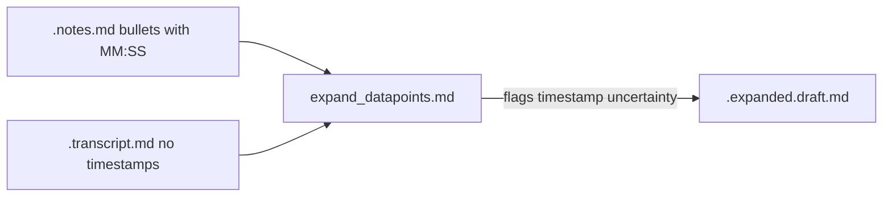

# Timestamp meta cleanup in expanded notes

## Problem

The expand prompt (`[ingestion/prompts/expand_datapoints.md](ingestion/prompts/expand_datapoints.md)`) tells the model to **flag missing/ambiguous timestamps** and mention **timestamp uncertainty** in Context (lines 13, 17–19). Transcripts in this vault are **plain text with no embedded timestamps** ([example transcript](content/transcripts/ep-0045-built-from-scratch-how-a-couple-of-regular-guys-grew-the-home-depot-from-nothing-to-30-billion/ep-0045-built-from-scratch-how-a-couple-of-regular-guys-grew-the-home-depot-from-nothing-to-30-billion.transcript.md)). The model interprets “uncertainty” as meta like:

> The timestamp 31:00 is noted in the raw bullet but cannot be verified against the transcript, which lacks timestamps.

That is **noise for retrieval** and wrong framing: timestamps are **your** listen-back anchors and **section ordering** for agents—not something to “verify” in the transcript file.

**Scale:** ~65 `*.expanded.draft.md` under `content/notes/`; ~31 files match noisy patterns (e.g. ep-0045 has 8 hits). No promoted `*.expanded.md` yet.




## Design principle


| Keep                                                            | Remove                                                                                                                        |
| --------------------------------------------------------------- | ----------------------------------------------------------------------------------------------------------------------------- |
| `### MM:SS — title` when raw bullet has a timestamp             | “transcript lacks timestamps”, “cannot be verified”, “from the raw notes”                                                     |
| `### — title` when raw bullet has no timestamp                  | “No timestamp is provided in the raw note”                                                                                    |
| Quote suffix **only** `(MM:SS)` when raw bullet has a timestamp | `(Timestamp not provided in transcript)`, `(No timestamp in transcript; …)`, “approximate as the transcript lacks timestamps” |
| Context about story / who / unsupported content                 | Any timestamp availability or verification commentary                                                                         |


**Keep** legitimate unsupported-content lines (`Quote: Not supported by transcript.`, “not found in the transcript” for **content**, not clock time).

---

## Part 1 — Surgical prompt patch (prevents recurrence)

**Prompt-engineering goal:** Remove only the instructions that *reward* timestamp disclaimers. Do **not** add a new “transcript has no timestamps” block, restate quote rules, or rewrite note-fidelity — that overtrains and shifts behavior on quotes/bold/support checks.

### Root cause (three leakages)


| Leak | Line(s)                                                                   | Model behavior it trains                          |
| ---- | ------------------------------------------------------------------------- | ------------------------------------------------- |
| A    | 13: “briefly **flag the missing timestamp** in Context”                   | “No timestamp is provided in the raw note”        |
| B    | 17 (prod only): “**flag uncertainty** briefly in Context or Key takeaway” | “cannot be verified… transcript lacks timestamps” |
| C    | 19: “**any timestamp uncertainty**”                                       | Same meta in Context; combines with A+B           |


**Not the problem:** Line 16 “If the match is uncertain, flag it briefly” = **quote** uncertainty (keep). Candidate L16 “Use the timestamp … to anchor lookup” = passage lookup (keep). Unsupported-bullet rule (keep).

### Exact edits — `[expand_datapoints.md](ingestion/prompts/expand_datapoints.md)`

**1. Delete line 17 entirely** (duplicate of A+C; highest overtrain signal):

```diff
- - Missing/ambiguous timestamp: still emit `###` and flag uncertainty briefly in Context or Key takeaway.
```

**2. Line 13 — swap flag-for-output for heading-only** (~8 words changed):

```diff
- - Preserve the timestamp when present. If no timestamp is present, still emit one `###` heading and briefly flag the missing timestamp in Context.
+ - Preserve the timestamp when present. If no timestamp is present, use `### — {title}` (no timestamp in the heading).
```

**3. Line 19 — drop one phrase** (do not add replacements):

```diff
- - Context should make the section self-contained for retrieval: 1–3 sentences explaining story position, who/what the note refers to, and any timestamp uncertainty. Mention the raw note only when needed to clarify a terse or ambiguous bullet.
+ - Context should make the section self-contained for retrieval: 1–3 sentences explaining story position and who/what the note refers to. Mention the raw note only when needed to clarify a terse or ambiguous bullet.
```

**4. After line 15 (TRANSCRIPT lookup) — one negative line** (~20 words; no positive re-teaching):

```diff
  - TRANSCRIPT is lookup only — never output the full transcript or a transcript summary.
+ - Do not mention transcript timestamps or verify note timestamps against TRANSCRIPT; put the note's MM:SS only in the `###` heading and `(MM:SS)` after Quote when present.
```

**Leave unchanged:** quote/bold/contiguous-passage rules, unsupported bullet rule, USER example, checklist `(MM:SS)` at end.

### Exact edits — `[expand_datapoints.candidate.md](ingestion/prompts/expand_datapoints.candidate.md)`

Same **edits 2, 3, 4** as production. **No line 17** in candidate. **Do not touch** Note fidelity block (L16–17 quote rules, ≥3 sentences, bold).

**Optional micro-edit** (only if A/B report still leaks meta): checklist L39 `timestamp-anchored` → delete those two words; keep `note-faithful`. Skip unless needed.

### What we deliberately avoid

- Long “TRANSCRIPT has no embedded timestamps” paragraphs
- New bullets on “user playback anchors” / section ordering (human intent; model already gets MM:SS from NOTES)
- Changing “flag match uncertain” or “unsupported by transcript”
- USER-template example rewrites

**Net delta:** prod ~4 line touches (+1 delete); candidate ~3 touches. `prompt_hash` changes; re-expand one noisy episode (ep-0045) to spot-check before bulk backfill.

---

## Part 2 — Manual backfill (agent edits by hand)

No LLM cleanup script, no OpenRouter task prompt, no API cost. The agent edits files directly with search/replace—same outcome, easier to review in git diff.

### Find work

```bash
rg -l -i 'lacks timestamps|cannot be verified|No timestamp is provided|from the raw note|Timestamp not provided in transcript|not verified against' content/notes --glob '*.expanded.draft.md'
```

~31 files. **Skip** the 34 clean drafts and all `[ingestion/fixtures/expand-runs/](ingestion/fixtures/expand-runs/)` unless you want those later.

### Edit rules (per section)

1. **Context / Key takeaway:** Delete timestamp-meta sentences/clauses only; keep story prose and unsupported-content warnings intact.
2. **Quote line:** Keep quote text verbatim. Trailing parenthetical → `(MM:SS)` if heading has `### MM:SS`, else remove parenthetical entirely.
3. **Headings:** Do not change `### MM:SS —` or `### —` unless obviously wrong vs raw `.notes.md`.

### Batch workflow

Work in **batches of ~8–10 episodes** per session (heavy files like ep-0011, ep-0045, ep-0008 first):

1. Open draft, apply edits.
2. Re-run detection `rg` on touched files — target zero forbidden-phrase hits.
3. Optional: `cd ingestion && python -c "… validate_expanded_draft …"` per file if promotion is soon.
4. User reviews diff; commit when they ask.

After all batches: `python search/build_chunks.py`.

### Example (ep-0045 §31:00)

**Before (Context tail):**  
`…Langone refused, warning that Sigoloff’s ego would lead to Marcuss firing regardless of results. The timestamp 31:00 is noted in the raw bullet but cannot be verified against the transcript, which lacks timestamps.`

**After:**  
`…Langone refused, warning that Sigoloff’s ego would lead to Marcuss firing regardless of results.`

**Before (Quote tail):**  
`…" (Timestamp 50:30 as noted in raw bullet; not verified against transcript timestamps)`

**After:**  
`…" (50:30)`

---

## Part 3 — Optional guard (lint only)

Add **warnings** in `[validate_expanded_draft](ingestion/lib/expand_llm.py)` via shared phrase list in `ingestion/lib/expanded_timestamp_lint.py` — catches regressions after prompt fix. No runtime dependency on manual backfill.

---

## Why manual beats LLM here


|              | Manual (chosen)                | LLM backfill                   |
| ------------ | ------------------------------ | ------------------------------ |
| Cost         | $0                             | ~31 API calls                  |
| Quote safety | Human/agent sees full sentence | Risk of silent quote drift     |
| Review       | Normal git diff                | Still need full diff review    |
| Infra        | None                           | Script + task prompt + logging |


Stereotyped phrases (“lacks timestamps”, “No timestamp is provided”) are **deletion edits**, not paraphrase—hand edits are faster than standing up a one-off pipeline.

---

## Success criteria

- Prompt fixed; new expands never add timestamp-meta disclaimers.
- `rg` forbidden-phrase scan returns **0** hits under `content/notes/**/*.expanded.draft.md`.
- Quote suffixes are only `(MM:SS)` or absent; unsupported-transcript **content** warnings preserved.
- ep-0045 §31:00 Context is story prose only.

## Out of scope

- `ingestion/fixtures/expand-runs/` A/B artifacts (historical)
- `clean_expanded_timestamp_meta_llm.py` / `prompts/tasks/strip_timestamp_meta.md`

