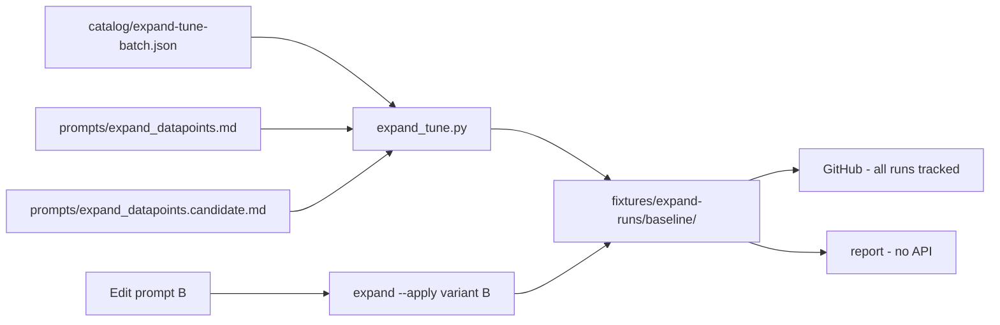

# Tracked expand-run fixtures for prompt tuning

## Problem

Today the tuning workflow is structurally complete but **not usable by default**:

- [`.gitignore`](.gitignore) lines 14–15 ignore all of `ingestion/fixtures/expand-runs/*/` except the README.
- On disk, [`ingestion/fixtures/expand-runs/tune-001/manifest.json`](ingestion/fixtures/expand-runs/tune-001/manifest.json) exists (A/B ran on 2026-05-26) but **no** `*.expanded.draft.md` files — only the manifest survived.
- Pytests use inline `SAMPLE_EXPANDED_BODY` and `tmp_path`; nothing in CI asserts real outputs exist.

You chose to **track the entire `expand-runs/` tree** on GitHub (not only `baseline/`).

## Target state



After this work, a fresh clone can:

1. `cd ingestion && python notes/expand_tune.py report` — see A vs B section counts and validation for all 10 episodes.
2. Open paired drafts under `ingestion/fixtures/expand-runs/baseline/A/...` and `.../B/...` in the editor for side-by-side prompt comparison.
3. Run `pytest` — fails fast if baseline drafts are missing or structurally invalid (no network).

Production notes (`content/notes/*.expanded.md`) stay out of scope until you explicitly `promote`.

## Implementation

### 1. Stop gitignoring expand-runs

In [`.gitignore`](.gitignore), **remove**:

```
ingestion/fixtures/expand-runs/*/
!ingestion/fixtures/expand-runs/README.md
```

[`catalog/expand-run.jsonl`](catalog/expand-run.jsonl) stays gitignored (runtime API log, not comparison artifacts).

### 2. Default run id in CLI

In [`ingestion/notes/expand_tune.py`](ingestion/notes/expand_tune.py):

- Add `DEFAULT_RUN_ID = "baseline"`.
- Change `--run-id` on `init`, `expand`, `report`, and `promote` from `required=True` to `default=DEFAULT_RUN_ID` (still overridable).

Update quick-start examples in:

- [`ingestion/fixtures/expand-runs/README.md`](ingestion/fixtures/expand-runs/README.md)
- [`docs/datapoint-workflow.md`](docs/datapoint-workflow.md) (remove “gitignored” wording; note runs are committed)
- [`ingestion/notes/README.md`](ingestion/notes/README.md) / [`ingestion/README.md`](ingestion/README.md) if they still say sandbox is ignored

### 3. Seed committed baseline outputs (one-time, requires API)

`baseline/` does not exist yet. Generate and commit:

```bash
cd ingestion
python notes/expand_tune.py init                    # creates baseline/ + seeds candidate prompt if needed
python notes/expand_tune.py expand --variant A --apply
python notes/expand_tune.py expand --variant B --apply
python notes/expand_tune.py report
```

This produces **20 drafts** (10 eps × A/B) under:

`ingestion/fixtures/expand-runs/baseline/{A|B}/{folder}/{folder}.expanded.draft.md`

plus `manifest.json` (model + `prompt_hash` per variant).

**Commit to git:** entire `ingestion/fixtures/expand-runs/` including `baseline/` and existing `tune-001/manifest.json`. Optionally delete empty/stale `tune-001/` if you prefer a single canonical run — your call at commit time.

Model: use whatever is in `.env` (`OPENROUTER_MODEL`); record it in manifest frontmatter (already written by [`write_expanded_draft`](ingestion/lib/expand_llm.py)).

### 4. `verify` subcommand (offline guardrail)

Add `expand_tune.py verify [--run-id baseline]` that:

- Loads [`catalog/expand-tune-batch.json`](catalog/expand-tune-batch.json)
- For each episode and variant `A`/`B`: draft file exists; `validate_expanded_draft` passes (errors fail, warnings print)
- Optionally warns if manifest `prompt_hash` ≠ current prompt file hash (signals fixtures are stale after prompt edits)

This gives a single command for you and CI: `python notes/expand_tune.py verify`.

### 5. Tests tied to real fixtures

New [`tests/test_expand_baseline_fixtures.py`](tests/test_expand_baseline_fixtures.py) (no network):

- Assert `ingestion/fixtures/expand-runs/baseline/` exists with manifest + 20 draft paths resolved via [`staging_draft_file_path`](ingestion/lib/paths.py) and catalog rows for the batch ids.
- Run `validate_expanded_draft` on each draft body.
- Smoke-test `verify` / `report` against repo `baseline` (subprocess or direct function call).

Keep existing unit tests in [`tests/test_expand_tune.py`](tests/test_expand_tune.py) / [`tests/test_expand_llm.py`](tests/test_expand_llm.py) for isolated logic; baseline tests are the integration layer.

### 6. Tuning workflow (documented default loop)

Document in [`ingestion/fixtures/expand-runs/README.md`](ingestion/fixtures/expand-runs/README.md):

| Step | Command |
|------|---------|
| Compare current A/B | `python notes/expand_tune.py report` |
| Edit prompt B | `ingestion/prompts/expand_datapoints.candidate.md` |
| Regenerate B only | `python notes/expand_tune.py expand --variant B --apply --force` |
| Re-check | `report` then `verify` |
| Commit | `git add ingestion/fixtures/expand-runs/` |
| New experimental run | `init --run-id tune-002` → expand → commit that run too |

When prompt B changes materially, re-run B with `--force`, commit updated drafts, and update manifest hashes.

### 7. Plan file

Add/update [`.cursor/plans/`](.cursor/plans/) for this task per [`AGENTS.md`](AGENTS.md); commit with the implementation.

## Out of scope

- Promoting baseline to `content/notes/*.expanded.md` (production corpus; separate decision).
- Snapshot-testing exact LLM prose in pytest (too brittle); structural `verify` only.
- Regenerating `tune-001` drafts unless you want that run kept — manifest exists but drafts are missing.

## Risks / notes

- **Repo size:** ~20 markdown drafts ≈ low hundreds of KB — fine for git.
- **Stale fixtures:** after editing prompts, `verify` hash warning + re-`expand --apply` keeps GitHub in sync.
- **Secrets:** drafts contain episode content only; no API keys in fixtures. `expand-run.jsonl` remains ignored.
