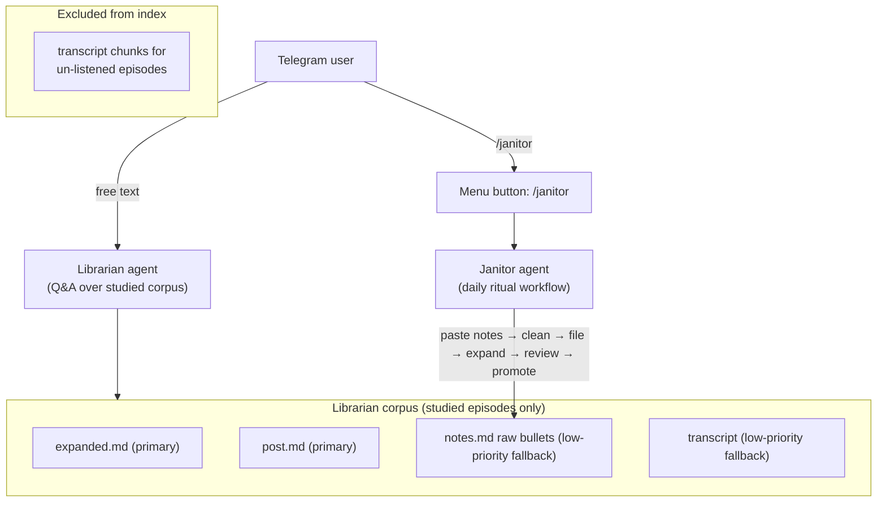

# Founders Vault Agent — Prioritized Backlog (archived)

**Status:** All todos completed May 2026. Janitor shipped — see [vault_janitor_agent.plan.md](vault_janitor_agent.plan.md) and [docs/janitor.md](../../../docs/janitor.md). Deferred follow-ups: [potential-ideas.md](../../../potential-ideas.md).

## Architecture Vision (Confirmed)

Two agents, one codebase:

**Corpus definition:**

- "Listened" = `.notes.md` contains at least one timestamp bullet line matching `^\[[\d:]+\]`. Auto-detected from file content; no catalog flag needed.
- "Completed" = post synced from X API (`post.md` present).
- Un-listened episodes: **zero chunks** in index (transcripts excluded entirely).
- Listened episodes — source priority order:
  1. `expanded:`* — primary, highest quality (synthesis + verbatim quotes)
  2. `post:`* — high quality, finished voice
  3. `notes:*` raw bullets — low-priority fallback (same tier as transcripts were; present but not primary)
  4. `transcript:*` — low-priority fallback for listened episodes only; excluded entirely for un-listened

---

## Shipped (summary)

| Item | Outcome |
|------|---------|
| Index filter | `build_chunks.py` skips transcript chunks for un-listened episodes |
| Chunk granularity | Expanded sections split at `###` datapoint boundaries |
| Line numbers | File-absolute `start_line` / `end_line` in chunks |
| Scenario tests | `tests/test_vault_retrieval_scenarios.py` + fixture JSONL |
| Nightly cron | `install-cron.sh` → `sync-and-index.sh` on Mac mini |
| v0 checklist | Verified against master plan success criteria |
| Janitor | [vault_janitor_agent.plan.md](vault_janitor_agent.plan.md), [docs/janitor.md](../../../docs/janitor.md) |

---

## Follow-ups

All open work: [`potential-ideas.md`](../../../potential-ideas.md). Pull one **Next** cluster into a new focused `.cursor/plans/*.plan.md` when implementing (AGENTS.md).

---

## Explicit defer list (not doing)

Consolidated in [`potential-ideas.md`](../../../potential-ideas.md) — **Decided / won't do** and **Next** clusters. SP6-lite (tool copy, status UX, scenarios) shipped May 2026; rerank and MRR@8 remain open under Librarian quality.

---

## Open Questions (historical)

Resolved at ship time: Janitor runs mode-switched in one bot; reindex runs after promote in `janitor_workflow`. See [potential-ideas.md](../../../potential-ideas.md) for deferred follow-ups.

## Resolved Review Findings

- **"Listened" detection threshold**: Resolved — use regex `^\[[\d:]+\]` (timestamp bullet line) rather than section presence. `split_sections()` would count scaffold placeholder HTML comments as non-empty content, producing false positives. Timestamp bullet is unambiguous.
- **Direct-to-main risk**: Resolved — user explicitly approved committing directly to `main` for this personal repo.
- **Mac mini execution boundary**: Resolved — implementation agent should provide exact handoff commands; user/operator runs them on the Mac mini.
- **Scenario test gating**: Resolved — rebuild-dependent assertions run only when `RUN_REBUILT_INDEX_SCENARIOS=1` is set.

