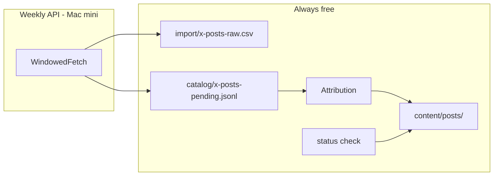
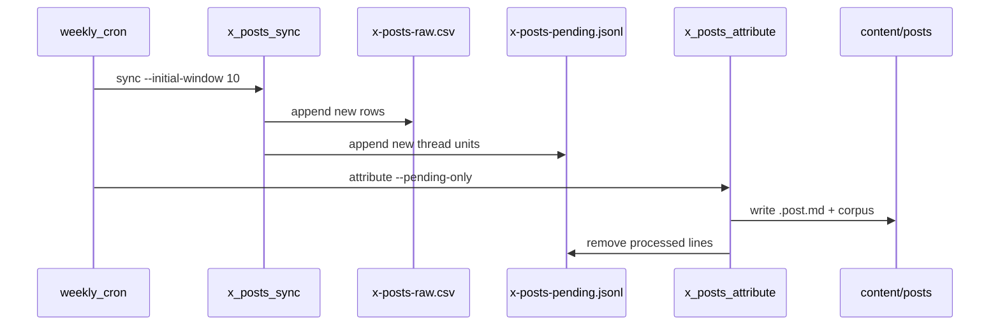

# X posts pipeline refactor — Option 2 implementation plan

## Decision

**Ship Option 2: decoupled sync + attribute jobs with a pending queue.**

| Why Option 2 | |
|--------------|--|
| Weekly API on Mac mini stays isolated from nightly `sync-and-index.sh` | |
| Re-attribute locally after CSV/manual fixes — zero API reads | |
| LLM runs only on new ambiguous units, not 200+ historical rows | |
| Natural hook for future Telegram `/sync-posts` | |

**Alternatives considered (not shipping):**

- **Option 1 (monolithic `x_posts.py run`)** — fastest to ship but always re-scans full CSV; defer unless Option 2 proves too heavy.
- **Option 3 (event ledger)** — best audit trail for a review UI or multi-account backfill; overkill for ~1 post/day. Revisit if Telegram `/sync-posts` needs state-machine semantics.

**Branch:** `feat/x-sync-daily-efficient` (current; note_tweet recap fix already merged here).

**Vault baseline:** through **ep-0196** posts; ~7 posts/week expected.

---

## Problem (current system)

Today: [`ingestion/x/sync_x_cache.py`](ingestion/x/sync_x_cache.py) + [`ingestion/x/organize_posts_from_csv.py`](ingestion/x/organize_posts_from_csv.py).

| Issue | Detail |
|-------|--------|
| API cost | `max_results=100` per page; no `since_id`; catch-up burns pages |
| Coupling | Sync and organize are separate steps; organize re-scans entire CSV (~444 rows) every run |
| Automation | No `--status`, no cron; `X_BEARER_TOKEN` only in laptop `.env`, not mini `founders-telegram` env |
| Attribution | [`x_posts_match.py`](ingestion/lib/x_posts_match.py) works when `#N` present; no chronological fallback; LLM never used |

---

## Architecture





---

## Shared design (extracted from all options)

### Windowed fetch

Implement in [`ingestion/lib/x_sync_fetch.py`](ingestion/lib/x_sync_fetch.py). Reuse [`colossus.session`](ingestion/colossus/__init__.py), [`tweet_to_row`](ingestion/lib/x_posts_csv.py), and bearer/user resolution from current [`sync_x_cache.py`](ingestion/x/sync_x_cache.py).

**Algorithm (weekly incremental):**

1. Load `existing_ids` from CSV and `meta` from [`import/x-posts-sync-meta.json`](import/x-posts-sync-meta.json).
2. First request: `max_results=10` (API minimum is 5), `exclude=retweets`, `tweet.fields` unchanged. If `meta["newest_id"]` exists, pass it as API param **`since_id`** (returns only newer tweets).
3. Append tweets not in `existing_ids`. Stop when:
   - any returned tweet ID is already in CSV, **or**
   - no `next_token`, **or**
   - `max_expansions` reached (default **3**).
4. **Catch-up expansion:** if the entire page was new and `next_token` exists, next page uses `max_results` **15**, then **20** (one step per expansion). Same `since_id` on first page only; subsequent pages use `pagination_token`.
5. Update meta: `newest_id`, `oldest_id`, `last_sync_at`, `row_count`, `user_id` (same fields as today).

**Admin backfill:** `x_posts_sync.py --backfill` maps to old `--full` behavior (no `since_id`, larger `max_pages`, `max_results=100`) for rare historical recovery.

**Done when:** `tests/test_x_sync_fetch.py` covers — (a) stops on known ID, (b) respects `max_expansions`, (c) passes `since_id` when meta has `newest_id`, (d) dry-run returns counts without writes.

### Attribution cascade

| Step | When | Cost |
|------|------|------|
| 1. Explicit `#N` / `ep. N` | [`EP_MENTION_RE`](ingestion/lib/x_posts_match.py) | Free |
| 2. Chronological gap-fill | No `#N`, recap shape, vault missing `next_ep`, date ≥ last assigned post | Free |
| 3. Existing fuzzy match | Title tokens + date proximity → review band | Free |
| 4. Low-cost LLM | Review band or chrono tie-break; post text + `last_assigned_ep` + next 3 catalog titles | ~$0.001/post |

LLM via [`ingestion/lib/openrouter_client.py`](ingestion/lib/openrouter_client.py); default model `deepseek/deepseek-v4-flash` (env override `X_ATTRIBUTION_MODEL` optional). Only when `--llm-review` is passed (weekly cron uses it).

**Chronological gap-fill (concrete):**

```python
# ingestion/lib/x_posts_chrono.py — only when EP_MENTION_RE finds nothing
next_ep = next_expected_episode()  # vault_max_episode() + 1
if is_founders_recap_shape(unit) and not vault_has_post(next_ep):
    if post_date >= last_assigned_post_date():
        assign(next_ep, reason="chrono_next")
```

**`is_founders_recap_shape(unit)` heuristic:**

- `post_kind` is `article` (note_tweet), **or** combined thread text length ≥ 200 chars
- AND text is not a bare link / promo (no `http` as sole content; at least one word ≥ 4 chars beyond URLs)
- Reuse [`is_article_unit`](ingestion/lib/x_posts_threads.py) for article detection

**Guardrails:** never chrono-assign if `#N` mentions a different N; never assign ep already in vault; skip replies-to-others ([`filter_attributable_rows`](ingestion/lib/x_posts_threads.py)); keep article skip rule unless explicit `#N` or chrono accepts.

**Review output:** continue writing [`catalog/post-mapping-review.jsonl`](catalog/post-mapping-review.jsonl) for fuzzy/LLM-uncertain rows (same schema as today). Pending queue is for *new* units only.

**Corpus regen:** attribute step must call existing `regenerate_corpus()` from organize (founders + optional other) after vault writes.

---

## Pending queue

**File:** `catalog/x-posts-pending.jsonl` (committed empty or absent; grows between attribute runs).

**Record schema (one line per attributable thread unit):**

```json
{
  "x_post_id": "1988758992869372159",
  "thread_root_id": "1988758992869372159",
  "created_at": "2026-02-27T12:00:00.000Z",
  "post_kind": "article",
  "text": "...",
  "synced_at": "2026-06-09T..."
}
```

**Sync (`x_posts_sync.py`):** after CSV append, run `assemble_threads` on **new rows only**, append units not already in pending file (dedupe by `x_post_id`).

**Attribute (`x_posts_attribute.py`):**

- Default `--pending-only`: process pending lines only.
- On successful vault write (or deliberate skip to `_other`): remove line from pending.
- On failure: leave line in pending; exit non-zero so cron logs the failure.
- **Idempotency:** before write, skip if `post_file_path(ep_id, …)` already exists for that episode.
- `--rebuild`: full CSV scan (current organize behavior) for recovery; does not clear pending unless `--clear-pending` also passed.

---

## CLI entrypoints

| Script | Flags | API? |
|--------|-------|------|
| [`ingestion/x/x_posts_sync.py`](ingestion/x/x_posts_sync.py) | `--initial-window 10`, `--max-expansions 3`, `--dry-run`, `--backfill` | Yes |
| [`ingestion/x/x_posts_attribute.py`](ingestion/x/x_posts_attribute.py) | `--pending-only` (default), `--rebuild`, `--llm-review`, `--dry-run`, `--founders-only` | No |
| [`ingestion/x/x_posts_status.py`](ingestion/x/x_posts_status.py) | `--expect-episode N` (exit 1 if vault max post ep < N) | No |

**Status output (human-readable):** vault max episode with `.post.md`, pending count, `last_sync_at` from meta, newest CSV row id.

**Env loading:** shell scripts source `~/.config/founders-telegram/env` (same as [`sync-and-index.sh`](services/telegram/deploy/sync-and-index.sh)). Python CLIs may `load_dotenv(ROOT / ".env")` as fallback for laptop use — do not require laptop `.env` on mini if env file is sourced.

---

## Mac mini automation

### Prerequisites (operator, one-time)

1. Add to `~/.config/founders-telegram/env`:
   - `X_BEARER_TOKEN` (from [developer.x.com](https://developer.x.com/))
   - `X_USERNAME` (already defaulted in code)
   - `OPENROUTER_API_KEY` (for `--llm-review`)
2. Confirm mini can **git push** to `origin` (SSH key or token) — unlike Janitor notes (Working Copy), this job **auto-commits content**.
3. Run `install-x-posts-cron.sh` after merge.

### `weekly-x-posts.sh`

Pattern from [`sync-and-index.sh`](services/telegram/deploy/sync-and-index.sh):

1. Source `FOUNDERS_TELEGRAM_ENV` / `VAULT_ROOT`
2. Acquire lock (`catalog/.x-posts-sync-in-progress` — separate from nightly lock)
3. `git pull --ff-only` in `VAULT_ROOT`
4. `python x/x_posts_sync.py --initial-window 10`
5. `python x/x_posts_attribute.py --pending-only --llm-review`
6. `python pipeline/verify.py` (structural checks only — missing posts beyond current episode are **normal** per [repo-agent-guide](docs/repo-agent-guide.md))
7. If changes under `content/posts/`, `catalog/gaps.md`, `catalog/post-mapping-review.jsonl`, `catalog/x-posts-pending.jsonl`: `git add` those paths → commit → `git push`
8. Release lock

**Commit message template:** `vault: sync X posts (weekly cron)`

**Cron:** Sunday 5:00 (after nightly 4:00 reindex) — `install-x-posts-cron.sh` prints idempotent crontab block with marker `# founders-telegram-weekly-x-posts`.

**Git policy (resolved):** **commit + push to `main`** from mini. No PR branch unless operator changes script later.

### Docs to update

| File | Change |
|------|--------|
| [`.env.example`](.env.example) | Note mini can use `founders-telegram/env` instead of repo `.env` |
| [`docs/operations.md`](docs/operations.md) | New row in decision matrix; weekly X job + env vars + log path `~/Library/Logs/founders-telegram/x-posts.log` |
| [`ingestion/x/README.md`](ingestion/x/README.md) | New commands as primary; old scripts deprecated |

---

## Deprecation path

- [`sync_x_cache.py`](ingestion/x/sync_x_cache.py) → thin wrapper calling `x_sync_fetch` + pending append (or delegate to `x_posts_sync.main` with deprecation warning).
- [`organize_posts_from_csv.py`](ingestion/x/organize_posts_from_csv.py) → thin wrapper calling `x_posts_attribute --rebuild` with deprecation warning.
- Keep wrappers **one release**; README points to new commands.
- [`assign_post_manual.py`](ingestion/x/assign_post_manual.py) unchanged.

---

## Implementation order

Execute todos in this order (each ends with targeted pytest):

1. **extract-x-sync-fetch** — no CLI yet; unit-test fetch logic with mocked HTTP.
2. **extract-x-posts-chrono** — pure functions over `content/posts/` + catalog.
3. **pending-queue** — JSONL helpers + dedupe.
4. **extract-attribution** — refactor organize loop into lib; wire cascade + optional LLM.
5. **cli-trio** — wire CLIs; integrate pending on sync.
6. **deprecate-wrappers** — backward-compatible shims + README updates.
7. **mini-cron** — shell scripts + `docs/operations.md`.
8. **verify-ship** — full CI parity + commit plan with code.

---

## Tests (CI)

From repo root (existing CI pattern):

```bash
ingestion/.venv/bin/pytest tests/test_x_sync_fetch.py tests/test_x_posts_chrono.py tests/test_x_post_attribution.py tests/test_x_posts_match.py tests/test_x_posts_threads.py -q
cd ingestion && ../ingestion/.venv/bin/python pipeline/verify.py
```

| File | Covers |
|------|--------|
| `tests/test_x_sync_fetch.py` | Window stop, expansions, `since_id`, dry-run |
| `tests/test_x_posts_chrono.py` | Sequential gap-fill only; guardrails |
| `tests/test_x_post_attribution.py` | Cascade order; LLM mocked; pending consume |

Extend existing [`tests/test_x_posts_match.py`](tests/test_x_posts_match.py) only if match signatures change.

---

## Deferred (out of scope)

- Telegram `/sync-posts` command (Option 2 leaves a clean hook; implement later).
- Option 3 ledger migration.
- Bulk historical re-attribution with LLM over full CSV.
- Changing `post-mapping-review.jsonl` schema.
