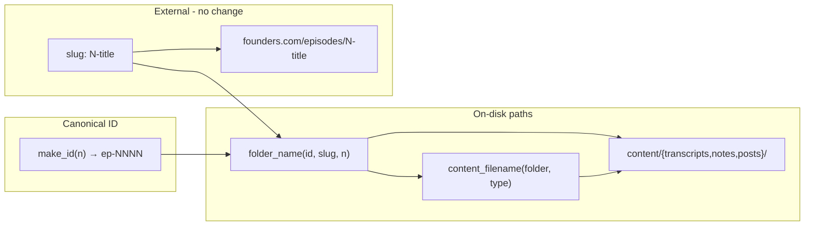

# Sort-safe episode IDs and unified per-episode filenames

## Problem

Two related inconsistencies break operability and will compound as the vault grows:

1. **Variable-width IDs:** numbered episodes use unpadded `ep-1`, `ep-10`, `ep-100`. Plain alphabetical sort (Finder, `@` mentions, `ls`, glob output, search hit lists) breaks numeric order (`ep-10` before `ep-9`, `ep-100` before `ep-20`). Catalog sorts by int `episode_number`; disk does not.
2. **Inconsistent filenames per episode:** transcripts use the fully-qualified `{folder}.md`, but notes/posts/expanded use generic `notes.md`, `post.md`, `expanded.md`. Filenames lose episode + type identity once detached from their parent folder (editor tabs, search results, copy-outs, future retrieval indexes).

**Scope:** 417 numbered episodes + 26 `ep-special-`* catalog rows (no special folders on disk yet). ~416 transcript dirs, ~189 notes, ~187 posts, ~? expanded files.

## Target convention

Two simple rules, applied uniformly across the three content trees.

### Rule 1 — Canonical ID is 4-digit zero-padded


| Layer                                   | Numbered                                | Unchanged           |
| --------------------------------------- | --------------------------------------- | ------------------- |
| Canonical `id`                          | `ep-0001` … `ep-0417`                   | `ep-special-{slug}` |
| Folder basename                         | `ep-0001-{slug-tail}`                   | `ep-special-{slug}` |
| `episode_number` in catalog/frontmatter | integer `1`                             | —                   |
| `slug` / `founders_url`                 | still `1-elon-musk-...` (external URLs) | —                   |


After padding, `ep-0009` < `ep-0010` < `ep-0100` < `ep-0417` lexicographically. `ep-special-`* folders sort after all `ep-0xxx` (`ep-0` < `ep-s`).

### Rule 2 — Per-episode filenames are `{folder}.{type}.md`

One pattern per content type, identical structure across all three trees:


| Tree                       | Path                                                              |
| -------------------------- | ----------------------------------------------------------------- |
| Transcript                 | `content/transcripts/ep-0001-{slug}/ep-0001-{slug}.transcript.md` |
| Notes (raw datapoints)     | `content/notes/ep-0001-{slug}/ep-0001-{slug}.notes.md`            |
| Notes (expanded, optional) | `content/notes/ep-0001-{slug}/ep-0001-{slug}.expanded.md`         |
| X post                     | `content/posts/ep-0001-{slug}/ep-0001-{slug}.post.md`             |


The four allowed type suffixes — `transcript`, `notes`, `expanded`, `post` — are the only sanctioned per-episode filenames. `.md` stays the real file extension so editors/Obsidian/markdown tooling work unchanged.

**Principle:** one canonical padded string for paths and IDs; integer `episode_number` for math, matching, and human display; unpadded slug for the web; one filename pattern per episode so a filename alone always identifies episode + content type.




## 1. Centralize formatting in `[ingestion/vault_lib.py](ingestion/vault_lib.py)`

Add constants and helpers:

```python
EPISODE_NUMBER_WIDTH = 4  # ep-0001 … ep-9999
CONTENT_TYPES = ("transcript", "notes", "expanded", "post")

def format_episode_id(episode_number: int) -> str:
    return f"ep-{episode_number:0{EPISODE_NUMBER_WIDTH}d}"

def parse_numbered_episode_id(episode_id: str) -> int | None:
    # accept legacy ep-1 and new ep-0001 during transition

def content_filename(folder: str, content_type: str) -> str:
    # e.g. ("ep-0001-slug", "notes") -> "ep-0001-slug.notes.md"
    assert content_type in CONTENT_TYPES
    return f"{folder}.{content_type}.md"
```

`**make_id`:** use `format_episode_id` for numbered episodes.

`**folder_name` (critical fix):** dedupe slug prefix using **integer** `episode_number`, not digits parsed from `episode_id`:

```python
def folder_name(episode_id: str, slug: str, episode_number: int | None = None) -> str:
    if episode_number is not None and slug.startswith(f"{episode_number}-"):
        return f"{episode_id}-{slug[len(str(episode_number)) + 1:]}"
    return f"{episode_id}-{slug}"
```

**Path helpers** all return `{folder}/{folder}.{type}.md`:

- `transcript_filename(id, slug, n)` → `{folder}.transcript.md` (was `{folder}.md`)
- `notes_path(id, slug, n)` → `…/{folder}.notes.md` (was `notes.md`)
- `expanded_path(id, slug, n)` → `…/{folder}.expanded.md` (was `expanded.md`)
- `post_path(id, slug, n)` → `…/{folder}.post.md` (was `post.md`)

Thread `episode_number` through `transcript_dir`, `notes_dir`, `post_dir`, and internal writers (~10 call sites in `vault_lib`, `[build_chunks.py](ingestion/build_chunks.py)`, `[verify.py](ingestion/verify.py)`, `[expand_datapoints.py](ingestion/expand_datapoints.py)`, `[fetch_transcripts.py](ingestion/fetch_transcripts.py)`, `[organize_posts_from_csv.py](ingestion/organize_posts_from_csv.py)`, `[assign_post_manual.py](ingestion/assign_post_manual.py)`).

## 2. One-shot migration script: `ingestion/migrate_episode_layout.py`

Single script handles **both** the id padding and the filename rename together — they touch the same files, so one atomic migration prevents an in-between half-state.

Catalog-driven renames (not hand-edited paths):

1. `**--dry-run`** (default): print folder rename map + file rename map + frontmatter patches; exit non-zero on conflicts.
2. For each numbered row in `[catalog/episodes.jsonl](catalog/episodes.jsonl)`:
  - Compute **old** folder via legacy unpadded id (or parse existing `transcript_path`).
  - Compute **new** folder + filenames via updated `vault_lib` (padded id + `{folder}.{type}.md`).
3. For each content tree `[content/transcripts](content/transcripts)`, `[content/notes](content/notes)`, `[content/posts](content/posts)`:
  - `rename(old_dir → new_dir)` if old exists
  - Rename inner file(s) to `{new_folder}.{type}.md`:
    - transcripts: `{old}.md → {new}.transcript.md`
    - notes: `notes.md → {new}.notes.md`
    - notes: `expanded.md → {new}.expanded.md` (when present)
    - posts: `post.md → {new}.post.md`
  - Patch frontmatter `id:` (quoted and unquoted forms) inside each file
4. Update catalog row: `id`, `transcript_path`
5. Update sidecars referencing old ids:
  - `[catalog/post-mapping-review.jsonl](catalog/post-mapping-review.jsonl)` (`suggested_episode`)
  - Any other jsonl fields found by grep for `"ep-\d+"` (skip transcript body text)
6. `**--apply`**: perform writes; then instruct running `build_chunks.py` + `verify.py`

**Safety:** abort if any target path already exists; write a manifest JSON (`catalog/migration-layout-YYYYMMDD.json`) listing every old→new path for rollback reference.

**Do not change:** transcript/post **body** text mentioning "episode 245"; `founders_url` / `colossus_url`; `slug` column; `episode_number` integers; `[content/posts/_corpus/](content/posts/_corpus/)` and `[content/posts/_other/](content/posts/_other/)` (these are not per-episode dirs).

## 3. Harden `[ingestion/verify.py](ingestion/verify.py)`

Add checks so regressions are caught immediately:

- Numbered `id` must match `^ep-\d{4}$`
- Every per-episode file under `content/{transcripts,notes,posts}/{folder}/` must match `^{folder}\.(transcript|notes|expanded|post)\.md$`
- `transcript_path` in catalog equals `vault_lib.transcript_path(id, slug, episode_number)` when status is `complete`
- No directories or files matching legacy patterns: `^ep-\d{1,3}-` folders, bare `notes.md` / `post.md` / `expanded.md`, or `{folder}.md` transcript form (orphan detection)
- `[gaps.md](catalog/gaps.md)` list items use padded ids via `format_episode_id(n)` instead of `ep-{n}`

## 4. Documentation updates


| File                                                                                                                                                                                                                                  | Changes                                                                                                                                                                          |
| ------------------------------------------------------------------------------------------------------------------------------------------------------------------------------------------------------------------------------------- | -------------------------------------------------------------------------------------------------------------------------------------------------------------------------------- |
| `[docs/episode-id-rules.md](docs/episode-id-rules.md)`                                                                                                                                                                                | Rule 1 (`ep-0001` format, `EPISODE_NUMBER_WIDTH`, `episode_number` vs `id`, slug/URL stay unpadded, specials unchanged) + Rule 2 (the four `{folder}.{type}.md` filenames table) |
| `[docs/datapoint-workflow.md](docs/datapoint-workflow.md)`                                                                                                                                                                            | Update examples to `{folder}.notes.md` / `{folder}.expanded.md`                                                                                                                  |
| `[docs/retrieval.md](docs/retrieval.md)`                                                                                                                                                                                              | Chunk ids use padded `episode_id`; `source_path` shows new filenames                                                                                                             |
| `[AGENTS.md](AGENTS.md)`                                                                                                                                                                                                              | Update "One episode" section to show all three padded `{folder}.{type}.md` paths; CLI examples `ep-0200`                                                                         |
| `[README.md](README.md)`                                                                                                                                                                                                              | Cursor `@` examples with padded ids and new filenames; `## Layout` block                                                                                                         |
| `[catalog/import-review.md](catalog/import-review.md)`                                                                                                                                                                                | Manual table refs (`ep-0088` etc.)                                                                                                                                               |
| Script `--help` strings in `[fetch_transcripts.py](ingestion/fetch_transcripts.py)`, `[expand_datapoints.py](ingestion/expand_datapoints.py)`, `[sync_new.py](ingestion/sync_new.py)`, `[import_notes.py](ingestion/import_notes.py)` | `ep-0418` examples                                                                                                                                                               |


## 5. Regenerate derived artifacts

After migration `--apply`:

```bash
cd ingestion
python migrate_episode_layout.py --apply
python build_chunks.py    # rebuild catalog/chunks.jsonl (chunk_id + source_path)
python verify.py          # refresh catalog/gaps.md + run new guards
```

## Execution order

1. Implement `vault_lib` padding helpers + filename helpers + `folder_name` fix; thread `episode_number` through path APIs
2. Add `migrate_episode_layout.py` (dry-run first, review manifest)
3. Apply migration + rebuild chunks + verify
4. Update docs, AGENTS.md, README.md, and CLI help text
5. Optional: grep workspace for stale `ep-\d{1,3}` or bare `notes.md`/`post.md`/`expanded.md` references in catalog/docs (not content bodies)

## Risk summary


| Risk                                                          | Mitigation                                                                                           |
| ------------------------------------------------------------- | ---------------------------------------------------------------------------------------------------- |
| `ep-0001` + slug `1-foo` → `ep-0001-1-foo`                    | `folder_name` uses int `episode_number`, not padded id string                                        |
| Partial migration (id padded but filename not, or vice versa) | Single migration script handles both atomically per episode                                          |
| Conflict on rename (target exists)                            | Pre-flight check; abort entire migration on first conflict                                           |
| Broken Cursor muscle memory                                   | Updated docs + AGENTS.md; legacy ids accepted only inside migration script                           |
| Episode 1000+                                                 | Already covered by 4-digit width                                                                     |
| Long filenames                                                | `{folder}.{type}.md` stays well under macOS/Linux 255-byte limit even for the longest existing slugs |


## Out of scope

- Renaming `[content/posts/_other/](content/posts/_other/)` (X post ids, not episode ids) or `[content/posts/_corpus/](content/posts/_corpus/)`
- Changing external podcast URL slugs
- Embedding reindex beyond `build_chunks.py`
- Restructuring into a single per-episode tree (`content/ep-0001-slug/...`) — would be a separate, larger change

