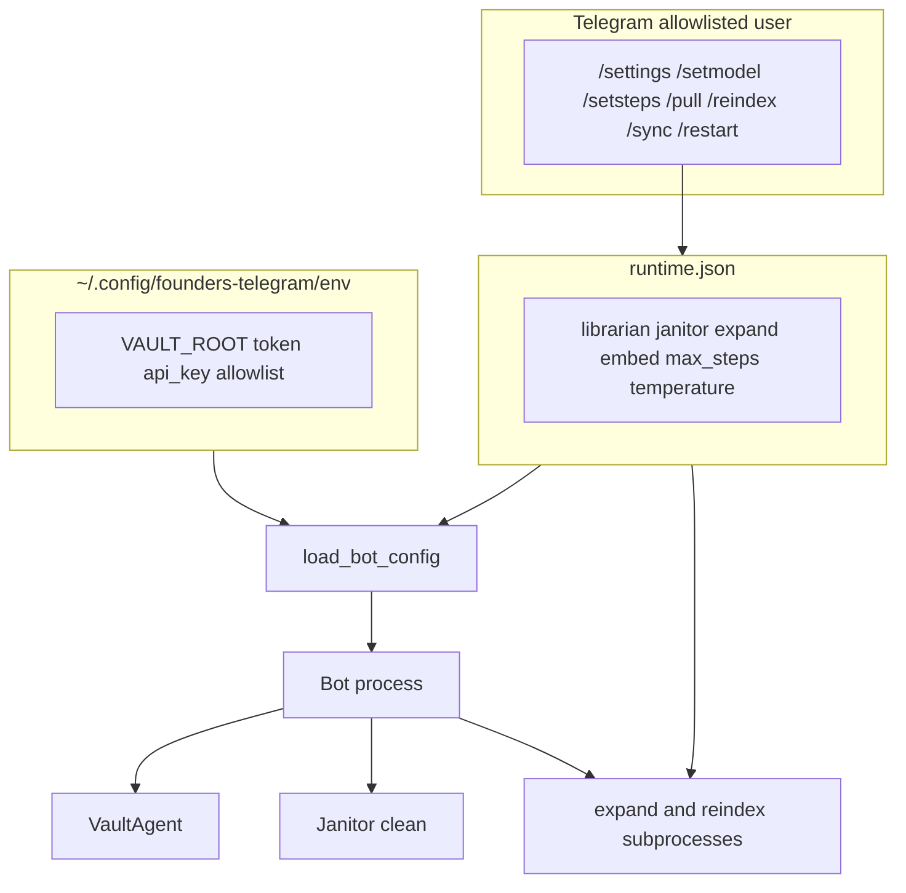

# Telegram-controlled models and ops

## Implementation status (read before Agent mode)

| Area | State |
|------|--------|
| `max_steps` via `runtime.json` | **Shipped** |
| Model slugs + ops commands | **Shipped** — `/setmodel`, `/resetmodel`, `/pull`, `/reindex`, `/sync` |
| `/resetsteps` bug | **Fixed** — `reset_runtime_key("max_steps")` only |
| Working tree | Ready to commit with this plan file |

**Agent session:** one focused PR; commit this `.plan.md` with the implementation (see root `AGENTS.md`).

---

## Direct answer

| Variable | Required in Mac mini `env` today? | After this work |
|----------|-----------------------------------|-----------------|
| `TELEGRAM_CHAT_MODEL` | Yes (bot refuses to start) | No — runtime `librarian_model` |
| `OPENROUTER_EMBED_MODEL` | Yes (reindex + hybrid search) | No — runtime `embed_model` (also synced into process `os.environ` for live search) |
| `JANITOR_CLEAN_MODEL` | Effectively yes (`/janitor` blocks) | No — runtime `janitor_clean_model` |
| `OPENROUTER_MODEL` (expand) | Often in env | No — runtime `expand_model` |

**Always stay in env** (secrets / host wiring — never in Telegram chat):

- `VAULT_ROOT`
- `TELEGRAM_BOT_TOKEN`
- `TELEGRAM_ALLOWED_USER_IDS`
- `OPENROUTER_API_KEY`
- `OPENROUTER_BASE_URL` (optional)

Optional env vars are **legacy fallbacks** only when a runtime key is absent (migration), not the primary control surface.

---

## Target architecture



**Resolution order (every setting):** `runtime.json` → env var (legacy fallback) → code default (only where safe: `max_steps=5`, `janitor_clean_temperature=0.2`).

**One-time migration on bot startup:** `seed_runtime_from_env_if_missing()` in `load_bot_config()` — for each model key missing in `runtime.json`, copy from the legacy env var if set; write file once (`chmod 600`). After deploy + `/restart`, you can delete model lines from `env` without retyping slugs in Telegram.

---

## Runtime file schema

Path: `FOUNDERS_TELEGRAM_RUNTIME` or default `~/.config/founders-telegram/runtime.json` (see [`services/telegram/bot/runtime_settings.py`](services/telegram/bot/runtime_settings.py)).

```json
{
  "librarian_model": "deepseek/deepseek-v4-pro",
  "janitor_clean_model": "openai/gpt-oss-20b::Groq",
  "janitor_clean_temperature": 0.2,
  "expand_model": "anthropic/claude-sonnet-4",
  "embed_model": "qwen/qwen3-embedding-8b",
  "max_steps": 10
}
```

### Env var ↔ runtime key ↔ `/setmodel` role

| Runtime key | Legacy env | `/setmodel` role | `/resetmodel` role |
|-------------|------------|------------------|---------------------|
| `librarian_model` | `TELEGRAM_CHAT_MODEL` | `librarian` | `librarian` |
| `janitor_clean_model` | `JANITOR_CLEAN_MODEL` | `janitor` | `janitor` |
| `expand_model` | `OPENROUTER_MODEL` | `expand` | `expand` |
| `embed_model` | `OPENROUTER_EMBED_MODEL` | `embed` | `embed` |
| `max_steps` | `TELEGRAM_MAX_STEPS` | *(use `/setsteps`)* | *(use `/resetsteps`)* |
| `janitor_clean_temperature` | `JANITOR_CLEAN_TEMPERATURE` | *(no command — env or runtime file only)* | *(no command)* |

---

## Code changes

### 1. Extend [`runtime_settings.py`](services/telegram/bot/runtime_settings.py)

- `MODEL_ROLE_TO_KEY`, `set_model(role, slug)`, `reset_runtime_key(key)` (do **not** delete the whole file).
- Getters returning `(value, source_label)`: `effective_librarian_model()`, `effective_janitor_clean_model()`, `effective_expand_model()`, `effective_embed_model()`, `effective_janitor_clean_temperature()`.
- `apply_runtime_overrides(AgentConfig)` — keep `max_steps`; set `model` from `librarian_model`.
- `apply_runtime_to_bot_config(BotConfig)` — set `janitor_clean_model` from runtime (or build janitor field inside `load_bot_config` before constructing `BotConfig`).
- `build_subprocess_env(base: dict | None = None) -> dict` — copy base (default `os.environ`), set `VAULT_ROOT`, `OPENROUTER_API_KEY`, `OPENROUTER_MODEL`, `OPENROUTER_EMBED_MODEL`, `OPENROUTER_BASE_URL` from effective values.
- `sync_embed_to_os_environ()` — set `os.environ["OPENROUTER_EMBED_MODEL"]` from `effective_embed_model()` so **in-process** hybrid search ([`ingestion/lib/search_retrieval.py`](ingestion/lib/search_retrieval.py) `embed_query`) works after env slim-down. Call from `load_bot_config()` and after `/setmodel embed` reload.
- `seed_runtime_from_env_if_missing()` — idempotent; only fills absent keys.
- `format_settings_summary(AgentConfig, BotConfig)` — all effective values + source labels + command hints.

**Fix `/resetsteps`:** replace `clear_runtime_settings()` with `reset_runtime_key("max_steps")` only.

### 2. Update [`config.py`](services/telegram/bot/config.py)

- `load_agent_config()`: resolve librarian model runtime → `TELEGRAM_CHAT_MODEL`; **fail** with a clear message if neither is set.
- `load_bot_config()`: call `seed_runtime_from_env_if_missing()` once; resolve `janitor_clean_model` runtime → `JANITOR_CLEAN_MODEL`; apply both runtime helpers; call `sync_embed_to_os_environ()`.

### 3. Reload helper in [`handlers.py`](services/telegram/bot/handlers.py)

- `_reload_bot_config(context)` — `load_bot_config()`, store in `bot_data["config"]`, rebuild `VaultAgent`, return both.
- `/setmodel`, `/resetmodel`, `/setsteps` use this (not agent-only reload).
- Update `HELP_TEXT` and error copy in [`janitor_handlers.py`](services/telegram/bot/janitor_handlers.py) (e.g. “use `/setmodel janitor …` or runtime file” instead of env-only).

### 4. Subprocess wiring — [`janitor_workflow.py`](services/telegram/bot/janitor_workflow.py)

- `run_expand`: `env = build_subprocess_env()` instead of bare `os.environ.copy()`.
- `run_reindex`: today calls [`reindex_vault`](ingestion/lib/reindex_vault.py) which does its **own** `os.environ.copy()` for chunk/embedding subprocesses. **Done when:** either pass `env=build_subprocess_env()` into an extended `reindex_vault(..., env=...)` or merge effective embed/expand keys into `os.environ` immediately before `reindex_vault()` in `run_reindex`. Prefer explicit `env=` param on `reindex_vault` (small ingestion change, keeps Janitor promote path correct too).

Janitor clean already receives `model=` from `BotConfig` — no change inside `llm_clean_pasted_notes`. Optional: read temperature from runtime in `janitor_clean_temperature()` via `effective_janitor_clean_temperature()`.

### 5. Ops — new [`bot/ops_runner.py`](services/telegram/bot/ops_runner.py)

- `bot_data["ops_lock"]` or similar: reject concurrent `/pull`, `/reindex`, `/sync`.
- `asyncio.to_thread` for `git pull --ff-only` in `config.agent.vault_root` and for `run_reindex`.
- Reply: start message, then completion with exit code + `_tail` log (reuse `_TAIL_LINES` pattern from janitor_workflow).
- `/sync` = pull then reindex (same outcome as [`sync-and-index.sh`](services/telegram/deploy/sync-and-index.sh); cron script can stay for unattended 4am runs).

**Safety copy in replies:** avoid during active Librarian/Janitor turns; reindex may take several minutes. After `/setmodel embed`, `/settings` reminds: run `/reindex` or `/sync` before trusting search (embedding model / dimension mismatch).

### 6. Register commands — [`__main__.py`](services/telegram/bot/__main__.py)

Add handlers + `BotCommand` entries for: `setmodel`, `resetmodel`, `pull`, `reindex`, `sync`. Keep `resetsteps` registered.

---

## Docs sweep (`docs-sweep` todo)

**Goal:** One consistent story everywhere — **secrets in `env`**, **models + `max_steps` in `runtime.json`**, **day-to-day control via Telegram** (`/settings`, `/setmodel`, `/setsteps`, `/sync`). No doc should still imply you must SSH-edit `TELEGRAM_CHAT_MODEL` on the Mac mini for routine tuning.

**Do not edit** [`.cursor/plans/archive/`](.cursor/plans/archive/) unless a link is actively misleading in a non-archive doc; archived plans are historical.

### Operator / runbook (required updates)

| File | Update |
|------|--------|
| [`services/telegram/deploy/env.example`](services/telegram/deploy/env.example) | Secrets-only template; model vars **commented** with pointer to `runtime.json` + `/setmodel` |
| [`services/telegram/README.md`](services/telegram/README.md) | Split **env** vs **runtime.json** tables; full **Ops from Telegram** command list (`/setmodel`, `/resetmodel`, `/pull`, `/reindex`, `/sync`, `/resetsteps`); slim-env cutover; `/sync` vs cron `sync-and-index.sh`; troubleshooting (embed → `/reindex`) |
| [`docs/janitor.md`](docs/janitor.md) | Model tuning playbook: primary path `/settings` + `/setmodel`; env as migration fallback; replace env-only examples; Janitor help strings reference Telegram not `JANITOR_CLEAN_MODEL=` in env |
| [`docs/manual-operations.md`](docs/manual-operations.md) | Index refresh: add **Telegram `/sync`** alongside `sync-and-index.sh`; embed keys from runtime (or env fallback); traveling workflow table |
| [`docs/telegram-vault-agent.md`](docs/telegram-vault-agent.md) | Architecture blurb: runtime-controlled models; `/sync` for index; link to README ops section |
| [`services/telegram/REVIEW.md`](services/telegram/REVIEW.md) | Install checklist: copy env + note auto-seed `runtime.json`; ops commands |

### Cross-links (required updates)

| File | Update |
|------|--------|
| [`docs/retrieval.md`](docs/retrieval.md) | `OPENROUTER_EMBED_MODEL` → runtime `embed_model` on Mac mini bot host; reindex after slug change via `/reindex` or `/sync` |
| [`docs/testing.md`](docs/testing.md) | Live harness: still uses `TELEGRAM_CHAT_MODEL` in env for laptop runs **or** document optional `runtime.json` read — keep harness working without Telegram bot |
| [`docs/telegram-mock-harness.md`](docs/telegram-mock-harness.md) | Env table: distinguish bot host (`runtime.json`) vs harness live mode (env vars OK); mention `FOUNDERS_TELEGRAM_RUNTIME` |
| [`dev/scenarios/README.md`](dev/scenarios/README.md) | One line: production models on Mac mini live in `runtime.json`; harness unchanged |

### Light touch (only if stale after grep)

| File | Update |
|------|--------|
| [`docs/expanded-backfill.md`](docs/expanded-backfill.md) | Mac mini reindex: optional “or `/sync` from Telegram” |
| [`docs/vault-agent-v0-checklist.md`](docs/vault-agent-v0-checklist.md) | Manual sync row: add `/sync` |
| [`.cursor/plans/telegram_rag_bot_v0.plan.md`](.cursor/plans/telegram_rag_bot_v0.plan.md) | One-line **Decisions log** row: models → `runtime.json` (link this plan) — keeps master index accurate |

### Harness code (minimal; only if docs claim otherwise)

| File | Update |
|------|--------|
| [`dev/harness/env.py`](dev/harness/env.py) | **Optional:** after loading `env`, also load `runtime.json` and map `librarian_model` → `TELEGRAM_CHAT_MODEL` for `live_harness_ready()` so laptop live scenarios work when models were removed from env on the mini. If skipped, document that harness still requires `TELEGRAM_CHAT_MODEL` in env or repo `.env`. |

### Deploy test

| File | Update |
|------|--------|
| [`tests/test_telegram_deploy.py`](tests/test_telegram_deploy.py) | `test_env_example_lists_required_keys`: assert only secrets keys are **required** (uncommented); model keys present in comments or “moved to runtime” block |

### Docs sweep “done when”

1. From repo root, stale-reference pass (fix every hit in **non-archive** docs):

```bash
rg -n 'TELEGRAM_CHAT_MODEL|JANITOR_CLEAN_MODEL|OPENROUTER_EMBED_MODEL|edit.*env.*model|Model changes still require' \
  --glob '*.md' --glob '!**/.cursor/plans/archive/**'
```

Expect **zero** lines that tell the operator to edit model slugs in `env` as the primary path (fallback/migration mentions are OK).

2. New operator can read **only** [`services/telegram/README.md`](services/telegram/README.md) + [`docs/manual-operations.md`](docs/manual-operations.md) and understand: env = secrets; `~/.config/founders-telegram/runtime.json` = models; Telegram commands for travel.

3. `pytest tests/test_telegram_deploy.py -q` passes after `env.example` slim-down.

**Order:** Run `docs-sweep` **after** code + handlers ship (so README command table matches reality), in the same PR as implementation.

---

## Tests

| File | Coverage |
|------|----------|
| [`tests/test_runtime_settings.py`](tests/test_runtime_settings.py) | Model getters, seed-from-env (only missing keys), `reset_runtime_key`, `apply_runtime_overrides` sets `model`, `build_subprocess_env` injects expand/embed |
| [`tests/test_telegram_bot.py`](tests/test_telegram_bot.py) | `load_bot_config` with models only in runtime file (no `TELEGRAM_CHAT_MODEL` / `JANITOR_CLEAN_MODEL` env) |
| `tests/test_ops_runner.py` (optional) | Lock rejects second op; mocked `git pull` failure message |

No live OpenRouter or Telegram API for settings/ops unit tests.

---

## Verification (Agent “done when”)

```bash
# From repo root
pytest tests/test_runtime_settings.py tests/test_telegram_bot.py tests/test_telegram_deploy.py -q
pytest tests -q   # full suite if time permits

# Docs sweep (no stale "edit env for models" as primary path)
rg -n 'TELEGRAM_CHAT_MODEL|JANITOR_CLEAN_MODEL|OPENROUTER_EMBED_MODEL|Model changes still require' \
  --glob '*.md' --glob '!**/.cursor/plans/archive/**'
```

Manual on Mac mini (after deploy):

1. `/settings` — all models show `runtime` source.
2. `/setmodel librarian <slug>` — Librarian uses new model without env edit.
3. `/resetsteps` — only clears `max_steps`; model keys remain.
4. `/sync` — pull + reindex succeed when idle; second `/sync` while running gets “already running”.
5. Remove model lines from `env`, `/restart` — bot still starts (values in `runtime.json`).

---

## Mac mini cutover (operator)

1. Deploy + `/restart` once (seeds `runtime.json` from current env).
2. Remove from `~/.config/founders-telegram/env`: `TELEGRAM_CHAT_MODEL`, `OPENROUTER_EMBED_MODEL`, `JANITOR_CLEAN_MODEL`, `OPENROUTER_MODEL` (if present).
3. Confirm `/settings` — all models from runtime file.
4. Going forward: `/setmodel …`, `/sync` after laptop pushes.

---

## Implementation order

1. `extend-runtime-schema` + `config-load-merge` (including seed + embed env sync).
2. `subprocess-env` + `janitor_workflow` / `reindex_vault` env param.
3. `telegram-commands` + `ops-runner` (can land in one commit).
4. `docs-sweep` + `tests` (docs last, same PR).

---

## Deferred (out of scope)

- OpenRouter `reasoning` / effort params (not wired in [`agent.py`](services/telegram/bot/agent.py)).
- Telegram command for `janitor_clean_temperature` (runtime key + env fallback is enough).
- File lock between bot and `git pull` (document “idle only”; same as SP4).
- Replacing cron `sync-and-index.sh` — keep both; Telegram `/sync` is the traveling shortcut.
