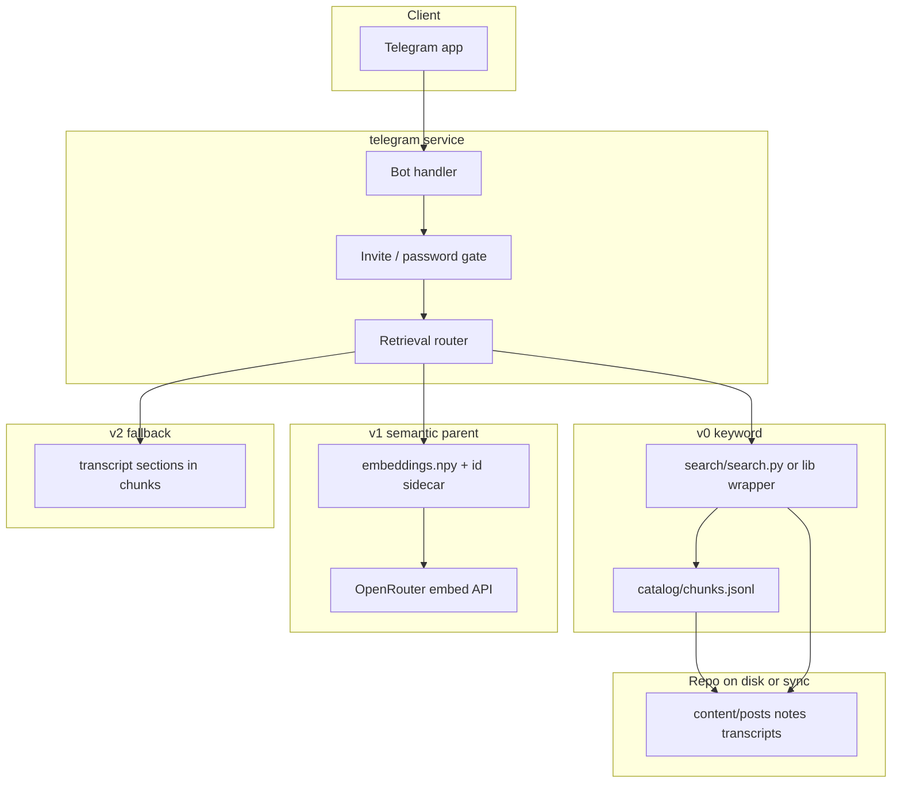

> **Superseded for implementation.** Use **[telegram_rag_bot_v0.plan.md](telegram_rag_bot_v0.plan.md)** (master index) and **sub-plans** `telegram_vault_sp1_tools.plan.md` … `sp4_ops` — one per agent session. This file remains background on parent/child tiers and the original v0/v1 sketch.

# Telegram Vault Bot (background)

## Goal

A **private** Telegram interface to query the Founders vault from a phone: high-signal hits first (posts, expanded notes, raw datapoints), transcript only when needed.

Historical sketch — see [telegram_rag_bot_v0.plan.md](telegram_rag_bot_v0.plan.md) for the locked agent architecture. Aligns with [README.md](../../README.md) “Systems Roadmap: Telegram vault agent” and [docs/retrieval.md](../../docs/retrieval.md).

**Dependency:** Production [expanded backfill](../../docs/expanded-backfill.md) — promote `.expanded.md` before embeddings/index tuning matter for expanded content.

---

## Non-goals (this plan)

- Public bot or multi-tenant auth
- Writing to `content/` from Telegram (read-only retrieval first)
- Replacing Cursor / `maintain.py` for ingestion
- Indexing `.expanded.draft.md` (staging only)

---

## Architecture



---

## Retrieval tiers (parent / child)

Matches README parent-child design:

| Tier | Default? | Chunk sources | `section` / `content_type` (from [build_chunks.py](../../ingestion/search/build_chunks.py)) |
|------|----------|---------------|-----------------------------------------------------------------------------------------------|
| **Parent** | Yes | X posts, canonical expanded, raw datapoints | `post:body`, `expanded:*`, `notes:raw_datapoints` |
| **Child** | Fallback only | Full transcript chunks | `transcript:transcript`, `transcript:description` |

**Rules:**

1. Query parent tier first (v0: keyword via `search.py`; v1: embedding similarity on parent excerpts only).
2. If top scores below threshold **or** user sends `/transcript <query>`, include child tier.
3. Never return child-only results without trying parent first (except explicit `/transcript`).

**Citation:** Every reply includes `chunk_id`, `source_path`, and `start_line` from chunk records so user can open the file in git.

---

## v0 — Chunk search bot (ship first)

**Why:** [AGENTS.md](../../AGENTS.md) — do not add embeddings until grep + chunk index fail real queries. v0 validates Telegram UX and auth with zero new ML infra.

### Scope

- New package: [`services/telegram/`](../../services/telegram/) (see README stub).
- Dependencies: reuse `ingestion` as library (`search/search.py`, `catalog.load_catalog`, `paths.ROOT`) or subprocess `python search/search.py "query" -n 5`.
- Commands:
  - `/start` — help + auth check
  - `/query <text>` or plain text — parent-tier search only (filter results where `section` does not start with `transcript:`)
  - `/episode ep-0200` — list chunks for one episode id
  - `/transcript <text>` — child tier only
- Auth: env `TELEGRAM_BOT_TOKEN` + allowlist (`TELEGRAM_ALLOWED_USER_IDS` comma-separated) or single shared `TELEGRAM_GATE_PASSWORD` for `/login`.
- Runtime: local polling for dev; Cloud Run + webhook for prod (later todo).

### Response shape

Short message per hit:

- Title + episode id
- Excerpt (first ~400 chars from chunk)
- Link: `founders_url` from chunk metadata when present
- Footer: `source_path:start_line`

### Verify v0

- [ ] Parent query returns posts/notes/expanded, not transcript walls of text
- [ ] `/transcript` returns transcript chunks
- [ ] Unauthorized chat id rejected
- [ ] Works after `python search/build_chunks.py` with at least one `.expanded.md` promoted

---

## v1 — Parent-tier embeddings

**When:** v0 search routinely misses paraphrased queries **and** post + expanded corpus is large enough (see [retrieval.md](../../docs/retrieval.md): posts ~400+, expanded notes for studied episodes).

### Storage (README-aligned)

- Flat `embeddings.npy` (or memmap) + sidecar JSONL/sqlite: `chunk_id`, model id, `embedded_at`.
- Incremental sync: hash `excerpt` per chunk; embed only new/changed rows after `build_chunks.py`.
- Embed via OpenRouter (same account as expand); store `OPENROUTER_EMBED_MODEL` in secrets, not repo.

### Index scope

- **Embed:** parent-tier chunks only (same filter as v0).
- **Do not embed** transcript sections by default (child tier stays keyword or on-demand embed job).

### Query path

1. Embed user message.
2. Top-k chunk_ids by cosine similarity.
3. Load full section from `content/` for LLM optional answer synthesis (phase 1.5 — can stay excerpt-only).

### Verify v1

- [ ] Re-embed after chunk rebuild does not duplicate vectors (stable `chunk_id`)
- [ ] Parent query quality ≥ v0 on 10 hand-written paraphrase tests
- [ ] Cost bounded (batch embed script, not per-message full corpus)

---

## v2 — Transcript fallback + automations

- Auto-fallback: if parent top score < τ, run child search and merge (dedupe by episode).
- Slash commands: `/transcript`, `/post`, `/notes`, `/expanded` as section filters.
- Future: “daily digest”, “what did I note on ep X” — out of scope until v0 stable.

---

## Repo layout (target)

```
services/telegram/
  README.md           # pointer to this plan
  pyproject.toml      # or requirements.txt (minimal: python-telegram-bot / aiogram)
  bot/
    __main__.py       # entry
    auth.py
    handlers.py
    retrieval.py      # v0/v1 router
  Dockerfile          # Cloud Run (later)
```

**Ingestion stays in `ingestion/`** — bot imports or shells out; no duplicate chunk builder.

---

## Environment variables

| Variable | Phase | Purpose |
|----------|-------|---------|
| `TELEGRAM_BOT_TOKEN` | v0 | BotFather token |
| `TELEGRAM_ALLOWED_USER_IDS` | v0 | Comma-separated numeric user ids |
| `TELEGRAM_GATE_PASSWORD` | v0 | Optional shared password |
| `OPENROUTER_API_KEY` | v1 | Embeddings |
| `OPENROUTER_EMBED_MODEL` | v1 | e.g. `openai/text-embedding-3-small` slug |
| `VAULT_ROOT` | v0 | Path to repo root (default: parent of `services/`) |

Secrets live in Cloud Run / local `.env` — **not** committed.

---

## Coordination with expanded backfill

| Backfill stage | Bot work |
|----------------|----------|
| Bulk `.expanded.draft.md` running | Plan + v0 scaffold only; no chunk expectations on drafts |
| Review + promote batches | `build_chunks.py` after each promote batch; test `/query` on expanded sections |
| Most backlog promoted | v1 embedding job on parent tier; tune thresholds |
| Daily single-episode expand | Incremental chunk rebuild documented in [expanded-backfill.md](../../docs/expanded-backfill.md) |

---

## Suggested PR sequence

1. **PR1 (docs):** This plan + [expanded-backfill.md](../../docs/expanded-backfill.md) + `services/telegram/README.md` + link updates in README/AGENTS/gaps_report.
2. **PR2 (v0):** Minimal polling bot, parent-only chunk search, allowlist auth.
3. **PR3:** Cloud Run deploy + webhook.
4. **PR4 (v1):** Embed script + vector query path (after expanded corpus promoted).

---

## Success criteria

- Private bot answers “Rockefeller efficiency” with posts or expanded notes before transcript spam.
- Every hit traceable to a git file path + line.
- No embeddings in repo until v0 proves insufficient on real phone queries.
- Expanded content appears in results only after `.expanded.md` promote + chunk rebuild.

---

## Open questions (decide in PR2)

- `python-telegram-bot` vs `aiogram` vs raw HTTP.
- Single-user vs small allowlist (family/cofounder).
- Optional LLM synthesis layer (OpenRouter chat) on top of chunks vs excerpts-only.
- Whether vault on server is git pull on schedule vs baked into container image.
