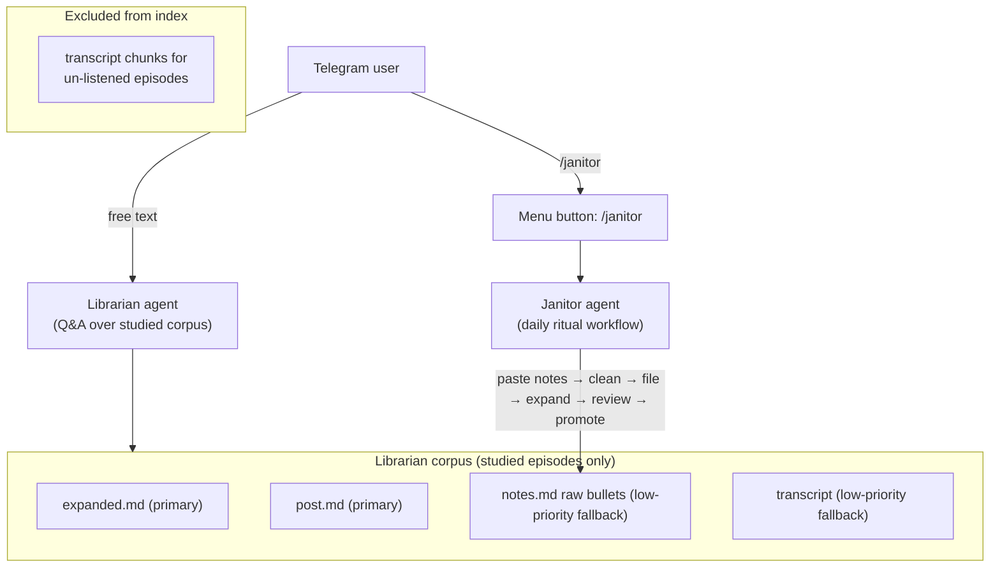

# Founders Vault Agent — Prioritized Backlog (archived)

**Status:** All todos completed May 2026. Janitor shipped — see [vault_janitor_agent.plan.md](vault_janitor_agent.plan.md) and [docs/janitor.md](../../../docs/janitor.md). Deferred follow-ups: [potential-ideas.md](../../../potential-ideas.md).

## Architecture Vision (Confirmed)

Two agents, one codebase:

**Corpus definition:**

- "Listened" = `.notes.md` contains at least one timestamp bullet line matching `^\[[\d:]+\]`. Auto-detected from file content; no catalog flag needed.
- "Completed" = post synced from X API (`post.md` present).
- Un-listened episodes: **zero chunks** in index (transcripts excluded entirely).
- Listened episodes — source priority order:
  1. `expanded:`* — primary, highest quality (synthesis + verbatim quotes)
  2. `post:`* — high quality, finished voice
  3. `notes:*` raw bullets — low-priority fallback (same tier as transcripts were; present but not primary)
  4. `transcript:*` — low-priority fallback for listened episodes only; excluded entirely for un-listened

---

## Shipped (summary)

| Item | Outcome |
|------|---------|
| Index filter | `build_chunks.py` skips transcript chunks for un-listened episodes |
| Chunk granularity | Expanded sections split at `###` datapoint boundaries |
| Line numbers | File-absolute `start_line` / `end_line` in chunks |
| Scenario tests | `tests/test_vault_retrieval_scenarios.py` + fixture JSONL |
| Nightly cron | `install-cron.sh` → `sync-and-index.sh` on Mac mini |
| v0 checklist | Verified against master plan success criteria |
| Janitor | [vault_janitor_agent.plan.md](vault_janitor_agent.plan.md), [docs/janitor.md](../../../docs/janitor.md) |

---

## NEXT (Librarian Quality + Ops)

**6. Nightly cron for sync-and-index.sh on Mac mini**

- Add crontab entry (noted in [services/telegram/README.md](services/telegram/README.md) but not configured)
- Run at 4am when bot is typically idle

**7. Verify v0 success criteria**

- Systematic test of the 5 checklist items from the master plan: thematic Q, web gate, expanded:* in hits, allowlist block, /newchat export
- Confirm a question about an un-listened episode returns "no notes yet" (not transcript soup)

**8–10. Janitor + post-promote reindex (shipped May 2026)**

- Architecture + implementation: [vault_janitor_agent.plan.md](vault_janitor_agent.plan.md)
- Operator guide: [docs/janitor.md](../../../docs/janitor.md)
- Mode-switched `/janitor` in the same bot process; subprocess expand/promote/reindex in `janitor_workflow.py`

---

## LATER (Post-Janitor Foundation)

**11. SP3.1 — /web provider**

- Wire Tavily or Brave into `[services/telegram/bot/tools/web.py](services/telegram/bot/tools/web.py)`
- Currently returns `{"error":"not configured"}`

**12. SP6 partial — tool tuning + status messages**

- "Searching notes…" Telegram status messages
- Tool description improvements in prompt
- Episode intent classifier (reduce tool storms on specific-episode questions)

---

## Explicit defer list (not doing)

- SP5 GitHub webhook (Mac mini + Tailscale exposure) — manual cron is sufficient for now; revisit if daily ritual makes lag painful
- LLM rerank on top-20 hybrid hits — index is small after filter, cost/complexity not justified
- Golden query set / MRR@8 eval — not enough stable queries yet; v1 scenario tests (NOW #5) are the precursor
- Cloud Run / multi-host — Mac mini is permanent
- File lock on sync-and-index.sh — document "run when idle"; not worth the complexity at this scale
- /transcript slash command, /post, /notes, /expanded section filters — architecture handles this through corpus filtering and load_episode tool

**Deferred:** SP5 webhook, SP6 tuning, golden MRR@8 — [potential-ideas.md](../../../potential-ideas.md).

---

## Open Questions (historical)

Resolved at ship time: Janitor runs mode-switched in one bot; reindex runs after promote in `janitor_workflow`. See [potential-ideas.md](../../../potential-ideas.md) for deferred follow-ups.

## Resolved Review Findings

- **"Listened" detection threshold**: Resolved — use regex `^\[[\d:]+\]` (timestamp bullet line) rather than section presence. `split_sections()` would count scaffold placeholder HTML comments as non-empty content, producing false positives. Timestamp bullet is unambiguous.
- **Direct-to-main risk**: Resolved — user explicitly approved committing directly to `main` for this personal repo.
- **Mac mini execution boundary**: Resolved — implementation agent should provide exact handoff commands; user/operator runs them on the Mac mini.
- **Scenario test gating**: Resolved — rebuild-dependent assertions run only when `RUN_REBUILT_INDEX_SCENARIOS=1` is set.

