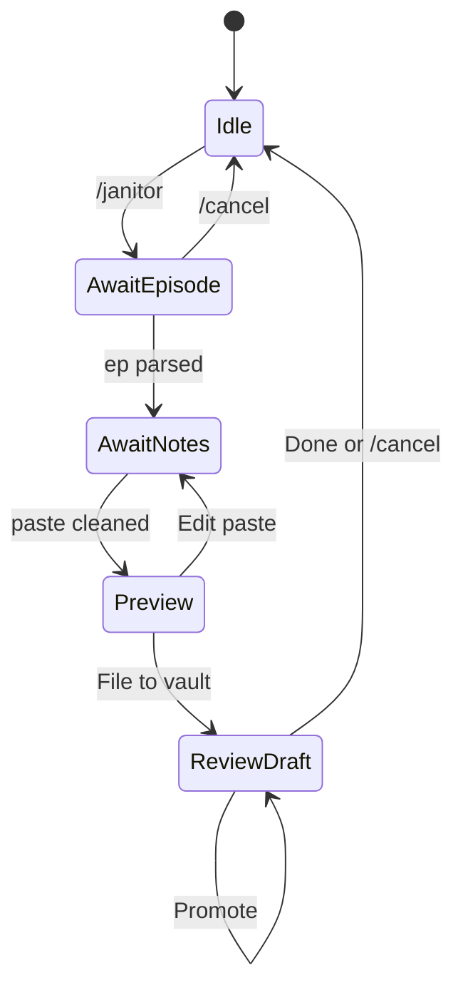

# Vault Janitor Agent — architecture

## Decision: mode in one bot process

| Option | Verdict |
|--------|---------|
| Same bot, `/janitor` mode | **Chosen** — one launchd job, one allowlist, simpler Mac mini ops |
| Separate bot process | Deferred — cleaner multi-user ACL later |

Librarian and Janitor share `services/telegram/bot/` but never run tool loops concurrently for the same user: Janitor active → free text routes to Janitor FSM; idle → Librarian `VaultAgent`.

## Permissions

| Agent | Vault access |
|-------|----------------|
| Librarian | Read-only tools (`search_*`, `load_episode`, `list_episode_ids`) |
| Janitor | Write `.notes.md`, run expand/promote, rebuild `chunks.jsonl` + embeddings |

v0: same `TELEGRAM_ALLOWED_USER_IDS` for both. Future: split allowlists or Janitor-only user ids.

## Interaction flow

1. User sends `/janitor` → bot asks for episode (`ep-NNNN` or `200`).
2. User pastes bullets → regex normalizes to `- MM:SS — hook` under `## Raw datapoints`.
3. Inline **File to vault** → merge into `{folder}.notes.md` (or replace empty scaffold).
4. **Expand** → subprocess `expand_datapoints_llm.py --id … --apply --no-stream` (uses `OPENROUTER_MODEL` from env).
5. **Show draft** → excerpt of `.expanded.draft.md`.
6. **Promote** → in-process `promote_draft()` from `expand_llm`.
7. **Reindex** → `build_chunks.py` + `build_embeddings.py` (no `git pull` — use nightly cron for that).
8. **Done** / `/cancel` → return to Librarian.

## Implementation choices

| Step | Mechanism | Rationale |
|------|-----------|-----------|
| Clean paste | `JANITOR_CLEAN_MODEL` + [`prompts/janitor_clean.md`](../../services/telegram/prompts/janitor_clean.md) | LLM-first on every paste; no regex fallback |
| Re-clean | Same model | Optional retry from preview keyboard |
| Expand | Subprocess CLI | Uses `OPENROUTER_MODEL`; long-running OK in `asyncio.to_thread` |
| Promote | Import `promote_draft` | Fast; no duplicate validation logic |
| Reindex | Subprocess search scripts | Matches `sync-and-index.sh` minus git pull |
| State | `JanitorStore` in memory | Same pattern as `SessionStore`; lost on bot restart (acceptable) |

## Code map

| File | Role |
|------|------|
| `bot/janitor_store.py` | Per-user FSM state |
| `bot/janitor_notes.py` | Parse episode id, clean/merge bullets |
| `bot/janitor_workflow.py` | File notes, expand/promote/reindex |
| `bot/janitor_handlers.py` | `/janitor`, `/cancel`, callbacks |
| `bot/handlers.py` | Route text to Janitor when active |

## Ops

- Nightly `install-cron.sh` → `sync-and-index.sh` at 4am (git pull + full reindex on Mac mini).
- After Janitor **Promote** on the bot host, user should tap **Reindex** (or wait for cron) before expecting Librarian to surface new `expanded:*` chunks.
- Restart bot after deploy: `launchctl kickstart -k gui/$(id -u)/com.founders.telegram.bot`

## Deferred

See [`potential-ideas.md`](../../potential-ideas.md) — **Next → Janitor UX** cluster.

## Related

- Operator guide: [docs/janitor.md](../../../docs/janitor.md)
- Corpus filter (studied episodes only): [vault_agent_backlog_8fad41c3.plan.md](vault_agent_backlog_8fad41c3.plan.md)
- Librarian master index: [telegram_rag_bot_v0.plan.md](../telegram_rag_bot_v0.plan.md)
- Runbook: [services/telegram/README.md](../../services/telegram/README.md)
