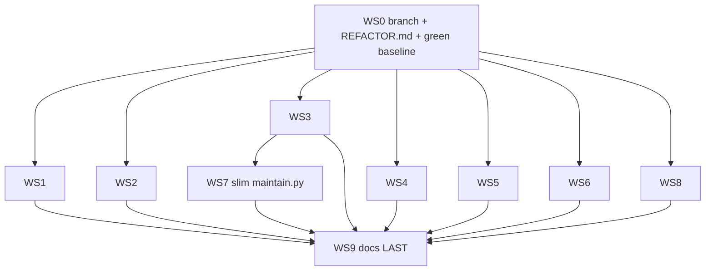

# Cut-Noise Refactor

## North star (decided)

The **product** is the Telegram **Librarian** (v3 orchestrated retrieval) + **Janitor** + the **content vault** they serve. Everything in `ingestion/` / `maintain.py` is authoring/dev toolchain, kept only where it feeds the bot or the daily ritual. We cut hard everywhere else.

## Setup

- Branch: `refactor/cut-noise` off `main`.
- Tracking doc: `REFACTOR.md` in repo root (committed on the branch). It records: the north star, guardrails, the workstream table (status + owning agent + commit), and decisions from this interview.
- Per the AGENTS.md "Cursor plans" rule, commit this `.plan.md` alongside `REFACTOR.md` in the first commit.

## Guardrails (apply to every workstream)

- `content/**` and `catalog/episodes.jsonl` are **read-only** (the knowledge asset).
- Generated indexes (`chunks.jsonl`, embeddings) change **only** via normal reindex, never hand-edited.
- **No behavioral rewrites** of live Librarian/Janitor/orchestrator logic — removal of dead branches only.
- `pytest tests -q` and `cd ingestion && python pipeline/verify.py` must be **green at every commit**.
- One workstream = one focused commit on the single branch.

## Execution model

WS1-WS6 + WS8 are independent. WS7 (slim `maintain.py`) waits on WS3. **WS9 docs is last** so every link/reference reflects the final tree.

## Workstreams

### WS1 - Delete one-shot migrations + historical archives
Delete from working tree (git history is the archive):
- `ingestion/migrations/` (layout, transcript-names, frontmatter, `import_notes_apple.py`) + any migration-specific tests
- `docs/archives/raw_notes_2026.txt`, `catalog/migration-layout-2026-05-21.json`

### WS2 - X import pipeline -> lean sync->organize
Posts stay (Librarian serves them). Cut only the fuzzy-attribution machinery:
- Delete `ingestion/x/attribute_posts_llm.py`, `ingestion/x/dedupe_x_csv.py` + `tests/test_attribute_posts_llm.py`.
- **Keep** `x/sync_x_cache.py`, `x/organize_posts_from_csv.py`, `x/assign_post_manual.py`, and `lib/x_posts_csv.py` / `lib/x_posts_match.py` / `lib/x_posts_threads.py` (organize imports match+threads; they are load-bearing).
- Remove the X-LLM-match row from `AGENTS.md`; note review-queue (`post-mapping-review.jsonl`) + `content/posts/_other/` remain as `organize` outputs.

### WS3 - Slim expand-tune sandbox
- Delete `ingestion/fixtures/expand-runs/`, `ingestion/prompts/expand_datapoints.candidate.md`, `catalog/expand-tune-batch.json`, `tests/test_expand_baseline_fixtures.py`.
- Remove tune from `AGENTS.md` and the `maintain.py` menu.
- **Keep** `ingestion/notes/expand_tune.py` + `tests/test_expand_tune.py`.

### WS4 - Trim retrieval v2 remnants from live agent
- In `services/telegram/bot/agent.py`, drop `search_vault_parent` / `search_transcript` from the live executor map (they are unadvertised and the orchestrator runs ahead of synthesis).
- **Keep** those functions in `bot/tools/vault.py` for tests/harness; update `tests/test_vault_v0_checklist.py` (and any harness scenario) to call them directly rather than via the live agent.

### WS5 - Remove the /web stub
- Delete `services/telegram/bot/tools/web.py`, the `/web` command handler, any settings toggle, and the web-tool branch in `agent.py`.
- Strip web references from `README.md`, `docs/telegram-vault-agent.md`, and tests.

### WS6 - Verify-then-cut compat shims (one verified deletion each)
For each, a sub-agent first confirms no live caller / no on-disk data in the old shape, then removes:
- `ingestion/lib/expand_llm.py` re-export shim (callers import split modules directly).
- Legacy `transcript.md` deletion hook + legacy frontmatter `legacy_map` in `lib/markdown_io.py`.
- Unpadded-id acceptance in `lib/episode_ids.py` (quick scan of `catalog/` + content for any bare `ep-N`).
- `seed_runtime_from_env_if_missing` env->runtime model seeding in `runtime_settings.py` (+ legacy env var docs).

### WS7 - Slim maintain.py to recovery/tactical fallback (after WS3)
- Drop the tune menu; demote in `AGENTS.md` from co-equal surface to "laptop recovery/tactical." Keep expand/promote/reindex menus (bot shells out to the same scripts).

### WS8 - Misc dead-code sweep
- Delete the orphan `ingestion/tests/` (bytecode-only) directory.
- Note (do not delete) the redundant root `.venv` in `REFACTOR.md`; standardize docs on `ingestion/.venv` only.

### WS9 - Docs consolidation (LAST)
- Merge `manual-operations.md` + `laptop-development.md` + `remote-product-workflow.md` + `mac-mini-operator-setup.md` into one `docs/operations.md` (sectioned by surface + decision matrix).
- Delete `services/telegram/REVIEW.md`; fold the still-useful test mapping from `docs/vault-agent-v0-checklist.md` into `docs/testing.md`, then delete the checklist.
- Rewrite all links in `AGENTS.md` / `README.md` / cross-doc references to reflect the final tree.

## Definition of done

- All workstreams committed on `refactor/cut-noise`; `REFACTOR.md` table fully checked.
- `pytest tests -q` green; `python pipeline/verify.py` exits 0.
- `AGENTS.md` + `README.md` describe only systems that still exist.
- Single merge to `main` at the end.
