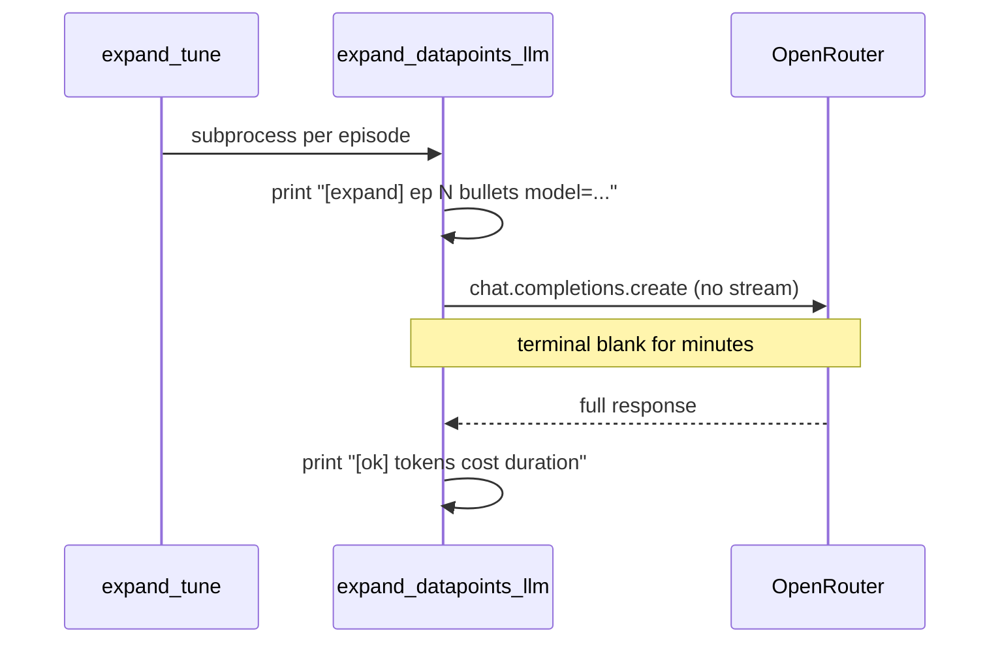

# Expand streaming and live progress

## Problem

Today the expand path is silent for the entire HTTP wait:



Relevant code: [`ingestion/lib/expand_llm.py`](ingestion/lib/expand_llm.py) `call_openrouter()` (blocking `create()`), [`ingestion/notes/expand_datapoints_llm.py`](ingestion/notes/expand_datapoints_llm.py) `run_expand_one()` (one print before, one after).

Your current run (`expand_tune expand --variant B --apply --force`) is working; it just has no mid-flight output.

## Recommended UX (what helps most)

Prioritize **signal over noise** — avoid dumping raw tokens to the terminal.

| Moment | Single episode (`expand_datapoints_llm --id …`) | Batch (`expand_tune`, `--subprocess`, `--from/--to`) |
|--------|---------------------------------------------------|------------------------------------------------------|
| Start | `[expand] ep-0001  3 bullets  ~142k chars in  model=…` then `[expand] ep-0001  waiting for API…` | Parent: `[expand] 3/10 ep-0042 variant B` |
| First bytes | `[expand] ep-0001  first output (4.2s)` | Same (child stdout) |
| During generation | `[expand] ep-0001  datapoint 2/3` when a new `###` heading appears in the stream | Same per episode |
| Done | Existing `[ok] ep-0001  …tokens… cost duration → path` | Existing batch summary from `expand-run.jsonl` |

**Why section progress:** expand output is structured (`### {timestamp} — …`). You already know `n_bullets` before the call; counting completed `###` headings in the accumulating buffer gives meaningful progress without scrolling thousands of tokens.

**Why not stream full text:** transcript-scale completions are huge; token-by-token print is unusable in a terminal.

**Default:** streaming **on** for expand `--apply`. Opt out with `--no-stream` (scripts/CI). Attribution stays non-streaming (small JSON responses, `response_format`).

## Implementation

### 1. Streaming API helper — [`ingestion/lib/expand_llm.py`](ingestion/lib/expand_llm.py)

- Add a small `ExpandProgressReporter` protocol or callback type with events: `waiting`, `first_token`, `section(n, total)`, optional `chars_out`.
- Add `call_openrouter_streaming(...)` (or extend `call_openrouter` with `stream: bool = False`):
  - `client.chat.completions.create(..., stream=True, stream_options={"include_usage": True})` (OpenRouter documents usage on the final chunk when requested).
  - Accumulate deltas into `content: str`; reuse `usage_from_response()` on the final chunk object when present.
  - Return the same `OpenRouterCompletion` dataclass so callers/tests stay unchanged.
- Keep the existing non-streaming branch for `response_format` callers ([`ingestion/x/attribute_posts_llm.py`](ingestion/x/attribute_posts_llm.py) — no behavior change).

Section detection helper (pure function, unit-tested):

```python
def count_datapoint_headings_in_partial(text: str) -> int:
    # count lines matching ^### \d{1,2}:\d{2} (reuse TIMESTAMP / heading logic from markdown_io)
```

Reporter prints with `flush=True` on every line.

### 2. Wire into expand — [`ingestion/notes/expand_datapoints_llm.py`](ingestion/notes/expand_datapoints_llm.py)

In `run_expand_one()` after the existing `[expand] {ep_id}  {n_bullets} bullets  model=…`:

- If streaming (default): call streaming helper with `total_sections=n_bullets` and a reporter that prints the lines above.
- If `--no-stream`: add one line `[expand] {ep_id}  calling API (~{input_chars} chars)…` with flush, then existing blocking `call_openrouter` (still better than today).

CLI: `--no-stream` on `expand_datapoints_llm.py`.

### 3. Batch counters — [`ingestion/notes/expand_tune.py`](ingestion/notes/expand_tune.py) + subprocess path

**expand_tune** (`cmd_expand` loop ~L226):

- Before each subprocess: `print(f"[expand] {i}/{len(episode_ids)} {ep_id} variant {variant}", flush=True)` instead of only `ep_id`.
- Child env: add `PYTHONUNBUFFERED=1` so prints appear immediately when inherited stdout is a TTY.

**expand_datapoints_llm** `--subprocess` loop (~L485): same `i/N` prefix when `len(selected) > 1`.

Forward `--no-stream` to child argv when set (expand_tune gets matching flag).

### 4. Tests

| File | What |
|------|------|
| [`tests/test_expand_llm.py`](tests/test_expand_llm.py) | Mock streamed chunks; assert assembled `content`, usage fields, section counter on partial buffer |
| [`tests/test_expand_datapoints_llm_logging.py`](tests/test_expand_datapoints_llm_logging.py) | Mock streaming call; assert progress prints (capsys) or reporter invoked |
| [`tests/test_expand_tune.py`](tests/test_expand_tune.py) | Optional: assert `build_child_cmd` includes `--no-stream` when parent requests it |

No network tests.

### 5. Docs (one line each)

- [`docs/datapoint-workflow.md`](docs/datapoint-workflow.md) — expand streams section progress by default; `--no-stream` to silence.
- [`ingestion/fixtures/expand-runs/README.md`](ingestion/fixtures/expand-runs/README.md) — tune runs show `N/10` + per-episode datapoint progress.

## Out of scope

- Parallel episode subprocesses (faster wall clock, not better per-request feedback).
- Streaming for X attribution (`attribute_posts_llm.py`).
- Changing OpenRouter model routing (`:nitro`, etc.) — separate from logging.

## Example terminal flow after change

```
[expand] 1/10 ep-0001 variant B
[expand] ep-0001  3 bullets  ~138k chars in  model=deepseek/deepseek-v4-pro
[expand] ep-0001  waiting for API…
[expand] ep-0001  first output (3.8s)
[expand] ep-0001  datapoint 1/3
[expand] ep-0001  datapoint 2/3
[expand] ep-0001  datapoint 3/3
[ok] ep-0001  42k in / 8k out  $0.02  94s  → ingestion/fixtures/expand-runs/baseline/B/.../....expanded.draft.md
[expand] 2/10 ep-0022 variant B
…
```
