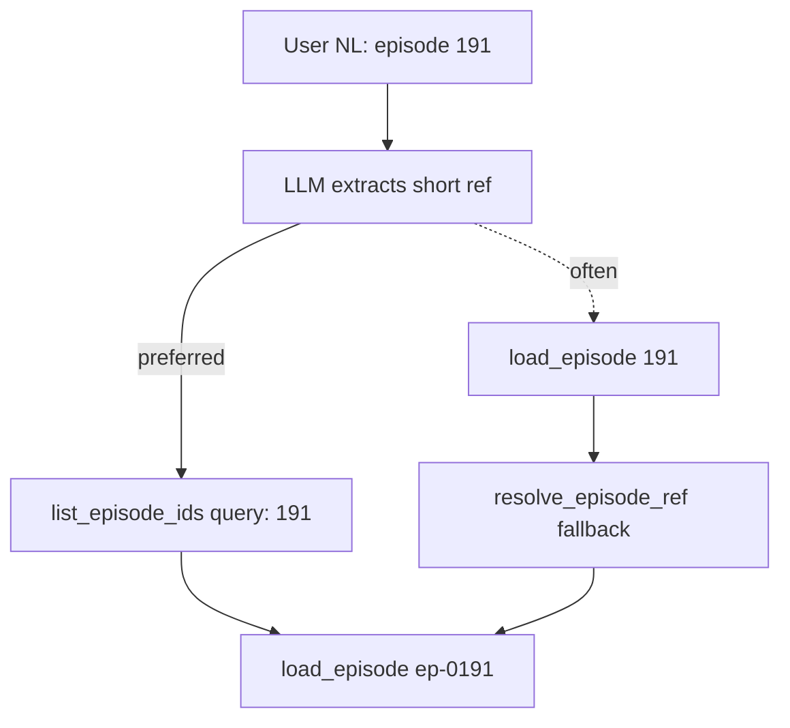

# Fix Librarian episode resolution (no NL regex)

## Success criteria

- User asks in Telegram: **"What did I note on episode 191?"** → answer from ep-0191 notes/expanded (studied since Janitor), without typing `ep-0191`.
- User asks about an **older episode by number or guest** → same, no canonical-id syntax lecture.
- **Janitor** paste parsing unchanged (`191 naval`, etc.).
- `pytest tests/test_vault_agent.py -q` passes; no regression on `ep-9999` missing.

## Design principle

| Path | Input | Parsing |
|------|--------|---------|
| **Janitor** | Paste bullets, first line `191 naval` | Regex in [`janitor_notes.parse_episode_id`](services/telegram/bot/janitor_notes.py) — **keep** |
| **Librarian** | Free-form Telegram questions | **LLM** extracts short ref → tools; **no regex** on NL in Python |

[`lookup_catalog_row`](ingestion/lib/catalog.py) stays **strict** (`ep-NNNN` / `ep-N` via [`parse_numbered_episode_id`](ingestion/lib/episode_ids.py) only). No bare-number or `episode NNN` regex in catalog.

## Root cause

The model often calls `load_episode({"episode_id": "191"})` without `list_episode_ids` first. Strict lookup fails → `{"error": "Episode not in catalog: 191"}` or tool loops → final-step hint **"Try naming an episode id like ep-0100"** in [`agent.py`](services/telegram/bot/agent.py) (~L326).

[`resolve_episode_ref`](services/telegram/bot/tools/vault.py) wraps `list_episode_ids` but is **unused**.



## Implementation (order matters)

### Step 1 — `list_episode_ids` (no NL regex)

File: [`services/telegram/bot/tools/vault.py`](services/telegram/bot/tools/vault.py)

- **Delete** [`_EPISODE_REF_RE`](services/telegram/bot/tools/vault.py) and `import re` if unused.
- Numeric path (clean tool token only):
  - `token = query.strip()` (do not lower before `isdigit()` / `parse_numbered_episode_id`)
  - If `token.isdigit()` → `format_episode_id(int(token))` → exact catalog row, score `1.0`
  - Elif `parse_numbered_episode_id(token)` → same
- Else → existing fuzzy loop on **lowered** query vs titles (`SequenceMatcher`, `q in title`, threshold `0.45`).
- **Do not** scan multi-word strings for embedded episode numbers.

**Regression note (accepted):** Today regex makes `list_episode_ids("episode 191")` work; after removal fuzzy score for that string is ~0.12 vs Naval title — **no match**. That is intentional: the **LLM** must pass `191` or `Naval Ravikant`, not the full sentence, via prompt/tool copy (Step 3). `load_episode` fallback with `episode_id="episode 191"` will also fail unless the model shortens the ref.

### Step 2 — `resolve_episode_ref` ambiguity guard

Same file. Today `limit=1` picks arbitrary row when many titles tie (e.g. `"Henry Ford"` → five episodes at score `0.85`).

**Done when:** `resolve_episode_ref` returns canonical id only if:

| Case | Rule |
|------|------|
| Digit / `ep-N` path | Top hit with score `1.0` |
| Fuzzy | Top hit score ≥ `0.85` **and** (no second hit **or** second hit score &lt; `0.85`) |

Otherwise return `None` (caller surfaces error; model should call `list_episode_ids` with more context or ask user).

Implementation sketch:

```python
def resolve_episode_ref(ref: str) -> str | None:
    result = list_episode_ids(ref, limit=3)
    eps = result.get("episodes") or []
    if not eps:
        return None
    top, *rest = eps
    if top.get("score", 0) >= 1.0:
        return top["episode_id"]
    if top.get("score", 0) >= 0.85 and (not rest or rest[0].get("score", 0) < 0.85):
        return top["episode_id"]
    return None
```

### Step 3 — `load_episode` fallback

In `load_episode`, after first `lookup_catalog_row` miss:

```python
resolved = resolve_episode_ref(episode_id.strip())
if resolved:
    row = lookup_catalog_row(rows, resolved)
```

If still `None` → keep existing `{"error": f"Episode not in catalog: {episode_id}"}` (no `SystemExit`).

### Step 4 — Prompt + tool copy

Files:

- [`services/telegram/prompts/vault_agent.md`](services/telegram/prompts/vault_agent.md) — extend "Episodes you have not studied" / tool-use section:
  - `list_episode_ids` **query** = short token only: episode number (`191`), guest name (`Naval Ravikant`), or `ep-0191` — **not** full sentences like `episode 191`.
  - `load_episode` **episode_id** = canonical `ep-NNNN` from `list_episode_ids` when possible; bare `191` is tolerated via server fallback.
- [`services/telegram/bot/agent.py`](services/telegram/bot/agent.py) — `load_episode` tool `description`: same; final-step empty content (~L324–327): replace `ep-0100` hint with e.g. "Try a guest name or episode number, or ask me to search the vault for a theme."

### Step 5 — Tests

File: [`tests/test_vault_agent.py`](tests/test_vault_agent.py) (and small unit test in same file or new `tests/test_vault_tools.py` if preferred).

| Test | Expect |
|------|--------|
| `execute_tool("load_episode", {"episode_id": "191"})` | `episode_id == "ep-0191"`, no `error` |
| `execute_tool("load_episode", {"episode_id": "ep-9999"})` | `error` present |
| `list_episode_ids("191")` | top `ep-0191`, score `1.0` |
| `list_episode_ids("Naval Ravikant")` | includes `ep-0191` in top 3 |
| `list_episode_ids("episode 191")` | **no** top hit with score `1.0` (documents regex removal) |
| `resolve_episode_ref("Henry Ford")` is `None` OR load_episode errors | ambiguity guard |

Run from repo root:

```bash
pytest tests/test_vault_agent.py -q
```

### Step 6 — Ship

Per [AGENTS.md](AGENTS.md): copy this plan to [`.cursor/plans/fix_bare_episode_refs.plan.md`](.cursor/plans/fix_bare_episode_refs.plan.md) and **commit it in the same commit** as the code.

Mac mini (operator):

```bash
cd "$VAULT_ROOT" && git pull
launchctl kickstart -k gui/$(id -u)/com.founders.telegram.bot
```

Telegram smoke:

1. "What did I note on episode 191?" → Naval study material.
2. "episode 22" or similar → resolves without manual `ep-0022` typing.

## Out of scope (this PR)

- NL regex in `lookup_catalog_row` or pre-parsing user Telegram text in Python before the LLM.
- Changing search index / `listened` filtering (already shipped).

## Deferred follow-ups

Track in [potential-ideas.md](potential-ideas.md) under a **Librarian episode resolution** bullet when any of these ship.

### UX / agent behavior

| ID | Follow-up | Why defer |
|----|-----------|-----------|
| **D1** | **`load_episode` error includes `candidates`** — when `resolve_episode_ref` is ambiguous, return `{ "error": "...", "candidates": [{ "episode_id", "title", "score" }, ...] }` from `list_episode_ids(..., limit=5)` so the model can ask the user or pick in one turn without re-searching. | Needs prompt line (“if candidates present, disambiguate”); small API shape change. |
| **D2** | **Stricter tool schema** — document `load_episode.episode_id` as “canonical `ep-NNNN` from `list_episode_ids`” in OpenAPI-style `description`; optional `enum` not viable (417 episodes). Consider making first tool call `list_episode_ids` mandatory in prompt only (no code enforcement) vs future `tool_choice` nudge. | Prompt-only may be enough after this fix; revisit if model still skips list. |
| **D3** | **Soften / remove `resolve_episode_ref` fuzzy auto-pick entirely** — fallback only for `isdigit` / `parse_numbered_episode_id`; force guest names through explicit `list_episode_ids` + user-visible disambiguation. | Reduces wrong-episode risk (Henry Ford); stricter than Step 2 guard. |
| **D4** | **Final-step copy audit** — grep Librarian paths for `ep-0100`, `ep-NNNN` syntax hints; align [`vault_agent.md`](services/telegram/prompts/vault_agent.md) with [`docs/vault-agent-v0-checklist.md`](docs/vault-agent-v0-checklist.md) smoke wording. | Docs-only; do after smoke on Mac mini. |

### Code hygiene

| ID | Follow-up | Why defer |
|----|-----------|-----------|
| **D5** | **Shared episode ref helper in `ingestion/lib`** — move digit / `ep-N` resolution used by Librarian + Janitor into one module (e.g. `episode_ids.resolve_episode_number(ref) -> int | None`); Janitor keeps line-1 regex for paste, Librarian uses strict token rules only. | Avoids drift; not required for the bugfix. |
| **D6** | **`tool_trace` metadata** — when `load_episode` uses fallback, append `resolved_from: "191" -> ep-0191` in trace for `/newchat` session exports under `catalog/telegram-sessions/`. | Debugging convenience. |
| **D7** | **Fuzzy tuning** — episode_number column exact match when `token.isdigit()`; title boost for `#NNN` prefix in catalog title; re-evaluate `0.45` / `0.85` thresholds with fixture queries (`Henry Ford`, `Ford`, `Rockefeller`). | SP6 tuning; needs scenario table. |

### Tests & docs

| ID | Follow-up | Why defer |
|----|-----------|-----------|
| **D8** | **Refresh v0 checklist** — [`test_v0_criterion_unlistened_agent_response`](tests/test_vault_v0_checklist.py) still mocks ep-0191 as un-listened; ep-0191 is studied post-Janitor. Update mock + [`docs/vault-agent-v0-checklist.md`](docs/vault-agent-v0-checklist.md) guest example (e.g. ep-0400) for consistency. | Mock-only; unrelated to resolution bug. |
| **D9** | **Scenario fixture** — add `tests/fixtures/episode_resolve_scenarios.jsonl` (`query`, `expect_top`, `expect_ambiguous`) for `list_episode_ids` / `resolve_episode_ref`; run in CI without Telegram. | Nice guardrail after D7. |
| **D10** | **Telegram smoke script** — document 3 fixed prompts in [`services/telegram/README.md`](services/telegram/README.md) (thematic, ep number NL, ambiguous guest) post-deploy. | Operator doc; after Mac mini smoke. |

### Ops / product

| ID | Follow-up | Why defer |
|----|-----------|-----------|
| **D11** | **Review exported sessions** — after deploy, inspect latest `catalog/telegram-sessions/*.jsonl` on Mac mini for `load_episode` errors and tool storms; adjust prompt if model still passes full sentences as `episode_id`. | Requires production traffic. |
| **D12** | **Master plan link** — add one line under NEXT in [`.cursor/plans/telegram_rag_bot_v0.plan.md`](.cursor/plans/telegram_rag_bot_v0.plan.md) pointing here + deferred D1/D7 as SP6-adjacent quality. | Plan hygiene when shipping. |

### Explicit non-goals (do not defer into this track)

- Regex extraction of episode numbers from arbitrary user sentences in Python (Janitor paste only).
- Pre-running `list_episode_ids` on every Librarian message without LLM tool choice (duplicates NL handling in the wrong layer).
