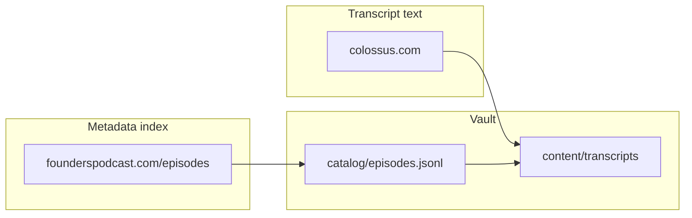
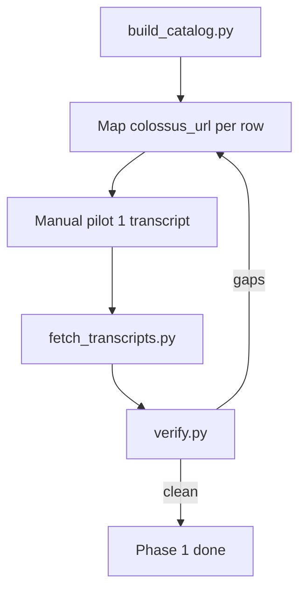

# Founders Knowledge Vault — Phase 1 Plan

## Alignment with project guidelines

This repo already has [`.cursor/guidelines.mdc`](.cursor/guidelines.mdc) (`alwaysApply: true`). The plan below is revised to match it:

| Guideline | How the plan applies it |
|---|---|
| **Think before coding** | Pilot one transcript manually before any scraper; state assumptions; no silent guesses on Colossus URL mapping |
| **Simplicity first** | Fewer files and folders than v1; no `meta.json`, no separate `scrape-log.jsonl`, no premature `.cursor/rules/` |
| **Surgical changes** | Phase 1 touches only `catalog/`, `content/transcripts/`, minimal `ingestion/` — notes/posts stay empty placeholders |
| **Goal-driven execution** | Every step below ends with an explicit **verify** check, not vague “done when it feels right” |

## Starting point

[`founders-notes`](https://github.com/ethan-frost-xyz/founders-notes) has no commits yet; only [`.cursor/guidelines.mdc`](.cursor/guidelines.mdc) and this plan exist locally.

**Your choices (unchanged):** authenticated Colossus scraping (you have an account); **full catalog first** (~400+ episodes).

## Explicit assumptions

- Colossus remains the **only** transcript text source for Phase 1 (not RSS, not third-party mirrors).
- [founderspodcast.com/episodes](https://www.founderspodcast.com/episodes) is the **metadata index** (numbers, dates, titles); Colossus URLs are resolved per row and stored — not derived from a single URL formula.
- Some catalog rows lack `episode_number` (conversations, reposts, specials); they get `ep-special-{slug}` ids and may or may not have Colossus transcripts.
- Newest episodes may show “Coming soon” on Colossus before a transcript exists; those are **documented exceptions**, not scraper failures.
- Personal archive only — rate-limited fetching, credentials never committed.

If any assumption is wrong, we stop and adjust before writing ingestion code.

## What we are building (and what we are not)

| In scope (Phase 1) | Out of scope (later) |
|---|---|
| Every fetchable Founders transcript from Colossus | Post-writing / X drafting assistants |
| `catalog/episodes.jsonl` + auto-generated `catalog/gaps.md` | Vector DB / RAG |
| `content/transcripts/{id}/transcript.md` | Notes import, X post import |
| Minimal ingestion scripts (only what bulk fetch needs) | Public redistribution of transcripts |

**Why plain files in git:** longevity, diffs, Cursor indexing — no database until ripgrep + catalog stop being enough.

## Source-of-truth model



- **founderspodcast.com** → titles, dates, slugs, episode numbers when present.
- **colossus.com** → transcript body (login required).
- **Canonical `id`:** `ep-{number}` when numbered; else `ep-special-{slug}`.

## Repository structure (simplified)

Removed from v1 plan: per-episode `meta.json`, `scrape-log.jsonl`, nested `ingestion/colossus|catalog|verify/`, optional `.cursor/rules/`.

```
founders-notes/
├── README.md                      # What this is + how to query it
├── .cursor/
│   ├── guidelines.mdc             # Already exists — global agent behavior
│   └── plans/                     # This plan
├── docs/
│   └── episode-id-rules.md        # id rules + frontmatter + catalog columns (single schema doc)
├── catalog/
│   ├── episodes.jsonl             # One row per episode; includes fetch status fields
│   └── gaps.md                    # Auto-generated — human-readable gap report
├── content/
│   ├── transcripts/
│   │   └── ep-418-phil-knight-founder-of-nike/
│   │       └── transcript.md      # Frontmatter + body only
│   ├── notes/.gitkeep
│   └── posts/.gitkeep
├── ingestion/
│   ├── fetch_transcripts.py       # Auth + fetch + write (grow only if needed)
│   ├── build_catalog.py           # founderspodcast.com → episodes.jsonl
│   └── verify.py                  # Regenerate gaps.md; print counts
├── .env.example                   # Colossus credentials shape (no secrets)
└── .gitignore                     # .env, __pycache__, etc.
```

**Why one file per episode folder:** matches how you’ll scope LLM queries (`@content/transcripts/ep-142-...`).

**Why status lives in `episodes.jsonl`:** one spine to query; avoid syncing a second log file until proven necessary.

### `transcript.md` contract

```yaml
---
id: ep-418
episode_number: 418
title: "Phil Knight: Founder of Nike"
published_at: 2026-05-07
colossus_url: https://colossus.com/episode/418-phil-knight-founder-of-nike/
founders_url: https://www.founderspodcast.com/episodes/418-phil-knight-founder-of-nike
source: colossus
fetched_at: 2026-05-21T12:00:00Z
---

[Transcript body — no site chrome]
```

### `episodes.jsonl` row contract

```json
{
  "id": "ep-418",
  "episode_number": 418,
  "title": "Phil Knight: Founder of Nike",
  "published_at": "2026-05-07",
  "founders_url": "...",
  "colossus_url": "...",
  "transcript_status": "pending",
  "transcript_path": null,
  "last_error": null,
  "fetched_at": null
}
```

`transcript_status`: `pending` | `complete` | `failed` | `no_transcript` | `coming_soon`

Set `transcript_path` when `complete` (e.g. `content/transcripts/ep-418-.../transcript.md`).

## Phase 1 workflow



## First concrete steps (goal-driven)

Each step: do the minimum, then run **verify** before moving on.

### Step 1 — Scaffold

- Create folder tree, `README.md`, `docs/episode-id-rules.md` (stub), `.gitignore`, `.env.example`, `.gitkeep` for notes/posts.
- First commit to `main`.

**Verify:** `git log` shows one commit; `catalog/`, `content/transcripts/`, `ingestion/` exist; no secrets in tree.

### Step 2 — Schema + manual pilot (before any automation)

- Finalize id rules, frontmatter fields, and jsonl columns in `docs/episode-id-rules.md`.
- Manually save **one** Colossus transcript into `content/transcripts/{id}/transcript.md`.
- Add matching row to `catalog/episodes.jsonl`.

**Verify:** Open pilot folder in Cursor; ask a content question and get a grounded answer. If the shape feels wrong, fix docs before Step 3.

### Step 3 — Full metadata catalog

- `ingestion/build_catalog.py` paginates founderspodcast.com → `catalog/episodes.jsonl`.
- Run `ingestion/verify.py` → first `catalog/gaps.md`.

**Verify:** Row count ≥ 400; every row has `id`, `title`, `founders_url`; unnumbered episodes listed in `gaps.md` with reason.

### Step 4 — Colossus URL mapping

- Resolve `colossus_url` for each **numbered** episode (script-assisted search + manual only for unmatched rows).
- Update jsonl; re-run verify.

**Verify:** Every row with `episode_number` has `colossus_url` **or** a one-line reason in `gaps.md` (not a fuzzy “95%” threshold).

### Step 5 — Bulk transcript ingest

- **Python only** for Phase 1 (single runtime; no “Python or Node” fork).
- `ingestion/fetch_transcripts.py`: read credentials from `.env`, fetch pending rows, write `transcript.md`, update jsonl status.
- Rate limit; idempotent re-runs (skip `complete` unless forced).

**Verify:** `verify.py` prints `N complete / M numbered / K documented exceptions`; random spot-check of 3 files matches Colossus in browser.

### Step 6 — Completeness audit

- Re-run verify; resolve remaining `failed` rows (retry or document).
- README: how to re-fetch one episode and how to read `gaps.md`.

**Verify:** `gaps.md` has zero unexplained blocking gaps; Phase 1 success criteria below all pass.

## How you query it (no extra infra)

- Episode content → `content/transcripts/{id}/`
- Catalog / missing episodes → `catalog/episodes.jsonl` or `catalog/gaps.md`
- Cross-episode search → ripgrep on `content/transcripts/`

## Phase 2 / 3 (placeholders only)

- `content/notes/` and `content/posts/` join on the same `id` — folder names frozen after Phase 1.

## Success criteria for Phase 1

1. `catalog/episodes.jsonl` lists the full Founders catalog with stable `id`s.
2. Every numbered episode with a published Colossus transcript has `transcript_status: complete` and a file on disk.
3. `catalog/gaps.md` lists only documented exceptions (`coming_soon`, `no_transcript`, unmapped specials).
4. You can scope Cursor to one `ep-*` folder and query without extra setup.
5. Ingestion is the minimum scripts in `ingestion/` — no unused abstractions or duplicate metadata files.

## What changed from plan v1

| Removed / deferred | Reason (guidelines) |
|---|---|
| `meta.json` per episode | Duplicates frontmatter — speculative redundancy |
| `scrape-log.jsonl` | Status fields on catalog row are enough for Phase 1 |
| `docs/philosophy.md` | Philosophy lives in README; one less doc to maintain |
| `ingestion/colossus/`, `catalog/`, `verify/` subpackages | Flat scripts until complexity forces a split |
| `.cursor/rules/` duplicate | `guidelines.mdc` already applies globally |
| “Python or Node” | Pick one; reduce decision surface at implementation time |
| “≥95% mapped” | Weak criterion → 100% numbered mapped or explicit exception per row |
