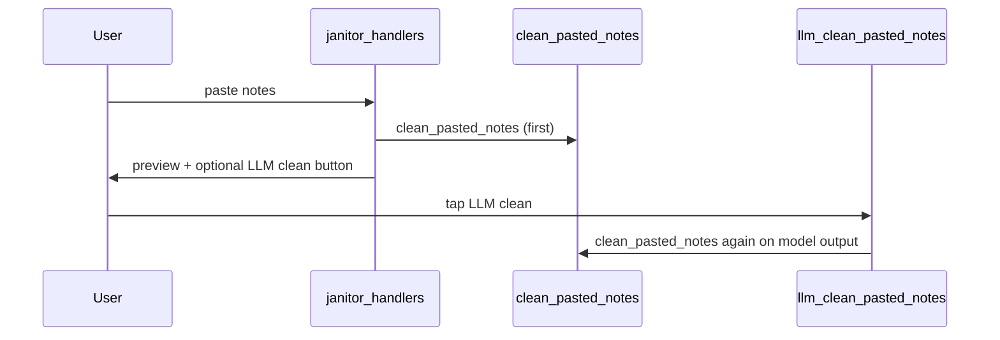
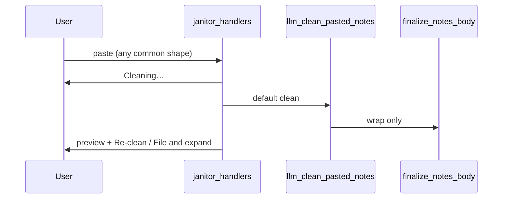

# Janitor LLM-first flexible clean

## Current behavior (problem)



- [`janitor_handlers.py`](services/telegram/bot/janitor_handlers.py) `_build_preview` calls regex [`clean_pasted_notes`](services/telegram/bot/janitor_notes.py) immediately.
- LLM clean is optional, manual, and still re-parses through regex ([`janitor_workflow.py`](services/telegram/bot/janitor_workflow.py)).
- Prompt is rigid and does not describe common `* hook (5:00)` or `191 naval` header lines.

**User choice:** if LLM fails or `JANITOR_CLEAN_MODEL` is unset → **block** (no regex fallback).

---

## Target behavior



---

## 0. Deferred ideas file (do first)

Create **[`potential-ideas.md`](../../potential-ideas.md)** at repo root (not in `docs/` — user-requested). Move all “later” items there so the plan stays focused. Suggested contents:

```markdown
# Potential ideas

Parking lot for follow-ups that are out of scope for the current Janitor LLM-first clean work.

## Janitor / Telegram

- **Streaming clean preview** — stream partial LLM output to Telegram during clean for perceived speed on long pastes.
- **Separate expand/promote models** — tune `OPENROUTER_MODEL` independently of `JANITOR_CLEAN_MODEL` (expand already separate; document tuning playbook).
- **Edit catalog title in frontmatter** — optional LLM pass to fix episode title in notes frontmatter (today title comes from catalog only; clean pass scrubs hook text).

## Vault agent (general)

- (add future ideas here)
```

Link from [`vault_janitor_agent.plan.md`](vault_janitor_agent.plan.md) Deferred section → `potential-ideas.md`.

---

## 1. New prompt file

Add [`services/telegram/prompts/janitor_clean.md`](services/telegram/prompts/janitor_clean.md):

- Flexible input (`*`, `-`, `(5:00)` at end, `[1:23:45]`, first line episode shorthand).
- Output: `## Raw datapoints` + `- H:MM:SS — hook` bullets only.
- Light spelling/grammar on hooks; use catalog title when provided for name spelling.
- Ignore first-line episode labels like `191 naval`.

User message template includes `Episode: ep-NNNN — {title}` when known.

---

## 2. Rewrite `llm_clean_pasted_notes`

[`janitor_workflow.py`](services/telegram/bot/janitor_workflow.py): load prompt file; `finalize_notes_body` only (no `clean_pasted_notes`); optional `JANITOR_CLEAN_TEMPERATURE` (default 0.2).

---

## 3. Handler / UX

[`janitor_handlers.py`](services/telegram/bot/janitor_handlers.py): auto LLM on paste; **Re-clean** button; require `JANITOR_CLEAN_MODEL`; update help for one-shot `191 naval` + bullets paste.

---

## 4. Regex module scope

Keep `parse_episode_id`, `merge_notes_body`, `finalize_notes_body`. Remove `clean_pasted_notes` from hot path (no fallback). Update [`tests/test_janitor_notes.py`](tests/test_janitor_notes.py).

---

## 5. Fast models (env)

[`deploy/env.example`](services/telegram/deploy/env.example): e.g. `JANITOR_CLEAN_MODEL=groq/llama-3.1-8b-instant` with Cerebras alternatives in comments.

---

## 6. Plan doc

Update [`vault_janitor_agent.plan.md`](vault_janitor_agent.plan.md) for LLM-first flow; point Deferred to [`potential-ideas.md`](../../potential-ideas.md).

---

## Verification

1. `pytest tests/test_janitor_notes.py tests/test_janitor_workflow.py -q`
2. Mocked test with Naval paste sample
3. `deploy/restart-bot.sh` — Telegram `/janitor` auto-clean smoke

---

## Not in this plan

See **[`potential-ideas.md`](../../potential-ideas.md)** at repo root.
