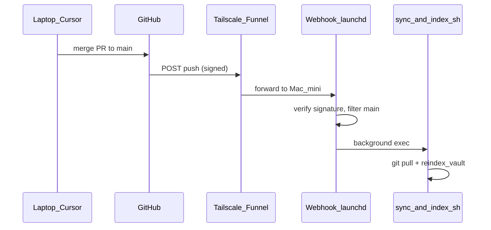

# Laptop remote hardening

**Goal:** Develop on laptop (Cursor, `pytest`, mock harness) and merge to `main`; Mac mini vault updates automatically without SSH or remembering `/sync`.

**Out of scope:** Daily notes on laptop (stay on Telegram/Janitor), Librarian quality tuning, SP3.1 `/web`, parallel expand workers.

---

## Architecture



| Layer | Already on `main` | Gap |
|-------|-------------------|-----|
| Laptop CI parity | `pytest tests -q`, harness echo in CI | One-time venv + optional `.env` |
| Model tuning without SSH | PR #12 `runtime.json`, `/setmodel`, `/sync` | Mac mini host may not be cut over yet |
| Auto sync after push | — | SP5 webhook + **sync-script runtime env fix** |
| Safe concurrent ops | In-process lock on bot `/sync` | Webhook/cron use shell script — add **minimal lock file** in script |

---

## Tier 0 — Operator (no feature code)

### Mac mini cutover (PR #12)

Do on the Mac mini before relying on cron/webhook for embeddings.

1. `cd "$VAULT_ROOT" && git pull --ff-only origin main` (confirm log includes runtime-config / PR #12).
2. `services/telegram/deploy/restart-bot.sh` (or `launchctl kickstart -k gui/$(id -u)/com.founders.telegram.bot`).
3. Telegram `/settings` — models sourced from `runtime.json` (one-time seed from legacy env on first start if keys missing).
4. Remove model slugs from `~/.config/founders-telegram/env` (secrets only per [`services/telegram/deploy/env.example`](../../services/telegram/deploy/env.example)).
5. Smoke when idle: `/sync` succeeds; overlapping `/sync` → “Another op is already running”.
6. `services/telegram/deploy/install-cron.sh --print` — cron line still present.

**Done when:** `/settings` shows runtime sources; `/sync` completes pull + reindex.

### Laptop bootstrap (dev-only)

```bash
git clone <repo-url> founders-notes && cd founders-notes
python3 -m venv ingestion/.venv
ingestion/.venv/bin/pip install -r ingestion/requirements.txt -r ingestion/requirements-dev.txt
# Optional for live harness only:
cp .env.example .env   # OPENROUTER_API_KEY
pytest tests -q
python dev/mock_telegram_cli.py --stub-llm --run-scenarios
```

- **No local index required** for default dev (echo harness + unit tests).
- **Live harness** (`--suite librarian --live-only`): needs `OPENROUTER_API_KEY`, local `catalog/chunks.jsonl` + `catalog/embeddings.npy`, and optionally Mac mini `runtime.json` copied to `~/.config/founders-telegram/` ([`dev/harness/env.py`](../../dev/harness/env.py)).

**Daily loop (after Tier 1):**

1. Laptop: feature branch → edit → `pytest tests -q` → PR → merge to `main`.
2. GitHub webhook → Mac mini `sync-and-index.sh` (within a few minutes).
3. Optional: Librarian smoke on phone for **content** changes only.

---

## Tier 0.5 — Sync script + runtime.json (ship before or with SP5)

**Problem (blocker for cutover + webhook):** [`sync-and-index.sh`](../../services/telegram/deploy/sync-and-index.sh) sources env only and calls `reindex_vault.py` with plain `os.environ`. After slimming env, `OPENROUTER_EMBED_MODEL` may be **only** in `runtime.json`. Telegram `/sync` works because [`ops_runner.run_reindex_op`](../../services/telegram/bot/ops_runner.py) uses [`build_subprocess_env()`](../../services/telegram/bot/runtime_settings.py).

**Fix (minimal):** Before `reindex_vault.py`, export embed (and expand if needed) from `runtime.json` into the shell environment — e.g. small helper invoked from the script:

```bash
# Pseudocode — implement in repo
eval "$( "${PYTHON}" -c '... read runtime.json, print export OPENROUTER_EMBED_MODEL=...' )"
```

Or call a tiny `ingestion/lib/export_runtime_env.py` used by both cron and webhook.

**Tests:** Extend [`tests/test_telegram_deploy.py`](../../tests/test_telegram_deploy.py) or add `tests/test_sync_script_runtime.py` — with `FOUNDERS_TELEGRAM_RUNTIME` pointing at a fixture `runtime.json`, assert reindex subprocess env includes embed slug (mock `subprocess`).

**Done when:** After removing `OPENROUTER_EMBED_MODEL` from Mac mini env, manual `sync-and-index.sh` still completes embeddings step.

---

## Tier 1 — SP5 GitHub webhook

Create focused plan [`telegram_ops_sync.plan.md`](telegram_ops_sync.plan.md) in the **same PR** (do not extend [`telegram_rag_bot_v0.plan.md`](telegram_rag_bot_v0.plan.md)).

### GitHub reachability (required)

GitHub’s servers **cannot** POST to a private Tailscale IP. Use **Tailscale Funnel** (HTTPS public URL → Mac mini listener) with:

- Webhook secret (`GITHUB_WEBHOOK_SECRET` in `~/.config/founders-telegram/env`)
- `X-Hub-Signature-256` validation on every request
- Listener bound to localhost; Funnel exposes only the webhook path

Document in README: Funnel enable command, webhook URL shape, rotation of secret. Operator confirmed Tailscale Funnel is available on the Mac mini. **Fallback until Funnel is configured:** manual Telegram `/sync` after merge (unchanged).

### Webhook behavior (v1)

| Rule | Detail |
|------|--------|
| Events | `push` only; respond 200 to `ping` during GitHub setup |
| Branch | `refs/heads/main` only (ignore tags, feature branches) |
| Response | Return **202/200 immediately**; run sync in **background** (`subprocess` / `nohup`) — GitHub times out ~10s |
| Action | Execute [`sync-and-index.sh`](../../services/telegram/deploy/sync-and-index.sh) (after Tier 0.5 fix) |
| Concurrency | At start of `sync-and-index.sh`, acquire `catalog/.sync-in-progress` (mkdir or flock); if held, log “skipped” and exit 0. Remove on exit. **Not** the deferred “full sync lock product” — minimal guard for webhook + cron + overlapping runs |
| Process | Separate `launchd` job (`com.founders.telegram.webhook`) — not embedded in polling bot |
| Logging | Append to `~/Library/Logs/founders-telegram/webhook.log` and existing `sync.log` |

### Files to add

```
services/telegram/deploy/github_webhook_server.py
services/telegram/deploy/com.founders.telegram.webhook.plist
services/telegram/deploy/install-webhook.sh      # mirror install-cron.sh --print pattern
tests/test_github_webhook.py                   # HMAC, ping, non-main push ignored
```

Update [`tests/test_telegram_deploy.py`](../../tests/test_telegram_deploy.py): `github_webhook_server.py` exists; `install-webhook.sh --print` documents plist label.

### Mac mini install (operator, after merge)

1. Set `GITHUB_WEBHOOK_SECRET` in founders-telegram env.
2. Enable Tailscale Funnel → note HTTPS URL.
3. GitHub repo → Settings → Webhooks → `https://<funnel-host>/github` (or chosen path), secret, “Just the push event”.
4. `install-webhook.sh` → `launchctl bootstrap` webhook plist.
5. Test: empty commit to `main` or merge PR → check `webhook.log` + `sync.log` + `git log -1` on Mac mini.

### Docs (same PR)

- [`docs/laptop-development.md`](../../docs/laptop-development.md) — clone, test, branch workflow, what not to do on laptop
- [`docs/manual-operations.md`](../../docs/manual-operations.md) — push → webhook; fallback `/sync`
- [`services/telegram/README.md`](../../services/telegram/README.md) — webhook + Funnel section
- [`docs/telegram-vault-agent.md`](../../docs/telegram-vault-agent.md) — add `/sync`, `/pull`, `/reindex`, `/settings` to ops table; replace “webhook deferred” when shipped
- [`potential-ideas.md`](../../potential-ideas.md) — SP5 → Shipped; note runtime ops + sync-script fix
- Link from [`README.md`](../../README.md) and [`AGENTS.md`](../../AGENTS.md)

### Out of scope (SP5 v1)

- Path-filtered reindex (code-only pushes still full reindex)
- `/resume` auto-sync
- Replacing nightly cron
- Handler integration tests for `/sync` (optional follow-up)

---

## Tier 2 — Hygiene

- Archive [`.cursor/plans/telegram_runtime_config_260f441f.plan.md`](telegram_runtime_config_260f441f.plan.md) → `archive/` after cutover verified.
- Update master plan todo `sp5-webhook-deferred` → completed when SP5 ships.

---

## Implementation order (Agent mode)

1. Branch `feature/laptop-remote-hardening` (or `feature/sp5-webhook`) off `main`.
2. **Tier 0.5** — sync-script runtime env + test (small PR or first commit).
3. **SP5** — `telegram_ops_sync.plan.md` + webhook + lock in script + deploy tests + docs.
4. Operator steps (Tier 0 + Mac mini install) — user-run; document in PR description.
5. Commit **this plan** + `telegram_ops_sync.plan.md` with code per AGENTS.md.

---

## Success criteria

| # | Check |
|---|--------|
| 1 | Laptop fresh clone: `pytest tests -q` green without local `embeddings.npy` |
| 2 | Mac mini with slim env: `./services/telegram/deploy/sync-and-index.sh` completes embeddings |
| 3 | Merge to `main` triggers webhook; Mac mini `HEAD` matches GitHub within ~10 min |
| 4 | `docs/laptop-development.md` linked from README/AGENTS; no stale “webhook deferred” |
| 5 | Concurrent webhook delivery while sync running → second run skips cleanly (lock file) |

---

## Deferred

- Librarian quality (D1, rerank, MRR@8), Janitor UX, `expand --jobs N`, SP3.1 `/web`
- Path-based “pull only” on code-only pushes
- Opt-in `RUN_LIVE_HARNESS` CI job on GitHub Actions
