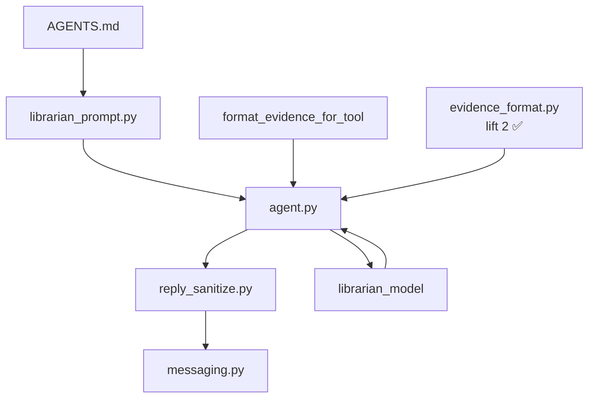

# Librarian output quality — living review

**Purpose:** Source context for multiple implementation plans. When a child plan ships, note it under [Derived plans](#derived-plans) and tick items here. Do not duplicate full runbooks — link to [`docs/telegram-vault-agent.md`](../../docs/telegram-vault-agent.md).

**Last reviewed:** 2026-06-10

**Active child plan:** None — lift 2 **shipped** 2026-06-10 (CI ✅; live re-baseline pending Mac mini). Next: lift 3 (`structured_embed_text`, temperature) or Mac mini re-baseline.

---

## Executive summary

Librarian quality is steered by **[`AGENTS.md`](../../AGENTS.md)** (synthesis persona), **how tool results are formatted** before the model sees them, and a thin **output sanitizer** on the way out.

**Lift B (shipped, CI verified):** Cursor ops stripped from Telegram prompt; DSML/reasoning sanitization; `search_vault_many` light expansion; aligned excerpt caps.

**Lift 2 (shipped, CI verified):** Harness `tool_called_any` + `response_contains_episode_citation`; `not_contains_all` leak guards; AGENTS.md playbook; cap nudge with trace summary; `evidence_format.py` / `format_load_episode_for_tool()`.

**Remaining gaps (lift 3+):**

1. **`structured_embed_text` in vault evidence blocks** (lift 2F deferred)
2. **Live re-baseline** — confirm #4, #7, #11 on Mac mini after lift 2
3. **`librarian_temperature`**, stream-preview sanitization, multi-turn evidence history

**Refactor priority (updated):** (1) live re-baseline → (2) `structured_embed_text` in formatter → (3) temperature + stream sanitization.

---

## Where formatting is controlled today

| Layer | Location | What it controls |
|-------|----------|------------------|
| Synthesis persona | [`AGENTS.md`](../../AGENTS.md) | Voice, citations `[ep-NNNN]`, evidence honesty, tool heuristics |
| Prompt load | [`librarian_prompt.py`](../../services/telegram/bot/librarian_prompt.py) | Strips `## Cursor Cloud` from `AGENTS.md` + appends `index_metadata` JSON |
| Reply sanitize | [`reply_sanitize.py`](../../services/telegram/bot/reply_sanitize.py) | `sanitize_librarian_reply()` in `agent._finish()` |
| Legacy pointer | [`vault_agent.md`](../../services/telegram/prompts/vault_agent.md) | Redirect only |
| Vault evidence | [`retrieval_orchestrator.py`](../../ingestion/lib/retrieval_orchestrator.py) `format_evidence_for_tool()` | Markdown blocks for `search_vault` / `search_vault_many` |
| Transcript evidence | [`retrieval.py`](../../services/telegram/bot/retrieval.py) | Inline `#### Hit N` formatting |
| Episode load | [`vault.py`](../../services/telegram/bot/tools/vault.py) `load_episode()` | On-disk sections; formatted by `evidence_format.py` |
| Tool → model | [`agent.py`](../../services/telegram/bot/agent.py) `_tool_result_content()` | Prefers `evidence` string; `format_load_episode_for_tool()` for loads |
| Runtime nudges | `agent.py` | `SEARCH_BUDGET_NUDGE` + trace summary on cap; `EMPTY_SYNTHESIS` |
| Telegram delivery | [`messaging.py`](../../services/telegram/bot/messaging.py) | Chunk at 4096; limited markdown → HTML |
| Retrieval sub-prompts | [`query_expand.md`](../../ingestion/prompts/query_expand.md), [`rerank_evidence.md`](../../ingestion/prompts/rerank_evidence.md) | Evidence *selection*, not reply layout |



---

## Baseline evidence (Jun 9 live suite)

From [`RERUN-LIVE-SUITE.md`](../../dev/scenarios/librarian/RERUN-LIVE-SUITE.md) — **pre-lift B**:

| Signal | Result |
|--------|--------|
| Harness pass | 9/11 |
| Substantive pass | 10/11 |
| Known failures | #4 `multi_hop` (zero tools); #7 `thematic_cross_episode` (tool asserts); #11 `verbatim_transcript` (cap + DSML leak) |
| Config | `retrieval_model: deepseek/deepseek-v4-flash`, `librarian_model: deepseek/deepseek-v4-pro` |

**Post-lift B live re-baseline:** pending Mac mini (SSH / terminal). Lift B expected to fix #11 DSML; #3/#7 wall times may rise slightly from `EXPAND_VARIANTS_LIGHT`.

Re-run: `ingestion/.venv/bin/python dev/mock_telegram_cli.py --scenario dev/scenarios/librarian/<FILE>.yaml -v`

---

## Lift 2 — shipped (detail)

Archived spec: [`archive/legacy/librarian_lift_2.plan.md`](archive/legacy/librarian_lift_2.plan.md).

### Scope summary

| Slice | Work | Laptop? | Addresses |
|-------|------|---------|-----------|
| **A** | Harness: `tool_called_any`, `response_contains_episode_citation` | ✅ shipped | Red flag #8, easy win #7 |
| **B** | Harness: `not_contains_all` leak list | ✅ shipped | Testing gap 2 |
| **C** | `AGENTS.md` search-stop / verbatim / comparison playbook | ✅ shipped | Red flag #6, easy win #6 |
| **D** | Enrich `SEARCH_BUDGET_NUDGE` with evidence summary | ✅ shipped | Red flag #7 |
| **E** | `evidence_format.py` + `format_load_episode_for_tool()` | ✅ shipped | Red flag #3, easy win #3 |
| **F** | `structured_embed_text` in vault formatter | deferred lift 3 | Medium #9, easy win #8 |

### Recommended order (laptop)

1. Living doc before → **A + B** (harness) → **C + D** (prompt + nudge) → **E** (evidence) → optional **F** → CI → living doc after
2. Mac mini when available: live suite + update baseline in this doc

### Out of scope for lift 2

`librarian_temperature`, stream-preview sanitization, multi-turn evidence history, mandatory pre-retrieval, JSON-schema replies, split expand/rerank models.

### Grill-me decisions (resolved 2026-06-10)

- Harness-first (A+B → C+D → E)
- Citation assert on baseline-failure trio only (`multi_hop`, `multi_founder_comparison`, `thematic_cross_episode`)
- Cap nudge: trace-only episode ids + chunk count
- Slice F deferred to lift 3
- Leak guards: `verbatim_transcript` only via `not_contains_all`
- Harness key: `response_contains_episode_citation: true`

---

## Red flags

### 1. Cursor ops text ships to every Telegram turn — ✅ lift B

**Shipped:** [`librarian_prompt.py`](../../services/telegram/bot/librarian_prompt.py) strips at `## Cursor Cloud`.

---

### 2. No reasoning / DSML leak protection — ✅ lift B

**Shipped:** [`reply_sanitize.py`](../../services/telegram/bot/reply_sanitize.py); harness `not_contains_all` on verbatim (lift 2B); `tests/test_reply_sanitize.py`. Stream preview may still flash markup mid-generation (P3 #12).

---

### 3. `load_episode` is a different species from search evidence — ✅ lift 2

**Shipped:** [`evidence_format.py`](../../services/telegram/bot/evidence_format.py) `format_load_episode_for_tool()` — frontmatter stripped, search-aligned markdown, `meta.listened` prominent; wired in `_tool_result_content()`.

---

### 4. `search_vault_many` degraded pipeline — ✅ lift B

**Shipped:** `EXPAND_VARIANTS_LIGHT = 2`; variants sliced after expand.

---

### 5. Rerank vs evidence excerpt mismatch — ✅ lift B

**Shipped:** `EXCERPT_MAX_CHARS = 600` shared.

---

### 6. Zero-tool answers on thematic questions — ✅ lift 2 (soft)

**Shipped:** `AGENTS.md` playbook (answer shape, verbatim, comparison, stop-searching); harness `response_contains_episode_citation` on baseline-failure trio. No mandatory pre-retrieval. Live validation pending Mac mini.

---

### 7. Tool-round cap causes quality cliffs — ✅ lift 2

**Shipped:** Verbatim playbook in `AGENTS.md`; `_search_budget_nudge()` appends trace episode ids + chunk count on cap. Live validation pending Mac mini (#11).

---

### 8. Harness asserts specific tools — ✅ lift 2

**Shipped:** `tool_called_any` + `response_contains_episode_citation` on `multi_hop`, `multi_founder_comparison`, `thematic_cross_episode`; `not_contains_all` on `verbatim_transcript` and `episode_resolve` turn 1.

---

## Medium issues

| # | Issue | Fix | Lift | Priority |
|---|-------|-----|------|----------|
| 9 | `structured_embed_text` unused in evidence blocks | Use in `format_evidence_for_tool` | 3 (was 2F) | P2 |
| 10 | Transcript vs vault format mismatch | Minor unification | 3+ | P3 |
| 11 | `librarian_temperature` unconfigured | `runtime.json` key | 3+ | P2 |
| 12 | Streaming shows raw markdown during generation | Sanitize stream or document preview-only | 3+ | P3 |
| 13 | `_meta: {...}` echoed by model | Clearer delimiter | 3+ | P3 |
| 14 | Multi-turn history loses evidence | Optional evidence summary | defer | P3 |
| 15 | `AGENTIC-VISION-BRIEF.md` stale sections | Doc cleanup | 3+ | P3 |

---

## What's working well (do not break)

- Cold-start agentic loop
- Per-datapoint expanded chunks in evidence
- Summary tier filtered from citable evidence
- Thin-evidence honesty + `thin_evidence_probe.yaml`
- `tool_trace` / harness reports
- Split `librarian_model` vs `retrieval_model`
- Lift B: `librarian_prompt.py`, `reply_sanitize.py`, `EXPAND_VARIANTS_LIGHT`

---

## Easy wins (ranked)

| # | Change | Effort | Impact | Lift | Status |
|---|--------|--------|--------|------|--------|
| 1 | Strip Cursor section from Telegram prompt | Small | High | B | ✅ |
| 2 | `sanitize_librarian_reply()` | Small | High | B | ✅ |
| 3 | `format_load_episode_for_tool()` | Medium | High | 2E | ✅ |
| 4 | `search_vault_many` expand variants | Small | High | B | ✅ |
| 5 | Align rerank vs evidence excerpt | Trivial | Medium | B | ✅ |
| 6 | Prompt search-stop + verbatim playbook | Small | Medium | 2C | ✅ |
| 7 | Harness `tool_called_any` + citation regex | Small | Medium | 2A | ✅ |
| 8 | `structured_embed_text` in formatter | Small | Medium | 3 | ⬜ |
| 9 | `librarian_temperature` runtime key | Small | Medium | 3+ | ⬜ |
| 10 | Harness leak `not_contains_all` | Trivial | Medium | 2B | ✅ |

---

## Suggested module layout

```
services/telegram/bot/
  librarian_prompt.py      # ✅ lift B
  reply_sanitize.py          # ✅ lift B
  evidence_format.py         # ✅ lift 2E — format_load_episode; future transcript unify
```

Keep [`AGENTS.md`](../../AGENTS.md) as human-edited persona; code handles environment-specific assembly.

### Prompt additions — ✅ lift 2C

- Answer shape, verbatim one-shot, comparison sub-queries, qualitative stop-searching — in [`AGENTS.md`](../../AGENTS.md) Composition heuristics.

---

## What not to refactor yet

- **Mandatory pre-retrieval** — vision brief rejected
- **Structured output / JSON schema for replies**
- **Full Telegram markdown renderer**
- **Split expand vs rerank models** — [`potential-ideas.md`](../../potential-ideas.md)

---

## Testing gaps to close

| # | Gap | Lift 2 slice | Status |
|---|-----|--------------|--------|
| 1 | Citation `\[ep-\d{4}\]` on thematic live turns | A | ✅ |
| 2 | Leak absence (DSML, reasoning tags) | B | ✅ |
| 3 | Tool-optional assertions (`tool_called_any`) | A | ✅ |
| 4 | Trace-aware thin evidence (optional) | defer | ⬜ |

**Harness limitation today:** one `not_contains` per turn in YAML; lift 2B adds `not_contains_all`.

---

## Derived plans

| Plan | File | Scope | Status |
|------|------|-------|--------|
| Lift B | [librarian_lift_b.plan.md](librarian_lift_b.plan.md) | Prompt strip, sanitize, `EXPAND_VARIANTS_LIGHT`, excerpt cap | **shipped** 2026-06-10 (CI ✅; live re-baseline pending mini) |
| Lift 2 | [archive/legacy/librarian_lift_2.plan.md](archive/legacy/librarian_lift_2.plan.md) | Harness asserts, playbook, `load_episode` format | **shipped** 2026-06-10 (CI ✅; live re-baseline pending mini) |

### Child plan history

| Slice | Lift B | Lift 2 |
|-------|--------|--------|
| Prompt hygiene (strip) | ✅ | — |
| Prompt hygiene (playbook) | — | ✅ 2C |
| Output sanitization | ✅ | — |
| `search_vault_many` quality | ✅ | — |
| Harness quality | partial (verbatim DSML) | ✅ 2A, 2B |
| Evidence formatting | — | ✅ 2E (2F → lift 3) |

---

## Verification

### Laptop (every child plan — required)

```bash
ingestion/.venv/bin/pytest tests/test_vault_agent.py tests/test_retrieval_orchestrator.py \
  tests/test_telegram_bot.py tests/test_harness_scenarios.py -q
cd ingestion && ../ingestion/.venv/bin/python pipeline/verify.py
```

Lift 2 adds: harness expect tests, `test_evidence_format` or vault agent formatter tests.

### Mac mini (when available — quality gate)

```bash
ingestion/.venv/bin/python dev/mock_telegram_cli.py --preflight
ingestion/.venv/bin/python dev/mock_telegram_cli.py --suite librarian --live-only -v
```

Compare to [`RERUN-LIVE-SUITE.md`](../../dev/scenarios/librarian/RERUN-LIVE-SUITE.md). Reports in `dev/logs/runs/` (gitignored — `scp` from mini). SSH requires Remote Login ([`potential-ideas.md`](../../potential-ideas.md)).

### After merge to `main`

Webhook pulls code to mini; **`/restart`** loads new bot Python. Harness does **not** auto-run — manual on mini or via SSH.
