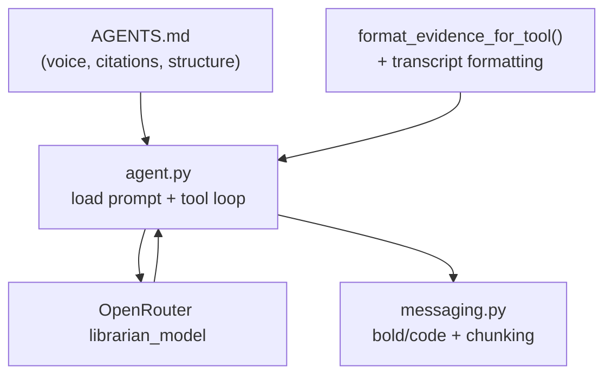

# Librarian output quality — living review

**Purpose:** Source context for multiple implementation plans. When a child plan ships, note it under [Derived plans](#derived-plans) and tick items here. Do not duplicate full runbooks — link to [`docs/telegram-vault-agent.md`](../../docs/telegram-vault-agent.md).

**Last reviewed:** 2026-06-10

**Active child plan:** lift B (hygiene + retrieval micro-fixes) — see [Derived plans](#derived-plans).

---

## Executive summary

Librarian quality is steered mainly by **[`AGENTS.md`](../../AGENTS.md)** (synthesis persona) and by **how tool results are formatted** before the model sees them. There is almost no **output guardrails** on the way out.

The biggest gaps are not missing retrieval power — they are:

1. **Prompt pollution** (Cursor ops text in Telegram system prompt)
2. **Inconsistent tool payloads** (`load_episode` vs search evidence)
3. **No leak sanitization** (DSML / reasoning markup in user-visible replies)
4. **Harness / prompt tension** (scenarios mandate specific tools; prompt says soft heuristics)
5. **`search_vault_many` runs a degraded pipeline** (no query expansion)

**Refactor priority:** (1) split/sanitize prompts → (2) unify evidence formatting → (3) thin output filter → (4) relax or reframe harness tool assertions.

---

## Where formatting is controlled today

| Layer | Location | What it controls |
|-------|----------|------------------|
| Synthesis persona | [`AGENTS.md`](../../AGENTS.md) | Voice, citations `[ep-NNNN]`, evidence honesty, tool heuristics |
| Prompt load | [`services/telegram/bot/librarian_prompt.py`](../../services/telegram/bot/librarian_prompt.py) | Strips `## Cursor Cloud` from `AGENTS.md` + appends `index_metadata` JSON |
| Reply sanitize | [`services/telegram/bot/reply_sanitize.py`](../../services/telegram/bot/reply_sanitize.py) | `sanitize_librarian_reply()` in `agent._finish()` before harness/session/Telegram |
| Legacy pointer | [`services/telegram/prompts/vault_agent.md`](../../services/telegram/prompts/vault_agent.md) | Redirect only |
| Vault evidence | [`ingestion/lib/retrieval_orchestrator.py`](../../ingestion/lib/retrieval_orchestrator.py) `format_evidence_for_tool()` | Markdown blocks for `search_vault` / `search_vault_many` |
| Transcript evidence | [`services/telegram/bot/retrieval.py`](../../services/telegram/bot/retrieval.py) `search_transcript_for_turn()` | Inline `#### Hit N` formatting |
| Episode load | [`services/telegram/bot/tools/vault.py`](../../services/telegram/bot/tools/vault.py) `load_episode()` | Raw JSON (`sections` + `meta`) — no formatter |
| Tool → model | [`agent.py`](../../services/telegram/bot/agent.py) `_tool_result_content()` | Prefers `evidence` string; else `json.dumps` |
| Runtime nudges | `agent.py` | `SEARCH_BUDGET_NUDGE`, `EMPTY_SYNTHESIS` |
| Telegram delivery | [`services/telegram/bot/messaging.py`](../../services/telegram/bot/messaging.py) | Chunk at 4096; `**bold**` + `` `code` `` → HTML only |
| Retrieval sub-prompts | [`ingestion/prompts/query_expand.md`](../../ingestion/prompts/query_expand.md), [`rerank_evidence.md`](../../ingestion/prompts/rerank_evidence.md) | Evidence *selection*, not reply layout |



---

## Baseline evidence (Jun 9 live suite)

From [`dev/scenarios/librarian/RERUN-LIVE-SUITE.md`](../../dev/scenarios/librarian/RERUN-LIVE-SUITE.md):

| Signal | Result |
|--------|--------|
| Harness pass | 9/11 |
| Substantive pass | 10/11 |
| Known failures | #4 `multi_hop` (zero tools); #7 `thematic_cross_episode` (tool asserts); #11 `verbatim_transcript` (cap + DSML leak) |
| Config | `retrieval_model: deepseek/deepseek-v4-flash`, `librarian_model: deepseek/deepseek-v4-pro` |

Re-run before/after each child plan: `ingestion/.venv/bin/python dev/mock_telegram_cli.py --scenario dev/scenarios/librarian/<FILE>.yaml -v`

---

## Red flags

### 1. Cursor ops text ships to every Telegram turn

[`AGENTS.md`](../../AGENTS.md) lines 58–75 ("Cursor Cloud specific instructions" — pytest, venv, mock harness) are appended to the Librarian system message for Telegram. Wastes context and dilutes persona.

**Shipped (lift B):** [`librarian_prompt.py`](../../services/telegram/bot/librarian_prompt.py) strips at `## Cursor Cloud`.

**Priority:** P0 · **Effort:** small · **Impact:** high

---

### 2. No reasoning / DSML leak protection

Baseline #11 (`verbatim_transcript`) — DSML / thinking markup in user-visible text. `agent.py` only `.strip()`; `handlers.py` streams and sends raw model output.

**Shipped (lift B):** [`reply_sanitize.py`](../../services/telegram/bot/reply_sanitize.py) in `agent._finish()`; verbatim scenario `not_contains: DSML`; `tests/test_reply_sanitize.py`.

**Priority:** P0 · **Effort:** small · **Impact:** high

---

### 3. `load_episode` is a different species from search evidence

Search tools return labeled markdown with citation hints. `load_episode` returns **raw JSON** with full file text (YAML frontmatter, raw notes) via `json.dumps` in `_tool_result_content()`.

**Fix:** `format_load_episode_for_tool()` — strip frontmatter, match search evidence shape, cap size, surface `meta.listened` prominently.

**Priority:** P0 · **Effort:** medium · **Impact:** high

---

### 4. `search_vault_many` runs a weaker pipeline than `search_vault`

In [`retrieval.py`](../../services/telegram/bot/retrieval.py):

- `search_vault`: `EXPAND_VARIANTS_FULL` (5), keep 8
- `search_vault_many`: `EXPAND_VARIANTS_NONE` (0), keep 5 per sub-query

Multi-founder comparison is exactly where per-angle retrieval should be *stronger*, not cheaper.

**Shipped (lift B):** `EXPAND_VARIANTS_LIGHT = 2` in orchestrator; `search_vault_many` uses it; variants sliced to `expand_variants` after expand.

**Priority:** P0 · **Effort:** small · **Impact:** high

---

### 5. Rerank sees 600 chars; synthesis sees up to 1200

`chunk_for_rerank` caps at 600; `evidence_chunk_from_dict` allows 1200. Reranker may score on partial text the model never sees (or vice versa).

**Shipped (lift B):** `EXCERPT_MAX_CHARS = 600` shared by `chunk_for_rerank` and `evidence_chunk_from_dict`.

**Priority:** P1 · **Effort:** trivial · **Impact:** medium

---

### 6. Zero-tool answers on thematic questions

Baseline #4 (`multi_hop`) sometimes returned **0 tools**. `AGENTS.md` says "retrieve before you cite" but code does not enforce it. Session history is user/assistant text only — **no prior evidence**.

**Options:**

- **Soft (preferred):** Stronger prompt + harness citation regex `\[ep-\d{4}\]` for thematic live scenarios
- **Hard (avoid):** Auto-run `search_vault` on thematic first turn — reintroduces rigid pre-scripted pipeline ([`AGENTIC-VISION-BRIEF.md`](../../AGENTIC-VISION-BRIEF.md) rejected this)

**Priority:** P1 · **Effort:** small–medium · **Impact:** medium

---

### 7. Tool-round cap causes quality cliffs

`MAX_TOOL_ROUNDS = 6` then `SEARCH_BUDGET_NUDGE` + `tool_choice="none"`. Verbatim scenario hit **cap** with 7 tool calls.

**Fix:** Prompt search-stop heuristics ("verbatim: one `search_transcript`, then answer"); enrich cap message with evidence summary (episode ids, chunk count).

**Priority:** P1 · **Effort:** small · **Impact:** medium

---

### 8. Harness asserts specific tools; prompt says soft heuristics

| Scenario | Asserts | Prompt |
|----------|---------|--------|
| `multi_hop.yaml` | `tools_called: [search_vault_many]` | "prefer `search_vault_many`" |
| `multi_founder_comparison.yaml` | `tool_called: search_vault_many` | soft |
| `thematic_cross_episode.yaml` | `tool_called_any` | either tool OK |

Baseline #7 failed tool asserts while answers may have been fine — measuring **tool choice**, not **answer quality**.

**Fix:** Prefer `tool_called_any` + `response_contains: [ep-` + citation-count checks over mandating `search_vault_many`.

**Priority:** P1 · **Effort:** small · **Impact:** medium (less flake)

---

## Medium issues

| # | Issue | Fix | Priority |
|---|-------|-----|----------|
| 9 | `structured_embed_text` exists in [`search_retrieval.py`](../../ingestion/lib/search_retrieval.py) but evidence blocks use raw `excerpt` | Use structured text for `expanded:` chunks in `format_evidence_for_tool` | P2 |
| 10 | Transcript vs vault evidence format mismatch (scores, titles) | Minor unification in formatters | P3 |
| 11 | Librarian temperature unconfigured (Janitor has `janitor_clean_temperature`) | `librarian_temperature` in `runtime.json` | P2 |
| 12 | Streaming shows raw markdown; final reply only converts `**` / `` ` `` | Run converter on stream edits or document preview-only | P3 |
| 13 | `_meta: {...}` appended to evidence strings — models occasionally echo | Clearer "do not cite" delimiter or separate field | P3 |
| 14 | Multi-turn history loses retrieval context | Optional last-turn evidence summary (token cost) | P3 defer |
| 15 | [`AGENTIC-VISION-BRIEF.md`](../../AGENTIC-VISION-BRIEF.md) still describes pre-agentic architecture in places | Doc cleanup | P3 |

---

## What's working well (do not break)

- Cold-start agentic loop — right architecture for multi-hop
- Per-datapoint expanded chunks — natural Quote / Key takeaway in evidence
- Summary tier filtered from citable evidence in orchestrator
- Thin-evidence honesty rules + `thin_evidence_probe.yaml`
- `tool_trace` / harness reports — right instrumentation
- Split `librarian_model` vs `retrieval_model`

---

## Easy wins (ranked)

| # | Change | Effort | Impact | Lift | Status |
|---|--------|--------|--------|------|--------|
| 1 | Strip/split Cursor section from Telegram system prompt | Small | High | B | ✅ |
| 2 | `sanitize_librarian_reply()` for DSML/reasoning leaks | Small | High | B | ✅ |
| 3 | `format_load_episode_for_tool()` | Medium | High | 2 | ⬜ |
| 4 | `search_vault_many`: 1–2 expand variants, not 0 | Small | High | B | ✅ |
| 5 | Align rerank vs evidence excerpt length | Trivial | Medium | B | ✅ |
| 6 | Prompt: search-stop heuristics + verbatim playbook | Small | Medium | 2 | ⬜ |
| 7 | Harness: `tool_called_any` + citation regex | Small | Medium | 2 | ⬜ |
| 8 | `structured_embed_text` in evidence formatter | Small | Medium | 2 | ⬜ |
| 9 | `librarian_temperature` runtime key | Small | Medium | 2 | ⬜ |
| 10 | Harness `not_contains` for leak patterns | Trivial | Medium | B | ✅ |

---

## Suggested refactor shape

When implementing, prefer a focused module split (no behavior change until wired):

```
services/telegram/bot/
  librarian_prompt.py      # load persona, strip cursor section, append runtime meta
  evidence_format.py       # format_evidence_for_tool, format_transcript_hits,
                           # format_load_episode — single module
  reply_sanitize.py        # DSML strip, empty fallback
```

Keep [`AGENTS.md`](../../AGENTS.md) as the human-edited persona source; code handles environment-specific assembly.

### Prompt additions worth considering

Short additions only — avoid rigid section headers (Telegram doesn't render them well):

- **Answer shape:** "2–4 short paragraphs; quotes in quotation marks; cite after the claim."
- **Verbatim:** "Call `search_transcript` once; if no hit, say so — do not loop."
- **Comparison:** "Use `search_vault_many` with one sub-query per founder; answer both sides or flag missing side."
- **Stop searching:** "If two searches return overlapping episodes with score ≥7, synthesize."

---

## What not to refactor yet

- **Mandatory pre-retrieval** — vision brief rejected; fix zero-tool via prompt + harness
- **Structured output / JSON schema for replies** — high friction; sanitization sufficient for now
- **Full Telegram markdown renderer** — unless adding episode deep links
- **Split expand vs rerank models** — latency cluster in [`potential-ideas.md`](../../potential-ideas.md)

---

## Testing gaps to close

Add with child plans:

1. **Citation presence** — thematic live turns must match `\[ep-\d{4}\]` at least once
2. **Leak absence** — ``, `DSML`, `` — **partial (lift B):** `tests/test_reply_sanitize.py` + verbatim `not_contains`; full-suite guards → lift 2
3. **Tool-optional assertions** — `tool_called_any` for multi-hop scenarios
4. **Trace-aware thin evidence** (optional) — assert honesty phrases when rerank scores low

---

## Derived plans

_Child `.plan.md` files built from this doc. Link here when created; move to [`archive/legacy/`](archive/legacy/) when shipped._

| Plan | File | Scope | Status |
|------|------|-------|--------|
| Lift B | [librarian_lift_b.plan.md](librarian_lift_b.plan.md) | Prompt strip, `reply_sanitize`, `EXPAND_VARIANTS_LIGHT`, excerpt cap, verbatim leak guard | **shipped** (2026-06-10; CI ✅; live #3/#7/#11 pending Mac mini SSH) |

**Next (lift 2):** `format_load_episode_for_tool()` + AGENTS.md search-stop playbook + harness `tool_called_any` / citation regex (easy wins #3, #6, #7).

### Suggested child plan slices

1. **Prompt hygiene** — split Cursor section, search-stop / verbatim playbook in `AGENTS.md` — *partially in lift B (strip only); playbook → lift 2*
2. **Evidence formatting** — `evidence_format.py`, `load_episode` formatter, `structured_embed_text` — *→ lift 2*
3. **Output sanitization** — `reply_sanitize.py` + harness leak checks — *in lift B*
4. **search_vault_many quality** — expansion variants + excerpt cap alignment — *in lift B*
5. **Harness quality assertions** — citation regex, relaxed tool asserts, leak `not_contains` — *partially in lift B (verbatim only); rest → lift 2*

---

## Verification

After any child plan:

```bash
ingestion/.venv/bin/pytest tests/test_vault_agent.py tests/test_retrieval_orchestrator.py tests/test_telegram_bot.py -q
cd ingestion && ../ingestion/.venv/bin/python pipeline/verify.py
```

Live quality (keys + index):

```bash
ingestion/.venv/bin/python dev/mock_telegram_cli.py --suite librarian --live-only
```

Compare against baseline in [`RERUN-LIVE-SUITE.md`](../../dev/scenarios/librarian/RERUN-LIVE-SUITE.md).
