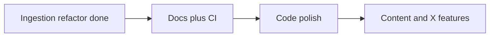

# Next refactor priorities

## What we already shipped (this thread)

The [ingestion refactor plan](.cursor/plans/ingestion_refactor_plan_41ab7943.plan.md) is **done** on `main` (`a02d035`):

- Split [`vault_lib.py`](ingestion/vault_lib.py) into `episode_ids`, `paths`, `catalog`, `markdown_io`, `colossus`, `sitemap`, `layout`, `gaps_report`
- Deduped helpers (`read_markdown_body`, `resolve_catalog_row`, `iter_sitemap_episodes`, unified writers)
- 16 pytest tests in [`tests/`](tests/)
- Migrations archived under [`ingestion/migrations/`](ingestion/migrations/); `import_posts_x.py` removed

**Deferred from that plan (still open):**

| Item | Status |
|------|--------|
| Phase 6: shared `--id` CLI helper | Not done |
| Full docs rewrite | Partial only |
| README datapoint count | Still wrong (189 vs **176**) |
| `ingestion/README.md` / `docs/ingestion-pipeline.md` | Missing |
| CI (pytest + verify on push) | Missing |



---

## Recommended next pass (balanced)

### 1. Documentation accuracy (low risk, ~30 min)

**Problem:** Agents and humans still read stale numbers and paths; [`catalog/gaps.md`](catalog/gaps.md) is authoritative (**176/417** datapoints) but [`README.md`](README.md) still says **189** in three places (status table, Phase 2 section, expansion roadmap).

**Changes:**

| File | Fix |
|------|-----|
| [`README.md`](README.md) | 189 → 176; clarify ep 0190–0417 are scaffolded (241 without bullets per gaps.md) |
| [`import/README.md`](import/README.md) | `ep-NNN-.../post.md` → `ep-NNNN-.../ep-NNNN-....post.md` |
| New [`ingestion/README.md`](ingestion/README.md) | Script index: pipeline order, env vars, flag matrix (`--id` vs `--episode`, `--apply` vs `--dry-run`) |
| [`docs/episode-id-rules.md`](docs/episode-id-rules.md) | One table: CLI conventions (`--id ep-NNNN` vs `assign_post_manual --episode N`) |
| [`AGENTS.md`](AGENTS.md) | Link `ingestion/README.md`; note `post-mapping-review.jsonl` is generated by organize |

**Verify:** Manual read; no code behavior change.

---

### 2. CI guardrails (low risk, prevents regressions)

**Problem:** Refactor added tests but **no GitHub Actions** — easy to break `vault_lib` shim or layout rules silently.

**Add** [`.github/workflows/verify.yml`](.github/workflows/verify.yml):

```yaml
# sketch
- checkout
- setup-python 3.12
- pip install -r ingestion/requirements.txt -r ingestion/requirements-dev.txt
- pytest tests -q
- cd ingestion && python verify.py
```

**Verify:** Workflow green on PR/push to `main`.

---

### 3. Code polish — Phase 6 + small dedup (~1–2 hrs)

**3a. Shared episode CLI** (deferred Phase 6)

Add [`ingestion/cli_args.py`](ingestion/cli_args.py):

```python
def add_episode_id_arg(parser, *, required=False) -> None:
    parser.add_argument("--id", dest="episode_id", help="Episode id, e.g. ep-0200", ...)
```

Wire into [`fetch_transcripts.py`](ingestion/fetch_transcripts.py), [`scaffold_notes.py`](ingestion/scaffold_notes.py), [`expand_datapoints.py`](ingestion/expand_datapoints.py) — replace duplicated `resolve_catalog_row` + argparse blocks.

**3b. `search.py` → `catalog.load_jsonl`**

[`search.py`](ingestion/search.py) `load_chunks()` duplicates JSONL parsing; use `load_jsonl(CHUNKS_PATH)` from [`catalog.py`](ingestion/catalog.py).

**3c. `import_notes.py` touch-up (surgical)**

- Import from `catalog` / `markdown_io` / `paths` instead of `vault_lib` shim
- Use `read_markdown_body` in `--merge` path (today raw `split("---")` in migration script only)
- **Keep** separate `TIMESTAMP_BULLET_RE` with `•*` prefix — Apple Notes format differs from verify; do not unify without re-baselining `gaps.md`

**3d. Remaining `vault_lib`-only scripts**

Optional same pass: update [`map_colossus.py`](ingestion/map_colossus.py), [`sync_x_cache.py`](ingestion/sync_x_cache.py) to import `colossus.session` / `paths.ROOT` directly (shim can stay indefinitely).

**Verify:** `pytest ../tests -q` + `python verify.py` (176 datapoints unchanged).

---

## Explicitly defer (not refactors)

These are **content/product** work from [`README.md`](README.md) roadmap, not structural cleanup:

| Gap | Count | Tooling exists |
|-----|-------|----------------|
| Notes without datapoints | 241 | `scaffold_notes.py --next` |
| Missing posts | ~230 | `sync_x_cache` + `organize_posts_from_csv` |
| Expanded notes | ~0 scale | `expand_datapoints.py` only (no batch driver) |

**Next feature build** (separate PR): `expand_datapoints.py --from/--to` or `--missing-expanded` batch mode — aligns with README “Datapoint expansion at scale” but is new behavior, not refactor.

**X pipeline depth** (separate PR): article-body fetch for `x.com/i/article/…`, split [`x_posts_lib.py`](ingestion/x_posts_lib.py) (~287 lines) only if you add substantial new X logic.

---

## Suggested PR sequence

1. **PR1:** README + import/README + `ingestion/README.md` + episode-id-rules CLI table  
2. **PR2:** GitHub Actions verify workflow  
3. **PR3:** `cli_args.py`, search `load_jsonl`, import_notes import cleanup  

Each PR: `pytest` + `verify.py` green.

---

## Success criteria

- README metrics match `catalog/gaps.md`
- New contributors/agents have one ingestion index doc
- CI fails if layout rules or unit tests break
- No change to datapoint count (176) or transcript completeness (417) unless explicitly intended
