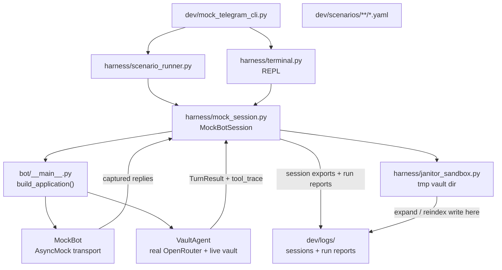

# Mock Telegram Harness

## Architecture

The harness is **not a reimplementation** — it is the real bot (`build_application()`) with a mocked HTTP transport layer. Every change to handlers, prompts, or workflow logic is automatically reflected in harness runs.




### Two key isolation rules

1. **Transport only**: `MockBotSession` patches only the outbound Telegram HTTP layer. Handler routing, auth, sessions, Janitor FSM, VaultAgent tool loop, and all OpenRouter calls run exactly as in production.
2. **Janitor sandbox — two mechanisms**: Subprocess calls (`run_expand`) already inject `VAULT_ROOT=sandbox` via env — those are isolated for free. In-process calls (`file_notes`, `run_promote`) use `paths` module globals fixed at import time and require `JanitorSandbox` to explicitly patch those globals on enter and restore on exit.

## Component plan

### `dev/harness/mock_session.py` — core engine

**Config construction** — `BotConfig` and `AgentConfig` are `frozen=True` dataclasses. `load_bot_config()` raises `ValueError` without a real `TELEGRAM_BOT_TOKEN`. `MockBotSession` must build configs manually:

```python
agent_cfg = AgentConfig(
    api_key=os.environ["OPENROUTER_API_KEY"],
    model=os.environ["TELEGRAM_CHAT_MODEL"],
    vault_root=vault_root,
    ...
)
bot_cfg = BotConfig(
    agent=agent_cfg,
    telegram_token="0:fake",            # PTB accepts any non-empty string
    allowed_user_ids=frozenset({user_id}),
    sessions_dir=log_dir / "sessions",  # field is sessions_dir, not session_dir
    janitor_clean_model=os.environ.get("JANITOR_CLEAN_MODEL"),
)
```

**PTB initialization sequence:**

1. `Application.builder().token("0:fake").build()` → `app`
2. Replace `app.bot` with `AsyncMock()` (before `initialize()` so `post_init` hits the mock)
3. `await app.initialize()` — runs `_register_bot_commands` against mock bot (no-op)
4. Inject `app.bot_data` with manually built config, agent, sessions, janitor
5. For each message: `await app.process_update(fake_update)` then drain `self.replies`
6. Teardown: `await app.shutdown()`

**Echo LLM mode** — patches `openai.OpenAI` before `VaultAgent` is instantiated so `client.chat.completions.create(...)` returns a `MagicMock` with a canned assistant reply and no tool calls. Toggle per-session: `MockBotSession(llm_mode="echo"|"live")`.

**Fake `Update` construction:**

```python
user = User(id=user_id, first_name="Harness", is_bot=False)
chat = Chat(id=user_id, type=Chat.PRIVATE)
msg = Message(message_id=_next_id(), date=utcnow(), chat=chat, from_user=user, text=text)
msg.set_bot(app.bot)   # wires mock bot to all outbound calls
update = Update(update_id=_next_id(), message=msg)
```

- Methods: `send(text) → list[Reply]`, `tap_button(callback_data) → list[Reply]`, `reset()`, `tool_traces → list`
- `Reply` dataclass: `{text, parse_mode, reply_markup, inline_keyboard_buttons}`

### `dev/harness/janitor_sandbox.py` — real Janitor in isolated temp vault

**Two isolation layers needed:**


| Call site                  | Isolation mechanism                                                                     |
| -------------------------- | --------------------------------------------------------------------------------------- |
| `run_expand` (subprocess)  | Already injects `VAULT_ROOT=sandbox` into subprocess env — works automatically          |
| `run_reindex` (in-process) | Calls `reindex_vault(vault_root)` with explicit arg — works if reindex respects the arg |
| `file_notes` (in-process)  | Uses `paths.NOTES_DIR` global (set at import time) — **must patch `paths` globals**     |
| `run_promote` (in-process) | Uses `promote_draft()` which reads `paths` globals — **must patch `paths` globals**     |


`JanitorSandbox.__enter__` patches the `paths` module globals directly (same pattern as existing tests use with `monkeypatch`):

```python
import paths as _paths
self._saved = {k: getattr(_paths, k) for k in ("ROOT", "NOTES_DIR", "TRANSCRIPTS_DIR", "POSTS_DIR", "CATALOG_DIR")}
_paths.ROOT = self.vault_root
_paths.NOTES_DIR = self.vault_root / "content" / "notes"
# ... etc.
```

`JanitorSandbox.__exit__` restores originals. Not thread-safe — harness is single-threaded, so fine.

Sandbox structure built by `JanitorSandbox(real_vault_root, episode_id)`:

```
{tmp}/
  ingestion/         → symlink to real_vault_root/ingestion/
  catalog/
    episodes.jsonl   — single-episode slice from real catalog
    chunks.jsonl     — empty (reindex will rebuild it here)
  content/
    notes/{folder}/{folder}.notes.md  — copy of real notes file (or empty scaffold)
    transcripts/{folder}/             — copy of transcript for expand context
```

- `sandbox.vault_root: Path` — passed to `MockBotSession` at construction; `bot_data["config"]` is rebuilt with a new `BotConfig(agent=AgentConfig(vault_root=sandbox.vault_root, ...))` for the Janitor session
- `sandbox.inspect() → dict` — after a run, lists files written/modified in the sandbox
- Context manager: `with JanitorSandbox(...) as sandbox:` — cleaned up on exit (or kept with `keep=True` / `--keep-sandbox`)

### `dev/harness/scenario_runner.py` — headless test execution

Scenario YAML format:

```yaml
name: "Librarian basic Q&A"
llm: live          # live = real OpenRouter; echo = stub LLM for CI
turns:
  - send: "/start"
    expect:
      contains: "Welcome"
  - send: "What was Carnegie's key insight about steel?"
    expect:
      tool_called: search_vault_parent
      response_contains: Carnegie
      response_min_length: 80
  - send: "/janitor"
    button: "janitor:cancel"   # tap inline keyboard button after response
    expect:
      contains: "Janitor"
```

Assertions supported:

- `contains` / `not_contains`
- `response_min_length`
- `tool_called` (checks `TurnResult.tool_trace`)
- `sandbox_file_written` (checks `JanitorSandbox.inspect()` for expected file paths)
- `phase` (checks Janitor FSM phase after the turn)

`ScenarioRunner.run(scenario, session) → ScenarioResult` with per-turn pass/fail, wall time, and token usage.

### `dev/harness/terminal.py` — REPL

- Adds `dev/` to `sys.path` at startup so `from harness import ...` resolves when run as `python dev/mock_telegram_cli.py`
- Launches `MockBotSession` and drives it with `asyncio.run()` / `loop.run_until_complete()`
- Prints bot replies with clear visual separation from user input
- `--debug` flag: shows tool traces inline after each reply (`[tool: search_vault_parent → 12 results in 1.2s]`)
- Special REPL commands: `:run <path>` (run scenario file), `:debug on/off`, `:quit`, `:reset` (new session), `:sandbox` (list files written to sandbox after Janitor turn)
- Displays Janitor inline keyboard buttons as numbered choices (`[1] Approve  [2] Retry  [3] Cancel`) — user types the number

### `dev/mock_telegram_cli.py` — entry point

Adds `dev/` to `sys.path` at the top so `from harness import ...` always resolves regardless of `cwd`.

```bash
python dev/mock_telegram_cli.py                          # interactive REPL
python dev/mock_telegram_cli.py --run-scenarios          # all scenarios → report
python dev/mock_telegram_cli.py --suite librarian        # subset
python dev/mock_telegram_cli.py --scenario path.yaml     # single file
python dev/mock_telegram_cli.py --debug                  # show tool traces in REPL
python dev/mock_telegram_cli.py --stub-llm               # override all scenarios to echo LLM (CI-safe)
python dev/mock_telegram_cli.py --keep-sandbox           # don't delete Janitor temp dir after run
```

Exit code 0 = all pass, 1 = any failure — machine-readable for agent use.

### Success criteria ("done when")

- `python dev/mock_telegram_cli.py --run-scenarios` exits 0 with real OpenRouter creds set
- All 5 starter scenarios pass (REPL-observable and headless)
- Janitor `full_workflow` scenario: notes file appears in sandbox but **not** in `content/notes/`
- `--stub-llm` makes all scenarios pass without `OPENROUTER_API_KEY`
- `pytest tests/test_harness_scenarios.py -q` passes in CI (no network calls)

### Log separation

All harness output goes to `dev/logs/` — never to real bot paths:


| Path                 | Contents                                             |
| -------------------- | ---------------------------------------------------- |
| `dev/logs/sessions/` | `/newchat` JSONL exports from harness runs           |
| `dev/logs/runs/`     | `YYYY-MM-DDTHH-MM-SS-report.json` per scenario run   |
| `dev/logs/sandbox/`  | Preserved sandbox dirs when `--keep-sandbox` is used |


The real bot writes to `catalog/telegram-sessions/` and `~/Library/Logs/founders-telegram/`. The harness never touches those paths. `dev/logs/` is gitignored.

### Scenario files (starters)

- `[dev/scenarios/librarian/basic_qa.yaml](dev/scenarios/librarian/basic_qa.yaml)` — `/start`, single Q&A, `/clear`
- `[dev/scenarios/librarian/multi_turn.yaml](dev/scenarios/librarian/multi_turn.yaml)` — 3-turn session, `/newchat`, `/resume`
- `[dev/scenarios/librarian/tool_coverage.yaml](dev/scenarios/librarian/tool_coverage.yaml)` — exercises all 4 tools (`search_vault_parent`, `search_transcript`, `load_episode`, `list_episode_ids`)
- `[dev/scenarios/janitor/full_workflow.yaml](dev/scenarios/janitor/full_workflow.yaml)` — episode parse → paste → real LLM clean → Approve → real expand (sandbox) → Promote → real reindex (sandbox)
- `[dev/scenarios/janitor/episode_parse.yaml](dev/scenarios/janitor/episode_parse.yaml)` — varied episode ID formats (`191`, `ep-0191`, `Episode 191`)

Janitor scenarios include a `janitor_episode` key so the runner knows which episode to seed the sandbox with:

```yaml
janitor_episode: "ep-0191"
```

### Pytest integration

- `[tests/test_harness_scenarios.py](tests/test_harness_scenarios.py)` — parametrizes over `dev/scenarios/**/*.yaml` with echo LLM forced (patches `openai.OpenAI` via `monkeypatch`) so CI passes without real OpenRouter calls or network
- Janitor CI scenarios use echo LLM + a pre-seeded fixture episode; `run_expand` subprocess is also stubbed in CI (subprocess cost is too high for every CI run)
- Guard: skipped if `SKIP_HARNESS_SCENARIOS=1`
- Do **not** add the harness pytest tests to the default CI `pytest tests -q` run until they are confirmed stable on main

### Config construction

`MockBotSession` builds `AgentConfig` + `BotConfig` manually — it never calls `load_bot_config()` because that function raises if `TELEGRAM_BOT_TOKEN` is absent and hardcodes `sessions_dir` to the real vault. Required env vars for live mode: `OPENROUTER_API_KEY`, `TELEGRAM_CHAT_MODEL`. Optional: `JANITOR_CLEAN_MODEL`, `OPENROUTER_MODEL`. Not required: `TELEGRAM_BOT_TOKEN`, `TELEGRAM_ALLOWED_USER_IDS` (harness injects fake values).

## Files to create / modify

**New files (~13):**

- `dev/__init__.py` (empty — makes `dev/` a package for import resolution)
- `dev/harness/__init__.py`
- `dev/harness/mock_session.py`
- `dev/harness/janitor_sandbox.py`
- `dev/harness/scenario_runner.py`
- `dev/harness/terminal.py`
- `dev/mock_telegram_cli.py`
- `dev/scenarios/librarian/basic_qa.yaml`
- `dev/scenarios/librarian/multi_turn.yaml`
- `dev/scenarios/librarian/tool_coverage.yaml`
- `dev/scenarios/janitor/full_workflow.yaml`
- `dev/scenarios/janitor/episode_parse.yaml`
- `dev/logs/.gitkeep` (so the dir exists; `dev/logs/` covered by `.gitignore`)

**Modified files (~2):**

- `tests/test_harness_scenarios.py` (new file — pytest integration)
- `docs/testing.md` (add harness section)
- `.gitignore` (add `dev/logs/`)

## Env requirements


| Var                         | Required for              | Notes                                         |
| --------------------------- | ------------------------- | --------------------------------------------- |
| `OPENROUTER_API_KEY`        | Live mode                 | Not needed for `--stub-llm`                   |
| `TELEGRAM_CHAT_MODEL`       | Live Librarian            | e.g. same value as production                 |
| `JANITOR_CLEAN_MODEL`       | Live Janitor clean        | Falls back to `TELEGRAM_CHAT_MODEL` if absent |
| `OPENROUTER_MODEL`          | Janitor expand subprocess | Inherited by `run_expand` subprocess          |
| `VAULT_ROOT`                | All modes                 | Defaults to repo root via `_bootstrap`        |
| `TELEGRAM_BOT_TOKEN`        | **Not needed**            | Harness uses `"0:fake"`                       |
| `TELEGRAM_ALLOWED_USER_IDS` | **Not needed**            | Harness injects fake user id                  |


