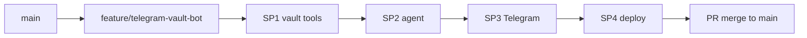
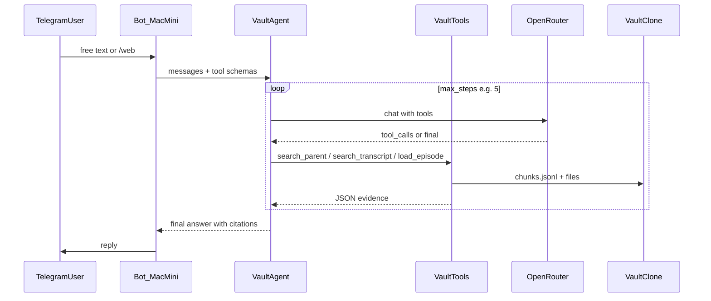

# Telegram Vault Agent — master plan (v0)

Filename kept as `telegram_rag_bot_v0` for history; **implementation is agent + tools**, not classic single-shot RAG.

Supersedes excerpt-only sketch in [telegram_vault_bot.plan.md](telegram_vault_bot.plan.md).

**Related:** [docs/expanded-backfill.md](../../docs/expanded-backfill.md), [docs/retrieval.md](../../docs/retrieval.md), [services/telegram/README.md](../../services/telegram/README.md).

---

## Is RAG stale? (May 2026 specialist view)

**Naive RAG is stale** — fixed pipeline “embed query → top-k chunks → one LLM call” with no routing, no rerank, and no iteration is commodity and often wrong for a **multi-source personal vault** (posts vs your notes vs expanded quotes vs huge transcripts).

**Retrieval is not stale** — you still need to **find** the right git-backed evidence before the model speaks. What changed:

| Approach | Fit for this vault |
|----------|-------------------|
| **Long-context only** (“dump everything”) | Poor at 417 episodes; good as a **tool** (`load_episode`) for 1–3 identified eps |
| **Agent + tools** | **Best default** — model chooses post vs notes vs expanded vs transcript vs web |
| **Hybrid search + rerank** | **Inside tools** — keyword + vectors + small rerank beats either alone |
| **GraphRAG / fine-tuned retriever** | Overkill for solo vault on Mac mini |
| **Pure web search** | Only via **`/web`** — never silently replace vault sources |

**Your choice (locked):** **Agent + tools** for Telegram; **`/web`** for external questions only (no auto-mixing).

Embeddings remain **one retrieval mechanism inside tools**, not the whole product.

---

## Decisions log

| Topic | Decision |
|-------|----------|
| UX | Chat synthesis + verbatim quotes + takeaways (study-notes voice) |
| Architecture | **Tool-calling agent** (`TELEGRAM_CHAT_MODEL`), not single-shot RAG |
| Vault sources | **Posts**, **raw notes**, **expanded** (canonical `.expanded.md`), **transcripts** (explicit tool or low-priority) |
| Web | **`/web <query>` only** — separate tool; vault answers must not silently use web |
| Host | Mac mini, polling |
| Retrieval inside tools | **Hybrid** keyword (`chunks.jsonl`) + **parent-tier embeddings** + optional `load_episode` |
| Auth | Solo `TELEGRAM_ALLOWED_USER_IDS` |
| Sessions | In-memory; `/clear`; `/newchat` → export jsonl; `/resume` |
| Sync v0 | Manual / cron `sync-and-index.sh`; webhook deferred (SP5) |
| Git | **`feature/telegram-vault-bot`** off `main` — focused commits per sub-plan; merge via PR |
| Chat model | `TELEGRAM_CHAT_MODEL` (faster/cheaper than expand) |
| Embed model | `OPENROUTER_EMBED_MODEL` inside `search_vault_parent` hybrid |

### Open later

- `/resume` + stale index: auto sync vs warn-only
- Web search provider (Brave/Tavily/SerpAPI) and env key
- Max agent steps / cost cap per message
- Tailscale vs Cloudflare for SP5 webhook

---

## Git workflow

1. Branch **`feature/telegram-vault-bot`** off `main` (pull `main` before branching).
2. Land changes in **focused commits** aligned to sub-plans (SP1 → SP2 → SP3 → SP4) on the feature branch.
3. **`pytest`** + **`ingestion/pipeline/verify.py`** green before each commit.
4. Commit this plan with the first implementation commit on the feature branch (per [AGENTS.md](../../AGENTS.md) Cursor plans rule).
5. Open a **PR into `main`** when SP1–SP4 (or an agreed slice) are ready; do not long-merge unrelated work on the feature branch.



---

## Architecture (v0) — agent loop



**Policy (system prompt):**

1. Prefer **expanded** → **notes** → **posts** for “what I believe / noted.”
2. Call **`search_transcript`** only when quotes need transcript grounding or user asks for episode dialogue depth.
3. Never call **`web_search`** unless user used **`/web`** or message is clearly external-only.
4. Cite `[ep-NNNN]` and quote verbatim from tool results; say when evidence is missing.

---

## Agent concept (design first)

**Build order:** nail **tool contracts + agent loop** (SP1–SP2) before Telegram polish (SP3). Telegram is a thin transport layer over `VaultAgent.run_turn()`.

### What the agent is

- A **controller** that calls `TELEGRAM_CHAT_MODEL` with OpenRouter **tool calling** until it produces a final user-facing message or hits `max_steps`.
- **Not** a retrieval pipeline that always embed-searches once. Retrieval happens **inside tools** the model chooses.

### Turn lifecycle

1. **Input:** user text + optional flags (`allow_web`, `session_id`) + last N chat turns from memory.
2. **System:** `vault_agent.md` + corpus metadata (`chunks` count, `embeddings` built_at, git short SHA if cheap).
3. **Loop (≤5 steps):** model may emit `tool_calls` → Python executes tools → append `tool` role messages with JSON evidence → model continues.
4. **Output:** final assistant string; persist tool trace in session jsonl for debug.

### Evidence object (tool return shape)

Every search tool returns the same JSON array shape so the model learns one format:

```json
{
  "hits": [
    {
      "chunk_id": "ep-0022#notes:raw_datapoints#12",
      "episode_id": "ep-0022",
      "section": "notes:raw_datapoints",
      "title": "...",
      "source_path": "content/notes/.../....notes.md",
      "start_line": 42,
      "excerpt": "...",
      "founders_url": "https://..."
    }
  ],
  "meta": { "query": "...", "tier": "parent", "k": 8 }
}
```

`load_episode` returns `{ "episode_id", "sections": { "post": "...", "notes": "...", "expanded": "..." } }` with per-section truncation. Tool hits expose **`episode_id`** (alias of chunk field `id`) for citations.

**`load_episode` default (v0):** include all sections that exist on disk, truncated to the char cap; when `.expanded.md` exists, **order expanded sections first** in the combined blob (prompt priority, not omission).

### Tool catalog (v0)

| Tool | When model should use it |
|------|---------------------------|
| `search_vault_parent` | Default thematic / cross-episode questions |
| `search_transcript` | Needs verbatim dialogue not in notes/expanded |
| `load_episode` | User named an episode or search narrowed to one id |
| `list_episode_ids` | Resolve “episode 22”, “Elon episode” via catalog title |
| `web_search` | **Never** unless `allow_web=true` (handler sets after `/web`) |

Merge `search_vault_semantic` into `search_vault_parent` as hybrid (keyword ∪ embed, dedupe by `chunk_id`, rerank v0.1).

### Source priority (enforced in prompt + optional score boost in tool)

1. `expanded:*` — Quote / Key takeaway  
2. `notes:*` — your timestamp bullets  
3. `post:*` — X post body  
4. `transcript:*` — only via `search_transcript`

### Guardrails

| Guard | Value |
|-------|--------|
| `max_steps` | 5 |
| `max_tool_result_chars` | ~20_000 per turn (sum) |
| `k` per search | 8 |
| `load_episode` cap | ~30_000 chars total |
| Web | Gated by `allow_web`; separate answer template optional (“Web results:”) |

### Failure modes

- **No hits:** model must say vault has no match; suggest refining the query or using `search_transcript` for dialogue — no fabrication (no `/transcript` slash command in v0).
- **Tool error:** return `{ "error": "..." }` in tool message; model retries or explains.
- **OpenRouter timeout:** user sees short error; log episode/session id.

### Test strategy (before Telegram)

- **Unit:** each tool against fixture `chunks.jsonl` slice in `tests/fixtures/`.
- **Agent contract:** mock OpenRouter responses that request `search_vault_parent` then final answer; assert no `web_search` when `allow_web=false`.
- **Integration (optional):** one live turn with real API locally (not required in CI).

### Docs for other coding agents

Run **Appendix A** in a **separate** Cursor/chat session (do not mix with SP1 implementation). Updates `AGENTS.md`, `README.md`, `docs/retrieval.md`, etc. to match this agent vision.

---

## Vault tools (v0)

Implemented in [`services/telegram/bot/tools/`](../../services/telegram/bot/tools/) calling [`ingestion/lib/search_retrieval.py`](../../ingestion/lib/search_retrieval.py).

| Tool | Purpose | Source tier |
|------|---------|-------------|
| `search_vault_parent` | **Hybrid** keyword + embeddings over parent chunks; returns evidence JSON | post, notes, expanded |
| `search_transcript` | Keyword search transcript sections | child |
| `load_episode` | Load post + notes + expanded (if exists) for one `ep-NNNN` — bounded chars | per-type files |
| `list_episode_ids` | Resolve “episode 22” → `ep-0022` via catalog | catalog |
| `web_search` | External search | **Only when `/web` or handler sets allow_web=true** |

**Not exposed to model by default:** bulk ripgrep over `content/` (keep deterministic chunk index as source of truth; add `rg` tool in v0.1 if gaps hurt).

**Index refresh:** `sync-and-index.sh` → `build_chunks.py` + `build_embeddings.py`.

---

## Sub-plan 1 — Vault tools + indexes

**Goal:** Tool backends + indexes; no Telegram.

**Deliverables:**

- `ingestion/lib/search_retrieval.py` — `is_parent_chunk`, `is_transcript_chunk`, keyword search, vector search, `load_chunk_source_excerpt`, `hybrid_search_parent(query, k)`
- `ingestion/search/build_embeddings.py` — incremental parent-only vectors
- `services/telegram/bot/tools/vault.py` — pure functions returning JSON-serializable evidence (testable without API)
- Gitignore: `catalog/embeddings.npy`, `catalog/embeddings-manifest.jsonl`
- Tests: parent filter, hybrid ordering, embed incremental skip
- Fixture: `tests/fixtures/chunks_parent_slice.jsonl` with at least one synthetic `expanded:*` row (hybrid tests must not depend on live corpus)

**SP1 acceptance criteria (mandatory):**

| Item | Spec |
|------|------|
| `is_parent_chunk` | `section` matches `^(post\|notes\|expanded):` |
| `is_transcript_chunk` | `section` matches `^transcript:` |
| Keyword leg | Reuse/extend [search.py](../../ingestion/search/search.py) `search_chunks` (case-insensitive substring + hit-count rank) — **not** BM25 in v0 |
| Vector leg | Cosine similarity over parent-tier rows in `catalog/embeddings.npy` aligned to `chunk_id` |
| Hybrid merge | **RRF** on keyword rank + cosine rank; dedupe by `chunk_id`; optional score boost: `expanded:*` > `notes:*` > `post:*` (+0.1 tier steps) |
| Evidence JSON | Every hit includes `episode_id` (= chunk `id`), `chunk_id`, `section`, `source_path`, `start_line`, `excerpt`, metadata fields when present |
| `list_episode_ids` | Fuzzy match on `catalog/episodes.jsonl` `title` + numeric episode number → `ep-NNNN` |

**Dependencies (SP1/SP3):** `numpy` for embeddings; `python-telegram-bot>=21` added in SP3 (or `services/telegram/requirements.txt` referenced from README).

---

## Sub-plan 2 — Agent loop + prompt

**Goal:** Multi-step OpenRouter chat with tool calling until final answer.

**Deliverables:**

- [`services/telegram/prompts/vault_agent.md`](../../services/telegram/prompts/vault_agent.md) — study-notes voice, tool-use policy, citation rules
- [`services/telegram/bot/agent.py`](../../services/telegram/bot/agent.py) — loop: `max_steps=5`, accumulate tool results, handle errors
- Tool JSON schemas registered with OpenRouter-compatible `tools` parameter (same **OpenAI client + OpenRouter base URL** as [expand_llm.py](../../ingestion/lib/expand_llm.py); add `tools` / multi-turn tool loop in `agent.py` — expand does not use tool calling today)
- Log `tool_calls` in session jsonl for debugging (optional fields)

**Cost/latency guardrails:**

- Cap total tool result chars per turn (~20k)
- Cap `search_*` k=8 per call
- Single episode `load_episode` max ~30k chars truncated with section headers

**Verify:** Mock tool responses — agent must call `search_vault_parent` before answering thematic question; must not call `web_search` on vault-only message.

---

## Sub-plan 3 — Telegram + sessions + /web

| Command | Behavior |
|---------|----------|
| `/start` | Help, index stats, tool list |
| `/clear` | Wipe in-memory thread |
| `/newchat` | Export thread → `catalog/telegram-sessions/*.jsonl`; reset |
| `/resume` | Load session; corpus freshness note if index newer than session |
| `/web <query>` | Run agent with **`allow_web=true`** only for that turn |
| Free text | Agent with **`allow_web=false`** |

**Library:** `python-telegram-bot` v21+ (add to `ingestion/requirements.txt` or `services/telegram/requirements.txt`).

**`/web` v0:** `web_search` tool returns `{"error":"not configured"}` until a provider and `WEB_SEARCH_API_KEY` are chosen (SP3.1).

**Session export naming:** `catalog/telegram-sessions/{utc_iso}_{short_slug}.jsonl` (gitignored).

**`/resume` + stale index (v0):** warn-only if `chunks.jsonl` / embeddings manifest is newer than session file; auto-sync deferred to SP5/SP6.

**Env:** `TELEGRAM_BOT_TOKEN`, `TELEGRAM_ALLOWED_USER_IDS`, `VAULT_ROOT`, `OPENROUTER_API_KEY`, `TELEGRAM_CHAT_MODEL`, `OPENROUTER_EMBED_MODEL`, `WEB_SEARCH_API_KEY` (when `/web` provider wired).

---

## Sub-plan 4 — Mac mini ops

Unchanged intent: `launchd`, `sync-and-index.sh`, `~/.config/founders-telegram/env`, manual/cron sync (webhook SP5 later).

---

## Sub-plan 5 — GitHub webhook (deferred)

Push → pull → `sync-and-index.sh`; exposure TBD (Tailscale preferred).

---

## Sub-plan 6 — v0.1 tuning

- Better tool descriptions + few-shot in system prompt
- Optional **LLM rerank** on top 20 hybrid hits inside `search_vault_parent`
- Episode intent classifier (cheap) before tool storm
- User-facing “Searching notes…” status messages on Telegram

---

## Repo layout (target)

```
services/telegram/
  bot/
    agent.py
    tools/
      vault.py
      web.py              # SP3; no-op stub until API key
    handlers.py
    sessions.py
    auth.py
    config.py
  prompts/vault_agent.md
  deploy/...

ingestion/lib/search_retrieval.py
ingestion/search/build_embeddings.py
catalog/chunks.jsonl
catalog/embeddings.npy          # gitignored
catalog/telegram-sessions/      # gitignored
```

---

## Commit sequence (on `feature/telegram-vault-bot`)

| Commit | Sub-plan | Delivers |
|--------|----------|----------|
| 1 | SP1 | Indexes + vault tool functions + tests + fixture slice |
| 2 | SP2 | Agent loop + `vault_agent.md` + mock contract tests |
| 3 | SP3 | Telegram + sessions + `/web` stub (`not configured`) |
| 4 | SP4 | launchd + ops docs |
| later | SP5 | Webhook |
| later | SP6 | Rerank + UX polish |

One commit per sub-plan keeps verify-this traceability (agent vs transport regressions).

---

## Success criteria

- Thematic question → agent calls **parent search** (and maybe **load_episode**), then answers with quotes — not transcript walls.
- `/web` is the **only** path to external search; vault Q&A never cites web without it.
- **Expanded quotes (deferred until corpus ready):** after ≥1 promoted `.expanded.md` on the bot host and `sync-and-index.sh`, answers can cite **Quote** / **Key takeaway** from `.expanded.md` (`expanded:*` chunks in index). Until then this criterion is **not a v0 ship blocker** (today many clones have 0 `expanded:*` chunks).
- Sessions export/resume on Mac mini; solo allowlist enforced.

### Post-implementation verify-this (pytest / manual)

| # | Claim | Check |
|---|-------|-------|
| 1 | Parent thematic Q avoids transcript walls | Mock turn: `search_vault_parent` in trace; no `search_transcript` unless dialogue asked |
| 2 | Web only via `/web` | `allow_web=false` → `web_search` never in tool_calls |
| 3 | Expanded hits after reindex | Promote one ep + reindex → `search_vault_parent` returns `expanded:*` with verbatim Quote |
| 4 | Allowlist | Non-allowed user id → no agent call |
| 5 | Session export | `/newchat` writes valid jsonl under `catalog/telegram-sessions/` |

---

## Alternatives considered (2026)

| Alternative | Verdict |
|-------------|---------|
| Single-shot RAG | Rejected — you want routing across source types; agent fits |
| Long-context only | Supplement via `load_episode`, not primary |
| Auto web augmentation | Rejected — `/web` only |
| MCP server instead of custom tools | Valid later; v0 keeps tools in-repo for Mac mini simplicity |
| No embeddings | Rejected — hybrid semantic still needed inside `search_vault_parent` |

---

## Questions still worth a pass

1. **Web provider** for `/web` — default v0: stub; SP3.1: Tavily or Brave when `WEB_SEARCH_API_KEY` is set.
2. **Session file naming** — locked: `{utc_iso}_{short_slug}.jsonl` under `catalog/telegram-sessions/`.
3. **`load_episode`** — locked: all on-disk sections, truncated; expanded sections first when present.

---

## Plan review (draft audit)

### Solid

- Clear pivot from naive RAG → **agent + tools** with locked decisions (study-notes voice, `/web` gate, solo allowlist, Mac mini).
- **Agent concept** section is implementation-ready: turn lifecycle, evidence JSON, guardrails, test strategy.
- **Parent/child** tiers match existing `chunks.jsonl` sections and [build_chunks.py](../../ingestion/search/build_chunks.py).
- **SP1 before SP3** avoids Telegram UX work before tool contracts exist.
- Appendix A handoff separates **docs sync** from **code** for other agents.

### Fixed in plan review (May 2026)

- **Git:** `feature/telegram-vault-bot` + PR into `main`; one commit per sub-plan SP1–SP4.
- **SP1:** RRF hybrid, parent/transcript filters, evidence `episode_id` alias, fixture slice — see SP1 acceptance criteria.
- **Success #3:** expanded corpus precondition documented; not a v0 blocker with zero `expanded:*` chunks.
- **Failure mode:** no `/transcript` slash in v0 — use `search_transcript` via agent.
- **Tools table:** hybrid lives only in `search_vault_parent` (no separate semantic tool).
- **OpenRouter:** reuse expand client pattern; tool loop is new in `agent.py`.

### Still thin (address during SP2/SP6)

| Gap | Recommendation |
|-----|----------------|
| `vault_agent.md` outline | Add stub sections in SP2 before coding agent loop |
| Hybrid vs keyword-only quality | Optional golden 10-query set in SP6 (MRR@8) |
| Concurrent git pull on Mac mini | File lock or queue in v0.1 during `sync-and-index.sh` |

### Risk watch

- **Bulk expand drafts** on disk are not indexed — agent won’t see them until promote + `build_chunks` + `build_embeddings`.
- **Agent cost** — up to 5 steps × tools + final; add optional `TELEGRAM_MAX_STEPS=3` env for cheap mode.
- **Concurrent git pull** on Mac mini while bot runs — `sync-and-index.sh` should not run mid-turn (file lock or single-worker queue in v0.1).

---

## Appendix A — Copy-paste prompt: docs sync for coding agents

**Use in a new agent session.** Goal: update repo docs only; no `services/telegram` implementation. Source of truth: this plan file.

```
You are updating documentation in the founders-notes repo so future coding agents understand the Telegram vault **agent** (tool-calling), not a naive RAG bot.

Read first:
- .cursor/plans/telegram_rag_bot_v0.plan.md (master plan — agent + tools)
- .cursor/plans/telegram_vault_bot.plan.md (superseded background only)
- services/telegram/README.md
- docs/retrieval.md
- docs/expanded-backfill.md
- AGENTS.md
- README.md (Systems Roadmap section)

## Vision to document

1. **Product:** Private Telegram bot on always-on Mac mini (polling). Solo user allowlist.
2. **UX:** Chat-style answers in study-notes voice: synthesized insights + verbatim quotes + [ep-NNNN] citations — NOT ranked excerpt dumps.
3. **Architecture:** OpenRouter tool-calling **agent** (TELEGRAM_CHAT_MODEL). Retrieval lives inside tools — hybrid keyword + parent-tier embeddings on catalog/chunks.jsonl — NOT single-shot embed→top-k→answer RAG.
4. **Sources (priority):** expanded.md > raw notes > X posts > transcripts (transcript tool only when needed).
5. **Web:** /web slash command ONLY — web_search tool disabled for normal messages; never silently mix web into vault answers.
6. **Sessions:** In-memory chat; /clear; /newchat exports catalog/telegram-sessions/*.jsonl (gitignored); /resume reloads.
7. **Index sync (v0):** manual or cron sync-and-index.sh (git pull + build_chunks + build_embeddings). GitHub webhook deferred.
8. **Git:** Implement on **`feature/telegram-vault-bot`**; focused commits per sub-plan; PR into `main`.
9. **Build order:** SP1 vault tools → SP2 agent loop → SP3 Telegram → SP4 Mac mini deploy.
10. **Embeddings:** Used inside search_vault_parent tool; AGENTS.md "no embeddings" rule means do not add repo-wide vector DB until chunk+agent search fails — Telegram embed index is scoped to parent chunks only.

## Files to update (surgical)

| File | Changes |
|------|---------|
| AGENTS.md | Link telegram_rag_bot_v0.plan.md; describe agent+tools not "chunk search only" |
| README.md | Systems Roadmap: vault agent, parent/child sources, /web, Mac mini; link master plan |
| docs/retrieval.md | v1 chunks + planned v2 agent tools; embeddings for parent-tier in bot only; link master plan |
| docs/expanded-backfill.md | After promote run sync-and-index; bot reads .expanded.md not drafts |
| docs/datapoint-workflow.md | One line: expanded corpus feeds vault agent parent tier |
| ingestion/README.md | Point to services/telegram + master plan |
| services/telegram/README.md | Agent architecture summary, env vars, build order |
| .cursor/plans/telegram_vault_bot.plan.md | Keep superseded notice at top |

Do NOT:
- Implement bot code in this task
- Change catalog/gaps counts or content/notes files
- Remove maintain.py or expand workflows
- Say "RAG bot" as the primary label — prefer "vault agent" or "Telegram vault agent"

Add optional new doc docs/telegram-vault-agent.md (short overview linking to plan) if README would become too long.

Run no destructive git commands. When done, list files changed and any intentional open questions left in retrieval.md.

Commit message suggestion: "docs: align vault agent vision for Telegram (tool-calling, not naive RAG)"
```
