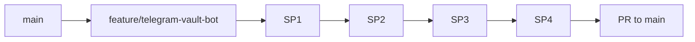
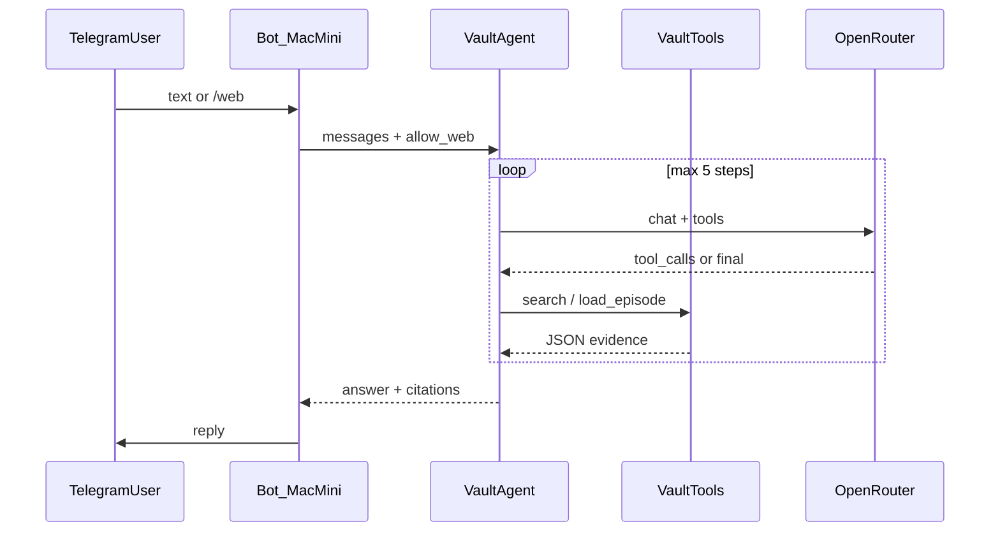

# Telegram Vault Agent — master index (v0)

Filename kept as `telegram_rag_bot_v0` for history. **Product:** OpenRouter **tool-calling agent**, not embed→top-k→one-shot RAG.

**Overview for humans:** [`docs/telegram-vault-agent.md`](../../docs/telegram-vault-agent.md) · **Stub:** [`services/telegram/README.md`](../../services/telegram/README.md)  
**Background (superseded sketch):** [telegram_vault_bot.plan.md](archive/telegram_vault_bot.plan.md)

---

## Sub-plans (use one file per agent session)

| SP | Plan file | Delivers |
|----|-----------|----------|
| **1** | [telegram_vault_sp1_tools.plan.md](telegram_vault_sp1_tools.plan.md) | `search_retrieval.py`, `build_embeddings.py`, `vault.py`, tests |
| **2** | [telegram_vault_sp2_agent.plan.md](telegram_vault_sp2_agent.plan.md) | `agent.py`, `vault_agent.md`, mock contract tests |
| **3** | [telegram_vault_sp3_telegram.plan.md](telegram_vault_sp3_telegram.plan.md) | Handlers, allowlist, sessions, `/web` stub |
| **4** | [telegram_vault_sp4_ops.plan.md](telegram_vault_sp4_ops.plan.md) | `launchd`, `sync-and-index.sh`, ops README → **PR** |
| 5 | *(this file § Deferred)* | GitHub webhook → pull + reindex |
| 6 | *(this file § Deferred)* | Rerank, tool copy, “Searching…” UX |



**Fresh-context handoff:** Open **only** the SP plan for the work in progress. Read this master for § Shared contracts and § Decisions when something is ambiguous.

---

## Decisions log

| Topic | Decision |
|-------|----------|
| UX | Study-notes synthesis + verbatim quotes + `[ep-NNNN]` |
| Architecture | Tool-calling agent (`TELEGRAM_CHAT_MODEL`), not single-shot RAG |
| Vault sources | Posts, raw notes, **canonical** `.expanded.md`, transcripts (explicit tool) |
| Web | **`/web <query>` only** — `web_search` disabled for normal messages |
| Host | Mac mini, polling |
| Retrieval | Hybrid keyword (`chunks.jsonl`) + **parent-tier embeddings** inside `search_vault_parent` |
| Auth | Solo `TELEGRAM_ALLOWED_USER_IDS` |
| Sessions | In-memory; `/clear`; `/newchat` → jsonl export; `/resume` |
| Sync v0 | Manual/cron `sync-and-index.sh`; webhook SP5 |
| Git | `feature/telegram-vault-bot` → focused commits SP1–SP4 → PR |
| Models | `TELEGRAM_CHAT_MODEL` (chat), `OPENROUTER_EMBED_MODEL` (parent embeds) |

**Not indexed:** `.expanded.draft.md` — promote + `build_chunks` + `build_embeddings` first.

---

## Shared contracts (all SPs)

### Architecture



### Evidence JSON (canonical — search tools)

```json
{
  "hits": [{
    "chunk_id": "ep-0022#notes:raw_datapoints#12",
    "episode_id": "ep-0022",
    "section": "notes:raw_datapoints",
    "title": "...",
    "source_path": "content/notes/.../....notes.md",
    "start_line": 42,
    "excerpt": "...",
    "founders_url": "https://..."
  }],
  "meta": { "query": "...", "tier": "parent", "k": 8 }
}
```

`load_episode` returns `{ "episode_id": "...", "sections": { "post": "...", "notes": "...", "expanded": "..." } }` — sections present only when the file exists on disk; truncated to ~30k chars total; expanded sections appear first when present.

### Source priority

1. `expanded:*` → 2. `notes:*` → 3. `post:*` → 4. `transcript:*` (via `search_transcript` only)

### Guardrails

| Guard | Value |
|-------|--------|
| `max_steps` | 5 |
| Tool result budget | ~20k chars/turn |
| `k` per search | 8 |
| `load_episode` | ~30k chars; expanded sections first when present |

### Repo layout (target)

```
services/telegram/bot/{agent,handlers,sessions,auth,config}.py
services/telegram/bot/tools/{vault,web}.py
services/telegram/prompts/vault_agent.md
services/telegram/deploy/...
ingestion/lib/search_retrieval.py
ingestion/search/build_embeddings.py
catalog/chunks.jsonl
catalog/embeddings.npy              # gitignored
catalog/telegram-sessions/        # gitignored
```

---

## Commit sequence

| # | Sub-plan | Commit delivers |
|---|----------|-----------------|
| 1 | SP1 | Indexes + vault tools + tests + fixture |
| 2 | SP2 | Agent + prompt + mock tests |
| 3 | SP3 | Telegram + sessions + `/web` stub |
| 4 | SP4 | launchd + sync script + ops docs |

Commit the matching **sub-plan `.plan.md`** with each implementation commit (AGENTS.md Cursor plans rule).

---

## Success criteria (v0)

- Thematic Q → `search_vault_parent` (maybe `load_episode`); not transcript walls by default.
- Web **only** via `/web`.
- Expanded quotes: **not a ship blocker** until promoted `.expanded.md` is indexed on the bot host.
- Allowlist + session export on Mac mini.

| # | Verify |
|---|--------|
| 1 | Mock turn: `search_vault_parent` in trace |
| 2 | `allow_web=false` → no `web_search` |
| 3 | After promote + reindex → `expanded:*` in hybrid hits |
| 4 | Non-allowed user blocked |
| 5 | `/newchat` → valid jsonl in `catalog/telegram-sessions/` |

---

## Deferred

### SP5 — GitHub webhook

Push → `git pull` → `sync-and-index.sh`; exposure TBD (Tailscale preferred).

### SP6 — v0.1 tuning

- Tool descriptions + few-shot in system prompt
- Optional LLM rerank on top-20 hybrid hits
- Episode intent classifier before tool storm
- Telegram “Searching notes…” status messages
- Golden query set (MRR@8) optional
- File lock on `sync-and-index.sh` during active turns

### Open questions

- Web provider for `/web`: SP3.1 — Tavily or Brave once `WEB_SEARCH_API_KEY` is set; v0 stub returns `{"error":"not configured"}`

**Decided (not open):** session naming locked as `{utc_iso}_{short_slug}.jsonl`; `TELEGRAM_MAX_STEPS` optional env override (default 5).

---

## Copy-paste: start an implementation session

```
Implement Founders Telegram vault agent — ONE sub-plan only.

Read and follow ONLY the plan for the current SP, e.g.:
  .cursor/plans/telegram_vault_sp1_tools.plan.md   (SP1)
  .cursor/plans/telegram_vault_sp2_agent.plan.md   (SP2)
  .cursor/plans/telegram_vault_sp3_telegram.plan.md (SP3)
  .cursor/plans/telegram_vault_sp4_ops.plan.md     (SP4)

Skim for contracts/decisions if something is ambiguous:
  .cursor/plans/telegram_rag_bot_v0.plan.md  (master index — do not implement from here)

Branch: feature/telegram-vault-bot
Before commit: cd ingestion && pytest -q && python pipeline/verify.py
One commit for this SP only. Include the sub-plan .plan.md in the commit.
Do not start the next SP in the same session.
```

---

## Appendix A — Docs sync (completed)

Docs handoff prompt lived here; **done** May 2026. Entry point for vision: [`docs/telegram-vault-agent.md`](../../docs/telegram-vault-agent.md). Re-run docs sync only if master decisions change materially.
