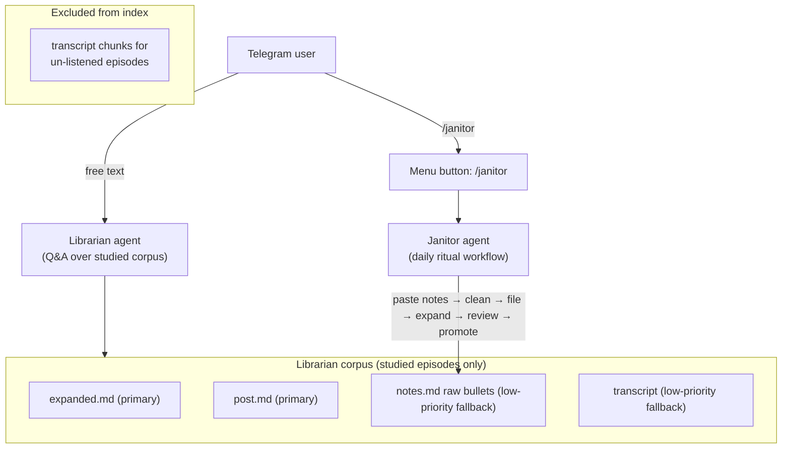

# Founders Vault Agent — Prioritized Backlog

## Architecture Vision (Confirmed)

Two agents, one codebase:




**Corpus definition:**

- "Listened" = `.notes.md` contains at least one timestamp bullet line matching `^\[[\d:]+\]`. Auto-detected from file content; no catalog flag needed.
- "Completed" = post synced from X API (`post.md` present).
- Un-listened episodes: **zero chunks** in index (transcripts excluded entirely).
- Listened episodes — source priority order:
  1. `expanded:`* — primary, highest quality (synthesis + verbatim quotes)
  2. `post:`* — high quality, finished voice
  3. `notes:*` raw bullets — low-priority fallback (same tier as transcripts were; present but not primary)
  4. `transcript:*` — low-priority fallback for listened episodes only; excluded entirely for un-listened

---

## NOW (Foundational — Do These In Order)

### Execution Guardrails

- Work directly on `main` only because the user explicitly approved that for this personal repo.
- Do not use destructive git commands or revert unrelated user changes.
- Commit this plan file with the implementation commit that ships these plan changes, per `AGENTS.md`.
- Mac mini steps are handoffs to the user/operator. The implementation agent should surface exact commands, not assume it can SSH into the host.
- Keep Janitor work out of this session. This implementation session is Librarian index/retrieval foundation only.

**1. Commit existing fixes**

- Files: `[ingestion/lib/search_retrieval.py](ingestion/lib/search_retrieval.py)`, `[services/telegram/bot/agent.py](services/telegram/bot/agent.py)`, `[services/telegram/bot/messaging.py](services/telegram/bot/messaging.py)`, `[services/telegram/prompts/vault_agent.md](services/telegram/prompts/vault_agent.md)`, `[catalog/chunks.jsonl](catalog/chunks.jsonl)`, 3 test files
- Push
- **Mac mini handoff:** `git pull && launchctl kickstart -k gui/$(id -u)/com.founders.telegram.bot`

**2. Index filter: remove un-listened transcript chunks**

- Modify `[ingestion/search/build_chunks.py](ingestion/search/build_chunks.py)`: skip `transcript:`* sections for episodes where `.notes.md` has no timestamp bullets
- **"Listened" detection heuristic:** scan notes file for any line matching `^\[[\d:]+\]` (timestamp bullet format e.g. `[1:23:45]`). This is safer than checking `##` section presence — `split_sections()` would count scaffold placeholder comments (e.g. `<!-- Add bullets here -->`) as non-empty content, causing false positives.
- Add a focused unit/helper test if the implementation factors this into a helper (for example, empty scaffold → false, timestamp bullet → true).
- Expected impact: ~6500 transcript chunks removed, index shrinks to ~700–1000 focused chunks
- This is the single highest-leverage architectural change (addresses noise, implements Listened/Completed distinction)

**3. Chunk granularity: split expanded files at ### datapoint boundaries**

- Modify `[ingestion/search/build_chunks.py](ingestion/search/build_chunks.py)`: for `expanded:`* sections, emit one chunk per `###` datapoint rather than 80-line windows
- Keep non-expanded content on existing 80-line / 4000-char chunking unless required by the line-number fix.
- If an expanded section has no `###` headings, fall back to existing chunking.
- Fixes the buried-quote problem (ep-0100 inner scorecard example)
- Also required for Janitor: when it files new expanded content, the index will correctly reflect individual datapoints

**4. Fix absolute line numbers in chunks**

- `start_line` / `end_line` in `[catalog/chunks.jsonl](catalog/chunks.jsonl)` are section-relative (reset to 1 per section); fix to file-absolute by tracking line offset through `split_sections()` and passing it into `chunk_body()`
- Preserve stable `chunk_id` shape (`{episode_id}#{section}#{start_line}`), but expect IDs to change after the rebuild because `start_line` becomes file-absolute and expanded chunks split differently.
- Unblocks accurate citations and any future file re-read logic

**→ After #2 + #3 + #4:** run `python ingestion/search/build_chunks.py` locally to verify filter + chunk shape, then commit all three together. Then:

- **Mac mini handoff:** `services/telegram/deploy/sync-and-index.sh` (runs `git pull` + `build_chunks.py` + `build_embeddings.py`)

**5. Retrieval scenario tests (v1)**

- New files: `[tests/fixtures/vault_retrieval_scenarios.jsonl](tests/fixtures/vault_retrieval_scenarios.jsonl)` + `[tests/test_vault_retrieval_scenarios.py](tests/test_vault_retrieval_scenarios.py)`
- Each scenario row: `id`, `tool` (`search_vault_parent` or `search_transcript`), `query`, `k`, plus assertion fields — `expect_top_episode`, `expect_excerpt_contains`, `expect_section_prefix`, `expect_max_hits`
- Tests call existing `execute_tool()` (confirmed in `services/telegram/bot/agent.py`, already imported in `tests/test_vault_agent.py`) against real `catalog/chunks.jsonl`. No OpenRouter, no Telegram, no formatting checks.
- `AgentConfig` with `VAULT_ROOT=REPO` needed — same pattern as existing `agent_config` fixture.
- Use `allow_web=False` for all scenarios.
- Because the repo has no pytest config file today, implement `needs_rebuild` as a `pytest.mark.skipif(os.getenv("RUN_REBUILT_INDEX_SCENARIOS") != "1", ...)` guard rather than relying only on marker selection. Optionally also add `@pytest.mark.needs_rebuild` for readability, but do not require a repo-wide pytest config change in this scope.
- **Seed scenarios (v1):**
  1. `"inner scorecard Buffett"` → top hit `ep-0100`, excerpt contains `inner scorecard`, section prefix `expanded:` — **rebuild-gated**: only passes after #2-#4 are applied and index is rebuilt; skipped in ordinary CI unless `RUN_REBUILT_INDEX_SCENARIOS=1`
  2. Un-listened episode (pick an ep-0191+ episode confirmed to have no timestamp bullets) → `expect_max_hits: 0` for both `search_vault_parent` and `search_transcript`, or two separate rows if the harness is simpler that way
  3. Chunk count guard: `len(all chunks in chunks.jsonl) < 2000` — confirms filter removed transcript noise; implement as a normal pytest test, not necessarily a scenario row, if that keeps the JSONL schema limited to tool calls
- Run ordinary test mode: `pytest tests/test_vault_retrieval_scenarios.py -q`
- Run rebuilt-index validation mode after #2-#4: `RUN_REBUILT_INDEX_SCENARIOS=1 pytest tests/test_vault_retrieval_scenarios.py -q`
- Scenarios without `needs_rebuild` marker run in standard CI immediately
- **Deferred from this scope:** golden query set, MRR@8, live OpenRouter agent eval, Telegram formatting tests, `@pytest.mark.live` trace smoke

---

## NEXT (Librarian Quality + Ops)

**6. Nightly cron for sync-and-index.sh on Mac mini**

- Add crontab entry (noted in [services/telegram/README.md](services/telegram/README.md) but not configured)
- Run at 4am when bot is typically idle

**7. Verify v0 success criteria**

- Systematic test of the 5 checklist items from the master plan: thematic Q, web gate, expanded:* in hits, allowlist block, /newchat export
- Confirm a question about an un-listened episode returns "no notes yet" (not transcript soup)

**8. Janitor agent — architecture plan**

- Separate plan doc before any code
- Decide: same bot process (mode-switched via /janitor command + menu buttons) vs separate bot process
- Map the interaction flow: paste notes with ep number → Janitor cleans formatting → files to `.notes.md` → triggers `expand_datapoints_llm.py` → streams expanded draft → user approves/retries → promotes + reindexes
- Clarify: does Janitor run shell subprocesses directly, or call Python functions via the agent tool loop?
- Multi-user/permissioning design (Janitor has write access; Librarian is read-only)

---

## LATER (Post-Janitor Foundation)

**9. Janitor agent — implementation**

- Interactive notes ingest + expand + promote workflow
- Menu button trigger in Telegram
- Non-order-dependent (user can go back to any old episode)

**10. Nightly index freshness after promote**

- After Janitor promotes, trigger index rebuild automatically (removes manual sync-and-index.sh step)

**11. SP3.1 — /web provider**

- Wire Tavily or Brave into `[services/telegram/bot/tools/web.py](services/telegram/bot/tools/web.py)`
- Currently returns `{"error":"not configured"}`

**12. SP6 partial — tool tuning + status messages**

- "Searching notes…" Telegram status messages
- Tool description improvements in prompt
- Episode intent classifier (reduce tool storms on specific-episode questions)

---

## Explicit defer list (not doing)

- SP5 GitHub webhook (Mac mini + Tailscale exposure) — manual cron is sufficient for now; revisit if daily ritual makes lag painful
- LLM rerank on top-20 hybrid hits — index is small after filter, cost/complexity not justified
- Golden query set / MRR@8 eval — not enough stable queries yet; v1 scenario tests (NOW #5) are the precursor
- Cloud Run / multi-host — Mac mini is permanent
- File lock on sync-and-index.sh — document "run when idle"; not worth the complexity at this scale
- /transcript slash command, /post, /notes, /expanded section filters — architecture handles this through corpus filtering and load_episode tool

---

## Recommended Next Implementation Session

**Scope: NOW items #1 → #2 + #3 + #4 (one commit) → #5**

- **Step A:** Commit the 9 existing fix files (#1) → push → Mac mini handoff
- **Step B:** Implement all three `build_chunks.py` changes (#2 + #3 + #4) in one pass → run `python ingestion/search/build_chunks.py` locally to verify → commit regenerated `[catalog/chunks.jsonl](catalog/chunks.jsonl)` with the code → push → Mac mini handoff (`sync-and-index.sh`)
- **Step C:** Write and commit scenario tests (#5) → `pytest tests/ -q` → then run rebuilt-index validation with `RUN_REBUILT_INDEX_SCENARIOS=1 pytest tests/test_vault_retrieval_scenarios.py -q`

**Rationale from your words:**

- "Having all those transcripts I haven't even heard the episode for would be hugely noisy" → index filter is the single change that most directly delivers your architectural vision
- Chunk granularity is a prerequisite for Janitor to work well: when you file new expanded content via Janitor, it needs to land as per-datapoint chunks, not 80-line windows
- Both are pure `build_chunks.py` changes — no agent loop changes, no Telegram changes, no API calls — low risk, fully testable, immediately verifiable
- Scenario tests replace the manual "what to test after" checklist with `pytest -q` — they travel with the code and protect every future `build_chunks.py` change

**Verification (automated after this session):**

```bash
pytest tests/test_vault_retrieval_scenarios.py -q
RUN_REBUILT_INDEX_SCENARIOS=1 pytest tests/test_vault_retrieval_scenarios.py -q
pytest tests -q
```

Scenarios cover: inner scorecard excerpt quality, un-listened episode → 0 hits, chunk count within expected range after filter.

---

## Open Questions

- **Janitor as mode vs separate process**: Same bot (mode-switched via /janitor) is simpler to deploy on Mac mini; separate process gives cleaner permissions for eventual multi-user. Needs a decision before implementation.
- **Cron vs Janitor-triggered reindex**: Once Janitor can file + promote notes, should it automatically trigger `sync-and-index.sh`, or stay hands-off? Matters for whether the nightly cron becomes redundant.
- **Fixes commit**: Confirmed by user — commit those 9 files before starting anything else. Should be done as a cleanup commit, not as part of the next feature PR.

## Resolved Review Findings

- **"Listened" detection threshold**: Resolved — use regex `^\[[\d:]+\]` (timestamp bullet line) rather than section presence. `split_sections()` would count scaffold placeholder HTML comments as non-empty content, producing false positives. Timestamp bullet is unambiguous.
- **Direct-to-main risk**: Resolved — user explicitly approved committing directly to `main` for this personal repo.
- **Mac mini execution boundary**: Resolved — implementation agent should provide exact handoff commands; user/operator runs them on the Mac mini.
- **Scenario test gating**: Resolved — rebuild-dependent assertions run only when `RUN_REBUILT_INDEX_SCENARIOS=1` is set.

