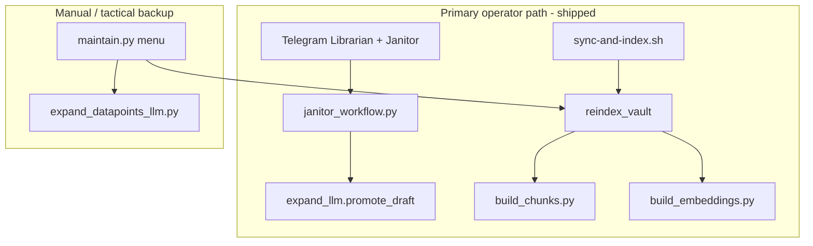

# Vault cleanup — three low-risk refactors + future `expand_llm` note

**Progress:** PR1 (Target 1 docs/hygiene) — branch `docs/vault-cleanup-pr1`. PR2/PR3 pending.

## Success criteria (done when)

| Track | Done when |
|-------|-----------|
| **Target 1** | `docs/retrieval.md` v2 marked implemented; `docs/manual-operations.md` exists and is linked from `ingestion/README.md` + `AGENTS.md`; orphan scripts deleted; completed plans in `archive/` with updated `archive/README.md` + master plan links; `pytest` + `verify.py` green; no grep hits for deleted script names |
| **Target 3** | Single `setup_ingestion_paths` / `resolve_vault_root` in [`ingestion/_bootstrap.py`](ingestion/_bootstrap.py); Telegram bot uses it; duplicate `sys.path` blocks removed from listed test files; full `pytest tests -q` green |
| **Target 2** | One `reindex_vault()` used by maintain menu 8, `janitor_workflow.run_reindex`, and `sync-and-index.sh`; maintain confirm text mentions chunks **and** embeddings; `test_reindex_vault.py` + extended Janitor test pass |

**Repo rule:** Commit this plan under [`.cursor/plans/`](.cursor/plans/) in the **same PR** as each target’s code/docs (per [`AGENTS.md`](AGENTS.md)).

**Progress:** PR1 (Target 1 docs/hygiene) — **shipped** on branch `docs/vault-cleanup-pr1`. PR2/PR3 pending.

**Every PR ends with two mandatory steps:** (1) **affected-doc sweep** (table below — all listed docs for that PR must match the diff), then (2) **`make-pr-easy-to-review`** (open/update PR description and reviewer guidance; no behavior changes in this step).

---

## Per-PR closing checklist (mandatory)

### 1. Affected-doc sweep

Before opening or updating the PR, read each doc in that PR’s column. Fix stale commands, paths, menu labels, and cross-links. Grep for removed symbols (e.g. deleted script names, old `_ensure_ingestion_*` helpers, “chunks only” where reindex is now dual).

| Doc | PR1 | PR2 | PR3 |
|-----|:---:|:---:|:---:|
| [`docs/retrieval.md`](docs/retrieval.md) | ✓ | | ✓ (reindex / sync wording) |
| [`docs/manual-operations.md`](docs/manual-operations.md) | ✓ (create) | ✓ (`VAULT_ROOT` / bootstrap) | ✓ (menu 8, `reindex_vault`, embed env) |
| [`docs/telegram-vault-agent.md`](docs/telegram-vault-agent.md) | ✓ (links only) | ✓ (path wiring note if mentioned) | ✓ (index sync) |
| [`docs/janitor.md`](docs/janitor.md) | | | ✓ (reindex after promote) |
| [`docs/expanded-backfill.md`](docs/expanded-backfill.md) | ✓ (embed note) | | ✓ (maintain menu 8 = chunks + embeddings) |
| [`docs/notes-pipeline.md`](docs/notes-pipeline.md) | ✓ (link to manual-operations) | | |
| [`docs/testing.md`](docs/testing.md) | | ✓ (conftest / `setup_ingestion_paths`) | ✓ (`test_reindex_vault.py`) |
| [`AGENTS.md`](AGENTS.md) | ✓ | | ✓ (maintain reindex if mentioned) |
| [`ingestion/README.md`](ingestion/README.md) | ✓ | ✓ (`_bootstrap` helpers) | ✓ (menu 8 / reindex) |
| [`ingestion/lib/README.md`](ingestion/lib/README.md) | ✓ | ✓ (`_bootstrap` / path setup) | ✓ (`reindex_vault.py`) |
| [`ingestion/search/README.md`](ingestion/search/README.md) | ✓ | | ✓ (unified reindex entry) |
| [`ingestion/notes/README.md`](ingestion/notes/README.md) | ✓ | | |
| [`services/telegram/README.md`](services/telegram/README.md) | ✓ (index sync links) | ✓ (import / `VAULT_ROOT`) | ✓ (`sync-and-index.sh`) |
| [`services/telegram/REVIEW.md`](services/telegram/REVIEW.md) | ✓ (shipped banner) | ✓ (update “Path / import wiring” to `_bootstrap`) | |
| [`.cursor/plans/archive/README.md`](.cursor/plans/archive/README.md) | ✓ | | |
| [`.cursor/plans/telegram_rag_bot_v0.plan.md`](.cursor/plans/telegram_rag_bot_v0.plan.md) | ✓ (archive links) | | |
| [`.cursor/plans/vault_cleanup_refactors.plan.md`](.cursor/plans/vault_cleanup_refactors.plan.md) | ✓ (mark PR1 done in body/todos) | ✓ (PR2) | ✓ (PR3) |

**Done when:** no doc in that PR’s column contradicts the merged behavior; `rg` for removed identifiers is clean.

### 2. `make-pr-easy-to-review` (end of every PR)

Run the [make-pr-easy-to-review](https://github.com/cursor/plugins) workflow on **that PR** before requesting review:

1. `gh pr view` / inspect diff — commits, file count, generated vs logic.
2. **PR description** (create or replace stale body):
   - **TL;DR** — one sentence matching the actual diff.
   - **Core files** — what to read first (3–5 paths).
   - **Mechanical / docs** — separate bullet list.
   - **Behavior change** — explicit yes/no; if yes, what and risk (PR3: maintain menu 8 now runs embeddings).
   - **Test plan** — copy verification commands from target section below.
   - **Plan link** — `.cursor/plans/vault_cleanup_refactors.plan.md` + which target this PR closes.
3. **Review order** — suggest read order (e.g. PR2: `_bootstrap.py` → `config.py` → `janitor_workflow.py` → tests).
4. **History** — do not rewrite commits unless the user asks; prefer description fixes over force-push.
5. Confirm PR title matches scope (e.g. `docs: vault manual ops and plan archive (vault cleanup PR1)`).

**Done when:** a reviewer can understand intent from the PR page alone without reading this chat.

---

## Project snapshot



| Layer | Role |
|-------|------|
| [`ingestion/`](ingestion/) | Catalog, expand, chunks, embeddings |
| [`services/telegram/`](services/telegram/) | Shipped SP1–4 + Janitor |
| [`ingestion/migrations/`](ingestion/migrations/) | Historical one-shots — do not re-run |
| [`potential-ideas.md`](potential-ideas.md) | SP5 webhook, SP6 tuning, parallel expand |

**Not in scope:** intentional Phase 2 gaps (~200/417 notes with bullets), bulk backfill, `expand_llm.py` / `maintain.py` / `markdown_io.py` splits.

---

## Locked preferences

| Topic | Decision |
|-------|----------|
| Orphan repair scripts | **Delete** [`strip_expanded_timestamp_meta.py`](ingestion/notes/strip_expanded_timestamp_meta.py), [`fix_expanded_section_spacing.py`](ingestion/notes/fix_expanded_section_spacing.py) |
| Operator UX | **Telegram-first**; [`maintain.py`](ingestion/maintain.py) = tactical backup (expand via menu today; no new Janitor duplication in maintain) |
| Reindex in maintain | Menu **8** = chunks + embeddings (with confirm), same recipe as Janitor / cron |
| `expand_llm.py` | **No changes** this round |

---

## Target 1 — Operator docs, plan hygiene, dead scripts (PR 1)

**Why:** Stale docs mislead agents; orphan CLIs look active; completed plans clutter `.cursor/plans/`.

### Steps (checklist)

1. **[`docs/retrieval.md`](docs/retrieval.md)** — Rename § “v2 — … (planned)” → “v2 — … (implemented)”; link [`docs/telegram-vault-agent.md`](docs/telegram-vault-agent.md), [`services/telegram/README.md`](services/telegram/README.md). Clarify § “Graduate to repo-wide embeddings” applies to **repo-wide** vectors, not Telegram parent-tier (already allowed).
2. **Add [`docs/manual-operations.md`](docs/manual-operations.md)** (preferred over bloating `notes-pipeline.md`):
   - **Primary:** Janitor + Librarian on Mac mini ([`docs/janitor.md`](docs/janitor.md), [`services/telegram/README.md`](services/telegram/README.md))
   - **Tactical / backfill:** `maintain.py`, `expand_datapoints_llm.py`, `expand_tune.py`, `pipeline/verify.py`
   - **Index:** after promote on Telegram host → chunks + embeddings (points to Target 2 / `sync-and-index.sh`)
   - Explicit: do not duplicate Janitor in maintain beyond current expand menu
3. **Link** new doc from [`ingestion/README.md`](ingestion/README.md) (Maintenance console section) and [`AGENTS.md`](AGENTS.md) (Datapoint expansion or Start here).
4. **[`ingestion/lib/README.md`](ingestion/lib/README.md)** — add `search_retrieval.py`, `openrouter_pricing.py`, `expanded_timestamp_lint.py`.
5. **[`ingestion/search/README.md`](ingestion/search/README.md)** — add `build_embeddings.py`; note parent-tier + `OPENROUTER_EMBED_MODEL`.
6. **[`ingestion/notes/README.md`](ingestion/notes/README.md)** — Downstream: chunks **and** embeddings when Telegram index exists (not chunks-only).
7. **Archive plans** → [`.cursor/plans/archive/`](.cursor/plans/archive/):
   - [`archive/vault_janitor_agent.plan.md`](.cursor/plans/archive/vault_janitor_agent.plan.md)
   - [`archive/vault_agent_backlog_8fad41c3.plan.md`](.cursor/plans/archive/vault_agent_backlog_8fad41c3.plan.md) — trim stale “future Janitor” body; keep historical context in header
   - Update [`archive/README.md`](.cursor/plans/archive/README.md) (move entries out of “Active plans”)
   - Fix links in [`telegram_rag_bot_v0.plan.md`](.cursor/plans/telegram_rag_bot_v0.plan.md) → `archive/vault_janitor_agent.plan.md`
8. **[`services/telegram/REVIEW.md`](services/telegram/REVIEW.md)** — One-line banner: shipped; operator docs = README + `docs/telegram-vault-agent.md` (do not maintain two runbooks).
9. **Delete** orphan `notes/strip_expanded_timestamp_meta.py`, `notes/fix_expanded_section_spacing.py`. Keep [`ingestion/lib/expanded_timestamp_lint.py`](ingestion/lib/expanded_timestamp_lint.py) (used by promote validation).

### Verification

```bash
pytest tests -q
cd ingestion && python pipeline/verify.py
rg 'strip_expanded_timestamp_meta|fix_expanded_section_spacing'  # expect no matches
```

**Risk:** Minimal (docs + delete unused entrypoints).

**PR1 finish:** Complete [affected-doc sweep](#1-affected-doc-sweep) (PR1 column) → [make-pr-easy-to-review](#2-make-pr-easy-to-review).

---

## Target 3 — Shared vault path bootstrap (PR 2)

**Why:** Six+ copies of `VAULT_ROOT` + `sys.path` wiring; drift risk when Janitor or tests change.

### Design (avoid naming collision)

Do **not** add `ingestion/lib/vault_paths.py` — [`ingestion/lib/paths.py`](ingestion/lib/paths.py) already owns filesystem paths. Extend **[`ingestion/_bootstrap.py`](ingestion/_bootstrap.py)**:

```python
def resolve_vault_root(explicit: Path | None = None) -> Path:
    """VAULT_ROOT env, else explicit, else parent of ingestion/ (from _bootstrap location)."""

def setup_ingestion_paths(
    vault_root: Path | None = None,
    *,
    include_subpackages: bool = False,  # tests: search, notes, x, pipeline
) -> Path:
    """Idempotent sys.path for ingestion/, lib/, optional subpackages. Returns ingestion root."""
```

- **Telegram** [`config.py`](services/telegram/bot/config.py) `_vault_root_default()` may call `resolve_vault_root()` or stay as thin wrapper — **one env resolution rule**.
- Replace: `__main__._ensure_ingestion_on_path`, `agent._ensure_tool_paths`, `vault._ensure_ingestion_path`, `janitor_workflow._setup_ingestion_paths` → `setup_ingestion_paths(vault_root)`.
- **Tests:** [`tests/conftest.py`](tests/conftest.py) calls `setup_ingestion_paths(include_subpackages=True)`; remove duplicate blocks from:
  - `test_telegram_bot.py`, `test_vault_agent.py`, `test_vault_v0_checklist.py`, `test_vault_retrieval_scenarios.py`
  - `test_janitor_workflow.py`, `test_janitor_notes.py` (keep `BOT` on path for `janitor_handlers` imports if still needed)
- **CLIs:** keep per-file `_bootstrap.setup_paths(__file__)` — no mass `python -m` migration.

### Code steps

1. Implement `resolve_vault_root` + `setup_ingestion_paths` in [`ingestion/_bootstrap.py`](ingestion/_bootstrap.py) (module docstring documents contract).
2. Wire Telegram + tests per Design above.
3. Remove superseded private helpers; grep repo for old names.

### Doc steps (PR2 column in sweep table)

- [`docs/manual-operations.md`](docs/manual-operations.md) — how `VAULT_ROOT` resolves for bot vs `cd ingestion` CLIs.
- [`docs/testing.md`](docs/testing.md) — `conftest` uses `setup_ingestion_paths(include_subpackages=True)`.
- [`services/telegram/README.md`](services/telegram/README.md) + [`REVIEW.md`](services/telegram/REVIEW.md) — replace ad-hoc path notes with `_bootstrap` reference.
- [`ingestion/README.md`](ingestion/README.md) + [`ingestion/lib/README.md`](ingestion/lib/README.md) — document bootstrap helpers (not `vault_paths.py`).

### Verification

```bash
pytest tests/test_telegram_bot.py tests/test_janitor_workflow.py tests/test_vault_agent.py tests/test_search_retrieval.py -q
pytest tests -q
rg '_ensure_ingestion|_ensure_tool_paths|_setup_ingestion_paths'  # expect only _bootstrap / docs
```

**Out of scope:** `_reject_unauthorized` / `_config` dedup in handlers.

**PR2 finish:** Doc sweep (PR2 column) → make-pr-easy-to-review.

---

## Target 2 — Canonical reindex recipe (PR 3)

### Problem

| Caller | Chunks | Embeddings |
|--------|--------|------------|
| [`maintain.py`](ingestion/maintain.py) menu 8 | yes | **no** |
| [`janitor_workflow.run_reindex`](services/telegram/bot/janitor_workflow.py) | yes (subprocess) | yes |
| [`sync-and-index.sh`](services/telegram/deploy/sync-and-index.sh) | yes | yes |

### Critical design constraint (review finding)

[`ingestion/lib/paths.py`](ingestion/lib/paths.py) sets `ROOT = INGESTION_DIR.parent` at **import time** from `__file__` — it does **not** read `VAULT_ROOT`. Janitor’s subprocess reindex works because **cwd** is `{vault}/ingestion` and scripts resolve paths from that tree.

**Therefore:** implement unified reindex as a **subprocess orchestrator** (not in-process `build_all_chunks` import from `lib/`), so `vault_root` is real and behavior matches today’s Janitor/cron paths.

### API

Add [`ingestion/lib/reindex_vault.py`](ingestion/lib/reindex_vault.py):

```python
def reindex_vault(
    vault_root: Path,
    *,
    embeddings: bool = True,
    python: str | None = None,
) -> tuple[int, str]:
    """Run search/build_chunks.py; optionally search/build_embeddings.py under vault_root/ingestion."""
```

- Reuse `_python(vault_root)` logic from janitor (venv under `ingestion/.venv` else `sys.executable`).
- Set `env["VAULT_ROOT"] = str(vault_root)`; `cwd = vault_root / "ingestion"`.
- On failure, return tail of stderr (same as Janitor `_tail`).
- **`embeddings=False`:** not exposed in maintain menu (user chose always both); optional kwarg for tests only.

### Wire callers

| Caller | Change |
|--------|--------|
| `maintain.action_rebuild_chunks` | Rename to `action_rebuild_index`; update `MENU` line 8 and confirm: “Rebuild chunks + embeddings (requires OPENROUTER_API_KEY + OPENROUTER_EMBED_MODEL)?”; call `reindex_vault(ROOT)` |
| `janitor_workflow.run_reindex` | Delegate to `reindex_vault` (drop duplicated subprocess body) |
| `sync-and-index.sh` | After `git pull`, call `"${PYTHON}" -c "from reindex_vault import reindex_vault; ..."` **or** `"${PYTHON}" lib/reindex_vault.py"` with `cd ingestion` — **required** in this PR, not optional |

### Env / operator note

If embeddings env vars are missing, `build_embeddings.py` exits with existing message (`Set OPENROUTER_API_KEY and OPENROUTER_EMBED_MODEL`). Document in `manual-operations.md` that menu 8 on a laptop without embed keys will fail at step 2 (same as running the script manually).

### Doc steps (PR3 column in sweep table)

- [`docs/manual-operations.md`](docs/manual-operations.md) — menu 8 / `reindex_vault`; embed env requirements.
- [`docs/janitor.md`](docs/janitor.md) — promote → reindex uses shared helper (not duplicate subprocess recipe).
- [`docs/expanded-backfill.md`](docs/expanded-backfill.md) — maintain step 8 and Mac mini sync aligned.
- [`docs/retrieval.md`](docs/retrieval.md) — `sync-and-index.sh` / `reindex_vault` as canonical index refresh.
- [`ingestion/README.md`](ingestion/README.md) — Maintenance console menu item 8 text.
- [`ingestion/lib/README.md`](ingestion/lib/README.md) + [`ingestion/search/README.md`](ingestion/search/README.md) — `reindex_vault.py` orchestrates existing scripts.
- [`services/telegram/README.md`](services/telegram/README.md) — `sync-and-index.sh` calls shared helper.

### Tests

- New [`tests/test_reindex_vault.py`](tests/test_reindex_vault.py): `tmp_path` vault layout, `monkeypatch` `subprocess.run` to record argv order; assert chunks then embeddings; assert `embeddings=False` skips second call.
- [`tests/test_janitor_workflow.py`](tests/test_janitor_workflow.py): add `test_run_reindex_invokes_both_steps` (patch `subprocess.run` or `reindex_vault`).

### Verification

```bash
pytest tests/test_reindex_vault.py tests/test_janitor_workflow.py -q
pytest tests -q
```

**Out of scope:** `git pull`, sync lock, SP5 webhook.

**PR3 finish:** Doc sweep (PR3 column) → make-pr-easy-to-review. In PR description, **call out behavior change:** maintain menu 8 now runs embeddings (previously chunks-only).

---

## Deferred — `expand_llm.py` split (separate plan when ready)

**Do not modify** [`ingestion/lib/expand_llm.py`](ingestion/lib/expand_llm.py) in this effort.

| Why high impact | ~861 lines; OpenRouter + validate + promote + logging; Janitor imports `promote_draft`; [`tests/test_expand_llm.py`](tests/test_expand_llm.py) ~572 lines |
| Suggested modules | `openrouter_chat.py`, `expand_validate.py`, `expand_promote.py`, `expand_run_log.py`; thin `expand_llm.py` re-exports |
| Order | (1) openrouter client (2) promote (3) validate (4) run log — one PR per step |
| Bar | `pytest tests -q`; no file >1k lines; keep `from expand_llm import promote_draft` shim one release |

Optional follow-up: create [`.cursor/plans/expand_llm_split.plan.md`](.cursor/plans/expand_llm_split.plan.md) when scheduling.

---

## Execution order and PRs

| PR | Target | Depends on |
|----|--------|------------|
| 1 | Target 1 docs/hygiene | — |
| 2 | Target 3 bootstrap | — (can parallel PR1) |
| 3 | Target 2 reindex | Target 3 recommended (shared `_python` / path setup) |

Each PR workflow:

1. Implement code + tests for that target.
2. **Affected-doc sweep** — all docs marked ✓ for that PR in the table above.
3. Update [`.cursor/plans/vault_cleanup_refactors.plan.md`](.cursor/plans/vault_cleanup_refactors.plan.md) (todo status / PR progress note).
4. `pytest tests -q` + `cd ingestion && python pipeline/verify.py`.
5. Commit + push; open PR.
6. **`make-pr-easy-to-review`** — TL;DR, core files, behavior/risk, test plan, read order (see checklist above).

**Rollback:** Revert PR; no schema migrations. Restoring deleted scripts only needed if you still run bulk draft repair locally (you chose delete).

---

## Intentionally not doing

- `expand_llm.py`, `maintain.py`, `markdown_io.py` splits
- Deduping expand batch between maintain and `expand_datapoints_llm.py`
- X / network CLIs / `verify.py` pytest
- SP5 / SP6 product work
