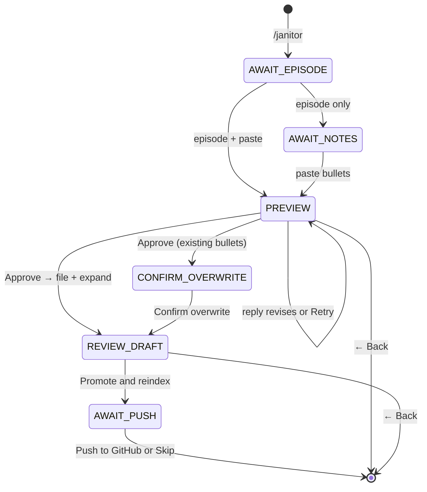

# Janitor — daily notes workflow

Janitor is a **mode** in the same Telegram bot as the Librarian vault agent. Use it on your phone after listening to an episode: paste rough bullets, get a cleaned preview, then file → expand → promote → reindex so Librarian can cite the episode.

**Mac mini ops (restart, webhook):** [`operations.md`](operations.md) · **Deploy reference:** [`services/telegram/README.md`](../services/telegram/README.md)  
**Expand/promote details (CLI):** [`datapoint-workflow.md`](datapoint-workflow.md)  
**Overview:** [`telegram-vault-agent.md`](telegram-vault-agent.md)

## What it does

1. You enter Janitor mode with `/janitor`.
2. You send an episode id (e.g. `191`, `ep-0191`) and paste notes in any common shape (`* hook (5:00)`, `- hook [1:23:45]`, etc.).
3. The bot **auto-cleans** every paste via LLM (`janitor_clean_model` in runtime.json) — no regex pre-pass; if unset, use `/setmodel janitor …`.
4. You review the cleaned preview: **reply with text** to revise, or use **Retry** / **Approve** / **← Back**.
5. On approve: if `{folder}.notes.md` already has timestamp bullets, the bot asks you to **confirm overwrite** (replace, not merge). Otherwise notes are written to `{folder}.notes.md`, then **expand** runs (`expand_datapoints_llm.py` → `.expanded.draft.md`).
6. You review the draft excerpt; tap **Promote & reindex** to write `.expanded.md` and rebuild `chunks.jsonl` + embeddings on the bot host.
7. Optionally tap **Push to GitHub** to commit that episode's notes folder (`vault-push.sh --episode`) or **Skip** to stay local-only on the mini.
8. Back in Librarian mode; the episode is in the studied corpus once timestamp bullets exist and expanded chunks are indexed (push optional for GitHub/laptop visibility).



## Commands

| Command | Behavior |
|---------|----------|
| `/janitor` | Enter Janitor mode; show help |
| `/librarian` | Exit Janitor; back to vault Q&A |
| `/cancel` | Exit Janitor (same as **← Back** button) |
| Free text (Janitor active) | Episode id, paste, preview revisions (`approve` / `yes` / `ok` also work) |

Inline buttons: **Retry**, **Approve**, **← Back** on preview; **Confirm overwrite** when re-filing studied notes; **Promote & reindex**, **Retry expand** on draft review. Every step includes **← Back**; typing is never blocked (inline keyboards only, not a reply keyboard).

## Environment (Mac mini)

Janitor uses **two env files** on the bot host:

| File | Purpose |
|------|---------|
| `~/.config/founders-telegram/env` | Secrets: `TELEGRAM_*`, `OPENROUTER_API_KEY`, `VAULT_ROOT` |
| `~/.config/founders-telegram/runtime.json` | Models + tuning: `/setmodel` (incl. `retrieval` for Librarian expand/rerank), `/setcleantemp`; **Stream replies** (`stream_replies`, default off) — see `/settings` |
| `{VAULT_ROOT}/.env` | Ingestion: Colossus, X API; **also** loaded by `expand_datapoints_llm.py` (`load_dotenv` on repo root) for `OPENROUTER_API_KEY` / `OPENROUTER_MODEL` if not already in the process env |

Quick reference (replace `VAULT_ROOT` with your clone path, e.g. `~/founders-notes`):

```bash
cat ~/.config/founders-telegram/env    # bot runtime
cat "$VAULT_ROOT/.env"                 # ingestion / expand subprocess
```

Copy templates: [`services/telegram/deploy/env.example`](../services/telegram/deploy/env.example), [`.env.example`](../.env.example).

| Variable | Purpose |
|----------|---------|
| `OPENROUTER_API_KEY` | Required in env (chat + embed + expand) |
| `VAULT_ROOT` | Git clone path in env |
| Models | `runtime.json` via `/setmodel` — not required in env after seed |

## Model tuning playbook

Janitor and Librarian use **different models on purpose**. On the Mac mini bot host, set them from Telegram (primary) or `~/.config/founders-telegram/runtime.json`.

| Role | `/setmodel` role | Typical use |
|------|------------------|-------------|
| **Paste clean** | `janitor` | Fast, cheap model on every paste |
| **Librarian retrieval** | `retrieval` | Query expand + evidence rerank (orchestrator); falls back to `librarian` if unset |
| **Expand** | `expand` | `expand_datapoints_llm.py` on **Approve** |
| **Librarian Q&A** | `librarian` | Synthesis + optional tools (not expand/rerank when `retrieval` is set) |
| **Search embeddings** | `embed` | Parent-tier index; run `/reindex` after changing |

Check effective slugs: `/settings`. Secrets (`OPENROUTER_API_KEY`) stay in `~/.config/founders-telegram/env`.

**Symptom → what to change**

| Symptom | Try |
|---------|-----|
| Clean preview garbled, too creative, or slow | `/setmodel janitor <faster/cheaper slug>` |
| Expand draft weak or hallucinated quotes | `/setmodel expand <stronger slug>`; **Retry expand** |
| Librarian answers shallow or wrong tool use | `/setmodel librarian <slug>` + prompt tweaks ([`AGENTS.md`](../AGENTS.md)) |
| Search returns wrong episodes / keyword-y misses | `/setmodel retrieval <slug>` first; tune [`query_expand.md`](../ingestion/prompts/query_expand.md) and [`rerank_evidence.md`](../ingestion/prompts/rerank_evidence.md) |
| Librarian slow before the answer text | `/setmodel retrieval <fast slug>` (Groq via OpenRouter); keep `librarian` on DeepSeek or similar for synthesis |
| Search misses new takeaways after promote | `/sync` when idle (see [operations.md](operations.md#when-to-refresh)) |

**Example (Telegram on Mac mini)**

```text
/setmodel janitor openai/gpt-oss-20b::Groq
/setmodel retrieval openai/gpt-oss-20b::Groq
/setmodel expand anthropic/claude-sonnet-4.6
/setmodel librarian deepseek/deepseek-v4-pro
/setmodel embed qwen/qwen3-embedding-8b
```

Laptop-only expand still uses `{VAULT_ROOT}/.env` for `OPENROUTER_MODEL` when running CLI outside the bot.

## After promote

Promote runs shared `reindex_vault()` (`build_chunks.py` + `build_embeddings.py` subprocesses on the Mac mini). If reindex fails, run manually when the bot is idle:

```bash
services/telegram/deploy/sync-and-index.sh
```

Nightly cron (`install-cron.sh`) also refreshes the index from git. Librarian will not surface new **Quote** / **Key takeaway** chunks until the index includes promoted `.expanded.md`.

## Corpus rules

- **Librarian** only searches episodes you have **studied** (timestamp bullets in `.notes.md`). Janitor files notes; after promote + reindex, expanded chunks join the parent-tier index.
- `.expanded.draft.md` is never indexed until promote.
- Janitor state is in-memory; bot restart clears an in-progress session — use `/janitor` again.

## Testing Janitor locally

Use the mock Telegram harness — same handler code as production, but notes and expand/promote write to a temp sandbox under `dev/logs/sandbox/`, never `content/notes/`:

```bash
python dev/mock_telegram_cli.py --stub-llm --suite janitor --run-scenarios
```

Scenarios: [`dev/scenarios/janitor/`](../dev/scenarios/janitor/). Guide: [telegram-mock-harness.md](telegram-mock-harness.md).

## Deferred / ideas

See [`potential-ideas.md`](../potential-ideas.md) (Janitor UX cluster).
