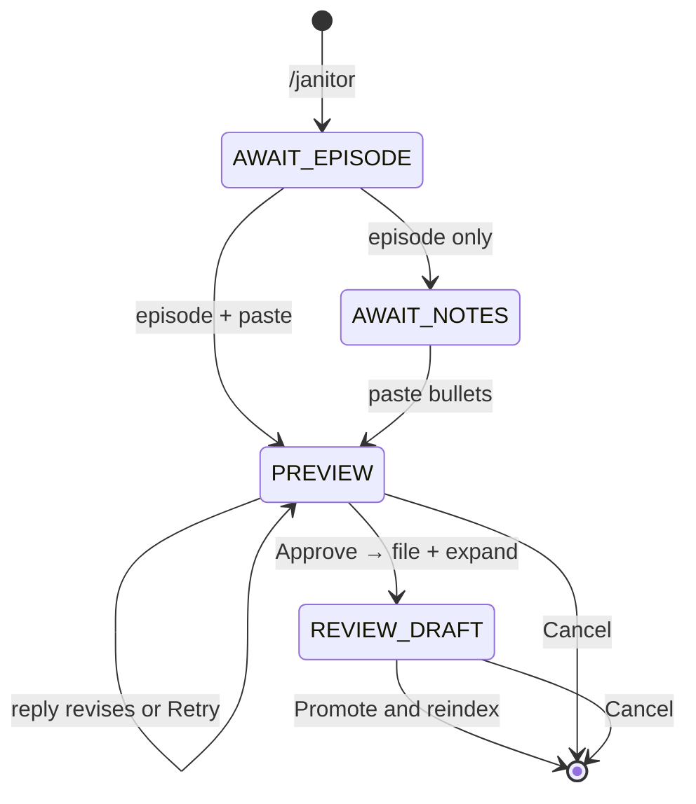

# Janitor — daily notes workflow

Janitor is a **mode** in the same Telegram bot as the Librarian vault agent. Use it on your phone after listening to an episode: paste rough bullets, get a cleaned preview, then file → expand → promote → reindex so Librarian can cite the episode.

**Runbook (Mac mini install, env, restart):** [`services/telegram/README.md`](../services/telegram/README.md)  
**Expand/promote details (CLI):** [`datapoint-workflow.md`](datapoint-workflow.md)  
**Overview:** [`telegram-vault-agent.md`](telegram-vault-agent.md)

## What it does

1. You enter Janitor mode with `/janitor`.
2. You send an episode id (e.g. `191`, `ep-0191`) and paste notes in any common shape (`* hook (5:00)`, `- hook [1:23:45]`, etc.).
3. The bot **auto-cleans** every paste via LLM (`JANITOR_CLEAN_MODEL`) — no regex pre-pass; if the model is unset, Janitor blocks.
4. You review the cleaned preview: **reply with text** to revise, or use **Retry** / **Approve** / **Cancel**.
5. On approve: notes are written to `{folder}.notes.md`, then **expand** runs (`expand_datapoints_llm.py` → `.expanded.draft.md`).
6. You review the draft excerpt; tap **Promote & reindex** to write `.expanded.md` and rebuild `chunks.jsonl` + embeddings on the bot host.
7. `/librarian` (or automatic reset after promote) returns to vault Q&A; the episode is in the studied corpus once timestamp bullets exist and expanded chunks are indexed.



## Commands

| Command | Behavior |
|---------|----------|
| `/janitor` | Enter Janitor mode; show help |
| `/librarian` | Exit Janitor; back to vault Q&A |
| `/cancel` | Cancel Janitor workflow |
| Free text (Janitor active) | Episode id, paste, preview revisions (`approve` / `yes` / `ok` also work) |

Inline buttons: **Retry**, **Approve**, **Cancel** on preview; **Promote & reindex**, **Retry expand** on draft review.

## Environment (Mac mini)

Janitor uses **two env files** on the bot host:

| File | Purpose |
|------|---------|
| `~/.config/founders-telegram/env` | Bot runtime: `TELEGRAM_*`, `JANITOR_CLEAN_MODEL`, `OPENROUTER_MODEL` (expand), `OPENROUTER_EMBED_MODEL`, `VAULT_ROOT` |
| `{VAULT_ROOT}/.env` | Ingestion: Colossus, X API; **also** loaded by `expand_datapoints_llm.py` (`load_dotenv` on repo root) for `OPENROUTER_API_KEY` / `OPENROUTER_MODEL` if not already in the process env |

Quick reference (replace `VAULT_ROOT` with your clone path, e.g. `~/founders-notes`):

```bash
cat ~/.config/founders-telegram/env    # bot runtime
cat "$VAULT_ROOT/.env"                 # ingestion / expand subprocess
```

Copy templates: [`services/telegram/deploy/env.example`](../services/telegram/deploy/env.example), [`.env.example`](../.env.example).

| Variable | Purpose |
|----------|---------|
| `JANITOR_CLEAN_MODEL` | **Required** for paste clean (e.g. `groq/llama-3.1-8b-instant`) |
| `JANITOR_CLEAN_TEMPERATURE` | Optional (default `0.2`) |
| `OPENROUTER_MODEL` | Expand subprocess when you tap Approve |
| `OPENROUTER_API_KEY` | Chat + embed + expand (set in Telegram env and/or root `.env`) |
| `VAULT_ROOT` | Git clone path |

## After promote

Promote runs `build_chunks.py` and `build_embeddings.py` on the Mac mini. If reindex fails, run manually when the bot is idle:

```bash
services/telegram/deploy/sync-and-index.sh
```

Nightly cron (`install-cron.sh`) also refreshes the index from git. Librarian will not surface new **Quote** / **Key takeaway** chunks until the index includes promoted `.expanded.md`.

## Corpus rules

- **Librarian** only searches episodes you have **studied** (timestamp bullets in `.notes.md`). Janitor files notes; after promote + reindex, expanded chunks join the parent-tier index.
- `.expanded.draft.md` is never indexed until promote.
- Janitor state is in-memory; bot restart clears an in-progress session — use `/janitor` again.

## Deferred / ideas

See [`potential-ideas.md`](../potential-ideas.md) (streaming clean preview, audit log, etc.).
