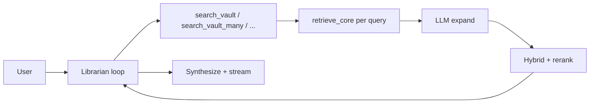

# Telegram vault agent

Short overview for coding agents. **v0 (SP1–SP4)** shipped on `main` (PR #3). Deferred work: [`potential-ideas.md`](../potential-ideas.md). Historical plans: [`.cursor/plans/archive/legacy/`](../.cursor/plans/archive/legacy/) (deep archive; see [archive README](../.cursor/plans/archive/README.md)).

Product is **v4: agentic retrieval loop** — the librarian model drives search via tools (cold start, no pre-retrieval). Retrieval **internals** remain in `retrieval_orchestrator.retrieve_core`.

## Product vision

The **Librarian** should feel like a sharp intellectual thought partner who has deeply studied the same Founders episodes you have — not a search tool that returns ranked excerpts. Target experience: Perplexity-like depth tuned to your personal vault — fast for simple questions, genuinely deep on complex ones, with a voice that connects ideas across founders rather than summarizing episodes in isolation.

## Product

- Private Telegram bot on an always-on **Mac mini** (polling), solo user via `TELEGRAM_ALLOWED_USER_IDS`.
- **Librarian:** study-partner voice — cross-episode synthesis, verbatim quotes, `[ep-NNNN]` citations — not ranked excerpt dumps. Persona: [`AGENTS.md`](../AGENTS.md).
- **Janitor:** daily notes ritual in the same bot — see [janitor.md](janitor.md).

## Architecture (v4)

- **OpenRouter agent** (Librarian model in `runtime.json`, `/setmodel librarian`) runs a **tool-calling loop** (≤6 rounds).
- **Toolbox:** `search_vault`, `search_vault_many`, `search_transcript`, `list_episode_ids`, `load_episode` — each search tool wraps `retrieve_core` in `ingestion/lib/retrieval_orchestrator.py` (expand → hybrid → rerank; `search_vault_many` skips per-sub-query expansion).
- **Cold start:** no pre-retrieved evidence; the model decides when to search. **Reply streaming** (default off): each completion round can stream token deltas; toggle in `/settings` → **Stream replies**.
- Index: `catalog/chunks.jsonl` — **expanded** + **summary** parent tiers; `catalog/episode-summaries.jsonl`; embeddings in `catalog/embeddings.npy` (gitignored).
- Librarian corpus = **studied episodes only** (timestamp bullets in `.notes.md`).

### Turn flow (thematic)

Expand + rerank inside each search use `retrieval_model` (`/setmodel retrieval …`); the loop + synthesis use `librarian_model`.

### Prompt stack

| Prompt | Role |
|--------|------|
| [`AGENTS.md`](../AGENTS.md) | Synthesis persona + evidence honesty (loaded at runtime by `bot/agent.py`) |
| [`ingestion/prompts/query_expand.md`](../ingestion/prompts/query_expand.md) | Founders-specific variant frames: synonym/reframe, operator mental model, biographical angle, contrasting case, cross-episode pattern |
| [`ingestion/prompts/rerank_evidence.md`](../ingestion/prompts/rerank_evidence.md) | Synthesis-usefulness scoring (0–10 bands); conceptual relevance over keyword overlap |

### Tuning and trace

Per-turn `tool_trace` + `trace_summary` (queries, episode ids, rerank scores, stop reason) are built in `VaultAgent.run_turn()` for harness `-v` runs and tests. Telegram persists `tool_trace` in session exports; live status labels come from `tool_status.py`. Follow-ups: [`potential-ideas.md`](../potential-ideas.md) (latency, reasoning params).

## Source priority (synthesis policy)

1. `{folder}.expanded.md` excerpts in the evidence block
2. Transcript excerpts when fallback fired
3. `load_episode` when the user names one episode explicitly

Summaries and raw notes/posts are not cited in thematic answers.

## Episode resolution (`load_episode` / `list_episode_ids`)

Used when the user names an episode by number or guest, not only `ep-NNNN`:

| Step | Behavior |
|------|----------|
| `list_episode_ids` | Match a **short** query token (`191`, `Naval Ravikant`, `ep-0191`) — not full sentences |
| `load_episode` | Strict catalog id; on miss, `resolve_episode_ref` fallback for bare digits / `ep-N` or an unambiguous fuzzy top hit |
| Ambiguous guest | e.g. **Henry Ford** (multiple episodes) → `error` plus up to five **`candidates`** (same shape as `list_episode_ids`) so the model can pick `ep-NNNN` in one turn |

Janitor paste line-1 parsing stays regex-based — see [janitor.md](janitor.md). Harness: [telegram-mock-harness.md](telegram-mock-harness.md) (`episode_resolve.yaml`); unit tests: `tests/test_vault_agent.py`.

## Sessions and index

**BotFather menu (6 commands):** `/start`, `/janitor`, `/settings`, `/sync`, `/newchat`, `/restart`. Power-user commands below still work when typed; they are omitted from the menu on purpose.

| Command | Behavior |
|---------|----------|
| `/start` | Catalog episode count, studied count (timestamp bullets), chunks index mtime |
| `/clear` | Wipe in-memory thread |
| `/newchat` | Export → `catalog/telegram-sessions/*.jsonl` (gitignored); reset |
| `/resume` | Reload exported session |
| `/janitor` | Enter Janitor — paste bullets → clean → expand → promote |
| `/librarian` | Exit Janitor back to Q&A |
| `/cancel` | Exit Janitor (alias; same as **← Back** button in Janitor) |
| `/settings` | Models, **Stream replies** (Librarian synthesis streaming), Janitor temp, **Ops** panel (sync / pull / reindex / restart) |
| `/setmodel` / `/resetmodel` | Per-role model overrides (`runtime.json`) |
| `/setcleantemp` / `/resetcleantemp` | Janitor clean LLM temperature (also **Settings** → Janitor temp) |
| `/pull` | `git pull --ff-only` |
| `/reindex` | Rebuild chunks, episode summaries, chunks (summary tier), embeddings |
| `/sync` | `/pull` then `/reindex` |
| `/restart` | Exit; launchd restarts bot |

**Janitor:** mode-switched workflow (LLM-first paste clean, file, expand subprocess, promote, reindex). Full guide: [janitor.md](janitor.md). Runbook: [services/telegram/README.md](../services/telegram/README.md).

**Index sync:** push to `main` → Mac mini GitHub webhook → `sync-and-index.sh`; or manual/cron/Telegram `/sync`. Cron: `install-cron.sh`. Webhook: `install-webhook.sh` + Tailscale Funnel — [services/telegram/README.md](../services/telegram/README.md#github-webhook-push-to-main).

After expanded promote on the Mac mini (or any host running the bot), run the same index rebuild so parent-tier chunks include **Quote** / **Key takeaway** sections. See [expanded-backfill.md](expanded-backfill.md).

## Implementation status

| Area | Status | Reference |
|------|--------|-----------|
| v0 SP1–SP4 | Shipped (PR #3) | This doc + codebase |
| Janitor | Shipped | [janitor.md](janitor.md) |
| Harness / tool UX | Shipped | [telegram-mock-harness.md](telegram-mock-harness.md) |
| Librarian quality | Shipped | `load_episode` **candidates**; synthesis **streaming** (default off) |
| Webhook / sync | Shipped | [operations.md](operations.md), [services/telegram/README.md](../services/telegram/README.md) |
| Follow-ups | Open | [potential-ideas.md](../potential-ideas.md) |

Runbook and env: [`services/telegram/README.md`](../services/telegram/README.md).

## Non-goals

- Multi-host / Cloud Run — Mac mini only.
- Section-filter commands (`/transcript`, `/post`, `/notes`, `/expanded`) — use `load_episode` + corpus tiers.
- Repo-wide vector DB — see [retrieval.md](retrieval.md) and [repo-agent-guide.md](repo-agent-guide.md) gates.
- `/resume` auto-sync — warn-only on index newer than session; use `/sync` when idle after travel or a failed webhook (no default background `sync-and-index.sh` on resume).

## Embeddings vs repo-agent-guide

Repo-wide rule: do **not** add a general-purpose vector DB until grep + chunk search + agent tools fail your queries. The Telegram embed index is **scoped to parent chunks only** (`expanded` + `summary`) inside the orchestrator hybrid search.

**Librarian system prompt:** [AGENTS.md](../AGENTS.md) (loaded at runtime by `services/telegram/bot/agent.py`).

## Related

- [operations.md](operations.md) — laptop, Mac mini, Telegram ops
- [telegram-mock-harness.md](telegram-mock-harness.md) — local headless/REPL testing (no Bot API)
- [janitor.md](janitor.md) — daily notes workflow; [model tuning playbook](janitor.md#model-tuning-playbook)
- [retrieval.md](retrieval.md) — chunk index + hybrid parent search
- [expanded-backfill.md](expanded-backfill.md) — corpus quality for parent tier
- [testing.md](testing.md) — CI + v0 checklist tests
- [potential-ideas.md](../potential-ideas.md) — backlog
